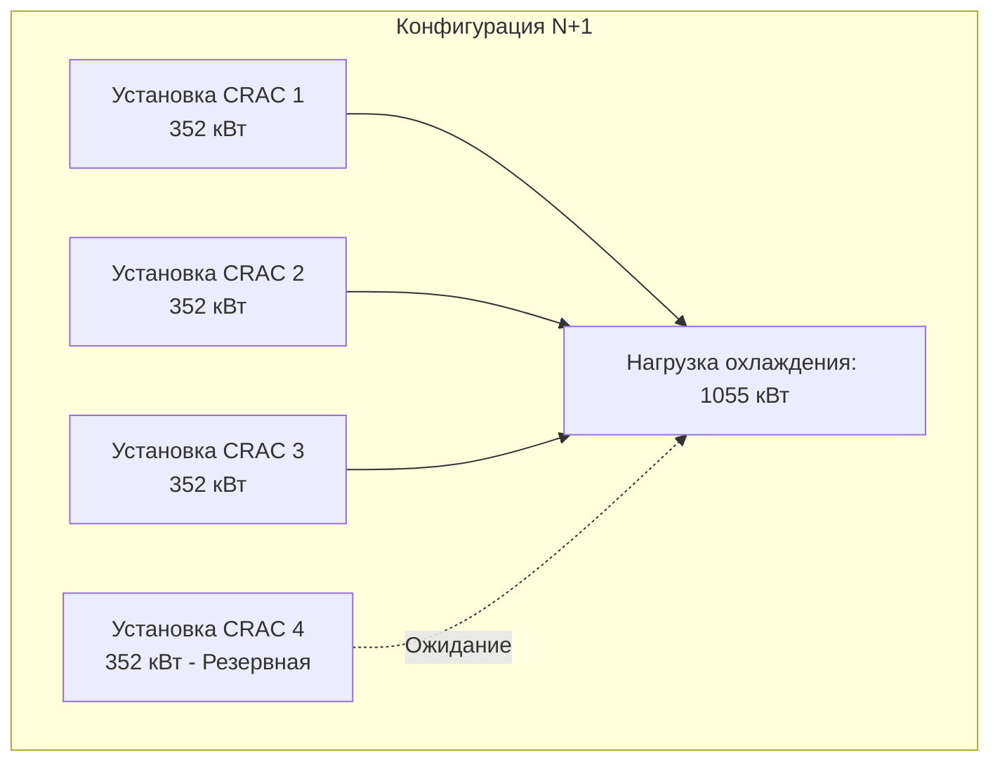
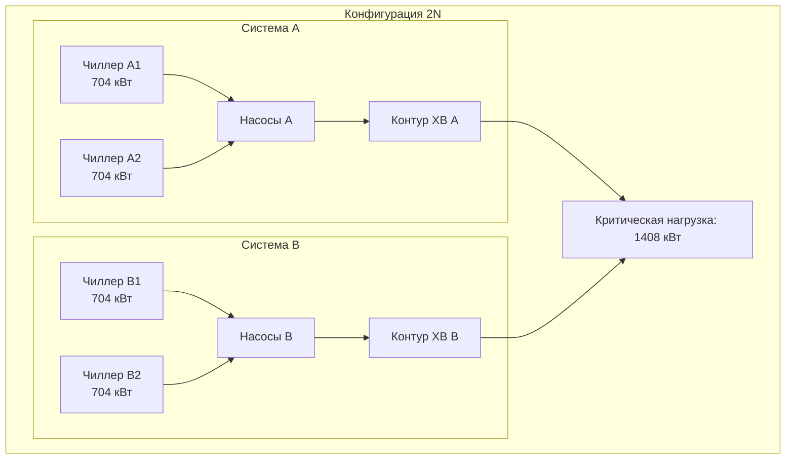

## Обзор

Резервирование охлаждения центра обработки данных обеспечивает непрерывное функционирование при отказах оборудования и работах по техническому обслуживанию. Стратегия проектирования напрямую влияет на доступность системы, с конфигурациями, варьирующимися от базовой архитектуры N+1 до полностью отказоустойчивой 2N+1. Планирование резервирования должно учитывать как отказы отдельных компонентов, так и уязвимости путей распределения.

## Конфигурации резервирования

### Резервирование N+1

N+1 предусматривает одну дополнительную установку сверх минимально необходимой емкости. Система работает с N установками, обеспечивающими полную нагрузку охлаждения, при сохранении одной резервной установки в режиме ожидания или активном режиме.

**Требование по емкости:**
$$Q_{\text{total}} = (N + 1) \times Q_{\text{unit}}$$

где $N = \lceil Q_{\text{load}} / Q_{\text{unit}} \rceil$

**Характеристики:**
- Допускает отказ одного компонента
- Наиболее экономичная конфигурация с резервированием
- Требует работы всех оставшихся установок на полной емкости при отказе одной
- Общий путь распределения создает уязвимость

### Резервирование 2N

Архитектура 2N дублирует всю систему охлаждения, включая пути распределения. Каждая независимая система может поддерживать 100% критической нагрузки.

**Требование по емкости:**
$$Q_{\text{total}} = 2 \times Q_{\text{load}}$$

**Характеристики:**
- Полное резервирование системы
- Независимые пути распределения исключают общие режимы отказа
- Позволяет проводить полное техническое обслуживание системы без воздействия на нагрузку
- Максимальная доступность, максимальная стоимость

### Резервирование 2N+1

2N+1 объединяет двойные пути распределения с дополнительным резервированием компонентов. Это обеспечивает отказоустойчивость как для отказов распределения, так и для отказов отдельных компонентов.

**Требование по емкости:**
$$Q_{\text{total}} = 2 \times (N + 1) \times Q_{\text{unit}}$$

### Распределенное резервирование

Распределенное резервирование размещает несколько меньших установок по зонам вместо централизованных крупных установок. Этот подход улучшает устойчивость к локализованным отказам при сохранении принципов N+1 или 2N на уровне объекта.

## Классификация ярусов Uptime Institute

| Ярус | Конфигурация | Доступность | Простой/год | Ключевые требования |
|------|-------------|-----------|----------|------------------|
| I | Базовая емкость | 99.671% | 28.8 часов | Один путь, без резервирования |
| II | Резервные компоненты | 99.741% | 22.0 часа | N+1 компоненты, один путь |
| III | Одновременно ремонтопригодная | 99.982% | 1.6 часа | N+1 компоненты, двойные пути |
| IV | Отказоустойчивая | 99.995% | 0.4 часа | 2N или 2N+1, двойные активные пути |

### Ярус I: Базовая емкость

Система без резервирования с единственным путем распределения. Плановое обслуживание требует полного отключения. Уязвима к незапланированным сбоям от любого отказа компонента.

### Ярус II: Резервные компоненты (N+1)

Резервирование N+1 для оборудования охлаждения, но сохранение единственного пути распределения. Обслуживание резервных компонентов возможно без отключения, но работа с распределением требует простоя.

### Ярус III: Одновременно ремонтопригодная

Двойные пути распределения с резервированием компонентов N+1. Любой отдельный компонент может быть удален для обслуживания без воздействия на нагрузку. Однако одиночные отказы во время обслуживания могут вызвать сбои.

### Ярус IV: Отказоустойчивая

Полная архитектура 2N или 2N+1 с компартментализацией. Система выдерживает любой одиночный отказ в любое время, включая во время работ по техническому обслуживанию. Требует физического и логического разделения резервных систем.

## Расчеты доступности

Доступность системы зависит от надежности компонентов и архитектуры конфигурации.

**Компоненты в последовательности (один путь):**
$$A_{\text{system}} = \prod_{i=1}^{n} A_i$$

**Параллельные компоненты (резервные):**
$$A_{\text{system}} = 1 - \prod_{i=1}^{n} (1 - A_i)$$

**Пример: N+1 с четырьмя установками надежностью 99.5%**

Требуется три установки (N=3), одна резервная:
$$A_{\text{system}} = 1 - (1 - 0.995)^4 = 1 - (0.005)^4 = 0.999999$$

Это дает доступность уровня компонентов 99.9999% (0.5 минут простоя/год). Доступность пути распределения должна рассчитываться отдельно и комбинироваться в последовательности.

## Рекомендации по проектированию

**Требования к одновременной ремонтопригодности:**
- Запорные клапаны на всех ветвях распределения охлаждения
- Резервные насосы с независимой изоляцией
- Возможности перекрестного соединения между системами
- Автоматический переход в режим отказа в пределах тепловой постоянной времени
- Мониторинг всех состояний резервных путей

**Реализация отказоустойчивости:**
- Физическое разделение резервных систем (отдельные помещения/этажи)
- Независимые электрические питания от отдельных источников коммунальных услуг
- Отдельные системы управления без общих зависимостей
- Компартментализованное пожаротушение
- Регулярное тестирование последовательностей переключения под нагрузкой

**Планирование емкости:**
- Размер для N+1 при будущей пиковой нагрузке, а не текущей
- Учет деградации установки охлаждения с течением времени (обычно 5-10%)
- Проверка емкости при повышенных условиях окружающей среды в соответствии с ASHRAE TC 9.9
- Учет коэффициента разнообразия для распределенных нагрузок
- Планирование увеличения плотности стойки в циклах обновления

## Режимы работы

**Активный-активный:** Все резервные установки работают с частичной нагрузкой. Обеспечивает распределение нагрузки, оптимизацию эффективности и более быстрый отклик на отказы. Требует элементов управления балансировкой нагрузки.

**Активный-ожидание:** Резервные установки остаются выключенными до обнаружения отказа. Снижает потребление энергии, но вводит задержку запуска и тепловые переходные процессы при переключении.

**Ротационное ожидание:** Установки чередуются между активными и резервными позициями с запланированными интервалами. Уравнивает время работы, обеспечивает функциональность резервных установок и выявляет отказы в периоды низкого риска.

## Анализ режимов отказа

Критические сценарии отказа, требующие защиты резервированием:

- Механический отказ компрессора
- Утечки хладагента, снижающие емкость
- Прерывание подачи конденсатора
- Отказы насосов охлажденной воды
- Неисправности системы управления, препятствующие работе
- Перебои в электроснабжении
- Плановое техническое обслуживание

Правильно спроектированные архитектуры резервирования сохраняют полную емкость охлаждения при любом одиночном отказе и позволяют проводить обслуживание без воздействия на нагрузку.

## Ссылки

- ASHRAE TC 9.9: Mission Critical Facilities, Data Centers, Technology Spaces, and Electronic Equipment
- Uptime Institute Tier Standard: Topology
- TIA-942: Telecommunications Infrastructure Standard for Data Centers
