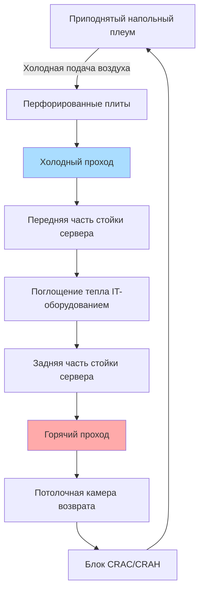

# Системы кондиционирования воздуха ЦОД

Системы кондиционирования воздуха ЦОД представляют одно из наиболее требовательных и критически важных специализированных приложений в инженерии климатического управления. Эти объекты требуют непрерывной работы с исключительной надежностью, точным управлением окружающей средой и энергоэффективностью для поддержки IT-оборудования, генерирующего тепловые потоки плотностью от 100 до 500+ Вт/м² (и более).

## Тепловые рекомендации ASHRAE для ЦОД

Технический комитет 9.9 ASHRAE публикует определяющие тепловые рекомендации для среды обработки данных. Рекомендуемые и допустимые рабочие диапазоны определяют приемлемые условия для IT-оборудования:

| Класс | Приложение | Рекомендуемая температура | Допустимый диапазон температур | Рекомендуемая ОВ | Допустимый диапазон ОВ | Макс. точка росы |
|-------|-------------|------------------|----------------------|----------------|-----------------------|---------------|
| A1 | Серверы предприятия, хранилище | 18-27°C | 15-32°C | 40-60% | 20-80% | 17°C |
| A2 | Массовые серверы, хранилище | 10-35°C | 5-35°C | 8-80% | 21°C |
| A3 | Массовые серверы, хранилище | 5-40°C | 5-45°C | 8-85% | 24°C |
| A4 | Массовые серверы, хранилище | 5-45°C | 5-45°C | 8-90% | 24°C |

Рекомендуемый диапазон (18-27°C, 40-60% ОВ) обеспечивает оптимальную надежность оборудования и долговечность. Работа при более высоких температурах в допустимом диапазоне снижает энергию охлаждения, но может снизить срок службы компонентов.

## Расчет охлаждающей нагрузки ЦОД

Общая охлаждающая нагрузка состоит из отвода тепла IT-оборудования и потерь инфраструктуры:

$$Q_{total} = Q_{IT} + Q_{lighting} + Q_{UPS} + Q_{PDU} + Q_{envelope} + Q_{people}$$

Нагрузка от IT-оборудования доминирует и обычно составляет 60-80% от общего тепловыделения. Коэффициент использования мощности (PUE) количественно оценивает общую эффективность:

$$PUE = \frac{P_{total\,facility}}{P_{IT\,equipment}}$$

Мировые центры обработки данных достигают значений PUE 1,1-1,3, что означает 10-30% дополнительной мощности для охлаждения и инфраструктуры. Типичные объекты работают при PUE 1,5-2,0.

Коэффициент ощутимого тепла (SHR) в ЦОД приближается к 0,95-1,0 из-за минимальных скрытых нагрузок:

$$SHR = \frac{Q_{sensible}}{Q_{sensible} + Q_{latent}}$$

Этот высокий SHR позволяет стратегии охлаждения только ощутимого тепла без увлажнения воздуха во многих случаях.

## Стратегии управления воздушным потоком

Эффективное управление воздушным потоком предотвращает рециркуляцию горячего воздуха и обход холодного воздуха, которые ухудшают эффективность охлаждения и создают неравномерность температуры.

### Конфигурация горячего прохода/холодного прохода

Фундаментальный подход организует стойки серверов в чередующихся рядах:

- **Холодные проходы**: Обращены передние части стоек (впуск воздуха) друг к другу
- **Горячие проходы**: Задние части стоек (выпуск) обращены друг к другу
- **Перфорированные плиты**: Расположены в холодных проходах для подачи кондиционированного воздуха
- **Возвратный воздух**: Перехватывает горячий выпуск из потолочных камер или задней части стоек

### Системы локализации

Физические барьеры предотвращают смешивание потоков подачи и возврата воздуха:

**Локализация холодного прохода (CAC)**
- Заключает холодные проходы дверями, крышными панелями и торцевыми стенками
- Создает подпирающийся источник холодного воздуха непосредственно к впускам оборудования
- Позволяет остальной части ЦОД работать при повышенных температурах
- Типовой перепад давления: 5-12 Па

**Локализация горячего прохода (HAC)**
- Заключает горячие проходы для перехвата всего выпуска оборудования
- Возвращает горячий воздух непосредственно в охлаждающие блоки без смешивания
- Более распространена, чем CAC, благодаря превосходной производительности и безопасности
- Температуры возвратного воздуха: 35-46°C

Системы локализации улучшают охлаждающую способность на 20-40% и снижают потребление энергии вентилятора на 20-40%, устраняя необходимость избыточного охлаждения для компенсации потерь от смешивания.

## Оборудование прецизионного охлаждения

### Блоки кондиционирования компьютерных помещений (CRAC)

Блоки CRAC обеспечивают прямое расширительное (DX) охлаждение с интегрированными компрессорами:

- Охлаждающая способность: 10,5-105 кВ на блок
- Конфигурации вверх или вниз для приподнятого напольного или верхнего подвода
- Интегрированное увлажнение и осушение
- Управление микропроцессором с сетевым подключением
- Типовая энергоэффективность: 0,8-1,2 кВ/кВ охлаждающей способности

Заряд хладагента и каскадирование компрессора реагируют на изменения ощутимой нагрузки. Несколько блоков работают параллельно с чередованием лидер-отстающий.

### Блоки обработки воздуха компьютерных помещений (CRAH)

Блоки CRAH используют охлаждающие водяные катушки вместо систем DX:

- Подаются из центральной установки охладителя
- Большая охлаждающая способность на блок: 105-350+ кВ
- Вентиляторы с переменной скоростью и управлением VFD
- Температура подачи охлаждающей воды: 5,6-12,8°C
- Меньшее энергопотребление в ряду, чем CRAC
- Позволяет работу экономайзера со стороны воды

Ощутимая охлаждающая способность водяной катушки следует:

$$Q = \dot{m}_{water} \cdot c_p \cdot \Delta T_{water}$$

## Системы охлаждения в ряду

Охладители в ряду устанавливаются между стойками серверов, позиционируя охлаждение максимально близко к источникам тепла:

- Горизонтальный воздушный поток непосредственно в передние части стоек
- Исключает требования приподнятого пола
- Минимальная мощность вентилятора из-за коротких воздушных путей
- Охлаждающая способность: 10-50 кВ на блок
- Температура подачи воздуха соответствует требованиям впуска стойки

Требования к скорости воздушного потока зависят от охлаждающей способности и температурного перепада:

$$CFM = \frac{Q_{sensible} \cdot 3413}{1.08 \cdot \Delta T}$$

Для охлаждения 30 кВ с перепадом 11°C:

$$CFM = \frac{30,000 \cdot 3413/1000}{1.08 \cdot 11} = 8,500\,CFM\,(14,405\text{ м}^3\text{/ч})$$

## Теплообменники на задней двери

Пассивные теплообменники на задней двери (RDHx) устанавливаются на дверях выпуска стойки:

- Катушки охлаждающей воды без вентиляторов или систем управления
- Удаляют 50-90% тепла стойки перед поступлением выпуска в помещение
- Охлаждающая способность: 20-50 кВ на дверь
- Минимальное воздействие на воздушный поток IT-оборудования
- Позволяет ультравысокой плотности стойки (20-40 кВ)

Эффективность теплообменника зависит от площади катушки, скорости водяного потока и температуры приближения:

$$\epsilon = \frac{T_{air,in} - T_{air,out}}{T_{air,in} - T_{water,in}}$$

Типовая эффективность находится в диапазоне 0,6-0,8 для хорошо спроектированных блоков.

## Технологии жидкостного охлаждения

Системы прямого жидкостного охлаждения преодолевают ограничения воздушного охлаждения для экстремальных плотностей (>30 кВ/стойка):

**Охлаждение холодной пластиной**
- Катушки холодной пластины с охлаждением жидкостью монтируются непосредственно на процессорах, GPU и памяти
- Теплопередача непосредственно от компонентов к контуру жидкости
- Типовой теплоноситель: вода или диэлектрическая жидкость при температуре 4-16°C
- Удаляет 60-90% от общего тепла в источнике
- Оставшееся тепло обрабатывается воздушным охлаждением

**Охлаждение погружением**
- Погружает целые серверы в диэлектрическую жидкость
- Однофазное погружение: температура жидкости 45-50°C
- Двухфазное погружение: кипящий теплоноситель при ~50°C
- Исключает все вентиляторы сервера
- Охлаждающая способность: 100+ кВ/стойка

Коэффициент теплопередачи для интерфейсов холодной пластины:

$$q'' = h \cdot (T_{surface} - T_{fluid})$$

где h варьируется от 1000-5000 Вт/м²·К для жидкостного охлаждения против 10-100 Вт/м²·К для воздушного охлаждения.

## Свободное охлаждение и экономайзеры

Центры обработки данных минимизируют механическое охлаждение благодаря работе экономайзера при благоприятных наружных условиях.

### Воздушные экономайзеры

Прямое или косвенное введение наружного воздуха для охлаждения:

- **Прямой (открытый)**: Смешивание наружного воздуха с возвратным воздухом через заслонки
- **Косвенный (закрытый)**: Теплообменник воздух-воздух разделяет воздушные потоки
- **Часы работы**: Зависит от климата и установки температуры
- **Энергосбережение**: 30-70% годовой энергии охлаждения в подходящих климатических условиях

Операция экономайзера начинается, когда энтальпия наружного воздуха меньше энтальпии возвратного воздуха:

$$h_{outdoor} < h_{return}$$

### Водяные экономайзеры

Производят охлаждающую воду с использованием охлаждающих башен и теплообменников, когда температура мокрого термометра наружного воздуха это позволяет:

- Пластинчато-рамные теплообменники между водой башни и охлаждающей водой
- Диапазон работы при мокром термометре: 7-13°C в зависимости от конструкции системы
- Параллельная или последовательная конфигурация с механическими охладителями
- Энергосбережение: 40-80% годовой энергии охлаждения

Температура приближения охлаждающей башни определяет эффективность экономайзера:

$$T_{approach} = T_{CW,out} - T_{WB,outdoor}$$

Типовое приближение: 3-6°C для эффективных башен.

## Требования к избыточности и надежности

Инфраструктура ЦОД должна поддерживать непрерывную работу при отказах оборудования:

| Уровень Яруса | Описание | Избыточность | Одновременная поддерживаемость | Годовой простой |
|------------|-------------|------------|---------------------------|-----------------|
| Ярус I | Базовая емкость | N | Нет | 28,8 часов |
| Ярус II | Компоненты избыточной емкости | N+1 | Нет | 22,0 часов |
| Ярус III | Одновременно поддерживаемая | N+1 | Да | 1,6 часов |
| Ярус IV | Отказоустойчивая | 2(N+1) | Да | 0,4 часов |

**N** = Емкость, требуемая для обслуживания нагрузки IT
**N+1** = Один дополнительный блок сверх требуемой емкости
**2(N+1)** = Две независимые системы распределения, каждая N+1

Конфигурации избыточности HVAC:

- **N+1**: Один резервный охлаждающий блок для каждого требуемого блока N
- **2N**: Полная двойная система охлаждения
- **Распределенная избыточность**: Несколько меньших блоков против нескольких больших блоков

Среднее время между отказами (MTBF) для оборудования охлаждения варьируется от 30 000 до 100 000 часов. Системы автоматического отказоустойчивости обнаруживают проблемы с оборудованием и активируют резервную емкость в течение секунд.

## Приподнятый пол против верхнего подвода

### Системы плеума приподнятого пола

Традиционный подход с возвышенным полом высотой 0,5-1,2 м:

- Подпирающийся плеум подает воздух через перфорированные плиты
- Маршрутизация кабеля под полом
- Гибкое размещение оборудования
- Типовое давление плеума: 12-37 Па
- Коэффициенты перфорации плиты: открытая площадь 25-56%

Перепад давления через перфорированные плиты:

$$\Delta P = \rho \cdot \frac{V^2}{2} \cdot K$$

где K = коэффициент потерь (обычно 1,5-3,0 для перфорированных плит).

### Системы верхнего подвода

Современный подход с верхними воздуховодами или охлаждением в ряду:

- Исключает затраты на конструкцию приподнятого пола
- Улучшает управление кабелями под полом
- Снижает энергию вентилятора благодаря исключению потерь плеума
- Лучше подходит для высокой плотности охлаждения

## Стратегии оптимизации энергии

Энергопотребление охлаждения ЦОД может быть минимизировано через интегрированные стратегии:

1. **Работа при повышенной температуре**: Повышение температуры подачи воздуха до 21-24°C
2. **Широкая полоса мертвой зоны температуры**: Разрешить вариацию подачи на 3-6°C
3. **Управление вентилятором переменной скоростью**: Соответствие воздушному потоку фактической охлаждающей нагрузке
4. **Максимизация экономайзера**: Свободное охлаждение, когда наружные условия позволяют
5. **Высокоэффективное оборудование**: Охладители премиальной эффективности, охлаждающие башни, вентиляторы
6. **Внедрение локализации**: Исключить потери смешивания горячего/холодного воздуха

Объединенные подходы оптимизации снижают энергию охлаждения на 40-60% по сравнению с традиционной конструкцией постоянного объема и низкой температуры.

Мощность вентилятора подачи следует кубическому соотношению со скоростью потока:

$$P_{fan} = \frac{Q \cdot \Delta P}{6356 \cdot \eta_{fan} \cdot \eta_{motor}}$$

Снижение воздушного потока на 20% благодаря оптимизации температуры снижает мощность вентилятора приблизительно на 50%.

## Рассмотрение управления влажностью

Поддержание влажности в рекомендуемых диапазонах ASHRAE предотвращает электростатическое разряды и коррозию оборудования:

- **Низкая влажность (<20% ОВ)**: Риск электростатического разряда для чувствительной электроники
- **Высокая влажность (>80% ОВ)**: Риск конденсации и коррозии
- **Управление точкой росы**: Максимум 17°C для оборудования класса A1

Системы увлажнения добавляют влагу, когда разбавление наружным воздухом создает сухие условия:

- Ультразвуковые увлажнители: 3-5 Вт/кг испаренной воды
- Инжекция пара: 2326-2558 кДж/кг
- Испарительные среды: Минимальная энергия, но охлаждающий эффект

Осушение происходит автоматически при ощутимом охлаждении, когда температура охлаждающей воды или температура испарителя хладагента падает ниже точки росы воздуха.

---

**Ключевые выводы**

Системы кондиционирования воздуха ЦОД требуют точности, надежности и эффективности для поддержки критически важных IT-операций. Конфигурации горячего прохода/холодного прохода с локализацией предотвращают смешивание воздушных потоков. Блоки CRAC и CRAH обеспечивают традиционное охлаждение, в то время как системы в ряду и жидкостное охлаждение решают приложения с высокой плотностью. Работа экономайзера использует благоприятные наружные условия для минимизации механического охлаждения. Надлежащее внедрение тепловых рекомендаций ASHRAE TC 9.9, конфигураций избыточности и стратегий оптимизации энергии обеспечивает надежность оборудования при контроле эксплуатационных расходов.
