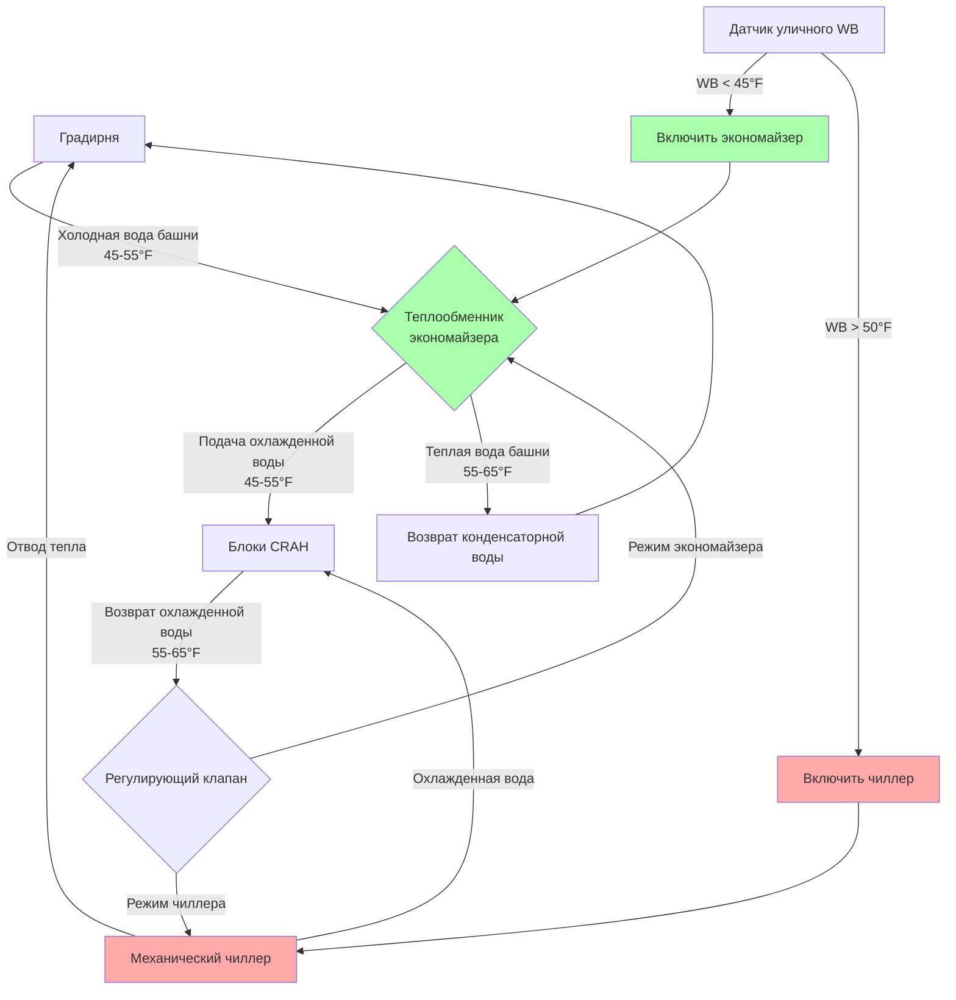

# Стратегии оптимизации эффективности охлаждения центра обработки данных

Эффективность охлаждения представляет основную возможность для оптимизации энергопотребления при работе центра обработки данных, обычно составляя 30-50% от общего энергопотребления инфраструктуры сверх нагрузок оборудования IT. Достижение эффективного охлаждения требует понимания термодинамических принципов, регулирующих отвод тепла, внедрения интеллектуальных стратегий управления и использования благоприятных условий окружающей среды посредством работы экономайзера.

## Термодинамическая основа эффективности охлаждения

Фундаментальная задача охлаждения центра обработки данных состоит в передаче тепла от оборудования IT при повышенных температурах (95-115°F / 35-46°C выхлопа) к окружающим условиям через несколько этапов теплового сопротивления. Каждый температурный перепад представляет термодинамическую необратимость и энергопотребление.

### Путь передачи тепла

Полный цикл охлаждения включает последовательные процессы передачи тепла:

Каждый этап теплового сопротивления требует температурного перепада и потребляет энергию. Минимизация этих перепадов при сохранении адекватной скорости теплопередачи представляет основную задачу оптимизации эффективности.

### Пределы эффективности Карно

Теоретический максимальный коэффициент производительности для механического охлаждения подчиняется пределам цикла Карно:

$$COP_{Carnot} = \frac{T_{evap}}{T_{cond} - T_{evap}}$$

где температуры должны быть выражены в абсолютных единицах (Кельвины или Ранкины).

Для типичных условий центра обработки данных:
- Температура испарителя: 40°F (4,4°C) = 277,6 K
- Температура конденсатора: 95°F (35°C) = 308,2 K

$$COP_{Carnot} = \frac{277.6}{308.2 - 277.6} = \frac{277.6}{30.6} = 9.07$$

Реальные чиллеры достигают 50-65% эффективности Карно, что приводит к фактическим значениям COP 4,5-6,0 при данных условиях. Повышение эффективности требует либо повышения температуры испарителя, либо снижения температуры конденсатора.

## Системы экономайзеры для свободного охлаждения

Работа экономайзера использует благоприятные условия на улице для исключения или снижения механического охлаждения, представляя стратегию с наиболее высоким воздействием на эффективность.

### Работа водяного экономайзера

Водяные экономайзеры производят охлажденную воду, пропуская воду из градирни через теплообменники, когда температура мокрого термометра на улице позволяет достаточное охлаждение без механического сжатия.

#### Эффективность теплообменника

Пластинчато-рамные теплообменники передают тепло между контурами башенной воды и охлажденной воды:

$$\epsilon_{HX} = \frac{Q_{actual}}{Q_{maximum}} = \frac{T_{CHW,return} - T_{CHW,supply}}{T_{CHW,return} - T_{tower,supply}}$$

Типичные значения эффективности составляют от 0,70 до 0,85 для противоточных пластинчатых теплообменников с адекватной площадью поверхности.

Необходимая температура мокрого термометра на улице для полной работы экономайзера:

$$T_{WB,required} = T_{CHW,supply} - \epsilon_{HX} \cdot \epsilon_{tower} \cdot (T_{CHW,return} - T_{CHW,supply})$$

Для подачи охлажденной воды 45°F (7,2°C) с возвратом 55°F (12,8°C), эффективностью теплообменника 0,80 и эффективностью градирни 0,85:

$$T_{WB,required} = 45 - 0.80 \cdot 0.85 \cdot (55-45) = 45 - 6.8 = 38.2°F\,(3.4°C)$$

#### Интегрированная конфигурация водяного экономайзера

### Работа воздушного экономайзера

Воздушные экономайзеры вводят наружный воздух прямо в центр обработки данных, когда условия температуры и влажности находятся в приемлемых пределах.

#### Прямой воздушный экономайзер

Прямые системы смешивают наружный воздух с возвратным воздухом через модулирующие заслонки:

$$CFM_{outdoor} = \frac{Q_{cooling}}{1.08 \cdot (T_{return} - T_{outdoor})}$$

Для нагрузки охлаждения 1000 кВт (284 т холода) с возвратным воздухом 85°F (29,4°C) и наружным воздухом 55°F (12,8°C):

$$CFM_{outdoor} = \frac{1000 \times 3413}{1.08 \times (85-55)} = \frac{3,413,000}{32.4} = 105,340\,\text{CFM}\,(179,000\,\text{м}^3\text{/ч})$$

К проблемам относятся:
- Контроль влажности при значительном колебании точки росы наружного воздуха
- Требования фильтрации твердых частиц (минимум MERV 13-15)
- Газовое загрязнение в городских или промышленных местоположениях
- Сложность управления, чтобы предотвратить ошибки температуры

#### Косвенный воздушный экономайзер

Косвенные системы используют воздухо-воздушные теплообменники для передачи холода при сохранении разделения между наружным и воздухом центра обработки данных:

Производительность теплообменника:

$$Q = \epsilon_{HX} \cdot C_{min} \cdot (T_{outdoor} - T_{supply})$$

где $C_{min} = \min(\dot{m}_{outdoor} \cdot c_p,\, \dot{m}_{datacenter} \cdot c_p)$ представляет минимальную тепловую производительность.

Типичная эффективность роторных теплообменников: 0,75-0,85
Типичная эффективность пластинчатых теплообменников: 0,60-0,75

### Частичная работа экономайзера

Большинство местоположений не могут достичь полного свободного охлаждения в течение всего года, но частичная работа экономайзера обеспечивает значительные сбережения, уменьшая механическую нагрузку охлаждения.

Чиллер работает с пониженной производительностью, когда условия на улице обеспечивают частичное охлаждение:

$$Q_{chiller} = Q_{total} - Q_{economizer}$$

$$Q_{economizer} = \epsilon_{system} \cdot \dot{m}_{air} \cdot c_p \cdot (T_{return} - T_{outdoor})$$

Стратегии управления переходят между полным механическим охлаждением, частичным экономайзером с механической добавкой и полным режимом экономайзера на основе условий на улице и требований нагрузки.

## Управление температурой для эффективности

Работа при повышенных температурах во всей системе охлаждения улучшает эффективность на каждом термодинамическом этапе, сохраняя надежность оборудования в соответствии с руководством ASHRAE TC 9.9.

### Повышенная температура охлажденной воды

Традиционные системы охлажденной воды центра обработки данных работают с температурой подачи 42-45°F (5,6-7,2°C). Увеличение до 50-55°F (10-12,8°C) обеспечивает множество преимуществ:

**Улучшение эффективности чиллера**

Повышение температуры испарителя улучшает COP приблизительно на 1,5-2,5% на каждый °F увеличения:

$$\frac{dCOP}{dT_{evap}} \approx 0.015\,\text{до}\,0.025\,\text{на °F}$$

При увеличении на 10°F с 42°F до 52°F:
- Улучшение COP: 15-25%
- Снижение энергии: 13-20% при постоянной нагрузке

**Расширение часов работы экономайзера**

Повышенная температура охлажденной воды позволяет работе экономайзера при повышенных условиях мокрого термометра на улице, увеличивая годовые часы свободного охлаждения на 800-1500 часов в умеренном климате.

**Соображения относительно оборудования**

Повышенная температура охлажденной воды требует:
- Больших охлаждающих катушек для сохранения теплопередачи с пониженным температурным перепадом
- Более высоких скоростей воздуха или принятия повышенной температуры подаваемого воздуха
- Проверки совместимости с существующими блоками CRAH/CRAC

Требуемая площадь катушки масштабируется обратно пропорционально логарифмической средней разности температур (LMTD):

$$Q = UA \cdot LMTD$$

$$A_{new} = A_{existing} \cdot \frac{LMTD_{existing}}{LMTD_{new}}$$

Для постоянного U (общий коэффициент теплопередачи), увеличение подачи охлажденной воды с 42°F до 52°F при сохранении подаваемого воздуха 55°F обычно требует дополнительной площади катушки на 25-35%.

### Оптимизация температуры подаваемого воздуха

Температура подаваемого воздуха напрямую влияет как на производительность охлаждения, так и на энергопотребление вентилятора.

**Связь температуры и воздушного потока**

Производительность явного охлаждения:

$$Q_{sensible} = 1.08 \cdot CFM \cdot \Delta T$$

При постоянной нагрузке охлаждения требуемый воздушный поток варьируется обратно пропорционально температурному перепаду:

$$\frac{CFM_2}{CFM_1} = \frac{\Delta T_1}{\Delta T_2}$$

Увеличение температуры подачи с 55°F на 65°F с возвратом 85°F:
- Исходная ΔT: 30°F
- Новая ΔT: 20°F
- Снижение воздушного потока: 33%

**Влияние на энергию вентилятора**

Мощность вентилятора следует законам подобия с кубической зависимостью от потока:

$$\frac{P_2}{P_1} = \left(\frac{CFM_2}{CFM_1}\right)^3$$

Снижение воздушного потока на 33% приводит к снижению мощности вентилятора на 70%:

$$\frac{P_2}{P_1} = (0.67)^3 = 0.30$$

### Соответствие тепловому конверту ASHRAE

| Стратегия | Температура подачи | Температура входа в стойку | Класс ASHRAE | Годовая экономия на 1 МВт IT |
|----------|-------------------|--------------------------|--------------|------------------------------|
| Традиционная | 55-60°F (13-16°C) | 65-70°F (18-21°C) | A1 (консервативная) | Базовая |
| Умеренная оптимизация | 60-65°F (16-18°C) | 70-75°F (21-24°C) | A1 (верхний предел) | 150-250 МВтч |
| Агрессивная оптимизация | 65-70°F (18-21°C) | 75-80°F (24-27°C) | A2 (допустимая) | 250-400 МВтч |
| Максимальная оптимизация | 70-75°F (21-24°C) | 80-85°F (27-29°C) | A2/A3 (допустимая) | 350-550 МВтч |

Оптимизация температуры должна сбалансировать энергосбережение с соображениями надежности оборудования. Допустимые диапазоны ASHRAE позволяют агрессивную оптимизацию, но гарантии производителя могут указывать на более консервативные пределы.

## Эффективность оборудования охлаждения

Выбор и работа механического оборудования охлаждения значительно влияют на общее энергопотребление.

### Сравнение технологий чиллеров

| Технология | Типичный диапазон COP | кВ/т | Лучшие приложения | Эффективность при неполной нагрузке |
|-----------|----------------------|------|-------------------|-------------------------------------|
| Воздушный винтовой | 2,5-3,2 | 1,1-1,4 | Малые объекты, без доступа к воде | Хорошая (VFD компрессор) |
| Водяной винтовой | 4,0-5,5 | 0,64-0,88 | Средние объекты | Хорошая (уровневое управление + VFD) |
| Водяной центробежный | 5,0-7,5 | 0,47-0,70 | Крупные объекты | Отличная (магнитный подшипник) |
| Абсорбционный (отходящее тепло) | 0,6-1,2 | 2,9-5,9 | Применение когенерации | Умеренная |

### Внедрение привода переменной скорости

Приводы переменной частоты (VFD) позволяют оборудованию охлаждения работать с пониженной производительностью со значительно улучшенной эффективностью при неполной нагрузке.

**VFD компрессора чиллера**

Центробежные компрессоры с VFD сохраняют высокую эффективность в диапазоне нагрузки 30-100%:

$$\text{Эффективность при неполной нагрузке} = \frac{COP_{неполная\,нагрузка}}{COP_{полная\,нагрузка}}$$

Типичные значения:
- 100% нагрузка: 1,00 (опорная)
- 75% нагрузка: 1,05-1,10
- 50% нагрузка: 1,10-1,20
- 25% нагрузка: 1,00-1,10

**VFD вентилятора градирни**

Вентиляторы башни модулируют для сохранения целевой разности температур подходящего воздуха:

$$P_{fan} = P_{rated} \cdot \left(\frac{RPM_{actual}}{RPM_{rated}}\right)^3$$

При скорости 70% для сохранения разности во время умеренных условий на улице:

$$P_{fan} = P_{rated} \cdot (0.70)^3 = 0.343 \cdot P_{rated}$$

Снижение мощности вентилятора на 66% дает улучшение эффективности системы охлаждения на 5-15% в зависимости от размера башни.

### Стратегия уровневого управления охлаждающим оборудованием

Множество меньших охлаждающих блоков, работающих параллельно, обеспечивают лучшую эффективность при неполной нагрузке, чем несколько больших блоков.

**Пример конфигурации N+1**

Пять чиллеров мощностью 200 т вместо трех чиллеров мощностью 333 т:

При нагрузке центра обработки данных 50% (требуется 500 т холода):
- Подход с пятью блоками: Три чиллера при нагрузке 83% каждый → Работа с высокой эффективностью
- Подход с тремя блоками: Два чиллера при нагрузке 83% → Подобная эффективность, но отсутствие избыточности при неполной нагрузке

Ротация лидер-отстающий распределяет время работы равномерно по всем блокам, максимизируя срок службы оборудования при сохранении эффективности.

## Управление воздушным потоком для энергоэффективности

Эффективное управление воздушным потоком исключает ненужную производительность охлаждения и энергопотребление вентилятора путем предотвращения смешивания горячего и холодного воздуха.

### Влияние на энергию от герметизации

Системы герметизации обеспечивают измеримые сокращения энергии через несколько механизмов:

**Снижение требуемой производительности охлаждения**

Исключение рециркуляции позволяет повышение температуры возвратного воздуха:

$$\Delta T_{improvement} = (1 - RI) \cdot (T_{return,potential} - T_{return,actual})$$

где RI = индекс рециркуляции (0 = идеальный, 0,5 = серьезное смешивание)

Улучшение с RI = 0,3 на RI = 0,05 с выхлопом оборудования 95°F:
- Без герметизации: возврат 75°F (30% рециркуляция)
- С герметизацией: возврат 90°F (5% рециркуляция)
- Улучшение ΔT: 15°F (8,3°C)

**Снижение энергии вентилятора**

Более высокая ΔT снижает требуемый воздушный поток:

$$CFM_{new} = CFM_{original} \cdot \frac{\Delta T_{original}}{\Delta T_{new}}$$

$$P_{fan,new} = P_{fan,original} \cdot \left(\frac{\Delta T_{original}}{\Delta T_{new}}\right)^3$$

При увеличении ΔT на 50% (с 20°F на 30°F):
- Снижение воздушного потока: 33%
- Снижение мощности вентилятора: 70%

### Оптимизация вычислительной гидродинамики

Анализ CFD оптимизирует размещение плиток и перфорированную площадь для минимизации требуемого воздушного потока при сохранении тепловой однородности.

**Целевые показатели оптимизации**

1. Однородность температуры входа в стойку: ±2°F (1°C) максимальное отклонение
2. Минимизация обхода воздуха: <10% от подаваемого воздушного потока
3. Минимизация рециркуляции: Индекс рециркуляции <0,10
4. Минимальное требуемое давление в плене: Снижение энергии вентилятора

Типично оптимизированные по CFD конструкции достигают снижения энергии вентилятора на 15-25% в сравнении с подходами равномерного распределения плиток.

### Минимизация потерь давления

Снижение потерь давления в системах распределения воздуха напрямую снижает энергию вентилятора:

$$P_{fan} = \frac{CFM \cdot \Delta P_{total}}{6356 \cdot \eta_{fan}}$$

Каждое снижение потерь давления на 0,1 дюйм в.с. (25 Па) экономит приблизительно 3-5% энергии вентилятора при постоянном расходе.

**Источники потерь давления**

| Компонент | Типичная потеря давления | Стратегия оптимизации |
|-----------|--------------------------|----------------------|
| Перфорированные напольные плитки | 0,03-0,10 дюйм в.с. | Больший коэффициент перфорации, оптимизация CFD |
| Плена под поднятым полом | 0,02-0,08 дюйм в.с. | Удаление препятствий, адекватная высота плена |
| Охлаждающая катушка | 0,20-0,50 дюйм в.с. | Конструкция катушки при низкой скорости, регулярная чистка |
| Фильтры | 0,10-0,40 дюйм в.с. | Большая площадь фильтра, своевременная замена |
| Воздуховоды и фитинги | 0,10-0,30 дюйм в.с. | Обтекаемые переходы, минимизация изгибов |

## Метрики эффективности и мониторинг

Количественные метрики обеспечивают объективную оценку работы системы охлаждения и выявление деградации или возможностей оптимизации.

### Эффективность использования электроэнергии (PUE)

PUE остается основной метрикой эффективности центра обработки данных:

$$PUE = \frac{P_{total\,facility}}{P_{IT}} = 1 + \frac{P_{cooling} + P_{lighting} + P_{UPS\,loss} + P_{other}}{P_{IT}}$$

**Изоляция компонента охлаждения**

Вклад охлаждения в PUE:

$$PUE_{cooling} = \frac{P_{cooling}}{P_{IT}}$$

Типичные значения:
- Унаследованные объекты: 0,50-1,00 (компонент охлаждения PUE)
- Современные объекты: 0,25-0,40
- Оптимизированные объекты: 0,10-0,20

### Коэффициент производительности (COP)

Системный COP количественно определяет эффективность механического охлаждения:

$$COP_{system} = \frac{Q_{cooling}}{P_{chiller} + P_{pumps} + P_{tower\,fans} + P_{CRAH\,fans}}$$

Комплексный COP включает все вспомогательное оборудование, обеспечивая точную оценку эффективности.

### Использование производительности охлаждения

Использование производительности указывает, работает ли инфраструктура охлаждения в эффективных точках нагрузки:

$$\text{Использование} = \frac{Q_{actual\,load}}{Q_{installed\,capacity}} \times 100\%$$

Оптимальный диапазон: 60-80% установленной производительности
- Ниже 50%: Чрезмерное переключение, плохая эффективность при неполной нагрузке
- Выше 90%: Недостаточная избыточность, риск тепловых превышений

### Метрики эффективности температуры

**Индекс подачи тепла (SHI)**

Количественно определяет воздушный поток обхода, который возвращается без прохождения через оборудование:

$$SHI = \frac{T_{return} - T_{equipment\,outlet}}{T_{equipment\,outlet} - T_{supply}}$$

Цель: SHI < 0,10 (менее 10% обхода)

**Индекс температуры возврата (RTI)**

Измеряет эффективность сбора горячего выхлопа:

$$RTI = \frac{T_{return} - T_{supply}}{T_{equipment\,outlet} - T_{supply}}$$

Цель: RTI > 0,85 (сбор >85% температурного подъема)

**Индекс рециркуляции (RI)**

Количественно определяет смешивание горячего выхлопа с холодной подачей:

$$RI = \frac{T_{rack\,inlet} - T_{supply}}{T_{return} - T_{supply}}$$

Цель: RI < 0,05 (менее 5% рециркуляции)

## Стратегии оптимизации для конкретного климата

Географическое местоположение определяет потенциал экономайзера и оптимальные подходы к охлаждению.

### Стратегии холодного климата (Миннеаполис, Денвер, Торонто)

Температура на улице в течение года <55°F (12,8°C): 6000-7000 часов

**Приоритеты оптимизации**

1. **Максимизация работы воздушного экономайзера**
   - Прямой ввод наружного воздуха при T<50°F и надлежащей влажности
   - Управление сухим термометром приемлемо в холодном климате
   - Годовая экономия энергии: 40-60% энергии охлаждения

2. **Повышенные рабочие температуры**
   - Подаваемый воздух 70-75°F позволяет работу экономайзера даже в мягких условиях
   - Охлажденная вода 55-60°F расширяет часы работы водяного экономайзера

3. **Минимизация зимней увлажнения**
   - Холодный наружный воздух имеет низкую абсолютную влажность
   - Целевой нижний конец диапазона влажности ASHRAE (30-40% RH)
   - Предпочтительно адиабатическое увлажнение над паровым

### Стратегии умеренного климата (Сан-Франциско, Сиэтл, Портленд)

Температура на улице в течение года <55°F (12,8°C): 5000-6000 часов

**Приоритеты оптимизации**

1. **Водяной экономайзер с дополнительным охлаждением**
   - Работа частичного экономайзера круглый год
   - Механический чиллер обеспечивает добавочную производительность
   - Годовая экономия энергии: 50-70% энергии охлаждения

2. **Косвенный воздушный экономайзер**
   - Избегает вызовов контроля влажности
   - Эффективен с умеренными прибрежными условиями
   - Эффективность теплообменника имеет критическое значение

3. **Адиабатическое предварительное охлаждение**
   - Испарительное охлаждение наружного или конденсаторного воздуха
   - Расширяет часы работы экономайзера на 500-1000 часов ежегодно
   - Требует доступность воды и обработка

### Стратегии жаркого сухого климата (Феникс, Лас-Вегас, Альбукерке)

Температура на улице в течение года <55°F (12,8°C): 2000-3500 часов

**Приоритеты оптимизации**

1. **Улучшение испарительного охлаждения**
   - Прямое испарительное охлаждение подаваемого воздуха
   - Косвенное испарительное охлаждение конденсаторной воды
   - Температура мокрого термометра на 20-30°F ниже сухого термометра позволяет значительную производительность

2. **Тепловое аккумулирование**
   - Зарядка холодной воды или ледяного хранилища в ночное время
   - Снижает пиковую электрическую нагрузку и стоимость
   - Позволяет недостаточно размерному механическому охлаждению для средней нагрузки

3. **Агрессивная оптимизация температуры**
   - Подаваемый воздух 72-78°F максимизирует механическую эффективность
   - Пониженная ΔT частично компенсируется минимальной выгодой экономайзера

### Стратегии жаркого влажного климата (Майами, Хьюстон, Сингапур)

Температура на улице в течение года <55°F (12,8°C): <1000 часов

**Приоритеты оптимизации**

1. **Механическое охлаждение высокой эффективности**
   - Экономайзер обеспечивает минимальную выгоду
   - Чиллеры премиум-эффективности обязательны
   - COP чиллера >6,0 достижим при оптимизации

2. **Оптимизация осушения**
   - Высокая наружная влажность требует непрерывного удаления влаги
   - Повышенная температура охлажденной воды снижает осушение
   - Рассмотрение дессикантных систем для контроля влажности

3. **Оптимизация отвода отходящего тепла**
   - Работа градирни имеет критическое значение
   - Более крупные башни снижают температуру подхода
   - Адиабатическое предварительное охлаждение расширяет производительность башни

## Продвинутые стратегии управления

Интеллектуальные алгоритмы управления динамически оптимизируют системы охлаждения на основе условий реального времени и прогностической аналитики.

### Прогностическое управление (MPC)

Алгоритмы MPC предсказывают будущие тепловые условия и оптимизируют решения управления:

$$\min_{u(t)} \sum_{k=0}^{N} [J(x(k), u(k))]$$

с учетом тепловых ограничений: $T_{rack,inlet,i} \leq T_{max}$ для всех стоек

где:
- x(k) = состояние системы (температуры, нагрузки) в момент k
- u(k) = входные сигналы управления (выходы охлаждающих блоков, скорости вентилятора)
- J = целевая функция (обычно энергопотребление)
- N = горизонт предсказания (обычно 1-4 часа)

Внедрение MPC достигает энергосбережения 5-15% сверх обычного управления через:
- Предвидение изменений нагрузки и упреждающую регулировку
- Использование теплоемкости для сдвига спроса
- Оптимизация переходов режима экономайзера для предотвращения ошибок

### Оптимизация искусственного интеллекта

Алгоритмы машинного обучения выявляют неочевидные возможности эффективности:

**Предсказание нагрузки нейронной сетью**

Предсказание нагрузки IT на основе времени суток, дня недели и внешних факторов:

$$P_{IT}(t+\Delta t) = f_{NN}(t, day, weather, workload\,pattern)$$

Точное предсказание нагрузки позволяет:
- Упреждающие регулировки охлаждения
- Оптимизированное уровневое управление оборудованием
- Упреждающие изменения режима экономайзера

**Управление обучением с подкреплением**

Алгоритмы RL обучаются оптимальным политикам управления путем проб и ошибок:

1. Наблюдение состояния: Текущие температуры, нагрузки, условия на улице
2. Выбор действия: Выходы охлаждающих блоков, уставки, уровневое управление оборудованием
3. Расчет награды: Отрицательное энергопотребление, штрафы за нарушения температуры
4. Обновление политики: Регулировка стратегии управления для максимизации совокупной награды

Развернутые системы RL демонстрируют энергосбережение охлаждения на 10-20% сверх обычной оптимизации при сохранении более жесткого теплового управления.

## Валидация энергетических характеристик

Непрерывный мониторинг валидирует улучшения эффективности и выявляет деградацию.

### Базовое энергопотребление

Установка базовой линии до оптимизации, используя регрессионный анализ:

$$E_{cooling} = a_0 + a_1 \cdot P_{IT} + a_2 \cdot T_{outdoor} + a_3 \cdot T_{outdoor}^2$$

где коэффициенты определяются путем анализа исторических данных.

### Измерение и проверка (M&V)

Подход Option B IPMVP (Международный протокол измерения и проверки производительности):

$$\text{Сбережения} = (E_{baseline,adjusted} - E_{post-optimization}) \pm \text{точность}$$

где базовая линия корректируется для текущих условий года (нагрузка IT, температура наружного воздуха).

**Требуемое измерение**

- Общее потребление электроэнергии объектом (±1% точность)
- Потребление нагрузки IT (±2% точность)
- Потребление электроэнергии системой охлаждения по подсистемам (±2% точность)
- Расходы охлажденной воды (±3% точность)
- Температуры подачи/возврата воздуха и воды (±0,5°F точность)
- Температура и влажность наружного воздуха (±1°F, ±3% RH точность)

### Отслеживание долгосрочной производительности

Эффективность деградирует со временем в результате:
- Загрязненных теплообменников: Потеря эффективности 5-15% за 2-3 года
- Деградированного уплотнения: Повышенная рециркуляция, потеря эффективности 8-12%
- Дрейфа калибровки: Субоптимальное управление, потеря эффективности 3-8%

Квартальное сравнение эффективности с базовой линией выявляет деградацию:

$$\text{Сохранение эффективности} = \frac{COP_{current}}{COP_{baseline}} \times 100\%$$

Значения ниже 95% требуют исследования и корректирующего обслуживания.

---

**Основные выводы**

Оптимизация эффективности охлаждения требует интегрированного внимания к термодинамическим основам, выбору оборудования, стратегиям управления и непрерывному мониторингу. Системы экономайзеры обеспечивают сбережения с наиболее высоким воздействием, исключая механическое охлаждение, когда условия наружного воздуха это позволяют. Оптимизация температуры во всей системе (от повышенной охлажденной воды до более высоких температур подаваемого воздуха) улучшает эффективность на каждом этапе при сохранении соответствия ASHRAE TC 9.9. Эффективное управление воздушным потоком посредством герметизации и оптимизации CFD исключает потери смешивания, которые компрометируют как производительность, так и эффективность. Стратегии для конкретного климата адаптируют подходы оптимизации к местным условиям, причем холодные климаты благоприятствуют воздушным экономайзерам, а жаркие климаты требуют оптимизации механического охлаждения. Продвинутые алгоритмы управления, включающие MPC и машинное обучение, извлекают дополнительные сбережения через прогностическую и адаптивную работу. Комплексные системы измерения и M&V валидируют улучшения и выявляют деградацию производительности, требующую корректирующих действий.
