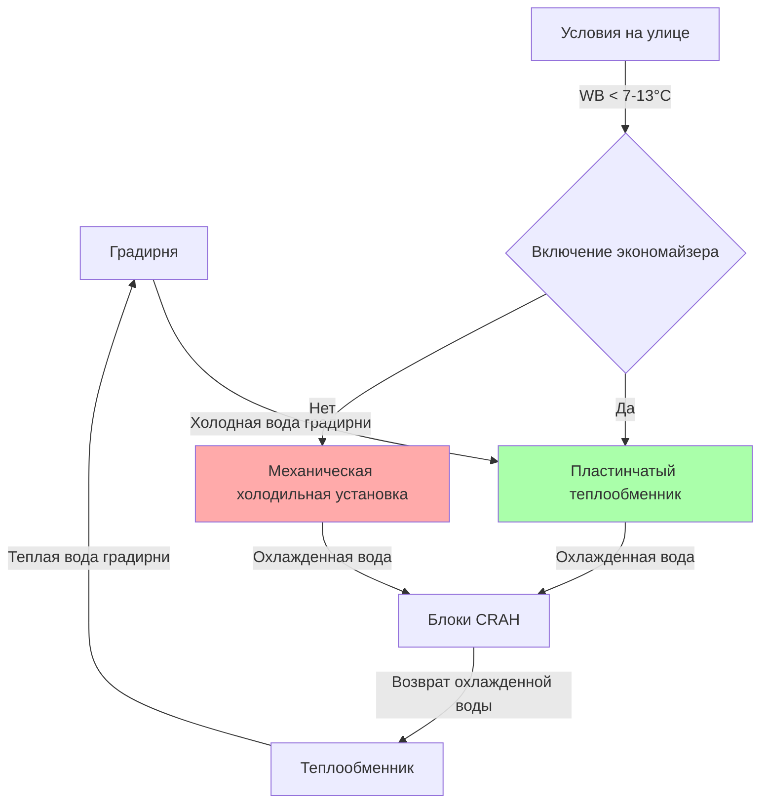
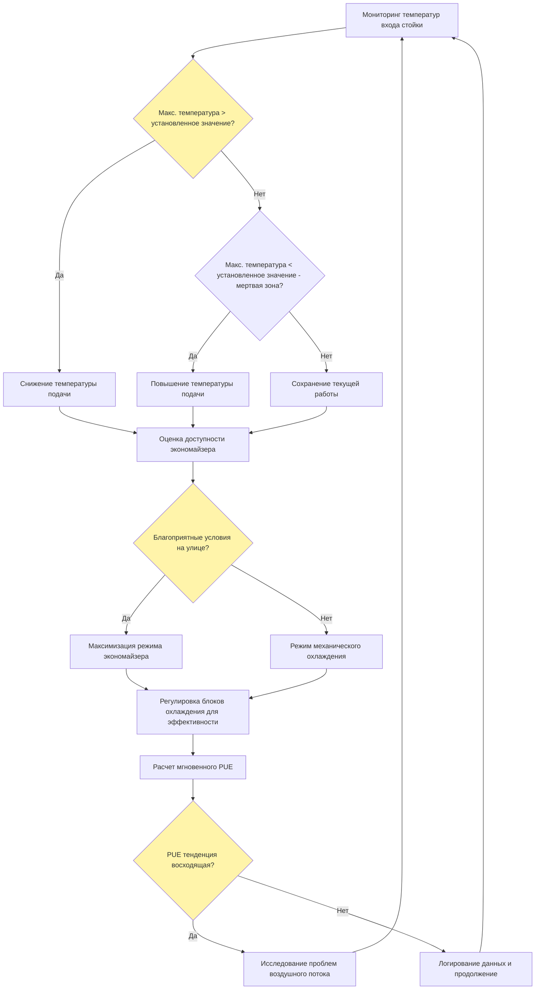

# Стратегии оптимизации PUE в центрах обработки данных

Оптимизация коэффициента использования энергии (PUE) представляет собой фундаментальный подход, управляемый метриками, для минимизации энергопотребления центра обработки данных при сохранении тепловой надежности оборудования IT. Достижение мировых стандартов значений PUE ниже 1,2 требует систематической оптимизации систем охлаждения, разумного использования свободного охлаждения, строгого управления воздушными потоками и непрерывного мониторинга через платформы управления инфраструктурой центра обработки данных (DCIM).

## Основы PUE и расчет

PUE количественно определяет потребление энергии всего объекта относительно энергии оборудования IT:

$$PUE = \frac{P_{total\,facility}}{P_{IT\,equipment}} = \frac{P_{IT} + P_{cooling} + P_{lighting} + P_{UPS\,loss} + P_{other}}{P_{IT}}$$

Это может быть разложено на факторы эффективности компонентов:

$$PUE = 1 + \frac{P_{cooling}}{P_{IT}} + \frac{P_{lighting}}{P_{IT}} + \frac{P_{UPS\,loss}}{P_{IT}} + \frac{P_{other}}{P_{IT}}$$

Компонент охлаждения обычно доминирует в расходах инфраструктуры, представляя 30-60% непроизводительного потребления энергии. Рекомендации ASHRAE TC 9.9 подчеркивают, что оптимизация системы охлаждения дает наиболее значительные улучшения PUE.

### Эталонные характеристики PUE

| Класс объекта | Типичный PUE | PUE лучших практик | Годовой кВт·ч/кВт нагрузки IT |
|----------------|-------------|-------------------|----------------------|
| Унаследованный центр обработки данных | 2,0-2,5 | 1,8-2,0 | 17 520-21 900 |
| Современное предприятие | 1,5-1,8 | 1,3-1,5 | 11 388-15 768 |
| Оптимизированная гиперскала | 1,2-1,4 | 1,08-1,2 | 9 467-12 264 |
| Мировой класс эффективности | 1,05-1,15 | 1,02-1,08 | 8 759-10 074 |

Физика снижения PUE сосредоточена на минимизации термодинамических необратимостей на пути отвода тепла от оборудования IT к окружающей среде.

## Оптимизация эффективности системы охлаждения

Эффективность системы охлаждения напрямую влияет на PUE как за счет потребления электроэнергии, так и за счет выделения тепла в пределах объекта.

### Эффективность холодильной установки

Современные холодильные установки центров обработки данных достигают значений коэффициента производительности (COP) от 4,0 до 7,0 в зависимости от технологии и условий эксплуатации:

$$COP_{chiller} = \frac{Q_{cooling}}{W_{compressor}} = \frac{\text{Производительность охлаждения (кВ)}}{\text{Мощность компрессора (кВ)}}$$

Соотношение кВ/кВт охлаждения (обратное к COP) выраженное в общепринятых единицах:

$$\text{кВ/кВт охлаждения} = \frac{3,517}{COP}$$

Стратегии повышения эффективности включают:

**Системы переменного основного потока**
- Исключение насосов с постоянной скоростью основного циклуса
- Приводы переменной скорости модулируют поток в зависимости от нагрузки охлаждения
- Мощность насоса подчиняется законам подобия: $P \propto Q^3$
- Экономия энергии: 40-60% по сравнению с системами постоянного основного потока

**Повышенная температура охлажденной воды**
- Повышение температуры подачи с 5,6°C до 10-13°C
- Эффективность холодильной установки улучшается приблизительно на 1,5-2% на 0,55°C повышения
- Требует больших змеевиков, но кардинально улучшает часы работы экономайзера
- Оборудование ASHRAE TC 9.9 класса A1-A4 допускает повышенные температуры

Термодинамическое соотношение между температурой испарителя и работой компрессора:

$$COP_{Carnot} = \frac{T_{evap}}{T_{cond} - T_{evap}}$$

Повышение температуры испарителя с 4,4°C до 10°C при сохранении температуры конденсатора 35°C увеличивает теоретический COP с 9,1 до 11,3, что представляет прирост эффективности на 24%.

### Оптимизация градирни

Градирни отводят тепло в окружающую среду посредством испарительного охлаждения, достигая температур подхода 3-6°C к температуре мокрого термометра:

$$T_{approach} = T_{CW,supply} - T_{WB,ambient}$$

Эффективность градирни:

$$\epsilon_{tower} = \frac{T_{CW,return} - T_{CW,supply}}{T_{CW,return} - T_{WB,ambient}}$$

Стратегии оптимизации:

- **Управление вентилятором переменной скорости**: Модуляция для поддержания целевого подхода
- **Увеличенная емкость градирни**: Снижение подхода позволяет повысить эффективность холодильной установки
- **Обработка воды**: Предотвращение образования накипи, снижающей коэффициент теплопередачи
- **Несколько секций**: Поэтапное включение вентиляторов для соответствия нагрузке

Анализ энергии показывает, что увеличение размеров градирни на 20-30% снижает годовое энергопотребление охлаждения на 8-12% за счет улучшения эффективности холодильной установки, несмотря на незначительное увеличение энергопотребления вентилятора градирни.

### Оптимизация блоков CRAH/CRAC

Оптимизация блока компьютерного помещения для подачи воздуха (CRAH) и кондиционирования воздуха (CRAC) сосредоточена на энергии вентилятора и управлении температурой:

**Управление вентилятором переменной скорости**

Соотношение мощности вентилятора:

$$P_{fan} = \frac{Q \cdot \Delta P}{6356 \cdot \eta_{fan} \cdot \eta_{motor} \cdot \eta_{VFD}}$$

При использовании законов подобия, снижение потока на 30% уменьшает мощность приблизительно на 66%:

$$\frac{P_2}{P_1} = \left(\frac{Q_2}{Q_1}\right)^3$$

**Сброс температуры подаваемого воздуха**

В традиционных центрах обработки данных подается воздух с температурой 13-16°C. Повышение до 18-21°C:
- Снижает требуемый воздушный поток на 25-40%
- Позволяет экономайзеру работать больше часов в год
- Снижает энергию холодильной установки за счет повышенной температуры испарителя
- Сохраняет рекомендуемый диапазон ASHRAE, когда температура на входе стойки достигает 21-24°C

## Стратегии экономайзера свободного охлаждения

Свободное охлаждение использует благоприятные условия на улице для минимизации или исключения механического охлаждения, представляя одну из наиболее эффективных техник оптимизации PUE.

### Системы экономайзера воздушной стороны

Экономайзеры воздушной стороны вводят наружный воздух, когда энтальпия или температура это позволяет:

**Прямой экономайзер воздушной стороны (открытая схема)**
- Смешивание наружного воздуха с воздухом возврата через модулирующие заслонки
- Исключение механического охлаждения, когда $T_{outdoor} < T_{return} - \Delta T_{buffer}$
- Буферный температурный диапазон обычно 3-6°C для предотвращения колебаний управления
- Фильтрация критична: требуется MERV 13-15 для качества наружного воздуха

**Непрямой экономайзер воздушной стороны (закрытая схема)**
- Теплообменники воздух-воздух разделяют потоки наружного и воздуха центра обработки данных
- Предотвращает загрязнение влаги, твердых частиц и газов
- Эффективность теплообменника 60-80%
- Эксплуатация при: $T_{outdoor} < T_{supply} - \frac{T_{supply} - T_{outdoor}}{\epsilon}$

### Системы экономайзера водяной стороны

Экономайзеры водяной стороны производят охлажденную воду с использованием градирни и теплообменника, когда это позволяет температура мокрого термометра:

Порог работы зависит от температур подхода:

$$T_{CHW,supply} = T_{WB,outdoor} + T_{approach,tower} + T_{approach,HX}$$

Для подачи охлажденной воды 7°C с подходом градирни 4°C и подходом теплообменника 3°C:

$$T_{WB,required} = 7 - 4 - 3 = 0°C$$

### Анализ часов работы экономайзера по климатическим зонам

Годовая доступность экономайзера варьируется резко в зависимости от географии:

| Климатическая зона | Представительный город | Годовые часы экономайзера (T<13°C) | Годовые часы экономайзера (WB<7°C) | Годовая экономия кВт·ч на кВт IT |
|--------------|-------------------|--------------------------------|----------------------------------|------------------------------|
| Холодный | Миннеаполис, МН | 6 200 часов (71%) | 5 800 часов (66%) | 2 800-3 400 |
| Умеренный | Сан-Франциско, Калифорния | 7 500 часов (86%) | 6 900 часов (79%) | 3 200-3 900 |
| Жарко-сухой | Феникс, Аризона | 2 800 часов (32%) | 2 200 часов (25%) | 1 200-1 600 |
| Жарко-влажный | Майами, Флорида | 800 часов (9%) | 400 часов (5%) | 300-500 |

Частичная работа экономайзера значительно расширяет эти часы, когда условия на улице позволяют снизить подъем компрессора даже без полного свободного охлаждения.

## Управление воздушными потоками для снижения PUE

Эффективное управление воздушными потоками устраняет термодинамические неэффективности, вызванные смешиванием горячего и холодного воздуха, снижая требуемую производительность охлаждения и энергопотребление вентилятора.

### Эффективность систем содержания

Физическое содержание предотвращает рециркуляцию и обход воздушных потоков:

**Рециркуляция**: Смешивание горячего воздуха выпуска с холодным воздухом подачи
**Обход**: Холодный воздух подачи возвращается без прохождения через оборудование IT

Индекс рециркуляции количественно определяет эффективность смешивания:

$$RI = \frac{T_{rack\,inlet} - T_{supply}}{T_{return} - T_{supply}}$$

Идеальная производительность: RI = 0 (нет рециркуляции)
Необработанное помещение: RI = 0,2-0,5 (20-50% рециркуляция)

Аналогично индекс подачи охлажденного воздуха измеряет обход:

$$SHI = \frac{T_{return} - T_{rack\,outlet}}{T_{rack\,outlet} - T_{supply}}$$

**Производительность содержания горячего прохода (HAC)**

Заключение горячих проходов захватывает выпуск оборудования до смешивания:
- Температура воздуха возврата повышается на 6-14°C
- Индекс рециркуляции снижается до <0,05
- Производительность охлаждения увеличивается на 25-40% для одинакового оборудования
- Энергопотребление вентилятора снижается на 20-35% за счет работы с повышенным ΔT

Энергетический баланс с содержанием:

$$Q_{cooling} = \dot{m}_{air} \cdot c_p \cdot (T_{return} - T_{supply}) = \frac{CFM \cdot 1.08 \cdot \Delta T}{3413}$$

Увеличение ΔT с 8°C до 14°C снижает воздушный поток на 40% при эквивалентном охлаждении, что уменьшает мощность вентилятора на приблизительно 78% вследствие кубического соотношения.

### Реализация пустых панелей

Незакрытые пространства стоек создают пути обхода с низким сопротивлением:

- Открытые U-пространства стоек допускают обход холодного воздуха на 30-50%
- Пустые панели заставляют воздушный поток проходить через заполненное оборудование
- Снижает требуемый воздушный поток на 25-40%
- Стоимость реализации: 10-30 USD за стойку
- Экономия энергии: 150-250 кВт·ч в год на стойку

Перепад давления по оборудованию определяет распределение воздушного потока согласно сетям сопротивления потока. Герметизация обхода увеличивает падение давления оборудования, заставляя пропорциональный поток проходить через тепловыделяющие компоненты.

### Оптимизированное размещение плиток

Расположение перфорированных плиток непосредственно влияет на эффективность доставки:

**Традиционный подход**: Равномерное распределение плиток (25-30% площади пола перфорировано)
**Оптимизированный подход**: Плитки расположены только в холодных проходах рядом с высокоплотными стойками

Анализ вычислительной динамики жидкостей (CFD) оптимизирует размещение для достижения:
- Однородность температуры на входе стойки в пределах ±1°C
- Минимальное требуемое давление в скрытой части
- Снижение энергии вентилятора за счет целевой доставки

## Мониторинг и оптимизация DCIM

Платформы управления инфраструктурой центра обработки данных (DCIM) обеспечивают мониторинг в реальном времени и алгоритмическую оптимизацию систем охлаждения на основе фактических тепловых условий.

### Архитектура сенсорной сети

Комплексный тепловой мониторинг требует распределенного измерения:

**Датчики уровня стойки**
- Температура входа: Верх, середина, низ фасадов стоек
- Температура выхода: Задняя часть стойки в горячем проходе
- Дифференциальное давление: Через корпус стойки
- Частота измерения: Интервалы 15-60 секунд

**Датчики уровня помещения**
- Температура и влажность подаваемого воздуха
- Температура воздуха возврата
- Давление в скрытой части (установки с поднятым полом)
- Дифференциальное давление в содержании

Рекомендации по плотности датчиков:
- Минимум: Одна пара входа/выхода на стойку
- Стандарт: Три точки входа (верх/середина/низ) на стойку
- Высокая плотность: 6-12 точек на стойку для стоек >5 кВт

### Алгоритмы оптимизации в реальном времени

Платформы DCIM реализуют алгоритмы управления, которые непрерывно регулируют охлаждение на основе обратной связи:

**Сброс температуры подаваемого воздуха**

Алгоритм поддерживает максимальную наблюдаемую температуру входа стойки на установленном значении (обычно 21-24°C):

$$T_{supply,new} = T_{supply,current} - k \cdot (T_{rack\,inlet,max} - T_{setpoint})$$

где k = коэффициент усиления управления (обычно 0,3-0,7 для устойчивости)

**Разделение блоков охлаждения**

Активация минимального количества блоков для сохранения теплового диапазона:

1. Мониторинг всех температур входа стойки
2. Если максимальная температура превышает установленное значение + мертвая зона → активация дополнительного блока
3. Если все температуры ниже установленного значения - мертвая зона → деактивация одного блока
4. Гистерезис предотвращает колебания: обычно мертвая зона 1-2°C

**Прогностическое тепловое моделирование**

Продвинутые системы DCIM строят модели теплового отклика:

$$T_{rack\,inlet}(t+\Delta t) = f(T_{supply}, CFM_{supply}, P_{IT\,load}, t)$$

Алгоритмы машинного обучения предсказывают реакцию температуры на изменения охлаждения, обеспечивая упреждающие регулировки до возникновения превышений температуры.

### Мониторинг энергии и отслеживание PUE

Непрерывный расчет PUE требует электроизмерений:

- Основное подключение к сети (полная мощность объекта)
- Выход ИБП или входы распределения мощности по сборкам (мощность оборудования IT)
- Электропотребление холодильной установки
- Насосы градирни и конденсаторной воды
- Блоки CRAH/CRAC и оборудование обработки воздуха

Расчет усредненного по времени PUE:

$$PUE_{avg} = \frac{\int_0^T P_{facility}(t) \, dt}{\int_0^T P_{IT}(t) \, dt}$$

Панели инструментов DCIM отображают:
- PUE в реальном времени мгновенного значения
- Средние значения за день/неделю/месяц
- Разбиение энергии по компонентам
- Анализ тенденций, выявляющий деградацию

### Рабочий процесс оптимизации охлаждения

## Интегрированная стратегия оптимизации PUE

Достижение мирового уровня PUE требует одновременной реализации нескольких стратегий оптимизации:

### Оптимизация температуры
- Повышение температуры подаваемого воздуха до 18-21°C
- Повышение температуры охлажденной воды до 10-13°C
- Реализация температурной мертвой зоны подачи 3-6°C
- Ожидаемое воздействие: снижение PUE на 0,1-0,2

### Управление воздушными потоками
- Развертывание содержания горячего прохода или холодного прохода
- Установка пустых панелей на все незакрытые пространства стоек
- Оптимизация размещения перфорированных плиток через анализ CFD
- Ожидаемое воздействие: снижение PUE на 0,15-0,25

### Максимизация экономайзера
- Установка экономайзера водяной стороны для систем охлажденной воды
- Реализация управления для частичной работы экономайзера
- Расширение часов экономайзера за счет повышенной температуры охлажденной воды
- Ожидаемое воздействие: снижение PUE на 0,1-0,3 (в зависимости от климата)

### Эффективность оборудования
- Приводы переменной скорости на всех вентиляторах охлаждения и насосах
- Высокоэффективные холодильные установки (>0,5 кВт на кВт охлаждения при условиях проектирования)
- Увеличенные градирни для сниженного подхода
- Ожидаемое воздействие: снижение PUE на 0,08-0,15

### Оптимизация управления
- Платформа DCIM с мониторингом теплого состояния в реальном времени
- Алгоритмы автоматического разделения блоков охлаждения
- Прогностическое управление на основе прогноза погоды
- Ожидаемое воздействие: снижение PUE на 0,05-0,12

**Комбинированное воздействие**: Комплексная оптимизация может снизить PUE с типичного базового уровня 1,6-1,8 до 1,15-1,25, что представляет снижение энергопотребления инфраструктуры на 30-40%.

Для объекта с нагрузкой IT в 1 МВт:

$$\text{Годовая экономия} = 1000\,\text{кВт} \times 8760\,\text{ч} \times (PUE_{before} - PUE_{after}) \times \text{Тариф электроэнергии}$$

$$= 1000 \times 8760 \times (1,7 - 1,2) \times 0,10\,\text{USD/кВт·ч} = 438\,000\,\text{USD/год}$$

---

**Ключевые выводы**

Оптимизация PUE требует систематического внимания к эффективности системы охлаждения, максимальному использованию свободного охлаждения через экономайзеры, исключению неэффективности воздушных потоков посредством содержания и пустых панелей и непрерывному мониторингу через платформы DCIM. Физика оптимизации сосредоточена на минимизации термодинамических необратимостей—снижении температурных дифференциалов при передаче тепла, исключении потерь смешивания и работе оборудования в точках максимальной эффективности. Рекомендации ASHRAE TC 9.9 по тепловому режиму обеспечивают работу при повышенной температуре, которая одновременно улучшает эффективность холодильной установки и расширяет часы работы экономайзера. Комплексная реализация стратегий оптимизации достигает значений PUE ниже 1,2, снижая энергопотребление инфраструктуры на 35-45% при сохранении полного соответствия спецификациям производителей оборудования и требованиям надежности.
