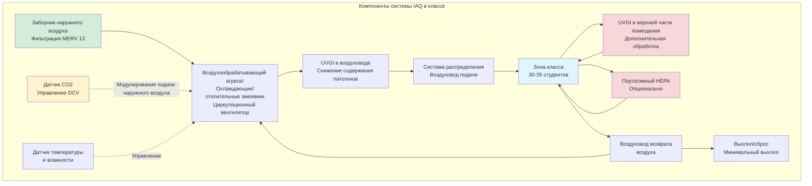

Качество воздуха в помещении класса напрямую влияет на здоровье учащихся, когнитивные способности и результаты обучения. Исследования демонстрируют, что адекватная вентиляция коррелирует с улучшением результатов тестов, сокращением абсентеизма и повышением концентрации внимания. Стандарт ASHRAE 62.1 обеспечивает основу для проектирования вентиляции в классах, а появляющиеся технологии предлагают улучшенные решения по качеству воздуха в помещении.

## Требования к вентиляции ASHRAE 62.1

Стандарт ASHRAE 62.1 устанавливает минимальные требования к наружному воздуху на основе как занятости помещения, так и площади пола. Для классов процедура определения скорости вентиляции требует:

$$V_{oz} = R_p \times P_z + R_a \times A_z$$

Где:
- $V_{oz}$ = требуемое количество наружного воздуха для дыхательной зоны (м³/ч)
- $R_p$ = норма наружного воздуха на человека = 4,75 м³/ч на человека
- $P_z$ = численность зоны (занятые люди)
- $R_a$ = норма наружного воздуха на площадь = 1,29 м³/(ч·м²)
- $A_z$ = площадь пола зоны (м²)

Для типичного класса с 30 учащимися и одним учителем (31 занятое лицо) и площадью пола 83,6 м²:

$$V_{oz} = (4,75 \times 31) + (1,29 \times 83,6) = 147,25 + 107,84 = 255,09 \text{ м³/ч}$$

Это составляет приблизительно 3,05 м³/(ч·м²), значительно выше, чем в общих офисных помещениях. Двухкомпонентный подход учитывает как биоэффлюэнты человека (связанные с людьми), так и материалы здания/мебель (связанные с площадью).

### Нормы вентиляции ASHRAE 62.1 для образовательных помещений

| Тип помещения | Норма на человека (м³/ч на чел.) | Норма на площадь (м³/(ч·м²)) | Типичная занятость (чел./100 м²) | Комбинированная норма (м³/(ч·м²)) |
|------------|-------------------------|---------------------|-------------------------------------|------------------------|
| Классы (возраст 5-8 лет) | 4,75 | 1,29 | 2,69 | 3,03 |
| Классы (возраст 9+) | 4,75 | 1,29 | 3,76 | 3,97 |
| Лекционные залы | 3,56 | 0,65 | 6,99 | 5,92 |
| Компьютерные лаборатории | 4,75 | 1,29 | 2,69 | 3,03 |
| Музыкальные кабинеты | 4,75 | 1,29 | 3,76 | 3,97 |
| Художественные классы | 4,75 | 1,94 | 2,15 | 4,10 |
| Научные лаборатории | 4,75 | 1,94 | 2,69 | 4,63 |
| Библиотеки | 2,37 | 1,29 | 1,08 | 1,83 |
| Спортивные залы | 9,49 | 0,65 | 3,23 | 7,10 |

## Контроль вентиляции по требованию на основе CO2

Контроль вентиляции по требованию (DCV) использует мониторинг CO2 в реальном времени для модулирования подачи наружного воздуха в зависимости от фактической занятости помещения. В классах с переменной посещаемостью DCV может поддерживать качество воздуха в помещении, снижая энергопотребление в периоды частичной занятости.

**Принципы реализации:**

- **Выбор уставки**: Поддерживать уровни CO2 на уровне или ниже 1000 млн⁻¹ (600-700 млн⁻¹ выше наружного фонового уровня)
- **Размещение датчиков**: Установите датчики в дыхательной зоне, на высоте 0,9-1,8 м над полом, вдали от приточных воздухораспределителей и окон
- **Минимальная вентиляция**: Всегда поддерживайте вентиляцию на основе площади (1,29 м³/(ч·м²)) даже при нулевой занятости
- **Время отклика**: Система должна реагировать на изменения занятости в течение 10-15 минут

Скорость вентиляции на основе CO2 можно рассчитать:

$$V_{ot} = V_{oz} \times \frac{C_s - C_o}{C_z - C_o}$$

Где:
- $V_{ot}$ = целевая скорость наружного воздуха (м³/ч)
- $V_{oz}$ = проектная скорость наружного воздуха (м³/ч)
- $C_s$ = уставка CO2 (обычно 1000 млн⁻¹)
- $C_o$ = концентрация наружного CO2 (обычно 400 млн⁻¹)
- $C_z$ = измеренная концентрация CO2 в зоне (млн⁻¹)

## Требования к фильтрации

Пандемия COVID-19 повысила осведомленность о передаче воздушных патогенов, вызвав ужесточение стандартов фильтрации для образовательных учреждений.

**Текущие рекомендации:**

- **Минимум MERV 13**: ASHRAE теперь рекомендует фильтры MERV 13 в качестве базовой линии для школ, обеспечивающие эффективность 85% для частиц размером 1-3 мкм
- **MERV 14-16**: Рассмотрите для школ, обслуживающих уязвимые группы населения или в районах с высоким загрязнением
- **Совместимость системы**: Проверьте, могут ли существующие воздухообрабатывающие агрегаты выдержать увеличенный перепад давления (MERV 13 обычно 100-150 Па при 2,54 м/с)
- **Замена фильтров**: Устанавливайте графики замены на основе мониторинга перепада давления, а не фиксированных интервалов

Фильтры MERV 13 задерживают:
- 50%+ частиц размером 0,3-1,0 мкм (включая множество вирусов в микродроплетах)
- 85%+ частиц размером 1,0-3,0 мкм (включая бактерии, споры плесени)
- 90%+ частиц размером 3,0-10 мкм (включая пыльцу, пыль)

## Температура и влажность для обучения

Тепловой комфорт напрямую влияет на внимание учащихся и когнитивные функции. Исследования показывают, что оптимальное обучение происходит в пределах конкретных параметров окружающей среды.

**Диапазоны температур:**
- Сезон отопления: 20-22°C
- Сезон охлаждения: 23-24°C
- Максимальное изменение: ±1,1°C в пределах занятой зоны

**Относительная влажность:**
- Целевой диапазон: 40-60% ОВ
- Минимум: 30% ОВ (предотвращает статическое электричество, раздражение дыхательных путей)
- Максимум: 60% ОВ (ограничивает рост плесени, снижает аллергены)

Контроль влажности представляет сложность в классах с высокой плотностью занятости. Каждый занятой человек генерирует приблизительно 0,035 кг/ч влаги через дыхание и потоотделение. В классе на 31 человека:

$$M_{total} = 31 \times 0,035 = 1,085 \text{ кг/ч генерирования влаги}$$

Адекватная вентиляция наружным воздухом и надлежащая емкость отвода влаги охлаждающего змеевика необходимы для контроля влажности.

## Контроль ЛОС и формальдегида

Строительные материалы, мебель, чистящие средства и художественные принадлежности вводят летучие органические соединения в воздух класса. Маленькие дети особенно уязвимы для воздействия ЛОС из-за более высоких скоростей дыхания относительно массы тела.

**Стратегии контроля:**

1. **Контроль источников**:
   - Укажите краски, клеи, напольные покрытия с низким содержанием ЛОС (сертификация Green Guard или эквивалент)
   - Используйте мебель из натурального дерева, а не ДСП (источник формальдегида)
   - Установите политику использования экологичных чистящих средств
   - Запланируйте работы по ремонту на летний период с предварительной промывкой перед занятием

2. **Промывка вентиляцией**:
   - Выполните промывку здания: 1330 м³ общего наружного воздуха на м² перед занятием помещения
   - Предварительная очистка перед занятием: Работайте HVAC на 100% наружном воздухе в течение 48-72 часов после строительства

3. **Очистка воздуха**:
   - Газофазная фильтрация (активированный уголь) для удаления формальдегида и ЛОС
   - Фотокаталитические окислительные (ФКО) установки для разложения органических соединений

## Технологии очистки воздуха для улучшенного качества воздуха в помещении

Помимо фильтрации и вентиляции, дополнительные технологии очистки воздуха обеспечивают дополнительное снижение содержания патогенов и удаление загрязняющих веществ.

**Варианты технологий:**

**Ультрафиолетовое излучение в верхней части помещения (UVGI)**:
- Светильники установлены на высоте более 2,1 м над полом облучают верхнюю зону воздуха
- Циркуляция воздуха в помещении естественным образом перемещает воздух через УФ-зону
- Эффективна против переносимых по воздуху бактерий, вирусов, спор плесени
- Обеспечивает эквивалент 10-20 воздухообменов в час для удаления патогенов

**UVGI в воздуховоде**:
- УФ-лампы установлены в воздухообрабатывающих агрегатах или воздуховодах
- Облучает охлаждающие змеевики (предотвращает биопленку) и воздушный поток
- Более низкая эффективность однопроходного режима, чем верхняя зона, но обрабатывает весь подаваемый воздух

**Биполярная ионизация**:
- Генерирует положительные и отрицательные ионы, которые прикрепляются к частицам
- Заявления об инактивации патогенов остаются под изучением
- Может производить озон как побочный продукт; проверьте сертификацию UL 2998 (нулевой озон)

**Портативные очистители воздуха**:
- HEPA-фильтрованные устройства обеспечивают дополнительную очистку воздуха
- Правильно определите размер: Чистая скорость доставки воздуха (CADR) должна быть в 4-6 раз больше объема помещения в час
- Располагайте, чтобы избежать замыкания питающего воздуха в системе распределения

## Практические соображения при реализации

**Проектирование системы:**
- Выделите наружный воздух для классов вместо полагаться на передачу воздуха из коридоров
- Определите размер распределительных систем для низких скоростей (менее 2,54 м/с в воздуховодах, менее 0,5 м/с в диффузорах) для минимизации шума
- Предусмотрите отдельное управление температурой в помещении с помощью беспроводных или низковольтных термостатов
- Установите ручные клапаны наружного воздуха с индикаторами положения для проверки

**Эксплуатация:**
- Реализуйте расписание вентиляции перед занятием и после занятия (начало за 2 часа до, работа 2 часа после)
- Проводите годовую проверку испытания и балансировки
- Контролируйте перепад давления фильтра и уровни CO2 непрерывно
- Установите расписания профилактического обслуживания для очистки змеевиков и санитизации поддонов слива

**Мониторинг:**
- Установите мониторинг системы автоматизации зданий (BAS) для положения клапана наружного воздуха, состояния фильтра и CO2 в помещении
- Рассмотрите панели мониторинга IAQ в реальном времени, видимые для занятых людей (прозрачность создает доверие)
- Установите протоколы оповещения для отклонений за пределы допустимых диапазонов

Надлежащее качество воздуха в классе требует интеграции адекватной вентиляции наружным воздухом, эффективной фильтрации, контроля температуры и влажности, управления источниками и потенциально дополнительных технологий очистки воздуха. Эти системы, работающие совместно, создают здоровую среду обучения, которая поддерживает достижения учащихся и их благополучие.
