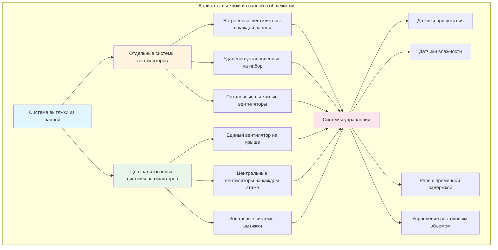

## Обзор

Системы вытяжки из ванных комнат в общежитиях и общежитиях для студентов представляют уникальные задачи по сравнению с типичными жилыми приложениями. Высокая плотность заселения, круглосуточная работа, общие помещения и требования к техническому обслуживанию учреждений требуют тщательно спроектированных решений вентиляции, которые уравновешивают соответствие коду, энергоэффективность и надежное удаление влаги и запахов.

Выбор между стратегиями непрерывной и прерывистой вытяжки, централизованными и отдельными системами вентиляторов, а также интеграция рекуперации энергии существенно влияют как на первоначальные затраты на строительство, так и на долгосрочные расходы на эксплуатацию многоэтажных общежитий.

## Требования кодекса и расходы вытяжки

Международный механический кодекс (IMC) и стандарт ASHRAE 62.1 устанавливают минимальные требования вентиляции для ванных комнат в общежитиях, которые отличаются от стандартов односемейного жилья.

### Минимальные расходы вытяжки

Для ванных комнат в общежитиях с ванной или душевой кабиной:

- **IMC Раздел 403.3**: Минимум 50 CFM (84,9 м³/ч) прерывистой или 20 CFM (33,9 м³/ч) непрерывной
- **ASHRAE 62.1**: 25 CFM (42,5 м³/ч) на унитаз, 25 CFM (42,5 м³/ч) на душ/ванну
- **Для туалетов без душа**: Минимум 25 CFM (42,5 м³/ч) прерывистой или 10 CFM (17,0 м³/ч) непрерывной

Общее требование вытяжки для типового набора ванной комнаты в общежитии с унитазом, душем и раковиной:

$$Q_{total} = Q_{wc} + Q_{shower} = 25 + 25 = 50 \text{ CFM (84,9 м³/ч)}$$

Для более крупных коллективных ванных комнат, обслуживающих нескольких человек одновременно:

$$Q_{gang} = n_{wc} \times 25 + n_{shower} \times 25 + n_{lav} \times 10 \text{ CFM}$$

где $n$ представляет количество каждого типа приспособления.

### Коэффициенты разнообразия

В больших общежитиях применение коэффициентов разнообразия снижает пиковые требования вытяжки:

$$Q_{design} = Q_{total} \times DF$$

где $DF$ обычно составляет от 0,6 до 0,8 для зданий с более чем 100 ванными комнатами, исходя из вероятности одновременного использования.

## Стратегии непрерывной и прерывистой вытяжки

Выбор между непрерывной и прерывистой работой кардинально влияет на конструкцию системы и потребление энергии.

### Непрерывная работа вытяжки

Непрерывные системы обеспечивают постоянную вентиляцию с расходом минимума кодекса (обычно 20 CFM на ванную комнату):

**Преимущества:**
- Постоянное удаление запахов и влаги
- Более простые системы управления без необходимости датчиков присутствия
- Улучшенный контроль влажности в жарком влажном климате
- Поддержание небольшого отрицательного давления, препятствующего распространению запахов
- Отсутствие задержки в реакции вентиляции

**Недостатки:**
- Более высокое годовое потребление энергии (работа вентилятора 24/7)
- Увеличенная нагрузка на отопление/охлаждение от непрерывной подачи наружного воздуха
- Больший износ электродвигателей вентиляторов и подшипников

Годовое потребление энергии для непрерывной работы:

$$E_{annual} = \frac{Q \times \Delta P \times 8760}{6356 \times \eta_{fan} \times \eta_{motor}} \text{ кВт·ч}$$

где $Q$ — расход воздуха (CFM), $\Delta P$ — статическое давление (дюйм вод. ст.), КПД указан в десятичной форме.

### Прерывистая работа вытяжки

Прерывистые системы работают с более высокими расходами (50 CFM) только при наличии людей в ванных комнатах:

**Преимущества:**
- Сниженное годовое потребление энергии (вентиляторы работают только при наличии)
- Пониженные нагрузки на отопление/охлаждение в течение года
- Возможность увеличения размера вентиляторов вытяжки для быстрого удаления влаги

**Недостатки:**
- Требует датчиков присутствия или ручных переключателей (проблемы с обслуживанием)
- Потенциал неадекватной вентиляции при отказе систем управления
- Накопление влаги в незанятый период во влажном климате
- Временная задержка перед началом вентиляции

**Стратегии управления:**
- Датчики присутствия, установленные на стену, с регулируемыми временными задержками (обычно 20 минут)
- Интеграция со световым выключателем (работает установленное время после выключения света)
- Датчики влажности, запускающие вентиляторы при >60% ОВ независимо от присутствия
- Комбинированное управление присутствием + влажность для оптимальной работы

## Варианты конфигурации системы

## Централизованные и отдельные системы вытяжки

Выбор между централизованной и отдельной системами вытяжки предполагает компромиссы в стоимости, техническом обслуживании и производительности.

| **Критерий** | **Централизованная система** | **Отдельная система** |
|-------------|----------------------|---------------------|
| **Первоначальная стоимость** | Более низкая стоимость оборудования, более высокая стоимость воздуховода | Более высокая стоимость оборудования, более низкая стоимость воздуховода |
| **КПД вентилятора** | 60–70% (более крупные вентиляторы более эффективны) | 40–50% (малые вентиляторы менее эффективны) |
| **Техническое обслуживание** | Единая точка доступа для обслуживания | Несколько устройств для обслуживания |
| **Надежность** | Единая точка отказа влияет на несколько ванных комнат | Отказ изолирован в одной ванной комнате |
| **Контроль звука** | Лучше (вентиляторы удалены от занятого пространства) | Более сложно (вентиляторы рядом с жильцами) |
| **Рекуперация энергии** | Более простая интеграция центральной ERV | Дорогостоящие индивидуальные ERV для помещений |
| **Балансировка** | Требуется сложная балансировка воздуховодов | Простые самозамкнутые системы |
| **Противопожарные заслонки** | Требуются при пересечении этажей/коридоров | Требуется меньше |
| **Размер воздуховода** | Магистрали 15–30 см, ветви 10–15 см | Отдельные воздуховоды 10–15 см |
| **Системы управления** | Централизованное ДДУ, VFD для модуляции | Отдельные термостаты/переключатели |
| **Типичное применение** | Новое строительство, >100 ванных комнат | Реновация, более мелкие здания |

### Проектирование централизованной системы

Централизованная система вытяжки, обслуживающая один этаж (40 ванных комнат), требует:

$$Q_{central} = n_{bathrooms} \times Q_{bathroom} \times DF = 40 \times 50 \times 0,7 = 1400 \text{ CFM (2379 м³/ч)}$$

Расчет размера воздуховода для основного стояка (скорость ограничена 6–7,6 м/с для контроля шума):

$$A = \frac{Q}{V} = \frac{1400}{1300} = 1,08 \text{ м}^2 \rightarrow 30 \text{ см круглый или 25×30 см прямоугольный}$$

### Проектирование отдельной системы

Отдельные вытяжные вентиляторы ванной комнаты обычно:
- Емкость 50–110 CFM для прерывистой работы
- 20–50 CFM для непрерывной работы
- Уровень шума 0,5–1,5 сон для тихой работы
- Подключение воздуховода 10–15 см

## Контроль влажности и запахов

Эффективное удаление влаги предотвращает рост плесени, ухудшение материалов и жалобы жильцов.

### Целевые уровни влажности

Поддерживайте относительную влажность в ванной комнате ниже:
- **60% ОВ во время присутствия** (события с душем)
- **50% ОВ в среднем** за 24-часовой период
- **Время работы вытяжки** 20–30 минут после душа для удаления влаги

Скорость образования влаги при принятии душа:

$$W = 0,09–0,23 \text{ кг/час}$$

Требуемая вытяжка для поддержания 60% ОВ:

$$Q = \frac{W \times 60}{(\omega_{room} - \omega_{outdoor})} \text{ CFM}$$

где $\omega$ представляет отношение влажности (кг влаги/кг сухого воздуха).

### Контроль запахов

Эффективное удаление запахов требует:
- Минимум 5–8 воздухообменов в час в туалетных помещениях
- Отрицательное давление относительно соседних помещений (-2–5 Па)
- Выходные решетки вытяжки расположены вдали от источников подпиточного воздуха
- Непрерывная минимальная вытяжка (даже в прерывистых системах) минимум 10 CFM

## Пути подпиточного воздуха

Выдаваемый воздух должен быть заменен, чтобы предотвратить разреживание здания и обеспечить надлежащую работу системы.

### Требования к зазорам под дверями

IMC требует путей подпиточного воздуха, обычно предусмотренные через зазоры под дверями:

$$A_{undercut} = \frac{Q}{V_{max}}$$

Для $Q = 50$ CFM и максимальной скорости $V_{max} = 60$ м/мин (для ограничения шума):

$$A_{undercut} = \frac{50}{200} = 0,25 \text{ м}^2 = 2500 \text{ см}^2$$

Стандартная практика: **2–2,5 см зазор** на дверь 0,9×2,1 м обеспечивает 2000–2700 см².

### Переходные решетки

Для ванных комнат без дверей в коридоры используются настенные переходные решетки размером:
- 0,76–1,0 м/с лицевая скорость
- Расположены для предотвращения короткого замыкания потока вытяжки
- Жалюзи, направляющие воздух вниз к уровню пола

### Подпиточный воздух в коридоре

В централизованных системах вытяжки коридоры должны быть завоздушены для подачи подпиточного воздуха:

$$Q_{corridor} = \sum Q_{exhaust} + Q_{infiltration}$$

Системы подачи воздуха в коридор обычно подают на 10–20% больше воздуха, чем общая вытяжка, для поддержания небольшого положительного давления.

## Рекуперация энергии из вытяжного воздуха

Рекуперация энергии из вытяжного воздуха из ванных комнат сложна из-за влаги и загрязнения, но может обеспечить значительную экономию при крупных установках.

### Вентиляторы рекуперации энергии (ERV)

Центральные системы ERV восстанавливают как явную, так и скрытую энергию:

**Эффективность явной теплоты:** 60–80%
**Эффективность скрытой теплоты:** 50–70%

Годовая экономия энергии:

$$\Delta E = Q \times \rho \times c_p \times \Delta T \times \eta_{sensible} \times hours \times \frac{1}{3413} \text{ кВт·ч}$$

Для системы 1400 CFM с разностью температур 22 °C и эффективностью 70% при работе 8760 часов:

$$\Delta E = 1400 \times 0,075 \times 0,24 \times 22 \times 0,70 \times 8760 \times \frac{1}{3413} = 33 000 \text{ кВт·ч/год}$$

### Сложности рекуперации тепла

Рекуперация вытяжного воздуха из ванных комнат представляет препятствия:
- **Высокое содержание влаги** может вызвать обледенение в холодном климате
- **Ограничения кодекса** на рециркуляцию загрязненного воздуха
- **Техническое обслуживание** теплообменников, подверженных ворсу и остаткам мыла
- **Экономика** может не оправдать рекуперацию из малых отдельных систем

**Решения:**
- Колеса энтальпии с сегментами очистки
- Системы с проточным циклом, изолирующие вытяжку и подачу
- Тепловые насосы вытяжного воздуха, восстанавливающие энергию для горячего водоснабжения
- Циклы разморозки, предотвращающие образование льда

### Соответствие кодексу для рекуперации энергии

ASHRAE 90.1 требует рекуперации энергии, когда:
- Расход проектной подачи превышает 2360 м³/ч, И
- Минимальный наружный воздух превышает 70% от проектной подачи

Большинство отдельных систем вытяжки ванной комнаты в общежитии не превышают эти пороги, но централизованные системы, обслуживающие целые этажи, могут инициировать требования.

## Рекомендации по проектированию

Для оптимальной производительности вытяжки из ванной комнаты в общежитии:

1. **Использовать непрерывную вытяжку** (минимум 20 CFM) с повышением до 50 CFM при присутствии во влажном климате
2. **Централизованные системы** предпочтительны для нового строительства с >50 ванными комнатами на здание
3. **Предусмотреть зазоры под дверями 2–2,5 см** для переноса подпиточного воздуха
4. **Установить датчики влажности**, запускающие вытяжку при ОВ более 60%
5. **Расположить выходные решетки вытяжки** на уровне потолка над душем/ванной
6. **Поддерживать отрицательное давление** -2–5 Па относительно коридоров
7. **Рассмотреть рекуперацию энергии** для централизованных систем >1400 м³/ч
8. **Указать вентиляторы высокой эффективности** (>3,4 м³/(ч·Вт) для отдельных, >5,1 м³/(ч·Вт) для центральных)
9. **Предусмотреть виброизоляцию** всех вентиляторов для минимизации передачи шума
10. **Спроектировать с учетом обслуживания** с доступными фильтрами и люками доступа вентилятора

Надлежащим образом спроектированные системы вытяжки из ванных комнат существенно способствуют комфорту жильцов, долговечности здания и энергоэффективности в общежитиях, обеспечивая при этом соответствие требованиям кодексов вентиляции и стандартам.
