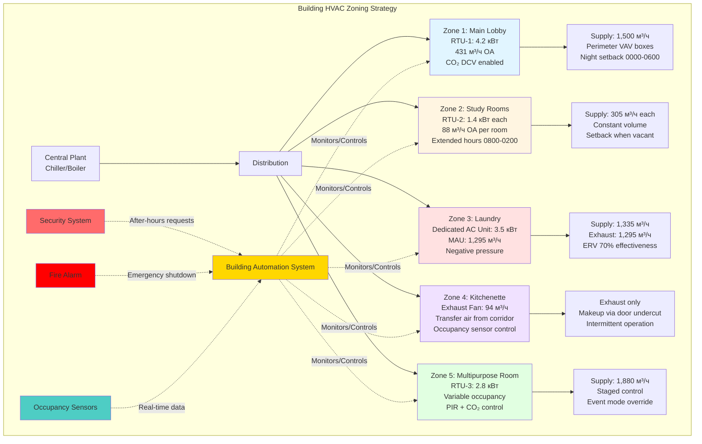

# HVAC для общественных зон общежития

Общественные зоны общежития создают особые задачи HVAC, отличные от отдельных спальных комнат из-за крайне переменных режимов заполнения, разнообразных функциональных требований и расширенного времени работы. В отличие от жилых спальных зон с предсказуемой ночной заполняемостью, общие пространства испытывают пиковые нагрузки в вечерние часы (18:00–24:00), требуют отдельного зонирования для предотвращения кондиционирования пустых комнат во время учебных часов и требуют надежных систем вентиляции для обработки концентрированной заполняемости во время общественных мероприятий. Надлежащая конструкция отделяет системы общих зон от кондиционирования отдельных комнат, внедряет управляемую вентиляцию по спросу для эффективности энергии и интегрируется с системой безопасности зданий для предотвращения несанкционированного доступа через механические проходы.

## Кондиционирование холла и зоны отдыха

### Характеристики расчетной нагрузки

**Режимы заполнения:**
- Пиковая плотность: 1 человек на 1,4–1,9 м² в вечерние часы (19:00–23:00)
- Минимальная плотность: 1 человек на 9,3 м² в часы занятий (09:00–15:00)
- 24-часовая непрерывная заполняемость требует круглогодичного кондиционирования
- Пики выходных дней на 50% выше средних будней

**Нагрузки ограждения:**
- Большие остекленные площади (40–60% соотношение окна к стене) создают значительные солнечные нагрузки
- Инфильтрация входной двери: 190–380 м³/ч на дверь во время пиковых потоков
- Двухэтажные атриумы создают проблемы термической стратификации
- Наружная экспозиция обычно 50% или больше (углы здания, главные входы)

**Внутренние нагрузки:**
- Люди: 73 Вт чувствительная + 59 Вт скрытая (легкая активность, сидя/стоя)
- Освещение: 8,6–12,9 Вт/м² (светодиодные даунлайты + декоративные светильники)
- Телевизоры/дисплеи: 88–147 Вт на экран 140 см
- Торговые автоматы: 352–528 Вт на единицу
- Мебель/отделка: Умеренная тепловая масса

**Пример расчета охлаждающей нагрузки (186 м² холл, 100 человек пик):**

$$Q_{sensible} = Q_{occupants} + Q_{lights} + Q_{solar} + Q_{transmission} + Q_{infiltration}$$

$$Q_{sensible} = (100 \times 73) + (186 \times 11.0) + 13.2 + 3.5 + 2.5$$

$$Q_{sensible} = 7,300 + 2,046 + 13,200 + 3,500 + 2,486 = 28,532 \text{ Вт}$$

$$Q_{latent} = (100 \times 59) + (Q_{infiltration,latent}) = 5,900 + 1,230 = 7,130 \text{ Вт}$$

$$Q_{total} = 28,532 + 7,130 = 35,662 \text{ Вт (10.1 кВт)}$$

**Коэффициент чувствительной теплоты:**

$$SHR = \frac{28,532}{35,662} = 0.80$$

Этот умеренный SHR (0,75–0,85 типично) требует надлежащего выбора оборудования для обработки как чувствительных, так и скрытых нагрузок без чрезмерного осушения при неполных нагрузках.

### Рекомендации по системе

**Кровельные блоки (RTU) с переменным объемом воздуха (VAV) и повторным нагревом:**
- Лучше всего для больших холлов (> 279 м²)
- Емкость: 2,1–7,1 кВт на единицу
- Подача воздуха: 165–212 м³/ч на кВт
- Несколько зон из одного блока (периметр в сравнении с ядром)
- Возможность экономайзера снижает энергию охлаждения на 20–35%

**Раздельные тепловые насосы:**
- Подходит для средних холлов (93–279 м²)
- Емкость: 0,9–2,8 кВт
- Ниже первоначальная стоимость чем RTU
- Более тихая работа (внутренний воздухообрабатывающий агрегат)
- Рекуперация тепла в переходные сезоны

**Излучающие потолочные панели с системой подачи свежего воздуха (DOAS):**
- Премиум вариант для помещений с высокими потолками (> 3,7 м)
- Устраняет термическую стратификацию
- Отличный комфорт (контроль средней радиационной температуры)
- Сниженный шум распределения воздуха
- 15–25% экономия энергии по сравнению с полностью воздушными системами

### Требования к вентиляции

**ASHRAE 62.1-2022 минимальный наружный воздух:**

$$V_{oz} = R_p \times P_z + R_a \times A_z$$

Где:
- $R_p$ = 2,4 м³/ч на человека (Таблица 6-1, сборочные пространства - неконцентрированные)
- $R_a$ = 0,6 м³/ч на м²
- $P_z$ = Пиковая заполняемость (1 человек на 1,4 м²)
- $A_z$ = Площадь пола (м²)

**Пример (186 м² холл, 133 человека пик):**

$$V_{oz} = 2.4 \times 133 + 0.6 \times 186 = 319 + 112 = 431 \text{ м³/ч}$$

**Управляемая вентиляция по спросу (DCV) внедрение:**
- Датчики CO₂ измеряют фактическую заполняемость (1 на 93 м² максимальный интервал)
- Наружный воздух колеблется между минимумом (112 м³/ч компонент площади) и максимумом конструкции (431 м³/ч)
- Установка: 1000–1100 ppm выше наружного окружающего
- Годовая экономия энергии: 25–40% энергии вентиляции

$$\text{Avg OA} = V_{min,area} + \frac{\text{Actual occupancy}}{\text{Design occupancy}} \times V_{people}$$

При низкой заполняемости (20 человек, 09:00–15:00):

$$V_{oz,actual} = 112 + \frac{20}{133} \times 319 = 112 + 48 = 160 \text{ м³/ч (63% снижение)}$$

## Вентиляция и комфорт комнаты учебы

### Расчеты нагрузки

**Типичная конфигурация комнаты учебы:**
- Площадь: 28–56 м²
- Заполняемость: 15–30 студентов (высокая плотность)
- Оборудование: Компьютеры, ноутбуки, зарядные станции
- Часы: Расширенная работа (08:00–02:00, 18 часов/день)

**Охлаждающие нагрузки на одного человека:**
- Чувствительная: 73 Вт (сидячая деятельность)
- Скрытая: 59 Вт (умеренная деятельность, стресс)
- Всего: 132 Вт на человека

**Тепловыделение оборудования:**
- Ноутбук: 50–80 Вт (во время зарядки)
- Настольный компьютер: 120–180 Вт с монитором
- Светодиодные лампы для стола: 10–15 Вт
- Зарядные устройства для телефонов: 5–10 Вт на студента

**Пример расчета нагрузки (46 м² комната учебы, 25 студентов, 15 ноутбуков):**

$$Q_{occupants} = 25 \times 132 = 3,300 \text{ Вт}$$

$$Q_{equipment} = 15 \times 66 + 10 \times 22 = 990 + 220 = 1,210 \text{ Вт}$$

$$Q_{lighting} = 46 \times 12.9 = 594 \text{ Вт}$$

$$Q_{transmission} = U \times A \times \Delta T = 0.34 \times 19 \times 8 = 52 \text{ Вт (внутренняя комната)}$$

$$Q_{total} = 3,300 + 1,210 + 594 + 52 = 5,156 \text{ Вт (1.5 кВт)}$$

**Пиковая интенсивность охлаждающей нагрузки:**

$$q = \frac{5,156}{46} = 112 \text{ Вт/м²}$$

Эта высокая интенсивность охлаждения (101–133 Вт/м²) превышает типичное офисное пространство (84–106 Вт/м²) и требует отдельной емкости HVAC.

### Вентиляция и качество воздуха

**Требование наружного воздуха ASHRAE 62.1:**

$$V_{oz} = 2.4 \times 25 + 0.6 \times 46 = 60 + 28 = 88 \text{ м³/ч}$$

**Требование фактической подачи воздуха (на основе охлаждающей нагрузки):**

$$\text{м³/ч}_{supply} = \frac{Q_{sensible}}{1.25 \times \Delta T} = \frac{3,160}{1.25 \times 11} = 229 \text{ м³/ч}$$

**Минимальная доля наружного воздуха:**

$$\text{OA%} = \frac{88}{229} = 38.4\%$$

Этот высокий процент наружного воздуха (типичные офисы используют 15–20%) увеличивает энергию охлаждения и отопления, но необходим для комфорта людей и соответствия кодексу.

**Воздухообмены в час:**

$$ACH = \frac{229 \times 60}{46 \times 2.4} = 10.5 \text{ ACH}$$

Этот повышенный воздухообмен (типичные офисы 4–6 ACH) обеспечивает отличную эффективность вентиляции и быстрое удаление загрязняющих веществ.

### Оптимизация теплового комфорта

**Контроль температуры и влажности:**
- Установка охлаждения: 22–23°C (студенты предпочитают прохладнее во время концентрации)
- Установка отопления: 20–21°C
- Мертвая зона: 1,7°C минимум (требование кодекса энергии)
- Относительная влажность: 40–55% (предотвращает жалобы на сухой воздух во время отопления)

**Стратегии зонирования:**
- Отдельный RTU или тепловой насос на комнату учебы (> 46 м²)
- Отдельный VAV блок для меньших комнат учебы от системы общей зоны
- Позволяет расширенные часы без кондиционирования пустых пространств
- Ночное понижение температуры при неиспользовании (02:00–08:00): 18°C отопление, 27°C охлаждение

**Акустическая производительность:**
- Комнаты учебы требуют тихой работы HVAC (NC 30–35 максимум)
- Выбор диффузора: Низкоскоростной перфорированный или тканевый воздуховод (< 1,5 м/с скорость выпуска)
- Возвратный воздух: Предпочтительны воздуховоды над дверными решетками (снижает передачу шума в коридоре)
- Расположение оборудования: Удаленно от зон учебы

## Вытяжка прачечной и подача свежего воздуха

### Нагрузки тепла и влажности

**Характеристики коммерческой сушилки (на одну машину):**
- Работающие на газе: 8,8–14,6 кВт вход, 94 м³/ч вытяжка
- Электрические: 5,0 кВт (14,3 кВт эквивалент), 94 м³/ч вытяжка
- Удаление влаги: 1,9–3,0 л/час на загрузку
- Время цикла: 30–45 минут типично

**Характеристики стиральной машины (на одну машину):**
- Электрическая: 1500–2000 Вт нагревательный элемент (в основном сливается, минимальная нагрузка пространства)
- Не требуется прямая вытяжка
- Случайное открытие двери высвобождает пульс влажности

**Типичное оборудование для стирки в общежитии (111 м², 12 стиральных, 12 сушильных):**

**Чувствительное тепловыделение от сушилок:**

$$Q_{dryers,sensible} = 12 \times 5000 \times 1 \times 0.35 = 21,000 \text{ Вт}$$

(Коэффициент 0,35 учитывает тепло, выводимое непосредственно наружу в сравнении с выделением в пространство)

**Скрытое тепловыделение (влажность):**

$$Q_{dryers,latent} = 12 \times 2.47 \frac{\text{л}}{\text{ч}} \times 1.0 \frac{\text{кг}}{\text{л}} \times 2450 \frac{\text{кДж}}{\text{кг}} / 3.6 = 20,184 \text{ Вт}$$

**Нагрузка от людей (транзитная, 10 человек в среднем):**

$$Q_{occupants} = 10 \times (73 + 59) = 1,320 \text{ Вт}$$

**Освещение и прочее:**

$$Q_{lights+misc} = 111 \times 10.8 = 1,199 \text{ Вт}$$

**Общая охлаждающая нагрузка:**

$$Q_{total} = 21,000 + 20,184 + 1,320 + 1,199 = 43,703 \text{ Вт (12.4 кВт)}$$

**Охлаждающая нагрузка на квадратный метр:**

$$q = \frac{43,703}{111} = 394 \text{ Вт/м²}$$

Эта экстремально высокая интенсивность охлаждения требует отдельного оборудования HVAC и надлежащей конструкции вытяжки/подачи свежего воздуха.

### Конструкция вытяжки и подачи свежего воздуха

**Требования вытяжки сушилки:**
- По спецификации производителя: 94 м³/ч на сушилку
- Общая вытяжка: 12 × 94 = 1,128 м³/ч
- Воздуховод к внешней части (не подключен к HVAC возвратному)
- Обратные клапаны предотвращают проникновение холодного воздуха при отключении
- Фильтры для ворса требуются (противопожарная безопасность)

**Общая вытяжка пространства (общая вентиляция):**
- Требование ASHRAE 62.1: 0,6 м³/ч на м² компонент площади
- Рекомендуется для прачечной: 1,5 м³/ч на м² (захватывает остаточную влажность и тепло)
- Общая вытяжка пространства: 111 × 1,5 = 167 м³/ч

**Общее требование вытяжки:**

$$\text{Exhaust}_{total} = 1,128 + 167 = 1,295 \text{ м³/ч}$$

**Требование подачи свежего воздуха:**
- Должна равняться общей вытяжке для предотвращения депрессуризации здания
- Емкость агрегата подачи свежего воздуха (MAU): 1,295 м³/ч
- Емкость отопления (зима, -18°C наружный на 18°C подача):

$$Q_{heating} = 1.25 \times 1,295 \times (18 - (-18)) = 58,275 \text{ Вт (58 кВт)}$$

**Опция рекуперации энергии:**
- Агрегат рекуперации энергии вытяжного воздуха (ERV)
- Чувствительная эффективность: 60–75%
- Скрытая эффективность: 50–60%
- Годовая экономия энергии отопления: 40–55%
- Период окупаемости: 4–7 лет в холодном климате

**Стоимость отопления без ERV (годовая, климат Чикаго):**

$$\text{Cost}_{heating} = \frac{58,275 \times 1,667 \text{ HDD}}{18 \times 37,000 \times 0.80} \times 0.95 \text{ руб}/\text{кВт·ч} = 4,810 \text{ руб}/\text{год}$$

**С ERV (70% эффективность):**

$$\text{Cost}_{heating,ERV} = 4,810 \times (1 - 0.70) = 1,443 \text{ руб}/\text{год}$$

$$\text{Savings} = 4,810 - 1,443 = 3,367 \text{ руб}/\text{год}$$

### Отношения давления

**Поддерживайте комнату прачечной при отрицательном давлении:**
- Цель: -2,4 до -4,8 Па относительно коридора
- Предотвращает миграцию запаха и влажности в соседние пространства
- Вытяжка м³/ч превышает подачу м³/ч на 10–15%

**Расчет:**

$$\text{Supply air} = 0.85 \times \text{Exhaust} = 0.85 \times 1,295 = 1,101 \text{ м³/ч}$$

$$\text{Negative pressure flow} = 1,295 - 1,101 = 194 \text{ м³/ч (инфильтрация из коридора)}$$

## Вентиляция кухни и мини-кухни

### Требования жилой мини-кухни

**Типичная мини-кухня этажа общежития (общая для 30–40 студентов):**
- Приборы: Холодильник, микроволновка, тостер-печь, кофеварка, раковина
- Отсутствует коммерческое кухонное оборудование (вытяжные шкафы, печи, фритюрницы)
- Минимальное образование жира
- Основной вопрос: Контроль запаха и комфорт людей

**Вентиляция ASHRAE 62.1 (жилая кухня):**
- Периодическая вытяжка: 47 м³/ч
- Непрерывная вытяжка: 12 м³/ч
- Большинство мини-кухонь в общежитии используют периодическую вытяжку, активируемую датчиком присутствия или выключателем на стене

**Рекомендуемая конструкция:**
- Вытяжной вентилятор: 71–94 м³/ч (увеличено для лучшего захвата)
- Подача свежего воздуха: Передача из коридора (не требуется отдельное MAU для малой мини-кухни)
- Поддерживать отрицательное давление: -1,0 до -2,4 Па
- Выпуск вытяжки: Минимум 3,0 м от наружных воздухозаборов

### Требования коммерческой кухни

**Крупные комплексы общежитий с центральной столовой/коммерческой кухней:**
- Подлежит IMC Глава 5 (Вентиляция коммерческой кухни)
- Вытяжные шкафы Тип I требуются над приборами, генерирующими жир
- Вытяжные шкафы Тип II требуются над приборами без жира (посудомоечные машины, пароварки)
- Отдельная система вытяжки от здания HVAC

**Частота вытяжки вытяжного шкафа Тип I (по IMC Таблица 507.2.2):**
- Навес на стене: 188–376 м³/ч на погонный метр
- Одинарный навес на острове: 376–564 м³/ч на погонный метр
- Двойной навес на острове: 470–658 м³/ч на погонный метр
- Задняя полка/проход: 282–470 м³/ч на погонный метр

**Пример (3,0 м навес Тип I на стене, интенсивное приготовление):**

$$\text{Exhaust}_{hood} = 376 \times 3 = 1,128 \text{ м³/ч}$$

**Требование подачи свежего воздуха (по IMC 508.1):**
- Подача свежего воздуха требуется, когда вытяжка превышает 944 м³/ч
- Минимум 50% вытяжки должно быть кондиционированным свежим воздухом
- Температура: Минимум 10°C (может быть до 5.6°C ниже комнатной температуры)

$$\text{MAU conditioned} = 1,128 \times 0.50 = 564 \text{ м³/ч при 12°C минимум}$$

$$\text{MAU unconditioned} = 1,128 \times 0.50 = 564 \text{ м³/ч (приемлемо передача воздуха)}$$

## Стратегии проектирования переменной заполняемости

### Технология мониторинга заполняемости

**Управляемая вентиляция по спросу на основе датчика CO₂:**
- Беспроводные датчики CO₂: 20,000–35,000 руб. за датчик
- Охват: 1 датчик на 93–140 м²
- Алгоритм управления модулирует заслонку наружного воздуха на основе заполняемости
- Время отклика: 2–5 минут (задержка датчика CO₂)

**Датчики движения PIR:**
- Обнаружение заполняемости: Присутствие/отсутствие статус
- Стоимость: 3,500–10,500 руб. за датчик
- Охват: 1 датчик на 28–47 м² (в зависимости от высоты монтажа)
- Время отклика: Немедленное обнаружение заполняемости, 15–30 минут задержка отсутствия

**Системы подсчета людей:**
- Датчики сверху подсчитывают входы/выходы
- Точность: ±2–5% типично
- Стоимость: 56,000–105,000 руб. на место подсчета
- Обеспечивает фактическое количество людей для точного контроля вентиляции

### Стратегии управления

**Пошаговое управление вентиляцией:**
- Низкая заполняемость (< 25%): Минимальный наружный воздух (компонент площади только)
- Средняя заполняемость (25–75%): 50% конструкции наружного воздуха
- Высокая заполняемость (> 75%): 100% конструкции наружного воздуха
- Предотвращает избыточную вентиляцию в период низкой заполняемости

**Поэтапная работа оборудования:**
- Однокомпрессорные системы: Понижение температуры термостата в период низкой заполняемости
- Системы с несколькими агрегатами: Отключение агрегатов при пустом пространстве
- Системы переменной скорости: Снижение скорости вентилятора в неиспользуемые периоды

**Пример экономии энергии (186 м² зона отдыха, RTU система):**

| Период | Часов/день | Заполняемость | OA м³/ч | Скорость вентилятора | кВ | кВ·ч/день |
|--------|-----------|-----------|---------|----------|-----|---------|
| Пик (вечер) | 6 | 100% | 431 | 100% | 2.6 | 15.6 |
| Умеренный (день) | 10 | 40% | 211 | 70% | 1.3 | 13.0 |
| Низкий (ночь) | 8 | 10% | 63 | 40% | 0.5 | 4.0 |
| **Всего** | **24** | — | — | — | — | **32.6** |

**Без управления по спросу (постоянно 431 м³/ч, 100% скорость вентилятора):**

$$\text{кВ·ч/day}_{baseline} = 2.6 \times 24 = 62.4 \text{ кВ·ч/day}$$

**Экономия энергии:**

$$\text{Savings} = \frac{62.4 - 32.6}{62.4} = 48\% \text{ снижение}$$

$$\text{Annual savings} = (62.4 - 32.6) \times 365 \times 8.5 \text{ руб}/\text{кВ·ч} = 92,735 \text{ руб}/\text{год на зону}$$

## Интеграция безопасности с системами HVAC

### Координация контроля доступа

**Безопасность механического помещения:**
- Считыватель карт доступа в механические помещения, электрические помещения, шкафы HVAC
- BAS контролирует статус двери (открыто/закрыто)
- Тревога срабатывает при обнаружении несанкционированного доступа
- Интеграция: Подключение BACnet/IP или Modbus между управлением доступом и BAS

**Запросы HVAC после часов:**
- Студенты запрашивают расширенное кондиционирование через приложение здания или считыватель карт
- Система предоставляет переопределение HVAC на 2–4 часа для конкретной зоны
- Датчики заполняемости проверяют фактическое использование (отменяют, если пусто через 30 минут)
- Снижает ненужное ночное кондиционирование общих зон

### Предотвращение вторжения

**Защита наружного воздухозабора:**
- Решетки: Минимум 9,5 мм интервал пластины предотвращает проникновение руки
- Экран: 12,7 мм сетка над воздухозабором (предотвращает мусор и животных)
- Высота: Монтаж воздухозаборов > 2,1 м над уровнем земли, когда возможно
- Заблокированные панели доступа на оборудовании на уровне земли

**Проходки воздуховода:**
- Противопожарные/дымовые заслонки с переключателями от несанкционированного открытия
- BAS контролирует положение заслонки (обнаруживает, если принудительное открытие)
- Дымовые датчики в потоках возвратного воздуха
- Звукоизоляционная облицовка закреплена (предотвращает удаление изнутри воздуховода)

**Доступ на крышу через механические пентхаусы:**
- Двери пентхауса: Сигнализированное аварийное оборудование выхода
- Люки на крыше: Закрыты на замок и контролируются
- Клетки для лестниц: Заблокированные ворота у основания
- Обнаружение движения: Камеры контролируют зоны крышного оборудования

### Интеграция экстренного реагирования

**Интерфейс пожарной сигнализации:**
- Дымовые датчики отключают воздухообработчики (предотвращают распределение дыма)
- Вентиляторы под давлением в лестничной клетке активируются (режим контроля дыма)
- Вытяжные вентиляторы в зоне пожара активируются (вытяжка дыма)
- Все зоны: Заслонки свежего воздуха закрываются (предотвращают наружный воздух, питающий пожар)

**Координация массового уведомления:**
- BAS может отправлять экстренные сообщения на интерфейсы людей
- Статус системы HVAC отображается на экстренных панелях
- Возможность удаленного отключения из центра управления пожаром
- Критические системы с поддержкой генератора (давление лестничной клетки, вытяжка дыма)

**Режим укрытия:**
- Событие наружного загрязнения: Закройте все заслонки наружного воздуха
- Режим рециркуляции поддерживает контроль температуры
- Высокоэффективная фильтрация (MERV 14–16) удаляет твердые частицы
- Активируется с помощью переключателя вручную или автоматического датчика химикалий

## Зонирование HVAC для общественных зон общежития

## Частота вентиляции для общественных зон общежития

| Тип пространства | Компонент люди (м³/ч на человека) | Компонент площадь (м³/ч на м²) | Типичная плотность (м² на человека) | Пример пространство (186 м²) | Общее OA (м³/ч) | ACH на OA (потолок 2.4 м) |
|------------|----------------------------------|------------------------------|----------------------------------|-------------------------------|-------------------|------------------------------|
| **Холл/Зона отдыха** | 2.4 | 0.6 | 1.4 | 133 человека | 431 | 1.0 |
| **Комната учебы** | 2.4 | 0.6 | 1.9 | 100 человек | 274 | 1.0 |
| **Компьютерный класс** | 2.4 | 0.6 | 2.3 | 80 человек | 230 | 0.9 |
| **Многоцелевое помещение** | 2.4 | 0.6 | 1.4 | 133 человека | 431 | 1.0 |
| **Игровая комната** | 3.5 | 0.6 | 1.9 | 100 человек | 485 | 1.8 |
| **Центр фитнеса** | 9.4 | 0.6 | 2.3 | 80 человек | 970 | 3.6 |
| **Прачечная** | 2.4 | 1.5 | 9.3 | 20 человек | 917 | 3.4 |
| **Мини-кухня (жилая)** | — | — | — | Периодическая | 71–94 | 0.3–0.4 |
| **Коммерческая кухня** | 3.5 | 0.18 | 18.6 | 10 человек† | 155† | 0.6† |
| **Коридор (подача воздуха)** | — | 0.6 | — | Передача воздуха | 112 | 0.4 |

**Примечания:**
- Все значения основаны на ASHRAE 62.1-2022 Таблица 6-1
- † Вентиляция коммерческой кухни в основном через вытяжку вытяжного шкафа (не включено в значения таблицы)
- Игровые комнаты используют более высокий компонент людей (3.5 м³/ч на человека) из-за высокого уровня деятельности
- Центры фитнеса требуют 9.4 м³/ч на человека минимум из-за деятельности в упражнениях
- Прачечные используют повышенный компонент площади (1.5 м³/ч на м²) для удаления влажности/тепла
- ACH рассчитан при предположении высоты потолка 2.4 м
- Управляемая вентиляция по спросу может снизить средний наружный воздух на 30–50% в пространствах переменной заполняемости

## Заключение

Проектирование HVAC для общественных зон общежития требует отделения от отдельных систем спальных комнат для обеспечения расширенного времени работы, стратегий управления переменной заполняемостью и специализированной вентиляции для помещений с высокой влажностью и высокой заполняемостью. Холлы и зоны отдыха получают выгоду от управляемой вентиляции по спросу на основе CO₂ для снижения энергопотребления в периоды низкой заполняемости при поддержании вентиляции, соответствующей коду, во время пиковой работы. Комнаты учебы требуют отдельной емкости охлаждения (101–133 Вт/м²) из-за высокой плотности людей и нагрузок оборудования с тихой работой (NC 30–35) критической для концентрации. Прачечные требуют значительной подачи свежего воздуха (1,295 м³/ч типично) для замены вытяжки сушилки и вентиляции пространства с рекуперацией энергии, обеспечивающей окупаемость за 4–7 лет в климате с отоплением. Интеграция с системами безопасности здания позволяет управлять запросами HVAC после часов работы, контролировать доступ в механические помещения и координировать реагирование на чрезвычайные ситуации. Надлежащее зонирование, выбор оборудования и стратегии управления снижают эксплуатационные расходы HVAC в общих зонах на 35–50% в сравнении с системами с постоянным объемом при улучшении комфорта и качества воздуха в помещении.
