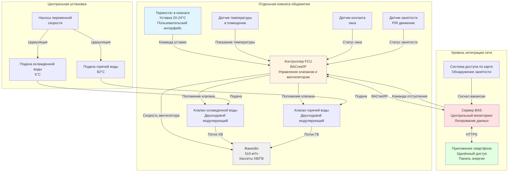

# Индивидуальное управление температурой в комнатах систем вентиляции и кондиционирования общежитий

Индивидуальное управление температурой в комнатах представляет наиболее критический параметр проектирования для удовлетворения студентов в общежитиях. Студенты ожидают органов управления, аналогичных жилым квартирам, однако институциональные ограничения требуют стратегий управления энергией для предотвращения чрезмерного потребления. Задача заключается в поиске баланса между автономией жильцов и эксплуатационной эффективностью в системах, обслуживающих сотни комнат с разнообразными тепловыми предпочтениями и непредсказуемыми графиками.

ASHRAE 62.1 раздел 6.2.7.1 предписывает, что жильцы должны иметь контроль над тепловым комфортом в отдельных помещениях, требуя регулируемые уставки с минимальным диапазоном 20-24°C. Однако практические приложения в общежитиях обычно реализуют более широкие диапазоны блокировки (18-27°C) для размещения экстремальных предпочтений при одновременном предотвращении энергопотерь из-за открытых окон во время отопления или чрезмерных уставок охлаждения.

## Конфигурации фанкойлов

Фанкойлы (FCU) обеспечивают наивысшее качество управления уровня комнаты для приложений в общежитиях, доставляя отфильтрованный кондиционированный воздух с минимальным шумом и отличной энергоэффективностью при подключении к центральным установкам охлажденной и горячей воды.

### Четырёхтрубные системы фанкойлов

Четырёхтрубные системы FCU поддерживают отдельные трубопроводы охлажденной и горячей воды для каждого блока, обеспечивая одновременную доступность отопления и охлаждения по всему зданию независимо от сезона.

**Компоненты системы на комнату:**
- Кабинет FCU с вентилятором подачи (200-400 CFM (340-680 м³/ч) типично для комнат площадью 23-28 м²)
- Кассета охлажденной воды (2-3 ряда, 8-10 рёбер на дюйм)
- Кассета горячей воды (1-2 ряда, 8-10 рёбер на дюйм)
- Трубопроводы охлажденной воды подачи и возврата (обычно 19 мм)
- Трубопроводы горячей воды подачи и возврата (обычно 19 мм)
- Управляющий клапан на каждой кассете (предпочтительно двухходовой модулирующий)
- Термостат с управлением скоростью вентилятора (низкая/средняя/высокая или непрерывно переменная)

**Расчёт производительности отопления:**

$$Q_h = \dot{m}_{hw} \times c_p \times (T_{hw,in} - T_{hw,out})$$

Для типовых условий (82°C подачи, 71°C возврата, 0,16 л/с):

$$Q_h = 0,16 \times 60 \times 1 \times (82 - 71) = 1,76 \text{ кДж/с}$$

Это обеспечивает достаточное отопление для комнаты площадью 23 м² с расчётной потерей тепла 2,3-3,5 кДж/с при условии электрического дополнительного нагрева или повышенного расхода.

**Расчёт производительности охлаждения:**

$$Q_c = \dot{m}_{chw} \times c_p \times (T_{chw,ret} - T_{chw,sup})$$

Для типовых условий (6°C подачи, 13°C возврата, 0,13 л/с):

$$Q_c = 0,13 \times 60 \times 1 \times (13 - 6) \times 1,0 = 0,546 \text{ кДж/с}$$

Общее охлаждение, включая скрытую нагрузку, обычно достигает 2,6-3,5 кДж/с для комнат общежития с 2 жильцами и умеренной солнечной экспозицией.

**Преимущества четырёхтрубных систем:**
- Немедленное переключение между режимами отопления и охлаждения
- Отсутствие задержки сезонного переключения в переходные сезоны
- Независимое управление отдельной комнатой от режима работы системы в целом
- Отличная энергоэффективность при частичных нагрузках благодаря модулирующим управляющим клапанам
- Более низкий уровень шума при работе, чем у систем PTAC (NC 30-35 против NC 45-50)

**Недостатки:**
- Высокая начальная стоимость ($3 500-5 000 на комнату, включая распределительные трубопроводы)
- Сложное распределение трубопроводов, требующее согласования с конструкцией
- Риск утечки воды в занятых помещениях
- Требования к огнестойким проникновениям на каждом этаже
- Требует инфраструктуры центральной установки (холодильные машины, котлы, насосы)

### Двухтрубные системы фанкойлов

Двухтрубные системы FCU используют одну пару труб подачи и возврата, которая переносит либо охлажденную, либо горячую воду в зависимости от графика сезонного переключения.

**Режимы работы:**
- **Режим охлаждения** (обычно май-октябрь): охлажденная вода 6-7°C по всей системе
- **Режим отопления** (обычно ноябрь-апрель): горячая вода 71-82°C по всей системе
- **Переходный сезон**: переключение на уровне здания на основе температуры наружного воздуха

**Критерии переключения:**

$$T_{changeover} = \frac{Q_{heat,rooms} - Q_{cool,rooms}}{U \times A_{total}}$$

Практически переключение происходит, когда средняя температура наружного воздуха за 7 дней пересекает пороговое значение 15-18°C, или когда значительные части здания одновременно требуют отопления и охлаждения.

**Ограничения:**
- Одновременно возникающие потребности в отоплении и охлаждении не могут быть удовлетворены в периоды переключения
- Помещения, обращённые на юг, могут требовать охлаждения, в то время как помещения, обращённые на север, требуют отопления
- Жалобы студентов увеличиваются в переходные сезоны (март-апрель, октябрь-ноябрь)
- Жильцы часто открывают окна для компенсации неправильного сезонного режима

**Сравнение затрат с четырёхтрубной системой:**
- Снижение начальной стоимости: $800-1 200 на комнату (снижение трубопроводов на 40%)
- Увеличение годовых жалоб: 3-5× выше в переходные сезоны
- Энергетический штраф: 10-15% выше из-за поведения открывания окон

**Рекомендация:** Двухтрубные системы подходят только для небольших общежитий (<50 комнат) в климатических зонах с четётко выраженными сезонами и минимальной продолжительностью переходного сезона. Четырёхтрубные системы обеспечивают превосходный комфорт и более низкие жизненные затраты для зданий >100 комнат.

### Стратегии управления фанкойлом

**Конфигурации управления термостатом:**

1. **Модуляция скорости вентилятора + клапана**: наиболее распространённый подход
   - Термостат переключает вентилятор между низкой/средней/высокой скоростями
   - Управляющий клапан модулирует поток воды пропорционально ошибке
   - Обеспечивает хороший комфорт с минимальной сложностью

2. **Непрерывный вентилятор + модуляция клапана**: премиум комфорт
   - Вентилятор работает непрерывно с выбранной скоростью
   - Управляющий клапан модулирует для поддержания уставки
   - Минимальное колебание температуры (±0,3°C достижимо)
   - Более высокое потребление энергии (время работы вентилятора 8 760 ч/год против 4 000 ч/год)

3. **Управление вкл/выкл**: подход для ограниченного бюджета
   - Вентилятор включается/выключается на основе спроса термостата
   - Клапан подачи воды полностью открывается при работе вентилятора
   - Типичное колебание температуры ±1-2°C
   - Не рекомендуется для приложений в общежитиях (плохой комфорт)

**Потребление энергии вентилятором:**

$$P_{fan} = \frac{\dot{V} \times \Delta P}{6356 \times \eta_{fan} \times \eta_{motor}}$$

Для типового FCU (300 CFM (510 м³/ч), 0,5 дюйма вод. ст. (125 Па), 50% КПД):

$$P_{fan} = \frac{300 \times 0,5}{6356 \times 0,50 \times 0,85} = 0,056 \text{ л.с.} = 42 \text{ Вт}$$

Годовое потребление энергии (50% коэффициент работы):

$$E_{annual} = 42 \text{ Вт} \times 8760 \text{ ч} \times 0,50 = 184 \text{ кВт⋅ч/год} = 22 \text{ долл./год при } 0,12 \text{ долл./кВт⋅ч}$$

## Приложения PTAC и PTHP

Кондиционеры воздуха в упакованных оконных терминалах (PTAC) и тепловые насосы в упакованных оконных терминалах (PTHP) обеспечивают автономное кондиционирование в комнате с отдельными подключениями наружного воздуха через внешние стены.

### Конфигурация PTAC

**Компоненты системы:**
- Кожух стены через внешнюю стену (ширина 107 см или 137 см типично)
- Автономный блок с прямым расширением охлаждения
- Электрическое сопротивление отопления (3-5 кВт типично)
- Заслонка наружного воздуха (ручная или с приводом)
- Термостат отдельной комнаты (встроенный в блок или навесной)
- Электрическое подключение 208-230 В

**Производительность охлаждения:**

$$\text{EER} = \frac{Q_{cooling}}{P_{input}}$$

Типовая производительность PTAC при условиях AHRI (35°C наружного воздуха, 27°C/19°C внутреннего воздуха):
- Производительность охлаждения: 2,6-4,4 кДж/с
- EER: 9,8-11,5 (минимум AHRI 310/380 9,8)
- Входная мощность: 1 000-1 400 Вт

**Производительность отопления:**

Электрическое сопротивление отопления обеспечивает 3,413 кДж/ч на ватт входной мощности:

$$Q_{heat} = P_{heater} \times 3,413$$

Для нагревателя 5 кВт:

$$Q_{heat} = 5 000 \times 3,413 = 17,065 \text{ кДж/ч}$$

Это обеспечивает достаточное отопление для большинства комнат общежитий, кроме экстремальных холодных климатов или комнат с большой площадью остекления.

**Сравнение операционных затрат (на комнату площадью 23 м², годовой):**

Сезон охлаждения (1 000 ч/год, среднее 3,5 кДж/с):

$$E_{cool} = \frac{3,5 \times 1 000}{10 \times 1} = 350 \text{ кВт⋅ч} = 42 \text{ долл./год}$$

Сезон отопления (1 500 ч/год, среднее 2,3 кДж/с):

$$E_{heat} = \frac{2,3 \times 1 500}{3,413} = 1 011 \text{ кВт⋅ч} = 121 \text{ долл./год}$$

Общие годовые операционные затраты: 163 долл./комнату (значительно выше, чем альтернативы FCU или PTHP)

### Конфигурация PTHP

Тепловые насосы в упакованных оконных терминалах обеспечивают как охлаждение, так и отопление, используя цикл охлаждения с реверсивным клапаном, предлагая значительно более низкие затраты на отопление, чем электрическое сопротивление PTAC.

**COP отопления:**

$$\text{COP}_{heating} = \frac{Q_{heating}}{P_{input}}$$

При условиях AHRI (8°C наружного воздуха, 21°C внутреннего воздуха):
- Производительность отопления: 2,9-4,1 кДж/с
- COP: 3,0-3,8
- Входная мощность: 900-1 200 Вт

**Производительность при низких температурах:**

Производительность теплового насоса снижается при низких температурах наружного воздуха. При -8°C наружного воздуха:
- Производительность отопления: 1,8-2,6 кДж/с (60% от значения при 8°C)
- COP: 2,0-2,5
- Электрическое сопротивление резервного копирования включается, когда производительность недостаточна

**Сравнение годовой энергии отопления:**

PTHP (средний COP 3,2, 70% нагрузки, плюс электрическое сопротивление 30%):

$$E_{heat,PTHP} = \frac{2,3 \times 1 500 \times 0,70}{3,2} + \frac{2,3 \times 1 500 \times 0,30}{3,413} = 758 + 303 = 1 061 \text{ кВт⋅ч}$$

Годовая стоимость: 127 долл./год (против 121 долл./год для чистого электрического сопротивления в умеренном климате)

В холодных климатах экономия PTHP значительно возрастает благодаря более высокому проценту использования теплового насоса.

### Ограничения управления PTAC/PTHP

**Проблемы управления наружным воздухом:**
- Ручные заслонки приводят к чрезмерному наружному воздуху (регулировка жильцом редко оптимизирована)
- Моторизованные заслонки увеличивают затраты и механическую сложность
- Наружный воздух попадает некондиционированным, создавая жалобы на комфорт в экстремальную погоду
- Отсутствие фильтрации на впуске наружного воздуха (пыльца, пыль попадают прямо в пространство)

**Проблемы шума:**
- Работа компрессора создаёт 45-55 дБA в занятом помещении
- Шум наружного блока влияет на соседние комнаты и кампусные помещения
- Ночная работа нарушает сон жильцов

**Требования к техническому обслуживанию:**
- Фильтры требуют ежемесячной замены жильцами (редко выполняется надлежащим образом)
- Замена блока каждые 10-12 лет (против 20-25 лет для FCU)
- Отказы отдельных блоков требуют аварийного реагирования (критично в экстремальную погоду)

## Стратегии ограничения уставок температуры

Системы вентиляции и кондиционирования в общежитиях требуют ограничений уставок для предотвращения потерь энергии при сохранении достаточного органа управления для комфорта жильцов.

### Реализация диапазона блокировки

**Стандартные диапазоны блокировки:**
- Минимальная уставка отопления: 18°C (предотвращает чрезмерное потребление энергии на отопление)
- Максимальная уставка охлаждения: 27°C (предотвращает чрезмерное потребление энергии на охлаждение)
- Регулируемый диапазон: 18-27°C (размах 9°C против минимума 4°C согласно ASHRAE 62.1)

**Обеспечение мёртвой полосы:**

Энергетические коды требуют минимальную мёртвую полосу 3-5°C между уставками отопления и охлаждения для предотвращения одновременного отопления и охлаждения:

$$\Delta T_{deadband} = T_{sp,cooling} - T_{sp,heating} \geq 5°C$$

Пример: Если жилец устанавливает отопление на 22°C, уставка охлаждения автоматически ограничивается минимум 27°C.

**Энергосбережение от диапазонов блокировки:**

Без блокировок (жилец устанавливает охлаждение 18°C, отопление 26°C):

$$E_{excess} = \frac{Q \times \Delta T_{excessive}}{COP} \times h_{operating}$$

Для типовой комнаты, требующей 15% дополнительного времени работы из-за агрессивных уставок:

$$E_{excess} = 450 \text{ кВт⋅ч/год/комнату} = 54 \text{ долл./год/комнату}$$

Экономия на уровне здания (200 комнат): 10 800 долл./год

### Адаптивные стратегии блокировки

**Сброс по температуре наружного воздуха:**

Отрегулируйте пределы блокировки на основе условий наружного воздуха, чтобы отразить сниженные нагрузки отопления/охлаждения:

$$T_{heat,min} = 18 + 0,5 \times (T_{oa} - 0) \text{ при } T_{oa} > 0°C$$

$$T_{cool,max} = 27 - 0,3 \times (35 - T_{oa}) \text{ при } T_{oa} < 35°C$$

Этот подход ограничивает экстремальные уставки в мягкую погоду, когда нагрузки здания минимальны.

**Ограничения по времени суток:**

Некоторые учреждения реализуют более жёсткие ограничения в периоды пиковой нагрузки:
- Стандартный диапазон (0000-0600, 0800-1700): 20-24°C
- Расслабленный диапазон (1700-2400, выходные): 18-27°C
- Обоснование: Пиковый электроспрос происходит 1400-1800, совпадая с минимальной занятостью общежития

**Контрверсия:** Ограничения по времени суток создают значительные жалобы студентов, когда жильцы присутствуют в ограниченные периоды. Не рекомендуется, если учреждение не ясно сообщает цели энергосбережения и пиковый спрос оправдывает реализацию.

## Возможности отступления по занятости

Комнаты в общежитиях пусты во время академических каникул (День благодарения, зимние каникулы, весенние каникулы, лето) и периодически в дневное время во время занятий.

### Отступление в период каникул

**Методы обнаружения занятости:**

1. **Ручное отключение**: студенты регулируют термостат в режим "отпуска" перед отъездом
   - Надёжность: 20-30% соответствие типично
   - Метод: физический переключатель или управление через приложение

2. **Интеграция доступа по карте**: BAS отслеживает события доступа к двери
   - Надёжность: точность 80-90%
   - Метод: Отсутствие считывания карты в течение 48 часов запускает режим вакансии

3. **Датчики занятости**: датчики PIR или ультразвуковые обнаруживают движение
   - Надёжность: точность 60-70% (ложные срабатывания от движения штор и т.д.)
   - Метод: Отсутствие движения в течение 24 часов запускает режим вакансии

**Стратегии отступления:**

Отступление в период зимних каникул (отопление 20°C нормально → 13°C отступление):

$$Q_{heat,setback} = U \times A \times (T_{sp,setback} - T_{oa})$$

Энергосбережение на комнату в течение трёхнедельного перерыва:

$$E_{saved} = \frac{(Q_{20°C} - Q_{13°C}) \times h_{break}}{COP_{heating}}$$

Для типовой комнаты с UA 450 Вт/°C и средней наружной температурой -1°C:

$$Q_{reduction} = 450 \times (20-(-1)) - 450 \times (13-(-1)) = 9 450 - 6 300 = 3 150 \text{ Вт}$$

$$E_{saved} = \frac{3 150 \times 504 \text{ ч}}{3,2 \times 1 000} = 495 \text{ кВт⋅ч за трёхнедельный перерыв}$$

При $0,12/кВт⋅ч: 59 долл. на комнату за перерыв

Экономия на уровне здания (200 комнат): 11 800 долл. за перерыв

**Критическое соображение:** Предотвратите замерзание труб в помещениях на периметре во время отступления:
- Минимальная уставка: 13°C для защиты от замерзания
- Отслеживайте температуру в пространстве с сигналами тревоги низкой температуры
- Поддерживайте циркуляцию воздуха (режим авто вентилятора) для предотвращения стратификации

### Ежедневное отступление по занятости

**Интеграция расписания занятий:**

Некоторые продвинутые системы интегрируют расписания занятий для реализации временного отступления в периоды вероятной вакансии:
- Будни 0900-1700: Предположите пусто, если нет переопределения
- Отступление до отопления 18°C / охлаждения 26°C
- Переопределение датчика занятости возвращает к нормальной уставке в течение 5 минут

**Потенциал энергосбережения:**

Предположим, 40% комнат пусты в течение типового периода занятий на будни (8 ч/день × 5 дней/неделю = 40 ч/неделю):

$$E_{saved,weekly} = \frac{Q_{reduction} \times 40 \text{ ч} \times 0,40 \times N_{rooms}}{COP}$$

Для здания на 200 комнат со средней снижением нагрузки 580 Вт:

$$E_{saved,weekly} = \frac{580 \times 40 \times 0,40 \times 200}{3,5 \times 1 000} = 1 329 \text{ кВт⋅ч/неделю}$$

Годовое сбережение: 1 329 × 30 недель = 39 870 кВт⋅ч = 4 784 долл./год

**Проблемы принятия студентами:**

Ежедневное отступление по занятости создаёт значительные жалобы:
- Студенты с нерегулярными расписаниями приходят в некомфортные комнаты
- Процесс переопределения воспринимается как неудобный
- Проблемы конфиденциальности относительно мониторинга занятости

**Рекомендация:** Реализуйте только для длительных перерывов (>3 дней). Ежедневное отступление создаёт большую неудовлетворённость, чем энергосбережение оправдывают.

## Интеграция сети для управления энергией

### Интеграция системы управления зданием

**Протоколы связи:**

1. **BACnet**: Промышленный стандарт для связи устройств HVAC
   - BACnet/IP для основной сети
   - BACnet MS/TP для коммуникации уровня устройства
   - Поддерживает контроллеры FCU, термостаты, датчики

2. **LonWorks**: Альтернативный протокол для распределённого управления
   - Топология свободной сети
   - Распространена в старых установках

3. **Modbus TCP**: Простой протокол для базового мониторинга
   - Ограниченные возможности управления
   - Подходит только для сбора данных

**Интеграция контроллера FCU:**

Каждый контроллер FCU предоставляет стандартные объекты BACnet:
- Аналоговые входы: температура в помещении, положение клапана, температура воздуха подачи
- Аналоговые выходы: команда клапана отопления, команда клапана охлаждения, скорость вентилятора
- Двоичные входы: статус занятости, статус контакта окна
- Аналоговые значения: уставка отопления, уставка охлаждения, мёртвая полоса

**Возможности центрального мониторинга:**

Рабочая станция BAS обеспечивает:
- Отображение температуры в реальном времени и уставок для всех комнат
- Оповещение о будильнике при превышении температуры (>29°C или <16°C)
- Логирование данных тренда (типично 15-минутные интервалы)
- Пакетное регулирование уставок в периоды каникул
- Отчёты о потреблении энергии по зонам или зданиям

### Выбор термостата для интеграции сети

**Проводные коммуникационные термостаты:**
- Физическое подключение к контроллеру FCU или сети BAS
- Наиболее надёжная коммуникация
- Более высокие затраты на установку (работа кабельки)
- Типовая стоимость: $150-300 на термостат

**Беспроводные коммуникационные термостаты:**
- Коммуникация Wi-Fi или ZigBee к шлюзу
- Более низкие затраты на установку (нет управляющей кабельки)
- Требование замены батареи (годовое)
- Проблемы надёжности сети при плотных развёртываниях
- Типовая стоимость: $120-200 на термостат

**Интеграция приложения смартфона:**

Современные системы терморегуляции предлагают мобильные приложения, позволяющие:
- Удалённую регулировку уставок
- Программирование расписания
- Обратную связь о потреблении энергии
- Отправку запросов на техническое обслуживание
- Push-уведомления для сигналов тревоги температуры

**Преимущества вовлечения студентов:**
- Видимость потребления энергии в реальном времени поощряет сбережение
- Удобные функции увеличивают принятие системы
- Удалённая регулировка снижает жалобы на температуру

### Интеграция реагирования на спрос

**Программы реагирования на спрос коммунальных предприятий:**

Многие коммунальные предприятия предлагают финансовые стимулы для снижения нагрузки в периоды пикового спроса (обычно летние полудни 1400-1800).

**Стратегии реагирования на спрос в общежитиях:**

1. **Регулировка уставки**: повысьте уставки охлаждения на 1-2°C в периоды событий реагирования на спрос
   - Снижение нагрузки: 15-25% на комнату
   - Влияние на студентов: минимальное (постепенное повышение температуры)

2. **Предварительное охлаждение**: понизьте уставки за 2 часа до события реагирования на спрос
   - Использование тепловой массы для поддержания комфорта во время события
   - Снижение нагрузки: 30-40% во время события
   - Нейтральность энергии за 24 часа

**Расчёт снижения нагрузки:**

Здание на 200 комнат со средней нагрузкой охлаждения 1 тонна на комнату (3,5 кВт):

$$Q_{reduction} = 200 \text{ комнат} \times 3,5 \text{ кВт} \times 0,20 = 140 \text{ кВ}$$

Годовой стимул (предположим 20 событий реагирования на спрос по 1,50 долл./кВ): 140 кВт × 20 событий × 1,50 долл. = 4 200 долл./год

## Сравнение систем управления HVAC уровня комнаты в общежитиях

| Параметр управления | 4-тр. FCU | 2-тр. FCU | PTHP | PTAC |
|------------------|-----------|-----------|------|------|
| **Начальная стоимость** ($/комн.) | 4 500 | 3 200 | 2 800 | 2 200 |
| **Операционная стоимость** ($/комн./год) | 210 | 225 | 380 | 566 |
| **Точность управления температурой** | ±0,3°C | ±0,6°C | ±0,8°C | ±1,1°C |
| **Уровень шума** | NC 30-35 | NC 30-35 | NC 40-45 | NC 45-50 |
| **Диапазон уставок** (возможна блокировка) | 15-29°C | 15-29°C | 18-27°C | 18-27°C |
| **Обеспечение мёртвой полосы** | Да (BAS) | Да (BAS) | Ограничено | Ограничено |
| **Отступление по занятости** | Да (BAS) | Да (BAS) | Нет | Нет |
| **Интеграция сети** | Полный BACnet | Полный BACnet | Ограничено | Отсутствует |
| **Качество наружного воздуха** | Фильтрованный, кондиционированный | Фильтрованный, кондиционированный | Нефильтрованный | Нефильтрованный |
| **Производительность в переходном сезоне** | Отличная | Плохая | Хорошая | Хорошая |
| **Частота техническогообслуживания** | 2×/год | 2×/год | 2×/год | 4×/год |
| **Срок службы оборудования** | 20-25 лет | 20-25 лет | 12-15 лет | 10-12 лет |
| **Жизненные затраты (20 лет)** | 7 120 | 7 680 | 9 420 | 13 520 |

**Рекомендации по выбору системы:**

- **4-Pipe FCU**: большие здания (>100 комнат) с центральной установкой, учреждения, приоритизирующие комфорт и жизненные затраты
- **2-Pipe FCU**: небольшие здания (<50 комнат) в климатических зонах с чётко выраженными сезонами, приоритет на более низкую начальную стоимость
- **PTHP**: приложения модернизации, здания без инфраструктуры центральной установки, зоны с умеренным климатом
- **PTAC**: проекты с ограниченным бюджетом, мягкие климаты, небольшие здания, где операционная стоимость не приоритизирована

## Архитектура системы управления HVAC в комнате общежития

## Заключение

Индивидуальное управление температурой в комнатах представляет наиболее критический фактор удовлетворения студентов в системах вентиляции и кондиционирования общежитий, однако стратегии управления энергией необходимы для предотвращения чрезмерного потребления в сотнях независимо управляемых помещений. Четырёхтрубные системы фанкойлов обеспечивают оптимальную производительность благодаря одновременной доступности отопления и охлаждения, тихой работе и полной интеграции BAS, обеспечивающей отступление на основе занятости в периоды каникул, генерирующее 59 долл. на комнату за перерыв в экономии. Диапазоны блокировки уставок 18-27°C сбалансировывают индивидуальные предпочтения жильцов с институциональными целями энергии, в то время как обеспечение мёртвой полосы предотвращает расточительное одновременное отопление и охлаждение. Интеграция сети через коммуникацию BACnet обеспечивает центральный мониторинг, автоматизированное отступление в период отпуска, генерирующее 197 долл. за перерыв, и участие в программах реагирования на спрос коммунальных предприятий. Системы PTAC остаются жизнеспособны для проектов с ограниченным бюджетом, несмотря на 2,5× более высокие операционные затраты, но отсутствие интеграции сети ограничивает возможности управления энергией. Интеграция приложений смартфонов повышает вовлечение студентов и принятие системы при предоставлении обратной связи о потреблении энергии в реальном времени, поддерживающей поведение сбережения.
