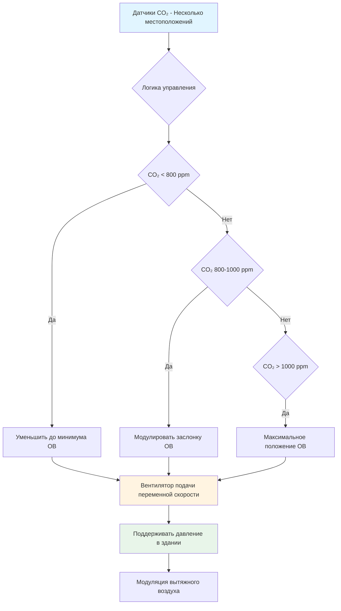
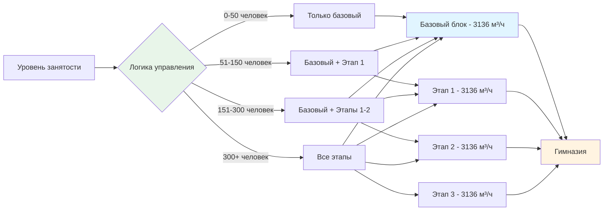

Гимназии представляют уникальные проблемы HVAC из-за экстремальных колебаний занятости. Типичная школьная гимназия может обслуживать 30 студентов во время утреннего занятия физкультурой, а затем вмещать 800 зрителей на вечерний баскетбольный матч. Этот диапазон занятости 25:1 создает значительную сложность проектирования, требующую интеллектуальных стратегий управления и правильного выбора оборудования.

## Характеристики нагрузки по занятости

### Типичные сценарии занятости

Паттерны занятости гимназии варьируются кардинально в течение дня и недели:

| Сценарий | Количество человек | Явная нагрузка | Скрытая нагрузка | Требование вентиляции |
|----------|-------------------|----------------|------------------|----------------------|
| Пусто/Хранилище | 0-5 | 56–112 кДж/ч·м² | Минимальная | 0,30 м³/ч на м² |
| Занятие физкультуры (30 студентов) | 30-40 | 161–269 кДж/ч·м² | Высокая | 472–627 м³/ч |
| Тренировка (50 спортсменов) | 50-70 | 269–430 кДж/ч·м² | Очень высокая | 787–1098 м³/ч |
| Матч (зрители) | 400-1000 | 645–967 кДж/ч·м² | Умеренная | 6280–15708 м³/ч |
| Собрание/Событие | 500-1500 | 538–860 кДж/ч·м² | Низко-умеренная | 7850–23560 м³/ч |

### Производство метаболического тепла

Спортивная деятельность генерирует существенно более высокое метаболическое тепло, чем малоподвижные зрители:

- **Малоподвижные зрители**: 422 кДж/ч всего (264 явное, 159 скрытое)
- **Лёгкая активность (ходьба)**: 581 кДж/ч всего (264 явное, 317 скрытое)
- **Умеренное упражнение (занятие физкультуры)**: 898 кДж/ч всего (333 явное, 565 скрытое)
- **Интенсивное упражнение (баскетбол, волейбол)**: 1533 кДж/ч всего (613 явное, 920 скрытое)

Доля скрытого тепла значительно увеличивается с интенсивностью активности, колеблясь от 38% для зрителей до 60% для интенсивного упражнения. Это влияет как на требования вентиляции, так и на мощность осушения.

## Требования вентиляции ASHRAE 62.1

Согласно ASHRAE 62.1, гимназии требуют скорость вентиляции на основе как площади, так и занятости:

**Наружный воздушный поток в дыхательной зоне (Vbz) = Ra × Az + Rp × Pz**

Где:
- Ra = 0,30 м³/ч на м² (компонент площади)
- Rp = 0,50 м³/ч на человека (компонент людей для гимназий со зрительским сиденьем)
- Rp = 0,34 м³/ч на человека (для помещений упражнений без зрительского сиденья)
- Az = площадь этажа (м²)
- Pz = численность зоны

Для гимназии площадью 929 м²:
- **Минимум (без занятости)**: 279 м³/ч (только компонент площади)
- **30 студентов (занятие физкультуры)**: 279 + (10,2 × 30) = 585 м³/ч
- **800 зрителей (матч)**: 11577 м³/ч (279 + 15 × 800)

Этот диапазон вентиляции 20:1 делает системы с постоянным расходом энергетически неэффективными.

## Стратегии вентиляции с управлением спросом

### Управление на основе CO₂

Вентиляция с управлением спросом (DCV) с использованием датчиков CO₂ обеспечивает наиболее эффективный подход для управления переменной занятостью:

**Требования реализации:**

1. **Размещение датчиков**: Минимум три датчика в дыхательной зоне (122–183 см от пола), распределённые для избежания мёртвых зон
2. **Стратегия установки**: Диапазон 800–1000 ppm с пропорциональным управлением
3. **Минимальное положение**: Всегда поддерживать компонент площади (0,30 м³/ч на м²)
4. **Время отклика**: Усреднение 2–5 минут для предотвращения колебаний
5. **Возможность отмены**: Возможность ручного отмены высокой скорости для быстрых изменений занятости

### Предварительное заполнение на основе расписания

Интеграция с системами расписания объектов позволяет упреждающей вентиляции:

```mermaid
gantt
    title Ежедневное расписание вентиляции гимназии
    dateFormat HH:mm
    axisFormat %H:%M

    section Режим вентиляции
    Без занятости (мин. ОВ)     :done, unoc1, 00:00, 07:00
    Предварительная очистка (50% ОВ)      :active, prepurge1, 07:00, 08:00
    Занятие физкультуры 1 (DCV активен) :crit, pe1, 08:00, 09:00
    Без занятости (мин. ОВ)     :done, unoc2, 09:00, 10:00
    Занятие физкультуры 2 (DCV активен) :crit, pe2, 10:00, 11:00
    Без занятости (мин. ОВ)     :done, unoc3, 11:00, 15:00
    Предварительное событие (75% ОВ)      :active, preevent, 15:00, 16:00
    Событие матча (DCV активен) :crit, game, 16:00, 18:00
    Последующая очистка (100% ОВ)    :active, postpurge, 18:00, 19:00
    Без занятости (мин. ОВ)     :done, unoc4, 19:00, 24:00
```

**Стратегии предварительного заполнения:**

- **Предварительная очистка на 30–60 минут** перед запланированными событиями с высокой занятостью
- **Промывка на 100% наружного воздуха** в течение 15–30 минут после события для удаления накопленных загрязнителей
- **Переход на минимальный ОВ** в течение проверенных периодов без занятости
- **Предварительное кондиционирование температуры** координируется с предварительной очисткой вентиляции

## Выбор оборудования для переменных нагрузок

### Системы переменного расхода воздуха

Системы VAV с приводами переменной скорости обеспечивают оптимальную энергетическую эффективность:

**Критерии выбора вентилятора:**
- Проектирование для пиковой занятости (матчи/события)
- Выбор моторов с минимальной возможностью скорости 40–50%
- Использование вентиляторов с обратным загибом или профилем для широкого диапазона работы
- Внедрение сброса статического давления на основе положения заслонок

**Расчёт экономии энергии:**

При 50% расходе воздуха мощность вентилятора падает примерно до 12,5% полной нагрузки (кубический закон):

Power₂ / Power₁ = (м³/ч₂ / м³/ч₁)³

Для проектирования на 15707 м³/ч, обслуживающего гимназию:
- **Полная нагрузка** (800 человек): 15707 м³/ч = 22,4 кВт
- **Занятие физкультуры** (30 студентов): 585 м³/ч (4%) = 0,006 кВт
- **Без занятости**: 279 м³/ч (2%) = 0,0002 кВт

Взвешенное среднее ежегодных часов работы показывает снижение энергии вентилятора на 75–85% по сравнению с работой с постоянным расходом.

### Модульный подход для больших гимназий

Для объектов, превышающих 1394 м², рассмотрите модульное распределение оборудования:

## Последовательности управления для переходов занятости

### Реакция на быстрое увеличение занятости

Когда уровни CO₂ превышают установку:

1. **Немедленно**: Заслонка наружного воздуха модулируется на 100% открыто
2. **0–30 секунд**: Вентилятор подачи разгоняется до расчётной скорости
3. **30–60 секунд**: Заслонки возврата/вытяжки модулируют для поддержания давления в здании
4. **60+ секунд**: Охлаждение/отопление регулируется для поддержания установки

### Цикл очистки после события

После событий с высокой занятостью:

1. **Триггер конца события**: Датчик занятости или ручной ввод
2. **Максимальная вентиляция**: 100% наружного воздуха на 20–30 минут
3. **Переопределение температуры**: Допустить отклонение 2,8°C во время очистки
4. **Проверка**: CO₂ должен упасть ниже 600 ppm перед возвратом к минимальному ОВ
5. **Отключение системы**: После завершения очистки и восстановления температуры

## Рассмотрения энергетической эффективности

### Интеграция экономайзера

Свободное охлаждение через работу экономайзера значительно снижает потребление энергии в переходные сезоны:

- **Экономайзер по сухому термометру**: Подходит для большинства климатов, блокировка выше 21°C наружного воздуха
- **Экономайзер по энтальпии**: Предпочтителен во влажных климатах, предотвращает введение скрытой нагрузки
- **Интегрированное управление**: Координация с DCV для максимизации свободного охлаждения во время периодов высокой занятости

### Рекуперация тепла

Вентиляторы рекуперации энергии (ERV) становятся экономически целесообразными для гимназий с последовательными графиками высокой занятости:

**Анализ окупаемости:**
- Гимназии, работающие >2000 ч/год при >50% расчётной занятости
- Минимум 50% эффективность восстановления явного тепла
- Полная эффективность >60% для восстановления скрытого тепла во влажных климатах
- Типичная окупаемость: 4–7 лет в северных климатах, 6–10 лет в мягких климатах

### Разслоение воздуха

Высокие потолки (6–12 м типично) создают значительное расслоение во время отопления:

- **Потолочные вентиляторы**: Снижение дифференциала температуры потолок-пол на 5,6–8,3°C
- **Экономия энергии**: Снижение энергии отопления на 20–30%
- **Летняя работа**: Обратная работа для тяги холодного воздуха вверх, снижение нагрузки охлаждения на зрителей
- **Интеграция управления**: Активация на основе датчиков дифференциала температуры в пространстве

## Рекомендации по проектированию

1. **Всегда внедрять DCV** с датчиками CO₂ для гимназий, обслуживающих несколько функций
2. **Проектировать для пиковой нагрузки**, но выбирать оборудование, оптимизированное для работы с неполной нагрузкой
3. **Установить минимум три датчика CO₂** распределённые по всей дыхательной зоне
4. **Интегрировать систему расписания** с управлением HVAC для упреждающей вентиляции
5. **Обеспечить возможность ручной отмены** для незапланированных событий
6. **Включить последовательности очистки после события** в программирование управления
7. **Рассмотреть отдельное осушение** отдельно от явного охлаждения для обработки переменных скрытых нагрузок
8. **Проектировать для положительного давления 0,05–0,12 кПа** для предотвращения инфильтрации при низкой занятости

Надлежащее управление колебаниями занятости преобразует HVAC гимназии из энергозатратного в высоко эффективный при поддержании превосходного качества воздуха в помещениях во всех условиях работы.
