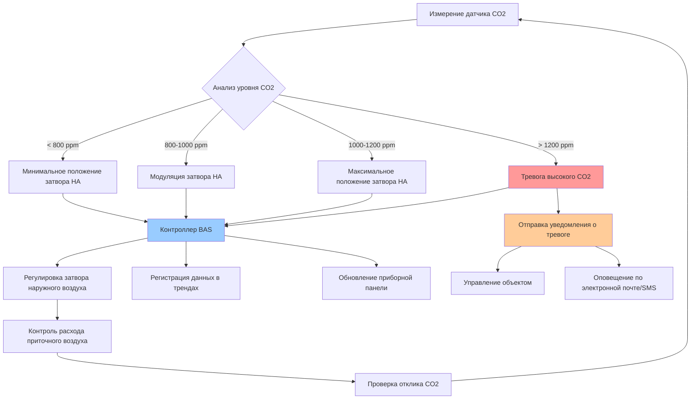

Мониторинг диоксида углерода стал критически важным компонентом управления качеством внутреннего воздуха в образовательных учреждениях. Уровни CO2 служат надежным показателем занятости помещений и эффективности вентиляции, что делает вентиляцию с управлением по требованию на основе CO2 (DCV) важной стратегией для поддержания здоровой учебной среды при оптимизации энергопотребления.

## Технология датчиков CO2

### Основы NDIR-сенсоров

Неполная спектральная инфракрасная (NDIR) спектроскопия сенсоры представляют собой отраслевой стандарт для измерения CO2 в образовательных учреждениях. Эти датчики работают на принципе поглощения молекулами CO2 инфракрасного излучения на определенной длине волны (4,26 мкм). Датчик измеряет ослабление инфракрасного света, проходящего через образец воздуха, для определения концентрации CO2.

NDIR-сенсоры обладают несколькими преимуществами:

- Высокая точность и стабильность во времени
- Минимальная перекрестная чувствительность к другим газам
- Длительный срок службы (10-15 лет)
- Отсутствие расходных компонентов, требующих замены

### Требования к точности

Для школьных приложений датчики CO2 должны соответствовать строгим стандартам точности:

- **Точность**: ±50 ppm или ±3% показания при 1000 ppm
- **Диапазон**: минимум 0-2000 ppm (предпочтительно 0-5000 ppm)
- **Разрешение**: минимум 1 ppm
- **Время отклика**: T90 < 60 секунд
- **Рабочая температура**: 0-50°C

Двухволновые NDIR-сенсоры обеспечивают превосходную точность путем компенсации старения инфракрасного источника и детектора. Эти датчики используют эталонную длину волны, на которой CO2 не поглощает излучение, что позволяет проводить автоматическую коррекцию дрейфа.

## Руководство по размещению датчиков

Надлежащее размещение датчика напрямую влияет на точность измерений и производительность системы.

### Стратегия размещения в классах

**Датчики, установленные на стене:**
- Установить на высоте 0,9-1,5 м над полом (на уровне дыхания)
- Разместить вдали от дверей, окон и приточных диффузоров (минимум 1,8 м)
- Избегать размещения рядом с вытяжными решетками или воздуховодами возврата воздуха
- Поддерживать минимальный зазор 0,9 м от наружных стен здания
- Обеспечить беспрепятственный поток воздуха вокруг датчика

**Датчики в воздуховоде возврата:**
- Установить в главном воздуховоде возврата, обслуживающем помещение
- Разместить на расстояние минимум трех диаметров воздуховода вниз по потоку от любых изгибов
- Установить перед фильтрацией или точками смешивания воздуха
- Обеспечить адекватную глубину введения датчика (минимум 1/3 диаметра воздуховода)

**Охват зон:**
- Один датчик на термическую зону для DCV-приложений
- Дополнительные датчики для помещений, превышающих 93 м²
- Отдельные датчики для площадей с различными режимами занятости

## Уставки CO2 для вентиляции с управлением по требованию

Установка надлежащих уставок CO2 обеспечивает баланс между качеством внутреннего воздуха, энергоэффективностью и соответствием кодексам.

### Выбор уставки

**Основной диапазон уставок**: 1000-1200 ppm выше уровня наружного воздуха

Связь между концентрацией CO2 и требуемым расходом вентиляции следует формуле:

$$V = \frac{N \times G}{C_i - C_o}$$

Где:
- $V$ = требуемый расход вентиляции (CFM)
- $N$ = количество людей
- $G$ = скорость выделения CO2 на одного человека (~0,31 CFM при малоподвижной деятельности)
- $C_i$ = концентрация CO2 внутри (ppm)
- $C_o$ = концентрация CO2 снаружи (обычно 400-450 ppm)

Для класса с 25 учащимися при концентрации CO2 внутри 1000 ppm:

$$V = \frac{25 \times 0,31}{(1000 - 450) \times 10^{-6}} = 14 091 \text{ CFM}$$

Это равно примерно 15 CFM (25,4 м³/ч) на одного человека, что соответствует требованиям стандарта ASHRAE 62.1.

### Стратегия управления

**Ступенчатая реакция вентиляции:**

1. **Ниже 800 ppm**: Минимальный расход вентиляции
2. **800-1000 ppm**: Линейное увеличение наружного воздуха
3. **1000-1200 ppm**: Максимальный расход вентиляции поддерживается
4. **Выше 1200 ppm**: Состояние высокого CO2 тревоги

Реализовать управление с гистерезисом (±25 ppm) для предотвращения колебаний и чрезмерного цикла затворов.

## Интеграция с системой автоматизации зданий

### Протоколы связи

Современные датчики CO2 интегрируются с системами автоматизации зданий через:

- **BACnet**: IP или MS/TP для стандартизированной совместимости
- **Modbus**: RTU или TCP для совместимости с унаследованными системами
- **0-10 ВДЦ аналоговый**: Простая передача сигнала для базовых приложений
- **Токовый контур 4-20 мА**: Промышленная устойчивость к помехам

### Последовательность управления

## Возможности приборной панели и оповещения

### Мониторинг в реальном времени

Эффективные системы мониторинга CO2 обеспечивают комплексную визуализацию:

**Функции приборной панели:**
- Текущие показания CO2 для всех контролируемых помещений
- Индикаторы состояния с цветовой кодировкой (зеленый/желтый/красный)
- Исторические тренды (почасовые, дневные, недельные)
- Идентификация пиков занятости
- Состояние системы вентиляции
- Корреляция потребления энергии

### Конфигурация оповещений

**Пороги тревоги:**

| Уровень тревоги | Концентрация CO2 | Действие ответа |
|-----------------|------------------|-----------------|
| Нормальное | < 1000 ppm | Стандартная работа |
| Совет | 1000-1200 ppm | Регистрация события, контроль тренда |
| Предупреждение | 1200-1500 ppm | Уведомление персоналу объекта |
| Критическое | > 1500 ppm | Требуется немедленный ответ |

**Методы уведомления:**
- Оповещения по электронной почте руководству объекта
- СМС-сообщения для критических тревог
- Интеграция с системами заказов работ
- Исторические журналы тревог для анализа

## Уровни CO2 и последствия для качества воздуха в школах

| Уровень CO2 (ppm) | Статус вентиляции | Следствия для качества воздуха | Рекомендуемое действие |
|-------------------|-------------------|-------------------------------|------------------------|
| 400-600 | Превосходно | Уровень наружного воздуха, хорошо вентилируется | Поддерживать текущую работу |
| 600-800 | Хорошо | Адекватная вентиляция | Продолжить мониторинг |
| 800-1000 | Приемлемо | Соответствует минимальным стандартам | Приемлемо для занятых периодов |
| 1000-1200 | Предельно | Приближается к неадекватной вентиляции | Увеличить поступление наружного воздуха |
| 1200-1500 | Плохо | Недостаточная вентиляция | Немедленное увеличение вентиляции |
| 1500-2000 | Очень плохо | Значительное ухудшение качества воздуха | Экстренная реакция вентиляции |
| > 2000 | Неприемлемо | Вероятны проблемы со здоровьем | Эвакуация и проверка системы |

## Требования к калибровке и техническому обслуживанию

### Протоколы калибровки

**Заводская калибровка**: Все NDIR-датчики проходят первоначальную калибровку в сравнении с известными концентрациями газов, прослеживаемыми до стандартов NIST.

**Частота полевой калибровки:**
- Годовая калибровка для критических приложений
- Двухгодичная калибровка для стандартных установок
- Проверка после любого технического обслуживания системы, влияющего на расход воздуха

**Методы калибровки:**

1. **Одноточечная калибровка**: Подвергнуть датчик воздействию известного наружного воздуха (предполагается 400 ppm)
2. **Двухточечная калибровка**: Использовать нулевой газ (азот) и калибровочный газ (1000 ppm CO2)
3. **Автоматическая коррекция базового уровня (ABC)**: Алгоритм предполагает периодическое воздействие уровней наружного воздуха

### График технического обслуживания

**Ежемесячно:**
- Визуальный осмотр корпуса датчика
- Проверка надлежащего монтажа и доступа воздуха
- Проверка данных трендов на предмет аномалий

**Ежеквартально:**
- Очистка оптики датчика и внешней поверхности корпуса
- Тестирование функциональности тревоги
- Проверка связи BAS

**Ежегодно:**
- Выполнить проверку калибровки
- Заменить датчики, превышающие спецификации дрейфа (>100 ppm)
- Обновить прошивку и программное обеспечение по мере необходимости
- Документировать все виды обслуживания

**Корреляция с техническим обслуживанием фильтров**: Очищать или заменять воздушные фильтры по одному графику с обслуживанием датчика CO2 для обеспечения точных показаний и оптимальной работы системы.

### Профилактические меры

- Защитить датчики от прямого солнечного света и тепловых излучений
- Защитить от чистящих химикатов и аэрозолей
- Поддерживать стабильное электроснабжение
- Документировать базовые концентрации CO2 в наружном воздухе для справки
- Установить бюджет замены датчика на цикл в 12-15 лет

Надлежащий мониторинг CO2 позволяет школам поддерживать здоровую внутреннюю среду при достижении значительной экономии энергии благодаря оптимизированному управлению вентиляцией. При интеграции с комплексными системами автоматизации зданий датчики CO2 обеспечивают информационную основу для основанного на фактических данных управления объектом и непрерывного совершенствования качества внутреннего воздуха в образовательных учреждениях.
