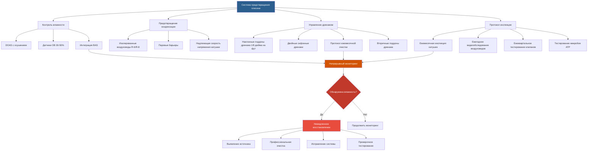

Образование плесени в образовательных учреждениях представляет серьезные риски для здоровья и создает помехи учебному процессу. Эффективное предотвращение плесени требует интегрированного проектирования HVAC, операционных протоколов и процедур технического обслуживания, нацеленных на контроль влажности во всех компонентах системы и интерфейсах здания.

## Целевые показатели контроля влажности

Поддерживайте относительную влажность ниже 60% ОВ для предотвращения размножения плесени, с оптимальным диапазоном 30-50% ОВ для образовательных учреждений. Соотношение между температурой и абсолютной влажностью определяет риск конденсации:

$$\text{Точка росы} = T - \frac{100 - RH}{5}$$

Где $T$ — температура сухого термометра (°C) и $RH$ — относительная влажность (%). Поверхности ниже температуры точки росы накапливают конденсацию, создавая идеальные условия для колонизации плесени.

Для точного контроля влажности при различных условиях заполнения:

$$\dot{m}_w = \frac{\dot{Q}_l}{h_{fg}}$$

Где $\dot{m}_w$ — скорость удаления влаги (кг/ч), $\dot{Q}_l$ — скрытая охлаждающая нагрузка (кДж/ч), а $h_{fg}$ — скрытая теплота парообразования (2450 кДж/кг при стандартных условиях).

### Оборудование контроля влажности

- **Системы подачи наружного воздуха (DOAS)** с роторными теплообменниками или осушителями
- **Системы холодного водоснабжения** с глубокими температурами на выходе катушки (9-11°C подающий воздух)
- **Системы прямого расширения** с усиленными режимами осушения
- **Непрерывный мониторинг** с интеграцией систем автоматизации зданий

## Предотвращение конденсации

Охлаждающие катушки и воздуховоды требуют теплоизоляции и надлежащей эксплуатации системы для предотвращения конденсации на поверхности.

### Конструкция охлаждающей катушки

- **Скорость напряжения поверхности**: Максимум 2,54 м/с для обеспечения адекватного удаления влаги
- **Температура на выходе катушки**: 11-13°C для баланса осушения и энергоэффективности
- **Расстояние между пластинами**: 8-10 пластин на дюйм для оптимального дренажа влаги
- **Уклон**: Минимум 1/8 дюйма на фут в направлении дренажных соединений

Разница температур поверхности определяет риск конденсации:

$$q = U \cdot A \cdot (T_s - T_{dp})$$

Где $q$ — скорость передачи тепла, $U$ — общий коэффициент теплопередачи, $A$ — площадь поверхности, $T_s$ — температура поверхности, и $T_{dp}$ — температура точки росы. Когда $T_s < T_{dp}$, происходит конденсация.

### Изоляция воздуховодов

Все воздуховоды подачи в неотапливаемых помещениях требуют изоляции с минимальным R-значением:

| Условие помещения | Минимальное R-значение | Паровой барьер |
|----------------|-----------------|---------------|
| Неотапливаемые машинные помещения | R-6 | Требуется |
| Чердаки и подпольные пространства | R-8 | Требуется |
| Наружная установка | R-8 | Требуется |
| Подземные помещения | R-6 | Требуется |

Наружная изоляция с паровым барьером, обращенным в сторону от поверхности воздуховода, предотвращает миграцию влаги в материал изоляции.

## Техническое обслуживание дренажа и поддона дренажа

Надлежащий дренаж предотвращает накопление стоячей воды в поддонах дренажа и секциях катушки.

### Требования к конструкции поддона дренажа

- **Материал**: Нержавеющая сталь (тип 316) или коррозионностойкий полимер
- **Уклон**: Минимум 1/8 дюйма на фут в направлении выхода дренажа
- **Двойные сифонные дренажи**: P-ловушки с глубиной водяного затвора 7,6-10 см
- **Панели доступа**: Минимум 30 см × 30 см для инспекции и очистки
- **Вторичные поддоны дренажа**: Требуются под всеми внутренними обработчиками воздуха

Расчет размера линии дренажа выполняется по формуле:

$$D = 0.593 \sqrt[3]{\dot{V}}$$

Где $D$ — диаметр дренажа (дюймы) и $\dot{V}$ — скорость потока конденсата (галлоны в минуту). Минимальный диаметр 3/4 дюйма для всех основных дренажей.

### Протокол технического обслуживания

- **Ежемесячная инспекция** в период охлаждения
- **Ежеквартальная очистка** с помощью дезинфицирующего средства, зарегистрированного EPA
- **Промывка линии дренажа** сжатым воздухом или водяной струей
- **Проверка герметичности сифона** — пополнение в период отопления
- **Тестирование микробного роста** при наличии видимого загрязнения

## Инспекция обработчика воздуха и воздуховодов

Регулярная инспекция выявляет накопление влаги и микробное загрязнение до обширной колонизации.

### Частота инспекции

| Компонент | Интервал инспекции | Документирование |
|-----------|-------------------|---------------|
| Охлаждающие катушки | Ежемесячно (период охлаждения) | Визуально + фотографии |
| Поддоны дренажа | Ежемесячно (период охлаждения) | Отчет о состоянии |
| Секции фильтров | Ежемесячно | Журнал перепада давления |
| Внутренние поверхности воздуховодов | Ежегодно | Видеоинспекция |
| Клапаны наружного воздуха | Ежеквартально | Тест функционирования |

### Критерии инспекции

- **Видимое загрязнение**: Видимая плесень, слизь или биологический рост
- **Запах**: Затхлый или биологический запах в регистрах подачи
- **Влажность**: Стоячая вода, влажная изоляция или конденсация на поверхности
- **Биологические показатели**: Тестирование ATP для оценки микробной нагрузки

## Управление влажностью строительной оболочки

HVAC системы взаимодействуют с характеристиками строительной оболочки для предотвращения проникновения объемной воды и паровой диффузии.

### Критические контрольные точки

- **Дренаж кровли**: Обеспечьте положительный дренаж, отводящий воду от обработчиков воздуха и воздуховодов
- **Гидроизоляция фундамента**: Предотвратите миграцию грунтовых вод в механические помещения
- **Герметизация окон**: Надлежащая установка предотвращает проникновение воды рядом с концевыми устройствами
- **Паровые замедлители**: Размещение согласно требованиям климатической зоны

Паровая диффузия через сборки следует:

$$\dot{m} = \frac{\mu \cdot A \cdot (p_1 - p_2)}{L}$$

Где $\dot{m}$ — скорость потока пара, $\mu$ — проницаемость, $A$ — площадь, $p_1 - p_2$ — разница парциального давления пара, и $L$ — толщина материала.

### Требования к механическому помещению

- **Осушение**: Независимые системы для подземных механических помещений
- **Погружные насосы**: Автоматическая работа с сигналом тревоги высокого уровня воды
- **Вентиляция**: Минимум 0,5 ACH для предотвращения застойных условий
- **Полы с дренажом**: Надлежащо оборудованы сифоном и подключены к санитарной системе

## Уровни влажности и риск роста плесени

| Относительная влажность | Риск роста плесени | Стратегия контроля | Частота инспекции |
|------------------|------------------|------------------|---------------------|
| < 30% | Отсутствует | Только мониторинг | Ежеквартально |
| 30-50% | Очень низкий | Стандартная эксплуатация | Ежеквартально |
| 50-60% | Низкий | Усиленный мониторинг | Ежемесячно |
| 60-70% | Умеренный | Немедленное действие | Еженедельно |
| 70-80% | Высокий | Оценка системы | Ежедневно |
| > 80% | Очень высокий | Аварийный ответ | Непрерывный |

## Восстановление и очистка системы

При возникновении загрязнения систематическое восстановление предотвращает рецидив.

### Протокол оценки

1. **Определение масштабности**: Визуальная инспекция, показания влагомера, воздушное пробоотбирание
2. **Выявление источника**: Неисправность HVAC, отказ строительной оболочки, деятельность жильцов
3. **Оценка здоровья**: Консультация с промышленным гигиенистом при обширном загрязнении
4. **Объем восстановления**: Определите объем очистки и требования к сдерживанию

### Процедуры очистки

**Незначительное загрязнение** (< 0,93 м²):

- HEPA-пылесос всех поверхностей
- Очистка с помощью дезинфицирующего средства, зарегистрированного EPA
- Полное высыхание перед перезапуском системы
- Замена пористых материалов (изоляция, фильтры)

**Значительное загрязнение** (> 0,93 м²):

- Профессиональный подрядчик по восстановлению
- Полное отключение системы и сдерживание
- HEPA-фильтрованные машины отрицательного давления воздуха
- Проверочное тестирование после восстановления
- Исправление источника перед перезапуском системы

### Профилактические меры после восстановления

- **Усиленная фильтрация**: Повышение до MERV 13 минимум
- **Ультрафиолетовое-C обеззараживание**: Установка в потоках подачи воздуха после охлаждающих катушек
- **Повышенная частота инспекции**: Ежемесячно в течение первого года
- **Мониторинг относительной влажности**: Непрерывное логирование данных с сигналами тревоги
- **Обработки поддона дренажа**: Ежеквартальное нанесение противомикробных покрытий

## Интеграция системы предотвращения плесени

## Проверка производительности системы

Непрерывный мониторинг подтверждает эффективность предотвращения плесени:

- **Относительная влажность**: Логирование во всех занимаемых помещениях каждый час с сигналом тревоги при достижении 60% ОВ
- **Температура поверхности**: Мониторинг катушек и поверхностей воздуховодов в критических областях
- **Поток конденсата**: Проверка надлежащего дренажа при максимальных охлаждающих нагрузках
- **Перепады давления**: Обеспечение положительного давления предотвращает миграцию влаги

Эффективное предотвращение плесени интегрирует проектирование оборудования, операционный контроль, проактивное техническое обслуживание и быстрый ответ на события с влажностью. Школы должны приоритизировать эти стратегии для защиты здоровья жильцов и поддержания оптимальной среды обучения.
