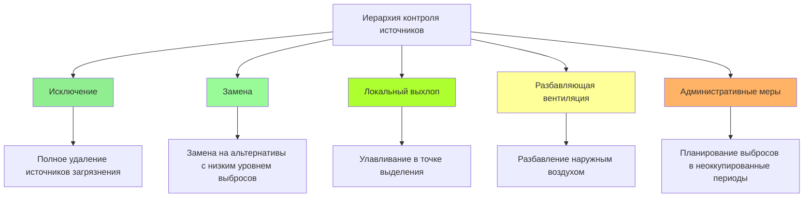

Контроль источников представляет собой наиболее эффективную и энергоэффективную стратегию поддержания качества воздуха в помещениях образовательных учреждений. Исключая или снижая источники загрязнителей у их источника, школы минимизируют нагрузку на вентиляцию при одновременной защите здоровья и когнитивного развития учащихся.

## Иерархия контроля источников

Принцип предотвращения загрязнения следует структурированной иерархии, которая отдает приоритет исключению над разбавлением:

## Выбор материалов с низким уровнем выбросов

Выбор материалов во время строительства и реконструкции существенно влияет на долгосрочное качество воздуха в помещениях. Выбросы летучих органических соединений (ЛОС) и формальдегида из строительных материалов создают постоянные риски воздействия.

**Стандарты выбросов ЛОС:**

Указывайте материалы, соответствующие или превосходящие следующие пределы:

| Категория материала | Лимит ЛОС | Стандарт |
|------------------|-----------|----------|
| Краски и покрытия | < 50 г/л | SCAQMD Rule 1113 |
| Клеи | < 70 г/л | SCAQMD Rule 1168 |
| Ковровые системы | < 0,5 мг/м²·ч суммарные ЛОС | CRI Green Label Plus |
| Композитная древесина | < 0,09 ppm формальдегид | CARB Phase 2 |
| Потолочные плиты | < 0,5 мг/м²·ч суммарные ЛОС | CDPH Standard Method v1.2 |
| Мебель | < 0,5 мг/м²·ч суммарные ЛОС | ANSI/BIFMA e3 |

**Контроль формальдегида:**

Выбросы формальдегида из композитных деревянных материалов (ДСП, МДФ, фанера) представляют особую опасность в школах. Пределы CARB Phase 2:

- Фанера из твердой древесины: 0,05 ppm
- ДСП: 0,09 ppm
- Плиты средней плотности: 0,11 ppm

Указывайте сверхнизкоэмиссионные (ULEF) или не содержащие добавленного формальдегида (NAF) продукты для шкафов, мебели и архитектурной отделки.

## Вентиляция хранилищ химических веществ в художественных и научных лабораториях

Помещения хранения химических веществ требуют специализированного локального выхлопа для предотвращения миграции паров в занятые помещения.

**Требования помещения хранения:**

Минимальный расход выхлопа: $Q = 1,0 \text{ CFM/м}^2$ площади пола

Для хранилища летучих химических веществ, превышающего 38 л:

$$Q = Q_{\text{base}} + \frac{V_{\text{chem}} \times EF \times SF}{C_{\text{max}}}$$

Где:
- $Q_{\text{base}}$ = базовый выхлоп (1,0 CFM/м²)
- $V_{\text{chem}}$ = объем летучих химических веществ (литры)
- $EF$ = коэффициент выделения (CFM/литр, типично 2-5)
- $SF$ = коэффициент безопасности (1,5-2,0)
- $C_{\text{max}}$ = максимально допустимая концентрация

**Параметры проектирования:**

- Отрицательное давление: 5-10 Па относительно соседних помещений
- Воздухообмен: минимум 6 ACH, предпочтительно 12 ACH
- Впускное отверстие выхлопа: на низком уровне (в пределах 30 см от пола)
- Блокирующий выключатель двери: выхлоп проверен перед разрешением входа
- Отдельный выхлоп: без рециркуляции, прямой выброс наружу
- Резервное питание: подключено к аварийному генератору

Установите датчики паров с сигнализацией для легковоспламеняющихся или токсичных веществ, превышающих пороговые значения воздействия.

## Требования вентиляции уборочных помещений

Чистящие средства выделяют ЛОС, ароматизаторы и раздражающие вещества, которые снижают качество воздуха. Уборочные помещения требуют непрерывного выхлопа в часы занятости плюс расширенная работа после опустевания здания.

**Расчет размера выхлопа:**

Минимальный выхлоп: $Q = 1,0 \text{ CFM/м}^2$ площади пола или 85 CFM (1,44 м³/ч), в зависимости от того, что больше

Для помещений, хранящих значительное количество (>19 л концентрированного продукта):

$$Q = 0,5 \times V_{\text{room}} \times ACH_{\text{required}}$$

Где $ACH_{\text{required}}$ = 10-15 воздухообменов в час

**Требования реализации:**

- Непрерывная работа в часы занятости
- Продление работы на 2 часа после опустевания здания
- Отрицательное давление: минимум 5 Па относительно коридора
- Впускное отверстие выхлопа: потолочное или верхнее настенное
- Подрез двери: минимум 2,5 см для поступления воздуха подпора
- Без рециркуляции в здание
- Взрывозащищенное оборудование при наличии легковоспламеняющихся материалов

## Вентиляция копировальных и печатных комнат

Копировальные аппараты и лазерные принтеры выделяют сверхмелкие частицы, озон, ЛОС (стирол, бензол, толуол) и другие побочные продукты нагрева тонера и обработки бумаги.

**Стратегия вентиляции:**

Отдельный выхлоп: $Q = 42-85 \text{ CFM/устройство}$ плюс общая вентиляция помещения

Общая вентиляция помещения:

$$Q_{\text{total}} = Q_{\text{devices}} + (A_{\text{floor}} \times 0,5 \text{ CFM/м}^2)$$

**Меры контроля:**

- Локальные вытяжные кожухи над высокопроизводительными копировальными аппаратами (>3400 копий/месяц)
- Скорость захвата: 25-38 см/с на поверхности устройства
- Отдельная система выхлопа (без смешивания с общей вентиляцией)
- Непрерывная работа в часы занятости плюс 1-часовая очистка
- Расположение помещений на периферии здания для прямого выхлопа
- Рассмотрение централизованных производственных помещений вместо распределенных копировальных аппаратов
- Указание низкоэмиссионных устройств (сертифицированные Blue Angel)

Обеспечьте подачу 100% наружного воздуха для поддержания отрицательного давления и предотвращения миграции в учебные классы.

## Источники загрязнения и стратегии контроля

| Источник загрязнения | Основные загрязнители | Стратегия контроля | Эффективность |
|------------------|---------------------|------------------|---------------|
| Краски, покрытия | ЛОС, формальдегид | Требование низкого ЛОС, применение в нерабочее время | Высокая |
| Ковры, полы | ЛОС, 4-ФЦ | Сертификация Green Label Plus, 72-часовая вентиляция | Высокая |
| Чистящие средства | Ароматизаторы, ЛОС, аммиак | Сертифицированные Green Seal, выхлоп уборочных помещений | Средняя-высокая |
| Копировальные аппараты, принтеры | Озон, СМЧ, ЛОС | Локальный выхлоп, низкоэмиссионное оборудование | Высокая |
| Художественные материалы | ЛОС, частицы | Сертифицированные AP/CP, локальный выхлоп | Средняя-высокая |
| Химические вещества в науке | Множественные | Закрытое хранилище с выхлопом, вытяжные шкафы | Высокая |
| Борьба с вредителями | Пестициды, пиретроиды | Программа IPM, приоритет наружного применения | Высокая |
| Система HVAC | Биологический рост, пыль | Правильная фильтрация, контроль влажности, обслуживание | Высокая |
| Наружная инфильтрация | Продукты сгорания, аллергены | Воздушные барьеры, фильтрация, стратегическое расположение впуска | Средняя |
| Занятые люди | CO₂, биоэффлюенты | Адекватные расходы вентиляции, управление по занятости | Высокая |

## Интеграция борьбы с вредителями с HVAC

Программы комплексной борьбы с вредителями (IPM) снижают использование пестицидов при сохранении целостности системы HVAC.

**Координация HVAC-IPM:**

- Герметизация проходов воздуховодов и коммунальных шахт (распространенные пути проникновения вредителей)
- Поддержание положительного давления в здании для предотвращения инфильтрации
- Устранение источников влаги (утечки конденсата, высокая влажность)
- Установка дверных щеток и уплотнителей
- Планирование наружной обработки пестицидами в неоккупированные периоды
- Поддержание буфера 15 метров от наружных воздухозаборников при обработке
- Работа систем вентиляции в режиме неоккупированности (100% выхлоп) в течение 24 часов после обработки, если необходима внутренняя обработка
- Приоритет приманок и физических барьеров над распыличиванием

**Вентиляция после применения:**

Если необходима внутренняя обработка пестицидами:

$$t = \frac{\ln(C_0/C_f)}{ACH} \times 60$$

Где:
- $t$ = время очистки (минуты)
- $C_0$ = начальная концентрация
- $C_f$ = конечная допустимая концентрация
- $ACH$ = воздухообмены в час

Например, снижение концентрации до 10% от начальной при 6 ACH:

$$t = \frac{\ln(1/0,1)}{6} \times 60 = 23 \text{ минуты}$$

На практике поддерживайте 24-часовую очистку с максимальным наружным воздухом перед возобновлением занятости.

## Использование химических веществ при обслуживании и протоколы вентиляции

Работы по обслуживанию вводят эпизодические источники загрязнения, требующие процедурного контроля в координации с работой HVAC.

**Протоколы на основе деятельности:**

| Деятельность | Загрязнители | Протокол вентиляции | Продолжительность |
|----------|-----------|---------------------|----------|
| Удаление/перекрытие пола | ЛОС, частицы | 100% НВ, изоляция площади, расширенная очистка | 72 часа |
| Покраска | ЛОС, растворители | 100% НВ, изоляция зоны, низкоЛОС продукты | 48 часов |
| Установка ковра | ЛОС, клеи | 100% НВ, установка в неоккупированные периоды | 72 часа |
| Работы на крыше | Асфальтовые пары, растворители | Закрытие наружного воздухозабора, если в пределах 7,6 м | Во время работ |
| Чистка воздуховодов | Пыль, биологический материал | Изоляция зон, вакуум HEPA, проверка фильтрации | Во время + 24ч |
| Борьба с вредителями (внутри) | Пестициды | 100% выхлоп, без рециркуляции | 24 часа |

**Рекомендации по выбору химических веществ:**

- Отдайте приоритет сертифицированным продуктам Green Seal GS-37, GS-40 или Safer Choice
- Исключите аэрозольные освежители воздуха и маскирующие ароматизаторы
- Используйте системы очистки из микрофибры для снижения потребления химических веществ
- Храните все химические вещества для обслуживания в выхлопных помещениях
- Ведите инвентарь химических веществ, доступный для персонала объекта и здравоохранения
- Предоставьте паспорта безопасности материалов (SDS) для всех продуктов

**Практика планирования:**

Проводите высокоэмиссионные работы в:
- Продленные перерывы (лето, зима, весна)
- Выходные с расширенной предварительной вентиляцией
- Позднее午 с ночной вентиляцией очистки
- Поэтапная реализация, позволяющая соседним помещениям оставаться занятыми

Рассчитайте требуемое время очистки:

$$t_{\text{purge}} = \frac{4}{ACH_{\text{effective}}} \text{ (часы)}$$

Это достигает примерно 98% удаления загрязнителя (4 временных постоянных).

## Реализация и проверка

Эффективность контроля источников требует проверки при пусконаладке и постоянном мониторинге:

1. **Проверка материалов:** Подтвердите доставку и установку указанных низкоэмиссионных продуктов
2. **Проверка выхлопа:** Протестируйте расходы воздуха и перепады давления в уборочных помещениях и хранилищах химических веществ
3. **Тестирование качества воздуха:** Проведите оценку после занятости после крупных реконструкций
4. **Соответствие протоколам:** Проведите ежеквартальный аудит процедур обслуживания и борьбы с вредителями
5. **Постоянное улучшение:** Отслеживайте жалобы занимающихся и корректируйте протоколы

Иерархия исключения, замены и локального выхлопа обеспечивает превосходные результаты качества воздуха в помещениях по сравнению с одной лишь разбавляющей вентиляцией, одновременно снижая потребление энергии и операционные затраты.
