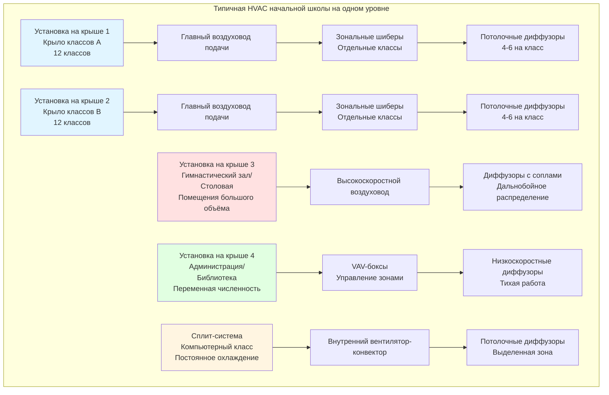

# HVAC начальных школ: проектирование для младших учащихся

Начальные школы, обслуживающие 1-5 классы (возраст 5-10 лет), требуют систем HVAC, специально разработанных для младших детей, которые имеют более высокие метаболические показатели на единицу массы тела, большую восприимчивость к переносимым по воздуху загрязнителям и требования безопасности, отличные от старших учащихся. Приоритеты проектирования подчёркивают безопасность, простоту, надёжное качество воздуха в помещениях и тепловой комфорт, оптимизированный для меньших размеров тела и различных характеров активности.

## Требования к вентиляции с учётом возраста

Стандарт ASHRAE 62.1 дифференцирует нормы вентиляции в зависимости от возраста учащихся из-за физиологических различий в частоте дыхания и метаболической активности.

### Вентиляция классов начальной школы (возраст 5-8 лет)

Для учащихся в возрасте 5-8 лет стандарт предписывает:

**Vₒₐ = Rₚ × Pz + Rₐ × Az**

Где:
- Rₚ = 10 CFM/человек (как для старших учащихся)
- Rₐ = 1,29 CFM/м²
- Pz = расчётная численность (обычно 22-26 учащихся + 1 учитель)
- Az = площадь класса

**Пример расчёта для типичного класса начальной школы:**

Класс детского сада площадью 70 м² с 24 учащимися и 1 учителем:

Vₒₐ = (10 × 25) + (1,29 × 70) = 250 + 90 = 340 CFM (9,6 м³/ч)

Это даёт 13,6 CFM/человек, выше, чем компонент по числу персон, потому что младшие учащиеся занимают классы с более низкой плотностью (2,6-3,3 м²/учащийся против 2,3-2,6 м²/учащийся в старших классах).

### Учёт метаболического потребления

Дети младшего школьного возраста имеют более высокие метаболические показатели относительно площади поверхности тела в сравнении со взрослыми:

| Возрастная группа | Метаболический показатель (met) | Явное тепло (кДж/ч) | Скрытое тепло (кДж/ч) | Всего тепла (кДж/ч) |
|-----------|---------------------|----------------------|---------------------|-------------------|
| Детский сад (5-6 лет) | 1,2-1,4 | 190 | 100 | 290 |
| 1-2 классы (6-8 лет) | 1,2-1,3 | 206 | 111 | 317 |
| 3-5 классы (8-10 лет) | 1,1-1,2 | 222 | 121 | 343 |
| Взрослый (сидит, лёгкая работа) | 1,0-1,1 | 259 | 164 | 423 |

Дети генерируют на 30-40% меньше общего тепла на одного человека, чем взрослые, но имеют более высокие отношения поверхности к объёму, что делает их более чувствительными к колебаниям температуры окружающей среды. Целевые установки 21-22°C для отопления и 23-24°C для охлаждения поддерживают комфорт без перегрева.

## Требования проектирования с ориентацией на безопасность

Начальные школы требуют повышенного внимания к безопасности учащихся во всех аспектах проектирования HVAC.

### Защита оборудования и доступность

**Требования по защите:**
- Размещение всего механического оборудования в запираемых помещениях, недоступных для учащихся
- Исключение открытых горячих поверхностей (трубы, радиаторы, теплообменники) в занятых помещениях
- Установка защищённых от несанкционированного доступа термостатов минимум на высоте 152 см над готовым полом
- Защита всех доступных жалюзи, диффузоров и регистров прочной конструкцией
- Предусмотрение возможности отключения всех локальных систем управления, доступных из занятых пространств

**Ограничения температуры:**
- Максимальная температура доступной поверхности: 49°C (предотвращение контактных ожогов)
- Горячее водоснабжение ограничено максимум 43°C на приборах
- Поверхности полов с подогревом ограничены максимум 29°C
- Радиаторы и конвекторы требуют защитных кожухов, если ниже 183 см от пола

### Безопасность распределения воздуха

**Соображения по выпускному воздуху:**
- Ограничение скорости выпуска подаваемого воздуха для предотвращения смещения бумаги и дискомфорта
- Размещение диффузоров для предотвращения прямого потока воздуха на сидящих детей (нижний уровень головы)
- Разница температур подаваемого воздуха ограничена максимум 8°C для предотвращения сквозняков
- Избегание напольных диффузоров в основных коридорах (опасность спотыкания, накопление мусора)

**Ограничения на рециркуляцию:**
- Запрещение рециркуляции воздуха из туалетных комнат, помещений для уборки и мест приготовления пищи
- Установка защитных сеток на низкомонтируемые рециркуляционные грили для предотвращения проникновения посторонних предметов
- Минимальный размер отверстия жалюзи 1,3 см максимум для предотвращения доступа пальцев к движущимся частям

## Упрощённые стратегии управления

Персонал по обслуживанию начальных школ и учителя требуют интуитивно понятных и простых систем управления HVAC. Сложные системы автоматизации зданий должны предоставлять удобные интерфейсы для основных регулировок.

### Системы управления, доступные для учителей

Предоставьте управление на уровне помещения, ограниченное следующим:
- Регулировка установки температуры (±1,7°C от исходного значения)
- Кнопка переключения режима занятости/незанятости (продолжительность 2-4 часа)
- Визуальная обратная связь текущей температуры и статуса системы

**Ограничения управления:**
- Отсутствие доступа к скорости вентилятора, норме вентиляции или запуску/остановке оборудования
- Автоматический возврат к запланированной работе после периода переключения
- Минимальная вентиляция поддерживается во всех занятых периодах независимо от локальных регулировок

### Централизованное управление системой

Управление на уровне здания должно позволить персоналу объекта:

1. **Управление расписанием**: Координирование работы HVAC с расписанием звонков, периодами перемены и специальными событиями
2. **Группировка зон**: Управление крыльями классов, блоками одного уровня или целыми зданиями как логическими группами
3. **Пределы установки**: Установка приемлемых диапазонов температур, предотвращающих чрезмерное энергопотребление
4. **Уведомления об обнаружении неисправностей**: Получение оповещений об отказах оборудования, экстремальных температурах или проблемах вентиляции
5. **Простое переключение**: Предусмотрение доступа в нерабочее время для мероприятий без переконфигурации

Графические интерфейсы с планами этажей и цветовыми индикаторами состояния позволяют нетехническому персоналу эффективно определять и реагировать на проблемы.

## Типичная архитектура системы HVAC начальной школы

Начальные школы обычно используют установки на крыше с управлением на уровне зон или системы VAV в зависимости от размера здания и бюджета.



### Критерии выбора системы для начальных школ

| Конфигурация здания | Рекомендуемая система | Обоснование |
|----------------------|-------------------|-----------|
| Один этаж, 12-24 класса | Несколько упакованных агрегатов RTU | Простота, доступность, низкая стоимость, независимые зоны |
| Два этажа, 24+ класса | Центральная VAV с периферийным отоплением | Лучший контроль влажности, централизованное обслуживание |
| Переоборудование/пристройка | Сплит-системы или безканальные системы | Минимизирует нарушение существующего здания |
| Высокопроизводительное/LEED | DOAS + лучистое или активные балки | Превосходное качество воздуха, энергоэффективность, акустическая производительность |

## Соображения по проектированию с учётом специфики класса

Классы начальной школы отличаются от старших классов макетом, характером загруженности и характеристиками внутренних нагрузок.

### Интеграция планирования пространства

**Типичный макет класса начальной школы:**
- Площадь 65-84 м²
- 22-26 учащихся за отдельными партами или сгруппированными столами
- Фасад преподавателя с доской/интерактивной доской
- Уголок для чтения или центры деятельности
- Хранилище пальто/рюкзаков

**Требования координирования HVAC:**
- Избегание диффузоров подачи непосредственно над фасадом преподавателя (бликование от потолочных светильников)
- Размещение термостатов вдали от наружных стен и прямого солнечного света
- Размещение рециркуляции напротив подачи для способствования циркуляции воздуха
- Поддерживание свободной высоты потолка минимум 2,7-3,0 м для надлежащего смешивания воздуха

### Характеристики внутренних нагрузок

Классы начальной школы генерируют более низкие нагрузки оборудования, чем средние/старшие школы:

**Типичные тепловые приобретения класса:**
- Учащиеся: 25 учащихся × 300 кДж/ч = 7,9 кДж/ч
- Учитель: 1 × 400 кДж/ч = 0,4 кДж/ч
- Освещение (LED): 70 м² × 10,8 Вт/м² = 0,76 кДж/ч
- Оборудование: 1-2 компьютера, проектор = 1,6 кДж/ч
- Ограждение: Варьируется в зависимости от ориентации, конструкции = 3,2-8,5 кДж/ч

**Общая нагрузка охлаждения: 15,8-21,1 кДж/ч** (приблизительно 4,4-6,0 кВт)

Более низкая плотность оборудования снижает нагрузки охлаждения, но увеличивает относительную важность производительности оболочки и управления солнечными теплозабросами.

## Требования к специальным помещениям

Начальные школы включают специализированные помещения с уникальными требованиями HVAC.

### Классы детского сада

Помещения детского сада требуют повышенного внимания к проектированию:

**Соображения вентиляции:**
- Более высокие кратности воздухообмена (5-6 ACH в сравнении с 3-4 ACH для старших классов)
- Увеличенный процент наружного воздуха из-за вероятности более высоких выбросов ЛОС от художественных/ремесленных материалов
- Рассмотрение периодов отдыха со сниженными уровнями активности

**Тепловой комфорт:**
- Мониторинг температуры на уровне пола (дети часто сидят и лежат на полах)
- Лучистое отопление пола идеально подходит для ковровых/мягких площадей, где собираются дети
- Избегание холодных сквозняков на уровне пола в период отопительного сезона

**Повышенные функции безопасности:**
- Непрерывная работа вытяжки туалетной комнаты в течение занятых часов
- Повышенная фильтрация (MERV 11-13 минимум) из-за развивающихся иммунных систем
- Размещение термостатов и систем управления вне досягаемости (60+ см от пола)

### Художественные классы и творческие пространства

Преподавание искусства генерирует переносимые по воздуху загрязнители, требующие выделенной вытяжки:

**Требования по вытяжке:**
- Локальная вытяжка для печей, гончарных кругов и зон рисования
- Минимум 5,4 CFM/м² (28,3 CFM/м²) общей вытяжки для художественных классов
- Захватывающие зонты для аэрографической окраски (скорость в лицевой части 30-46 м/ч)
- Отдельные вытяжные системы для обжига печи (высокотемпературный рейтинг воздуховода)

**Подпиточный воздух:**
Предоставьте подогретый подпиточный воздух для замены вытяжного и поддержания баланса давления в помещении. Прямоотопительные газовые установки подпиточного воздуха или воздух передачи из смежных коридоров приемлемы для общей вытяжки. Выделенный подпиточный воздух требуется для локальной вытяжки, превышающей 142 CFM (4,0 м³/ч).

### Музыкальные классы и помещения для индивидуальной практики

Акустическая производительность конфликтует с требованиями шумности HVAC:

**Целевые уровни шума:**
- Музыкальные классы: NC 25-30 максимум фонового шума
- Помещения для практики: NC 20-25 максимум фонового шума

**Стратегии акустического проектирования:**
- Глушители воздуховода в воздуховодах подачи и рециркуляции рядом с помещениями
- Низкоскоростное распределение воздуха (152-244 м/ч максимум)
- Виброизоляция всего механического оборудования
- Выделенные воздухоизмерители для музыкального крыла для изоляции от более шумных RTU
- Рассмотрение лучистого охлаждения с минимальным распределением воздуха для помещений для практики

### Многофункциональные помещения и столовые

Комбинированные помещения гимнастического зала/столовой, распространённые в начальных школах, представляют проблемы переменной загруженности:

```mermaid
graph LR
    subgraph "Режимы работы многофункционального помещения переменной загруженности"
        A[Режим спортзала<br/>30 учащихся<br/>Урок физкультуры] --> B{Обнаружение<br/>загруженности}
        B --> C[Сниженный НВ<br/>283 CFM (8,0 м³/ч)<br/>DCV активна]

        D[Режим обеда<br/>150 учащихся<br/>3 смены] --> B
        B --> E[Полный НВ<br/>943 CFM (26,7 м³/ч)<br/>Максимальная вент.]

        F[Режим собрания<br/>300 учащихся<br/>и родители] --> B
        B --> G[Полный НВ + охл.<br/>1,415 CFM (40,0 м³/ч)<br/>Макс. мощность]

        H[Незанятая<br/>Ночи/выходные] --> B
        B --> I[Минимум НВ<br/>0 CFM<br/>Режим отката]
    end

    style C fill:#e1ffe1
    style E fill:#fff5e1
    style G fill:#ffe1e1
    style I fill:#e1e1e1
```

**Подход к проектированию:**
- Соразмерность оборудования максимальной одновременной загруженности (режим собрания)
- Внедрение вентиляции, управляемой спросом на основе CO₂, для снижения наружного воздуха во время уроков физкультуры
- Двухступенчатое или регулируемое охлаждение для обработки 3:1 вариации нагрузки
- Отдельный термостат и переключение занятости для столовой в сравнении с гимнастическим залом
- Вытяжные вентиляторы для контроля запахов в период обеда

## Повышение качества воздуха в помещениях

Дети младшего школьного возраста более восприимчивы к переносимым по воздуху загрязнителям из-за развивающихся дыхательных систем и более высоких частот дыхания на единицу массы тела.

### Расширенные стратегии фильтрации

**Минимальные уровни фильтрации:**
- MERV 11: Стандартное применение для начальной школы
- MERV 13: Рекомендуется для территорий с высокой пыльцой или проблемами качества воздуха
- MERV 14-16: Школы с популяциями учащихся с астмой или проблемами качества воздуха в городских районах

**Техническое обслуживание фильтра:**
Установка дифференциальных манометров на все воздухоизмерители. Замена фильтров при перепаде давления, превышающем рекомендации производителя (обычно 0,25-0,5 кПа в зависимости от типа фильтра). Установка замены фильтра на основе календаря (минимум ежеквартально) вместо реактивного подхода.

### Управление влажностью

Поддержание 40-60% относительной влажности в течение года обеспечивает несколько преимуществ:

**Преимущества для здоровья:**
- Снижено время выживания гриппа и других переносимых по воздуху вирусов
- Снижено раздражение дыхательных путей и электростатика
- Минимизировано размножение плесени и пылевых клещей

**Стратегии эксплуатации:**
- Осушение в сезоне охлаждения через переохлаждение и повторный нагрев или выделенное осушение
- Увлажнение в сезоне отопления через центральный пар или испарительные увлажнители
- Мониторинг влажности в репрезентативных пространствах и регулировка на основе наружной точки росы

Выделенные системы наружного воздуха с интегрированным осушением обеспечивают превосходный контроль влажности в сравнении с обычными системами, которые часто идут на компромисс с осушением для энергоэффективности.

## Энергоэффективность и операционная экономия

Начальные школы работают приблизительно 1,800-2,000 часов в год в течение учебного времени, с расширенными периодами незанятости, позволяющими агрессивную экономию энергии.

### Стратегии энергосбережения на основе расписания

**Расписание занятости:**
- Предварительный нагрев/охлаждение: 6:00-7:30 (оптимальный старт)
- Полная работа: 7:30-15:00 (учебный день)
- После школы: 15:00-17:00 (сниженные зоны, мероприятия)
- Незанятая: 17:00-6:00 (откат на 13°C тепло / 29°C охл.)

**Сезонное выключение:**
Летний перерыв (обычно июнь-август) позволяет полное выключение за исключением:
- Минимальная вентиляция для контроля влажности во влажных климатических условиях
- Кондиционирование воздуха для летних программ и административного персонала
- Периодическая работа оборудования для предотвращения повреждения подшипников и поддержания смазывания

### Координирование освещения и нагрузок подключённого оборудования

Начальные школы имеют более низкие нагрузки подключённого оборудования, чем средние/старшие школы:

**Типическая плотность электроэнергии:**
- Классы: 5,4-8,6 Вт/м² (компьютеры, проекторы)
- Администрация: 10,8-16,1 Вт/м² (компьютеры, копировальные аппараты, принтеры)
- Библиотека: 6,5-10,8 Вт/м² (компьютеры, мультимедиа)

LED-освещение с датчиками присутствия и снижением яркости при дневном свете снижает внутренние приобретения на 40-60% в сравнении с люминесцентным освещением, пропорционально снижая нагрузки охлаждения при одновременном улучшении качества визуализации.

## Доступность обслуживания и безопасность

Проектирование для безопасного и эффективного обслуживания персоналом по содержанию школ с различными уровнями квалификации.

### Размещение оборудования и доступ

**Оборудование на крыше:**
- Предусмотрение соответствующего OSHA доступа на крышу (постоянная лестница или внутренние лестницы)
- Установка систем защиты от падения (ограждения, точки крепления страховки)
- Минимум 122 см зазора вокруг всего оборудования для замены фильтров и обслуживания
- Защита электрических отключений и панелей управления от атмосферных осадков

**Внутренние механические помещения:**
- Размещение вдали от классов, требующих тихих помещений
- Предусмотрение адекватного освещения (49 люкс минимум) для задач обслуживания
- Установка напольных стоков для конденсата оборудования и промывки
- Поддержание чистых проходов 91-122 см в ширину для доступа ко всему оборудованию

### Техническое обслуживание фильтров и змеевиков

**Требования доступности:**
- Доступ к фильтрам на высоте стояния (лестницы или подъёмники не требуются)
- Постоянные манометры видны из точки доступа к фильтру
- Адекватное напольное пространство для размещения грязных и чистых фильтров
- Моющиеся или постоянные фильтры для небольших сплит-систем для снижения бремени замены

**Очистка змеевика:**
Змеевики наружного воздуха требуют ежегодной очистки для поддержания эффективности теплопередачи и предотвращения биологического роста. Предусмотрите:
- Съёмные панели доступа на обеих сторонах змеевика
- Напольные стоки или сливные поддоны для сброса чистящего раствора
- Шланговые биб-краны водоснабжения рядом с впусками наружного воздуха

## Заключение

Проектирование HVAC для начальных школ требует специализированного внимания к безопасности детей, упрощённой эксплуатации, повышенному качеству воздуха в помещениях и возрастному тепловому комфорту. Надлежащее внедрение требований вентиляции ASHRAE 62.1, надёжных систем фильтрации, ограничений температуры на доступных поверхностях и защищённых от несанкционированного доступа систем управления создаёт здоровые среды обучения для младших учащихся. Выбор системы должен отдавать приоритет простоте, ремонтопригодности и надёжной производительности над технологической сложностью, признавая эксплуатационные ограничения и возможности обслуживания, типичные для объектов начальных школ.

---

**Соответствующие темы:**
- [HVAC системы K-12 школ](../)
- [Проектирование HVAC классов](../../classrooms-hvac/)
- [Качество воздуха в помещениях в школах](../../indoor-air-quality-schools/)
- [Гимнастические залы и плавательные бассейны](../../gymnasiums-natatoriums/)
- [Школьные столовые](../../school-cafeterias/)
