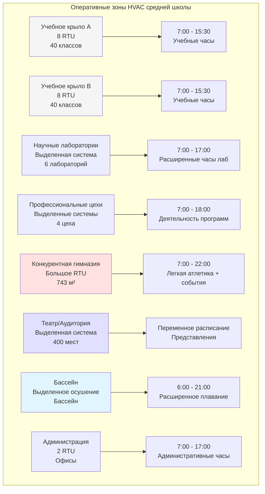
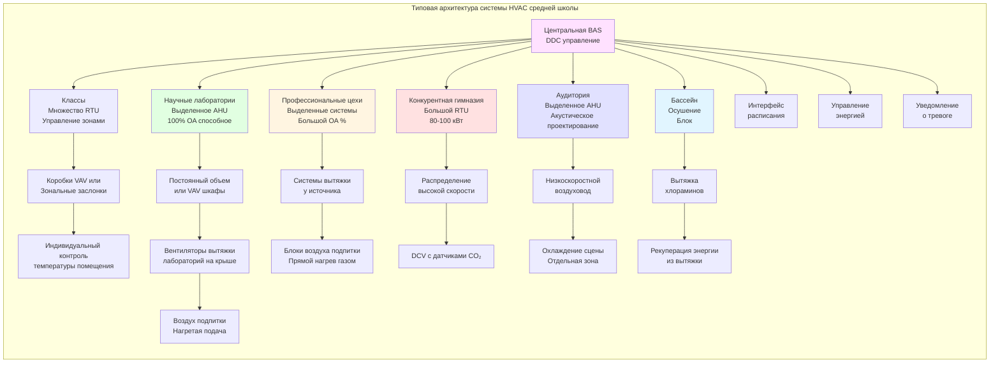

# Средняя школа HVAC: Проектирование сложного многофункционального учреждения

Средние школы представляют наиболее сложную задачу проектирования HVAC в системе К-12 образования из-за разнообразных специализированных помещений, включая лаборатории химии и биологии с вытяжными шкафами, профессиональные цехи, требующие промышленной вытяжки, конкурентные гимназии с переменной нагрузкой зрителей, театры исполнительских искусств, требующие строгого акустического контроля, и расширенные часы работы, поддерживающие спортивные мероприятия и вечерние мероприятия. Проектирование должно интегрировать эти разнообразные требования при сохранении энергоэффективности и операционной простоты.

## Сложность здания и разнообразие помещений

Средние школы обычно содержат 50-150 классов плюс специализированные помещения, не встречающиеся в начальных или средних школах. Такое разнообразие требует стратегии HVAC, специфичной для зон, а не унифицированного подхода на уровне всего здания.

### Требования HVAC к типам помещений средней школы

| Тип помещения | Скорость вентиляции | Специальные требования | Типичная нагрузка (кВт/м²) |
|------------|------------------|---------------------|------------------------------|
| Стандартный класс | 4,7 м³/ч·чел + 0,65 м³/ч·м² | Тихая работа, индивидуальный контроль | 4,7-6,3 |
| Лаборатория химии | 5,4 м³/ч·м² + вытяжка шкафа | Приток воздуха в шкаф, аварийная вытяжка | 7,9-11,0 |
| Лаборатория биологии | 5,4 м³/ч·м² + вытяжка шкафа | Хранение образцов, тепловая нагрузка инкубаторов | 6,3-9,4 |
| Лаборатория физики | 4,7 м³/ч·чел + 0,65 м³/ч·м² | Тепловая нагрузка оборудования, вытяжка лазерной безопасности | 6,3-7,9 |
| Автомастерская | 8,1 м³/ч·м² | Захват выхлопа автомобиля, удаление масляного тумана | 3,1-4,7 |
| Сварочный цех | 5,7 м³/ч на станцию | Вытяжка дыма, координация защиты от пожара | 4,7-6,3 |
| Столярный цех | 8,1 м³/ч·м² | Интеграция сбора пыли, защита от пожара | 3,1-4,7 |
| Кулинарная кухня | Вытяжные шкафы Типа I/II | Вытяжка коммерческой кухни, приток воздуха | 9,4-12,6 |
| Конкурентная гимназия | 9,4 м³/ч·чел + 0,32 м³/ч·м² | Сидения для зрителей, расширенные часы, DCV | 2,5-3,8 |
| Театр/Аудитория | 7,1 м³/ч·чел | Акустика NC 25, тепловая нагрузка сценического освещения | 4,7-6,3 |
| Тренажерный зал | 9,4 м³/ч·чел | Высокие скрытые нагрузки, выделение газов оборудованием | 7,9-11,0 |
| Бассейн | 2,7 м³/ч·м² минимум | Осушение, контроль хлораминов | 12,6-18,9 |

## Системы лабораторий химии и биологии

Лабораторные помещения требуют сложных систем вытяжки для защиты студентов и преподавателей во время экспериментов с химическими веществами, биологическими материалами и источниками тепла.

### Проектирование и производительность вытяжного шкафа

Химические лаборатории обычно содержат 2-4 вытяжных шкафа для настольных экспериментов. Проектирование шкафа следует стандартам ANSI Z9.5 и ASHRAE 110.

**Расчет вытяжки шкафа:**

Скорость воздуха на выходе шкафа определяется скоростью на лице и площадью отверстия:

$$Q_{hood} = V_{face} \times A_{opening}$$

Где:
- $Q_{hood}$ = скорость вытяжки шкафа (м³/ч)
- $V_{face}$ = скорость лица, обычно 0,40-0,51 м/с для образовательных приложений
- $A_{opening}$ = площадь отверстия заслонки (м²)

Для шкафа шириной 1,8 м × высотой 0,6 м:

$$Q_{hood} = 0,51 \text{ м/с} \times (1,8 \times 0,6) = 0,55 \text{ м³/с} = 1,98 \text{ м³/ч}$$

При изменяемой высоте заслонки от 0 до 0,6 м вытяжка шкафа должна поддерживать скорость лица в диапазоне работы. Системы с постоянным объемом вытяжат 1,98 м³/ч непрерывно. Системы переменного объема воздуха (VAV) модулируют вытяжку от 0,51 м³/ч (заслонка закрыта) до 1,98 м³/ч (заслонка полностью открыта), экономя 40-60% энергии вытяжки при сохранении безопасности.

### Требования воздуха подпитки для лабораторий

Вытяжка из шкафа лаборатории создает значительное отрицательное давление, требующее подачи воздуха подпитки. Химическая лаборатория с четырьмя шкафами 1,8 м, работающими одновременно, требует 7,9 м³/ч воздуха подпитки.

**Стратегия воздуха подпитки:**

1. **Общий приток воздуха**: Подача кондиционированного воздуха подпитки через потолочные диффузоры
2. **Перфорированные стены подачи**: Введение воздуха низкой скорости за шкафами
3. **Плинтусы подачи воздуха**: Прямая подача воздуха низкой скорости в объем помещения
4. **Комбинированный**: Общая вентиляция плюс специальный воздух подпитки шкафа

**Давление в лабораторном помещении:**

Поддерживайте лаборатории при отрицательном давлении (-8 до -20 Па) относительно коридоров для удержания загрязнений. Рассчитайте общую вытяжку для поддержания дифференциала давления:

$$Q_{exhaust} = Q_{supply} + \Delta Q_{pressure}$$

Где $\Delta Q_{pressure}$ = 0,024-0,047 м³/с на лабораторию для поддержания отрицательного давления во время открытия/закрытия двери.

### Расчет скорости вентиляции лаборатории

Помимо вытяжки шкафа, лаборатории требуют общей вентиляции помещения согласно ASHRAE 62.1:

$$V_{oa,lab} = 5,4 \text{ м³/ч·м}^2 \times A_{lab}$$

Для химической лаборатории площадью 111 м²:

$$V_{oa,lab} = 5,4 \times 111 = 599 \text{ м³/ч общей вентиляции}$$

Эта общая вентиляция работает непрерывно во время занятости, независимо от работы шкафа. Общее требование свежего воздуха равняется общей вентиляции плюс подпитка вытяжки шкафа.

## Вентиляция промышленных цехов и профессиональных мастерских

Профессиональные программы создают промышленные загрязнители, требующие специализированных систем вытяжки, скоординированных с HVAC учебного здания.

### Вытяжка автомобильного технического цеха

Автомастерские представляют множество требований вытяжки для разных видов деятельности и типов загрязнений.

**Системы захвата выхлопа автомобиля:**

Вытяжка у источника удаляет выбросы автомобилей при работе двигателя. Варианты проектирования:

- **Шланги выхлопной трубы**: Гибкие шланги подключаются к выхлопу автомобиля, минимум 76 мм диаметр, 0,085-0,11 м³/с на шланг
- **Верхняя вытяжка**: Сочлененные рычаги размещают вытяжные головки над автомобилем, 0,14-0,19 м³/с на позицию
- **Подпольная вытяжка**: Напольные соединения через рельсы, 0,095-0,14 м³/с на позицию

**Общая вентиляция:**

Помимо захвата источника, обеспечьте общую вытяжку для разбавления fugitive выбросов и масляных туманов:

$$Q_{general} = 8,1 \text{ м³/ч·м}^2 \times A_{shop}$$

Для автомастерской площадью 279 м²:

$$Q_{general} = 8,1 \times 279 = 2,26 \text{ м³/ч}$$

Нагретый воздух подпитки предотвращает чрезмерное отрицательное давление в отопительный сезон. Прямые нагревательные блоки воздуха подпитки имеют КПД 80-93%.

**Требования покрасочной кабины:**

Окраска распылением требует выделенной вытяжной кабины, соответствующей NFPA 33:
- Скорость вытяжки: минимум 0,51 м/с скорость лица
- Скорость вытяжного пленума: 0,51-1,02 м/с для эффективности фильтра
- Воздух подпитки: 90-100% скорости вытяжки
- Взрывозащищенное электрооборудование
- Автоматическая система спринклерной защиты

### Вытяжка дыма сварочного цеха

Сварочные операции создают металлические дымы и UV-излучение, требующие вытяжки у источника согласно ANSI Z49.1 и AWS F1.5.

**Методы захвата сварочного дыма:**

1. **Системы низкого объема высокой скорости (LVHV)**: Гибкие рычаги с вытяжными головками 102-152 мм, 0,071-0,14 м³/с на станцию, эффективный радиус захвата 0,3-0,5 м от дуги
2. **Столы с нисходящим потоком**: 1,1-2,2 м³/ч·м² площади стола, захватывают дымы у источника перед поднятием в дыхательную зону
3. **Скамьи с поперечным потоком**: Горизонтальный поток воздуха через рабочую поверхность, скорость захвата 0,25-0,51 м/с
4. **Общая вентиляция разбавления**: Вторичная система обеспечивающая 0,944 м³/с минимум на сварщика для fugitive дымов

**Расчет качества воздуха сварочного цеха:**

Для цеха с 6 сварочными станциями, использующих LVHV вытяжку:

$$Q_{welding} = (0,12 \text{ м³/с на станцию}) \times 6 + 0,47 \text{ м³/с общая} = 1,18 \text{ м³/с}$$

Координация защиты от пожара критична: обеспечьте работу систем вытяжки при срабатывании спринклеров.

### Интеграция сбора пыли столярного цеха

Столярное оборудование создает опилки, требующие выделенных систем сбора. Скоординируйте сбор пыли с HVAC здания для предотвращения помех.

**Требования интеграции проектирования:**

- Система сбора пыли работает независимо от HVAC здания
- Обеспечьте общую вентиляцию цеха (5,4-8,1 м³/ч·м²) отдельно от сбора пыли
- Поддерживайте цех при нейтральном давлении (±0 Па) относительно коридоров
- Подача воздуха для вытяжки сборщика пыли, если выводится наружу
- Блокировка работы сборщика пыли с питанием оборудования

## Проектирование HVAC конкурентной гимназии

Гимназии средней школы служат множественным функциям: физкультурные классы, спортивные соревнования со зрительскими местами, собрания и общественные мероприятия. Проектирование должно размещать изменения нагрузки от 30 студентов до 1500+ зрителей.

### Стратегии вентиляции гимназии

**Проектирование требований наружного воздуха:**

Базовая вентиляция на максимальной занятости (спортивные события со зрителями):

$$V_{oa,gym} = (9,4 \text{ м³/ч·чел} \times P_{max}) + (0,32 \text{ м³/ч·м}^2 \times A_{gym})$$

Для гимназии площадью 743 м² со вместимостью 1200 человек:

$$V_{oa,gym} = (9,4 \times 1,200) + (0,32 \times 743) = 11,280 + 237 = 11,517 \text{ м³/ч}$$

**Реализация управления вентиляцией по спросу:**

Установите датчики CO₂ на уровне дыхания как на игровом поле, так и в зрительской секции. Модулируйте наружный воздух на основе измеренных концентраций:

- Не занято: 0 м³/ч (система выключена во время setback)
- Физкультурный класс (30 студентов): 0,94 м³/ч (на основе обратной связи CO₂)
- Практика (50 студентов + тренеры): 1,65 м³/ч
- Игра JV (400 зрителей): 5,67 м³/ч
- Игра Varsity (1200 зрителей): 11,517 м³/ч

DCV снижает годовую энергию вентиляции на 35-50% в сравнении с постоянным максимальным потоком воздуха.

### Распределение воздуха большого объема

Высота потолка гимназии 7,3-9,1 м требует распределения воздуха дальнего действия. Подход к проектированию:

**Стратегия подачи воздуха:**

- Высокоскоростные диффузоры с соплами, обеспечивающие дальность 15-21 м
- Температурный дифференциал воздуха подачи 8-11°C приемлем из-за высокого смешивания
- Установите диффузоры у периметральных стен, направленные к центру
- Избегайте прямого выпуска на баскетбольные площадки (влияет на траекторию мяча)

**Стратегия вытяжки воздуха:**

- Вытяжка высокой стены напротив диффузоров подачи
- Расслоение температуры вытяжки минимально при правильном проектировании подачи
- Потолочная вытяжка приемлема, но требует вентиляторов расслоения в режиме отопления

### Переменная охлаждающая способность

Охлаждающие нагрузки гимназии варьируют 5:1 от не занятого к полной зрительской мощности. Однократное оборудование работает импульсом при низких нагрузках. Решения включают:

- **Двухэтапные RTU**: Первый этап обслуживает базовые нагрузки, второй этап для событий
- **Компрессоры переменной мощности**: Модулируют от 25-100% мощности непрерывно
- **Множество меньших единиц**: Последовательная работа на основе нагрузки, обеспечение резервирования

## HVAC театров и исполнительских искусств

Аудитории и театры исполнительских искусств требуют строгого акустического контроля, точного поддержания температуры во время представлений и координации с тепловыми нагрузками театрального освещения.

### Акустические требования для театров

ANSI S12.60 и принципы акустической инженерии устанавливают максимальные уровни фонового шума:

- **Театр/Аудитория**: NC 25 максимум во время представлений
- **Комнаты репетиции музыки**: NC 20-25 максимум
- **Практические комнаты**: NC 20 максимум

Достижение этих целевых показателей требует комплексного акустического проектирования:

**Стратегии контроля шума HVAC:**

1. **Низкоскоростные воздуховоды**: Ограничьте скорости 2,5-4,1 м/с в занятых помещениях
2. **Вентиляционные глушители**: Установите в воздуховодах подачи и вытяжки, выберите вставку потерь на проблемных частотах (125-500 Гц)
3. **Акустически облицованные воздуховоды**: Используйте минимум 25 мм внутреннего слоя на минимум 15 м перед диффузорами
4. **Виброизоляция**: Все вращающееся оборудование на пружинных изоляторах с эффективностью изоляции 95%+
5. **Расположение оборудования**: Отдельные механические комнаты от помещений исполнения буферными зонами

**Выбор диффузора:**

Низкошумные диффузоры с рейтингами NC 20-25 при расчетных скоростях потока. Укажите максимальный рейтинг sone (2,0-3,0 максимум) в помещениях исполнения.

### Вентиляция театра во время представлений

Театры испытывают высокую переменную занятость, создающую динамические требования вентиляции:

**Расчет вентиляции аудитории:**

Для аудитории на 400 мест (557 м² включая сцену):

$$V_{oa,theater} = (7,1 \text{ м³/ч·чел} \times 400) + (0,32 \text{ м³/ч·м}^2 \times 557) = 2,840 + 178 = 3,018 \text{ м³/ч}$$

Реализуйте управление вентиляцией на основе занятости, снижающее наружный воздух во время репетиций с частичным составом (50-100 человек), поддерживая полный воздушный поток во время представлений (400 человек).

**Охлаждение сценической зоны:**

Театральное освещение создает существенные тепловые нагрузки. Типовая плотность мощности освещения:

- Драма театр: 54-86 Вт/м² площади сцены
- Многофункциональный аудиторий: 32-54 Вт/м² площади сцены

Для сцены площадью 112 м² с 75 Вт/м² освещением:

$$Q_{lighting} = 112 \times 75 = 8,400 \text{ Вт} = 2,39 \text{ кВт}$$

Обеспечьте выделенное охлаждение сценической зоны отдельно от распределения воздуха зала. Расположите диффузоры для предотвращения нарушения штор и акустической производительности.

## Расширенные часы работы и расписание

Системы HVAC средней школы работают за пределами учебных часов, поддерживающих легкую атлетику, исполнительские искусства, общественное использование и деятельность по обслуживанию.

### Зонирование оперативного графика

Разделите HVAC здания на оперативные зоны, позволяющие частичную работу здания:

### Оптимизация работы в вечерние и выходные дни

**Стратегии энергосбережения:**

1. **Изоляция зон**: Работайте только системы, обслуживающие запланированные мероприятия
2. **Setback температуры**: Снизьте установки в соседних занятых зонах (15°C отопление, 28°C охлаждение)
3. **Снижение вентиляции**: Снизьте наружный воздух только занятым зонам
4. **Координация освещения**: Интегрируйте графики освещения и HVAC, предотвращая кондиционирование занятых помещений
5. **Optimum Stop**: Рассчитайте минимальное время работы оборудования перед завершением события

**Расписание на основе события:**

Спортивные события требуют подготовки до и восстановления после. Для баскетбольной игры в 19:00:

- **Предварительное охлаждение**: 16:30 (2,5 часа заранее для комфорта зрителей)
- **Время игры**: 19:00-21:00 (полная мощность работа)
- **После события**: 21:00-22:00 (сниженная работа во время эгрессии)
- **Setback**: 22:00 (возврат в режим не занято)

Скоординируйте с графиком спортивного директора заранее. Обеспечьте веб-интерфейс расписания, позволяющий тренерам и координаторам событий запрашивать работу HVAC.

## Архитектура системы HVAC средней школы

Сложная организация здания требует систем, специфичных для зон, а не центральных установок.

## Матрица выбора системы

| Тип здания | Рекомендуемая основная система | Специальные соображения |
|--------------|---------------------------|----------------------|
| Стандартные классы | Множество RTU с VAV/управлением зон | Экономайзеры, управление на основе занятости |
| Научные лаборатории | Выделенное AHU с 100% OA способностью | VAV шкафы, аварийная вытяжка |
| Профессиональные цехи | Блоки воздуха подпитки + вытяжка у источника | Прямой нагрев MAU, координация блокировки |
| Конкурентная гимназия | Большой RTU (80-100+ кВт) | Двухэтапное охлаждение, DCV, расширенные часы |
| Аудитория | Выделенное AHU с акустической обработкой | Проектирование NC 25, зона охлаждения сцены |
| Бассейн | Выделенный блок осушения | Вытяжка хлораминов, 15,5-16,5°C точка росы |
| Администрация | RTU или расщепленные системы | Стандартный комфорт охлаждения, экономайзеры |

## Интеграция системы управления

Средние школы требуют сложных систем автоматизации зданий (BAS), управляющих разнообразным оборудованием, расписаниями и пользовательскими интерфейсами.

**Функциональные требования BAS:**

- **Управление многоуровневым расписанием**: Учебное, спортивное, исполнительское искусство, расписание общественного использования
- **Управление на уровне зон**: Включение частичной работы здания для событий
- **Удаленный мониторинг**: Доступ персонала объектов из удаленных мест
- **Приоритизация тревог**: Критические тревоги (отказ вытяжки лабораторий, высокий CO₂) эскалируют немедленно
- **Панели энергии**: Отслеживайте потребление по типу системы и периоду времени
- **Отслеживание обслуживания**: Логируйте замены фильтра, время работы оборудования, требования обслуживания

**Уровни доступа пользователей:**

1. **Учителя**: Корректировка температуры помещения (±1,7°C), переопределение занятости
2. **Тренеры/Директора**: Расписание HVAC для событий (гимназия, аудитория)
3. **Персонал объектов**: Полное управление системой, устранение неисправностей, логирование обслуживания
4. **Администрация**: Отчеты об энергии, отслеживание затрат, планирование высокого уровня

## Рассмотрения обслуживания

Средние школы работают 180-200 дней школы плюс расширенные часы, требующие надежных программ обслуживания.

**График профилактического обслуживания:**

| Компонент системы | Частота | Критические пункты |
|-----------------|-----------|----------------|
| Фильтры RTU | Ежемесячно при работе | Проверьте перепад давления, замените MERV 11-13 |
| Вентиляторы вытяжки лабораторий | Ежеквартально | Проверьте воздушный поток, осмотрите ремни, проверьте статическое давление |
| Вытяжные шкафы лаборатории | Ежегодно | Тестирование ASHRAE 110, проверка скорости лица |
| Датчики CO₂ DCV | Ежегодно | Проверка калибровки, замена каждые 5-7 лет |
| Калибровка коробки VAV | Ежегодно | Проверка воздушного потока, работа заслонки |
| Охлаждающие змеевики | Ежегодно | Чистка наружных змеевиков, осмотр внутренних змеевиков |
| Работа экономайзера | Сезонная | Работа заслонки, калибровка датчика |

**Требования специализированного тестирования:**

- **Вытяжные шкафы лабораторий**: Годовое количественное тестирование ASHRAE 110 согласно ANSI Z9.5
- **Вытяжка кухни**: Полугодовая очистка капота, годовая проверка подавления пожара
- **Осушение бассейна**: Ежемесячная проверка точки росы, ежеквартальная проверка холодильного агента

Системы HVAC средней школы представляют кульминацию сложности проектирования образовательного учреждения. Успех требует интеграции требований учебных, спортивных и исполнительских искусств в согласованные, энергоэффективные системы, поддерживающие разнообразные образовательные программы, сохраняя операционную простоту и экономической эффективности жизненного цикла.

---

**Связанные темы:**
- [Системы HVAC K-12 школ](../)
- [HVAC начальной школы](../elementary-schools/)
- [Вытяжные шкафы химической лаборатории](../../laboratory-hvac/)
- [Гимназии и бассейны](../../gymnasiums-natatoriums/)
- [Школьные столовые](../../school-cafeterias/)
- [Акустические рассмотрения в помещениях собрания](../../acoustic-considerations-assembly/)
