# HVAC средней школы: Сложный многозонный дизайн

Средние школы, обслуживающие 6-8 классы (возраст 11-14 лет), представляют наиболее сложные задачи проектирования HVAC среди учреждений K-12. Эти здания сочетают разнообразные требования к пространству старших школ — включая научные лаборатории, специализированные классы и спортивные сооружения — с интенсивными схемами занятости и потребностями надзора начальных школ. Проектирование должно учитывать быстрые колебания занятости во время смены классов, высоко переменные требования к вытяжке в разных помещениях и возможности управления энергией на основе предсказуемых, но разнообразных расписаний.

## Требования для различных типов помещений

Средние школы обычно включают 15-20 различных типов помещений, каждое с уникальными требованиями к вентиляции, тепловому режиму и эксплуатации.

### Требования вентиляции по типам помещений средней школы

| Тип помещения | Норма на человека (CFM/человек) | Норма по площади (CFM/м²) | Типичный размер (м²) | Проектное наружное воздух (CFM) | Диапазон ACH |
|------------|------------------------------|-------------------------|----------------------|-------------------|-----------|
| Обычный класс | 10 | 1,29 | 84 | 370 | 3-4 |
| Научная лаборатория | 10 | 1,94 | 111 | 490 | 4-6 |
| Компьютерный класс | 10 | 1,29 | 93 | 400 | 3-4 |
| Кабинет изобразительного искусства | 10 | 1,94 | 111 | 490 | 4-6 |
| Музыкальный класс | 10 | 0,65 | 139 | 390 | 3-4 |
| Спортивный зал | 20 | 0,65 | 464 | 900 | 4-6 |
| Столовая | 7,5 | 1,94 | 279 | 1,200 | 6-8 |
| Раздевалка | - | 5,38 | 74 | 400 | 6-10 |
| Библиотека/Медиацентр | 5 | 1,29 | 232 | 550 | 2-3 |
| Аудитория | 5 | 0,65 | 371 | 800 | 3-5 |
| Тренажёрный зал | 20 | 0,65 | 93 | 260 | 6-8 |
| Административные офисы | 5 | 0,65 | 14 | 85 | 3-4 |
| Коридоры | - | 0,65 | - | Переменное | 2-3 |

**Пример расчёта — Научная лаборатория:**

Для научной лаборатории площадью 111 м² с 28 студентами и 1 преподавателем:

$$V_{oa} = R_p \times P_z + R_a \times A_z$$

$$V_{oa} = (10 \times 29) + (1,94 \times 111) = 290 + 216 = 506 \text{ CFM}$$

Это требование наружного воздуха представляет только компонент вентиляции. Общее количество подаваемого воздуха должно также удовлетворять тепловым нагрузкам, обычно приводя к 680-1,020 CFM (0,32-0,48 м³/с) общей подачи для надлежащего распределения воздуха и контроля температуры.

## Плотность занятости во время смены классов

Средние школы испытывают резкие колебания занятости в течение 4-7 минутных периодов смены классов, которые происходят каждые 45-90 минут в течение дня.

### Анализ пиковой занятости

**Типичный суточный график занятости:**
- Учебный период: 28 студентов + 1 преподаватель (29 человек)
- Смена класса: 0 человек в классе, 800-1,200 студентов в коридорах одновременно
- Между периодами: 5-10 минут подготовки с частичной занятостью

**Нагрузка на коридоры во время смены классов:**

Участок коридора длиной 61 м, шириной 3,7 м (223 м²):

Пиковая плотность занятости: 0,19-0,28 м²/студент во время смены класса

$$\text{Студентов в коридоре} = \frac{223 \text{ м}^2}{0,46 \text{ м}^2/\text{студент}} = 480 \text{ студентов}$$

**Последствия вентиляции:**

Стандартное требование наружного воздуха коридора:
$$V_{oa} = 0,65 \text{ CFM/м}^2 \times 223 \text{ м}^2 = 144 \text{ CFM}$$

При проектировании с учётом пиковой занятости коридора (не требуется кодексом):
$$V_{oa} = 10 \text{ CFM/человек} \times 480 = 4,800 \text{ CFM}$$

**Подход к проектированию:**

ASHRAE 62.1 основывает вентиляцию на установившейся занятости, а не на переходных пиках. Коридоры, спроектированные на основе норм по площади (0,65 CFM/м²), оказываются адекватными, потому что:

1. Высокие показатели воздухообмена из-за перепада воздуха из классов
2. Кратковременность пиковых нагрузок (4-7 минут)
3. Сниженная метаболическая активность при движении между помещениями
4. Разбавление CO₂ из-за открытия дверей классов

### Последствия для тепловой нагрузки

Смены классов создают всплески тепловой нагрузки из-за:
- Выделения скрытого тепла (студенты движутся между помещениями)
- Открытия дверей, увеличивающего инфильтрацию
- Одновременного использования раздевалок, создавая локализованные источники тепла

**Корректировка расчёта нагрузки:**

Стандартный коэффициент разнообразия охлаждающей нагрузки для средней школы: 0,85-0,90 (учитывает то, что 10-15% здания не используется в любой момент времени из-за смены классов, собраний и различных расписаний)

## Требования вентиляции научной лаборатории

Программы среднего образования по естественным наукам включают химию, биологию и физику, требующие повышенной вентиляции и возможностей локальной вытяжки.

### Общая вентиляция научной лаборатории

**Базовая норма вентиляции:**
- Компонент на человека: 10 CFM/человек
- Компонент по площади: 1,94 CFM/м² (на 50% выше, чем стандартный класс)

Увеличенная норма по площади учитывает:
- Выделение газов из шкафов для химических реактивов
- Демонстрационные эксперименты между классами
- Запахи сохранённых биологических образцов в лабораториях биологии
- Операции уборки с дезинфицирующими средствами

**Распределение подаваемого воздуха:**

Научные лаборатории требуют минимум 4-6 воздухообменов в час с распределением подаваемого воздуха, предотвращающим шунтирование к вытяжкам вытяжных шкафов:

$$\text{ACH} = \frac{Q \times 60}{V}$$

Для лаборатории площадью 111 м² с потолком высотой 3 м:

$$Q = \frac{5 \text{ ACH} \times 333 \text{ м}^3}{60} = 1,000 \text{ CFM общей подачи}$$

### Требования вытяжных шкафов

Лаборатории средних школ обычно включают 1-2 демонстрационных вытяжных шкафа для использования учителем, а не отдельные шкафы для студентов.

**Расходы воздуха вытяжного шкафа:**

Стандартный демонстрационный шкаф: 1,2-1,8 м в ширину × 0,6-0,9 м в глубину

Требование скорости на входе: 0,40-0,51 м/с (метод тестирования ASHRAE 110)

$$Q_{hood} = \text{Площадь входа} \times \text{Скорость входа}$$

Для входа шириной 1,5 м и высотой 0,6 м:

$$Q_{hood} = (1,5 \times 0,6) \times 0,51 = 1,000 \text{ CFM}$$

**Управление вытяжными шкафами переменного объёма:**

Установите датчики положения дверцы, которые модулируют вытяжку в зависимости от фактической высоты открытия:
- Полностью открыто (61 см): 1,000 CFM
- Половина открытия (30 см): 500 CFM
- Закрыто (15 см минимум): 200 CFM

Это снижает объём вытяжки на 50-80% в неиспользуемые периоды при сохранении минимальных норм продувки.

**Координация подпиточного воздуха:**

Вытяжка шкафа должна быть заменена подпиточным воздухом, чтобы предотвратить:
- Чрезмерное отрицательное давление в помещении (>12,7 Па)
- Затруднение при открытии дверей коридора
- Снижение эффективности системы общей вентиляции

Обеспечьте выделенный подпиточный воздух или перепад воздуха из соседних нелабораторных помещений. Подпиточный воздух должен быть нагрет до температуры в пределах 8°C от температуры помещения для сохранения комфорта.

### Вентиляция помещений для химических реактивов

Отдельная вытяжка требуется для помещений и шкафов хранения химических реактивов:

**Требования помещения хранения:**
- Минимум 6 воздухообменов в час непрерывная работа
- Вытяжка удаляется далеко от воздухозаборников (15+ м разделения)
- Сигнализация отказа для оповещения персонала сооружений
- Резервное питание для помещений хранения легковоспламеняющихся материалов

**Вентилируемые шкафы для хранения:**
- 47-94 CFM на шкаф в зависимости от размера
- Жёсткая разводка к выделенной системе вытяжки
- Обратные заслонки предотвращают перекрёстное загрязнение между шкафами

## Рассмотрение вытяжки раздевалки

Раздевалки генерируют высокие нагрузки влаги и требуют постоянной вытяжки для контроля запахов и предотвращения роста плесени.

### Определение расхода вытяжки

ASHRAE 62.1 предписывает вытяжку на основе площади: 5,38 CFM/м²

Для типичной раздевалки площадью 74 м²:

$$Q_{exhaust} = 5,38 \times 74 = 400 \text{ CFM}$$

Это даёт примерно 6-10 воздухообменов в час в зависимости от высоты потолка, адекватно для контроля влаги и запахов при нормальном использовании.

**Рассмотрение пиковой нагрузки:**

После занятий физкультурой или спортивных тренировок 30-40 студентов могут одновременно принимать душ, генерируя:

$$\text{Нагрузка влаги} = 40 \text{ студентов} \times 0,136 \text{ кг/ч на студента} = 5,44 \text{ кг/ч}$$

Эта скрытая нагрузка требует надлежащую вытяжку для поддержания <60% относительной влажности и предотвращения конденсации на холодных поверхностях.

### Проектирование системы вытяжки

**Стратегия распределения воздуха:**
- Решётки вытяжки установлены низко (в пределах 30 см от пола) для захвата влаги и запахов у источника
- Подаваемый воздух (если предусмотрен) от потолка для создания сверху вниз воздушного потока
- Туалеты/душевые зоны поддерживаются с отрицательным давлением относительно раздевалки

**Непрерывная или прерывистая работа:**

| Режим работы | Преимущества | Недостатки | Лучшее применение |
|---------------|------------|---------------|-----------------|
| Непрерывно 24/7 | Предотвращает рост плесени, контролирует запахи, простые управления | Более высокие энергетические затраты, переразмеренность в неиспользуемые периоды | Влажные климаты, частое использование |
| Только в часы работы | Экономия энергии, сниженное время работы оборудования | Возможное накопление влаги в ночное время | Сухие климаты, редкое использование |
| Датчик занятости | Экономия энергии, работает при необходимости | Задержанный ответ, обслуживание датчика | Умеренные климаты, запланированное использование |

**Рекомендуемый подход для средних школ:**

Непрерывная работа на 50% проектного расхода в неиспользуемые периоды, увеличение до 100% в часы работы. Это поддерживает контроль влаги при снижении энергопотребления.

### Возможности рекуперации тепла

Вытяжка раздевалки представляет значительные энергетические потери, особенно в экстремальных климатах.

**Потенциал рекуперации энергии:**

400 CFM вытяжка, 8,760 часов/год операции:

Сезон отопления (зима, наружный воздух 20°F/-6,7°C, вытяжка 70°F/21°C):

$$q_{sensible} = 1.08 \times Q \times \Delta T = 1.08 \times 400 \times 28 = 12,096 \text{ BTU/hr (3,54 кВт)}$$

Годовая энергия отопления потеряна:
$$E = 12,096 \times 4,380 \text{ (часы отопления)} = 53,000 \text{ MMBtu/year (56 ГДж/год)}$$

При стоимости природного газа $10/ММБТу и КПД котла 80%:
$$\text{Стоимость} = \frac{53,000 \times 10}{0,80} = \$662,500/\text{год}$$

**Опции рекуперации:**
- Контур циркуляции этиленгликоля: эффективность 50-65%, 8,000-12,000$ установлено
- Колесо рекуперации энергии: эффективность 70-80%, 15,000-25,000$ установлено
- Отдельный тепловой насос выхлопного воздуха: COP 200-300%, 10,000-15,000$ установлено

Простой период окупаемости: 7-15 лет в зависимости от климата и стоимости коммунальных услуг. Обоснованно в северных климатах или учреждениях с высоким использованием.

## Управление энергией в нерабочее время

Средние школы работают примерно 2,000 часов в год в учебное время (8:00 AM - 3:30 PM, 180 дней), оставляя 6,760 часов для агрессивной экономии энергии.

### Стратегии операции на основе расписания

**Режим работы (7:00 AM - 4:00 PM, Рабочие дни):**
- Полная вентиляция согласно ASHRAE 62.1
- Уставки температуры: 21°C отопление / 23°C охлаждение
- Все зоны работают

**Режим неработы (Ночи, выходные):**
- Нулевая вентиляция наружным воздухом (исключение: раздевалки, научные лаборатории на минимальных расходах)
- Понижение температуры: 13°C отопление / 29°C охлаждение
- Разрешить колебание температуры в пределах пониженных уставок

**Оптимальный запуск/остановка:**

Вычислите минимальное время предварительного отопления/охлаждения для достижения уставок работы к 7:00 AM на основе:
- Температура наружного воздуха
- Тепловая масса здания
- Производительность оборудования

$$t_{start} = \frac{T_{occupied} - T_{current}}{R_{recovery}}$$

Где скорость восстановления $R_{recovery}$ определяется эмпирически через тренды системы управления зданием, обычно 3-6°C в час для конструкции средней школы.

**Потенциал экономии энергии:**

Оптимальный запуск снижает суточное время работы HVAC на 1-3 часа по сравнению с фиксированным временем запуска:

Годовая экономия: 1,5 часа/день × 180 дней = 270 часов

Для системы охлаждения 150-тонная (530 кВт) при $0,08/кВh и 0,8 кВт/тонна:
$$\text{Экономия} = 150 \times 0,8 \times 270 \times 0,08 = \$2,592/\text{год}$$

### Мероприятия после школы и спорт

Средние школы обычно принимают мероприятия до 5:00-6:00 PM, требуя контроля HVAC на уровне зон.

**Выборочная работа зон:**

Вместо кондиционирования всего здания работайте только зоны с запланированными мероприятиями:
- Спортивный зал и раздевалки для спорта
- Кабинеты музыки/хора для репетиций
- Специальные крылья классов для дополнительных занятий/клубов

Это требует возможности изоляции на уровне зон через:
- Отдельные кровельные блоки обслуживают отдельные зоны здания
- VAV системы с зональным расписанием
- Отдельные сплит-системы для высоконаселённых помещений

**Энергетическое воздействие:**

Работа 30% зон здания для мероприятий после школы против всего здания:

Ежедневная расширенная работа: 2 часа × 70% снижение = 1,4 часа эквивалентной экономии

Годовое воздействие: 1,4 часа/день × 180 дней = 252 часа

Расчётное снижение на 20-30% затрат на кондиционирование в нерабочее время.

## Управление зонами для различных расписаний

Расписания средних школ значительно различаются в разных зонах здания, требуя сложных стратегий управления зонами.

### Стратегия зонирования HVAC средней школы

```mermaid
graph TB
    subgraph "Архитектура многозонного HVAC средней школы"
        subgraph "Учебное крыло - VAV система"
            A[Центральный воздухообработчик<br/>9,44 м³/с<br/>Рекуперация энергии] --> B[6-й класс<br/>12 классов]
            A --> C[7-й класс<br/>12 классов]
            A --> D[8-й класс<br/>12 классов]
            B --> B1[VAV коробки с доп.отоп<br/>Управление отдельными комнатами]
            C --> C1[VAV коробки с доп.отоп<br/>Управление отдельными комнатами]
            D --> D1[VAV коробки с доп.отоп<br/>Управление отдельными комнатами]
        end

        subgraph "Научное крыло - Выделенная система"
            E[Воздухообработчик науч.лаб<br/>100% наружный воздух<br/>2,12 м³/с] --> F[Биолог.лаб 1<br/>Вытяжной шкаф]
            E --> G[Химическая лаб 1<br/>Вытяжной шкаф]
            E --> H[Физическая лаб<br/>Общая вытяжка]
            F --> F1[Выделенная вытяжка<br/>Переменный объём]
            G --> G1[Выделенная вытяжка<br/>Переменный объём]
        end

        subgraph "Спорт - Независимые RTU"
            I[Спортзал RTU<br/>5,66 м³/с<br/>DCV включено] --> J[Спортзал<br/>464 м²]
            K[Раздевалка MUA<br/>0,19 м³/с<br/>Непрерывная] --> L[Раздевалка м/ж]
            M[Тренажёрный зал RTU<br/>0,71 м³/с] --> N[Тренажёрный зал<br/>93 м²]
        end

        subgraph "Общие зоны - Отдельные системы"
            O[Столовая RTU<br/>2,83 м³/с] --> P[Столовая<br/>279 м²]
            Q[Кухня MUA<br/>1,13 м³/с<br/>Нагретый] --> R[Кухонные вытяжки<br/>Тип I & II]
            S[Библиотека воздухообработчик<br/>1,18 м³/с] --> T[Медиацентр<br/>Тихая зона NC-30]
            U[Админист. сплит-системы<br/>Зонирование] --> V[Офисы<br/>Консультирование<br/>Мед.кабинет]
        end
    end

    W[Система управления зданием<br/>Зональное расписание & Управл.] -.->|Координирует| A
    W -.->|Координирует| E
    W -.->|Координирует| I
    W -.->|Координирует| K
    W -.->|Координирует| M
    W -.->|Координирует| O
    W -.->|Координирует| Q
    W -.->|Координирует| S
    W -.->|Координирует| U

    style A fill:#e1f5ff
    style E fill:#ffe1e1
    style I fill:#e1ffe1
    style K fill:#e1ffe1
    style M fill:#e1ffe1
    style O fill:#fff5e1
    style Q fill:#fff5e1
    style S fill:#f5e1ff
    style U fill:#ffe1f5
    style W fill:#fff9e1
```

### Обоснование зонирования

**Учебное крыло — центральная VAV система:**
- Централизованное обслуживание и фильтрация
- Превосходное управление влажностью для 30+ связанных помещений
- Управление температурой отдельных комнат через VAV коробки с горячей водой доп.отопления
- Рекуперация энергии на большом объёме наружного воздуха
- Позволяет согласованную работу в пределах крыльев уровней класса

**Научное крыло — выделенная 100% система наружного воздуха:**
- Изолирована от общей вентиляции для предотвращения перекрёстного загрязнения
- Возможность 100% наружного воздуха во время экспериментов
- Согласовывает работу с системами вытяжки вытяжных шкафов
- Более высокие уровни фильтрации (MERV 13-14) для лабораторных помещений
- Независимая работа от графика учебного крыла

**Спорт — несколько независимых RTU:**
- Спортзал работает в расширенные часы для спорта/общественного использования
- Раздевалки требуют постоянной вытяжки независимо от работы спортзала
- Тренажёрный зал может работать по другому графику, чем спортзал
- Простое упакованное оборудование для простой замены и обслуживания
- Управляемая вентиляция снижает наружный воздух при занятиях физкультурой

**Общие зоны — системы с функциональной специализацией:**
- Столовая работает с интенсивными нагрузками в течение 3-4 обеденных периодов, минимальное использование в остальное время
- Кухня требует выделенный подпиточный воздух согласованный с вытяжкой вентиляции
- Библиотека требует тихую работу (NC-30) несовместимую с высокоскоростными системами
- Административные зоны работают круглый год включая лето, отдельно от учебного расписания

### Требования гибкости расписания

Система управления зданием должна позволять:

**Расписание по периодам:**
- Координирует работу HVAC с периодами класса
- Снижает вентиляцию во время перемен, когда классы пусты
- Увеличивает производительность за 15-30 минут до начала периода

**Обработка исключений:**
- Переопределение зон для мероприятий после школы без влияния на остальное здание
- Дни ранней отпрос с пониженной операцией в дневное время
- Расписание собраний перемещающие студентов в аудиторию/спортзал

**Сезонные корректировки:**
- Летнее отключение учебных крыльев
- Расширенная работа спортзала для летних лагерей
- Круглогодичная работа административной зоны

## Коэффициенты разнообразия охлаждающей нагрузки

Средние школы получают преимущества от разнообразия нагрузок, потому что не все помещения достигают пиковых условий одновременно.

### Анализ одновременного пика

**Индивидуальные пики помещений:**
- Классы на западной стороне: Пик 15:00-16:00 (солнечный прирост)
- Классы на восточной стороне: Пик 9:00-10:00 (солнечный прирост)
- Внутренние классы: Пик в часы работы (нагрузка занятости)
- Спортзал: Пик во время спортивных событий (занятость + освещение)
- Столовая: Пик в обеденные периоды (занятость + оборудование)

**Пик здания против суммы пиков помещений:**

Сумма индивидуальных пиков: 707 кВт
Одновременный пик здания: 601 кВт
Коэффициент разнообразия: 0,85

Это 15% снижение требуемой производительности центральной установки представляет значительную экономию на первых затратах и затратах на работу.

**Применение разнообразия:**

$$Q_{plant} = \sum Q_{zones} \times D_f$$

Где:
- $Q_{plant}$ = производительность центральной установки
- $\sum Q_{zones}$ = сумма проектных нагрузок отдельных зон
- $D_f$ = коэффициент разнообразия (0,80-0,90 для средних школ)

**Предостережение:**

Коэффициенты разнообразия применяются к центральным установкам и распределительным системам, а не к оборудованию уровня зон. Каждая VAV коробка, фанкойл или RTU должна быть рассчитана на полную проектную нагрузку её зоны. Недо-расчёт оборудования на основе разнообразия приводит к недостаточной производительности и претензиям к комфорту.

## Мониторинг качества воздуха в помещениях

Средние школы всё чаще включают мониторинг качества воздуха для проверки производительности системы вентиляции и ответа на замечания пассажиров.

### Стратегия мониторинга CO₂

**Места измерения:**
- Репрезентативные классы (минимум 1 на 10 классов)
- Спортзал во время занятий физкультурой и событий
- Столовая в обеденные периоды
- Научные лаборатории
- Каналы возвратного воздуха на основных воздухообработчиках

**Приемлемые уровни CO₂:**

ASHRAE 62.1 не задаёт абсолютные пределы CO₂, но использует 1,000 ppm выше наружного атмосферного как проверку того, что скорости вентиляции адекватны.

Типичный наружный CO₂: 400-450 ppm
Целевой внутренний CO₂: <1,050 ppm в часы работы

Устойчивые уровни >1,200 ppm указывают на недостаточную вентиляцию, требующую исследования.

**Управляемая вентиляция (DCV):**

Помещения с высоко переменной занятостью получают преимущества от управления вентиляцией на основе CO₂:

- Спортзалы (30 студентов во время физкультуры против 300 на событиях)
- Столовые (разнообразная посещаемость обеденных периодов)
- Аудитории (редкое использование при полной мощности)

DCV поддерживает уставку 1,000-1,200 ppm путём модуляции заслонок наружного воздуха на основе измеренной концентрации CO₂.

**Экономия энергии:**

Спортзал с 9,44 м³/ч (900 CFM) проектным наружным воздухом, работает 30% часов при полной мощности:

DCV снижает наружный воздух до 2,83 м³/ч (300 CFM) во время физкультуры (30 студентов против 150 проектных):

$$\text{Снижение наружного воздуха} = (900 - 300) \times 0,70 \times 2,000 \text{ часов} = 840,000 \text{ CFM-часов/год}$$

Экономия энергии отопления/охлаждения: 20-35% в зависимости от климата

## Акустическое проектирование для учебных сред

ANSI S12.60 устанавливает максимальные уровни фонового шума в классах для поддержки разборчивости речи и обучения.

### Целевые критерии шума

| Тип помещения | Макс.фоновый шум | Подход проектирования |
|------------|-------------------------|----------------|
| Обычные классы | NC-35 | Низкоскоростные каналы, VAV терминалы <3,8 м/с |
| Научные лаборатории | NC-35 до NC-40 | Приемлемо немного выше из-за шума оборудования |
| Музыкальные кабинеты | NC-25 до NC-30 | Выделенные тихие системы, обширные глушители |
| Библиотека/Медиацентр | NC-30 до NC-35 | Низкоскоростное распределение, изолированное оборудование |
| Спортзал | NC-40 до NC-45 | Более высокие уровни приемлемы, высокая скорость OK |
| Столовая | NC-40 до NC-45 | Более высокие уровни приемлемы из-за фонового шума |

### Стратегии акустического проектирования

**Пределы скорости в каналах:**
- Основные каналы: 5,6-8,5 м/с
- Ветвевые каналы: 3,8-5,6 м/с
- Разводка к классам: 2,4-3,8 м/с

**Выбор VAV терминальных устройств:**
- Блоки, независимые от давления, с управлением заслонкой (тише, чем зависимые от давления)
- Максимальная скорость входа: 3,8 м/с при проектном расходе
- Акустически отделанный интерьер (минимум 2,5 см)
- Избегайте VAV терминалов с вентилятором в стандартных классах (приемлемо в коридорах только)

**Выбор диффузоров:**
- Низкозабросные диффузоры для подачи по периметру
- Скорость в горловине <1,9 м/с при проектном расходе
- Избегайте высокоиндукционных диффузоров генерирующих турбулентный шум

**Изоляция оборудования:**
- Размещайте воздухообработчики в выделенных механических комнатах, не над классами
- Пружинные виброизоляторы на всём вращающемся оборудовании (вентиляторы, насосы, компрессоры)
- Гибкие соединения каналов между оборудованием и каналами (минимум 2,5 м длины)
- Глушители каналов на подаче и возврате в пределах 6 м от воздухообработчиков

## Заключение

Проектирование HVAC для средней школы требует сложные многозонные подходы обслуживания различных типов помещений с переменными требованиями к вентиляции, моделями занятости и расписаниями. Успешные проекты включают выделенные системы научных лабораторий с координацией вытяжных шкафов, постоянную вытяжку раздевалок с рассмотрением рекуперации тепла, управление на уровне зон позволяющее выборочную работу при мероприятиях после школы и стратегии системы управления зданием, использующие преимущества предсказуемого расписания для экономии энергии. Сложность программ средней школы требует инженерные решения балансирующие ограничения на первые затраты с операционной гибкостью, энергетической эффективностью и качеством воздуха в помещениях достаточным для поддержки обучения и развития подростков.

---

**Связанные темы:**
- [HVAC системы K-12 школ](../)
- [HVAC начальной школы](../elementary-schools/)
- [HVAC старшей школы](../high-schools/)
- [HVAC научной лаборатории](../../laboratory-hvac/)
- [Спортзалы и плавательные бассейны](../../gymnasiums-natatoriums/)
- [Школьные столовые](../../school-cafeterias/)
- [Управляемая вентиляция](../../demand-controlled-ventilation-classrooms/)
