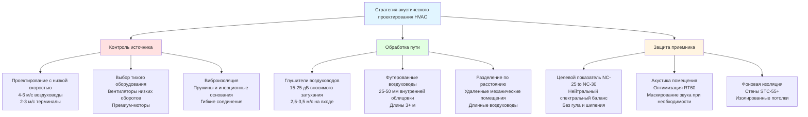

Акустическая производительность представляет собой критический параметр проектирования для систем HVAC в лекционных залах и аудиториях. Фоновый шум от механических систем напрямую влияет на разборчивость речи, концентрацию внимания аудитории и общую эффективность обучения. Надлежащее акустическое проектирование требует скоординированного внимания к генерации шума, путям передачи и характеристикам помещения-приемника.

## Критерии шума и целевые показатели критериев помещения

Шум системы HVAC в образовательных помещениях количественно определяется с помощью кривых Noise Criteria (NC) и Room Criteria (RC). Кривые NC определяют максимально допустимые уровни звукового давления в октавных полосах от 63 Гц до 8000 Гц. Кривые RC добавляют оценку спектрального баланса для выявления гула, шипения или других нежелательных качеств.

### Рекомендуемые уровни NC/RC для образовательных учреждений

| Тип помещения | Рейтинг NC | Рейтинг RC | Примечания к применению |
|------------|-----------|-----------|-------------------|
| Большой аудиторий (>500 мест) | NC-25 | RC-25(N) | Критические помещения для прослушивания |
| Средний лекционный зал (200-500 мест) | NC-30 | RC-30(N) | Стандартные учебные помещения |
| Небольшой класс (50-200 мест) | NC-30 to NC-35 | RC-30(N) to RC-35(N) | Общее обучение |
| Переговорная | NC-30 | RC-30(N) | Совместимость с видеоконференциями |
| Репетиционный класс для музыки | NC-25 | RC-25(N) | Помещения для музыкального исполнения |
| Звукозаписывающая студия | NC-15 to NC-20 | RC-15(N) to RC-20(N) | Профессиональная запись |

Обозначение (N) указывает на нейтральный спектральный баланс — без гула (доминирование низких частот) или шипения (доминирование высоких частот). Крупные аудитории требуют NC-25, чтобы фоновый шум оставался на 15-20 дБ ниже нормального уровня речи (60-65 дBA на 1 метр).

## Ограничения скорости воздуха при работе с низким уровнем шума

Скорость воздуха в воздуховодах и через концевые устройства создает аэродинамический шум. Более высокие скорости создают экспоненциально больший уровень звуковой мощности согласно:

$$L_w = L_{w0} + 50 \log_{10}\left(\frac{V}{V_0}\right)$$

где $L_w$ — уровень звуковой мощности (дБ), $V$ — скорость воздуха, $V_0$ — эталонная скорость.

### Максимальные рекомендуемые скорости воздуха

**Скорости в основных воздуховодах:**
- Подающие воздухопроводы: 6-9 м/с
- Возвратные воздухопроводы: 5-7,5 м/с
- Ответвления рядом с занятыми помещениями: 4-6 м/с

**Скорости в концевых устройствах:**
- Скорость в горловине диффузора: 2-3 м/с для NC-25
- Скорость в горловине диффузора: 2,5-4 м/с для NC-30
- Возвратные решетки: 2-2,5 м/с
- Переходные решетки: 1,5-2 м/с

Взаимосвязь между скоростью и генерируемым шумом является экспоненциальной. Удвоение скорости увеличивает звуковую мощность примерно на 15 дБ, что делает контроль скорости наиболее эффективной стратегией снижения шума.

## Контроль шума, передаваемого воздуховодом

Звук, генерируемый оборудованием обработки воздуха, распространяется через воздуховоды в занятые помещения. Стратегии затухания включают естественное затухание в воздуховодах, глушители воздуховодов и камеры-резонаторы.

### Естественное затухание в воздуховодах

Прямые прямоугольные воздуховоды обеспечивают затухание 0,1-0,3 дБ на метр на средних частотах, при большем затухании на более высоких частотах. Колена воздуховодов обеспечивают затухание 3-5 дБ. Для систем, требующих NC-25 до NC-30, естественного затухания недостаточно — необходимы спроектированные глушители.

### Выбор глушителя воздуховода

Диссипативные глушители используют баффли из стекловолокна или минеральной ваты для поглощения звуковой энергии. Вносимое затухание варьируется в зависимости от частоты:

$$IL = 1.05 \cdot P \cdot L \cdot \frac{1}{S}$$

где $IL$ — вносимое затухание (дБ), $P$ — периметр глушителя (м), $L$ — длина глушителя (м), $S$ — площадь поперечного сечения (м²).

**Рекомендации по проектированию глушителя:**
- Размещайте глушители на 10-15 диаметров воздуховода ниже по потоку от оборудования, чтобы обеспечить рассеивание турбулентности
- Выбирайте размер для скорости на входе 2,5-3,5 м/с, чтобы минимизировать самогенерируемый шум
- Задайте длину 1,5-3 м для вносимого затухания 15-25 дБ на 500 Гц
- Используйте конструкцию с двойными стенками, чтобы предотвратить прорывной шум
- Устанавливайте выше и ниже по потоку от вентиляторов при необходимости

### Камеры-резонаторы

Звуковые ловушки или камеры-резонаторы обеспечивают затухание через множественные отражения и поглощение. Надлежащим образом спроектированная камера с акустической облицовкой толщиной 10-15 см обеспечивает затухание 10-20 дБ на средних частотах.

## Контроль структурного шума

Вибрация механического оборудования передается через конструктивные соединения на элементы конструкции, создавая излучение как воздушный шум в занятых помещениях. Передача структурного шума часто преобладает на низких частотах (ниже 250 Гц), где затухание воздушного шума наиболее сложное.

**Требования к виброизоляции:**
- Приточно-вытяжные установки: пружинные изоляторы отклонения 5-7,5 см или неопреновые прокладки
- Вентиляторы: пружины отклонения 7,5-10 см для оборудования мощностью более 7,5 кВт
- Насосы: инерционные основания с пружинными изоляторами
- Трубопроводы: гибкие соединители на соединениях оборудования
- Соединения воздуховодов: тканевые гибкие соединители 20-30 см

Эффективность изоляции повышается с увеличением прогиба. Пружинный изолятор обеспечивает примерно 95% изоляцию на частотах выше $f = 3.13\sqrt{1/\delta}$, где $\delta$ — статический прогиб в сантиметрах.

## Выбор концевого устройства для тихой работы

Концевые устройства переменного расхода воздуха (VAV) создают шум от модуляции потока воздуха и снижения давления. Последовательные боксы с приводом вентилятора производят меньше шума, чем параллельные конфигурации, но потребляют больше энергии.

**Акустическая производительность по типам концевых устройств:**
- Однопроводные VAV с управлением заслонкой: NC-35 to NC-40
- Однопроводные VAV с входным конусом: NC-30 to NC-35
- VAV с приводом вентилятора (последовательные): NC-35 to NC-38
- VAV с приводом вентилятора (параллельные): NC-38 to NC-42
- Двухпроводные VAV: NC-35 to NC-40

Для помещений NC-25 to NC-30 располагайте боксы VAV за пределами аудитории в потолочных пространствах или механических помещениях. Используйте футерованные нижерасположенные воздуховоды (минимум 3-4,5 м) между концевыми устройствами и диффузорами.

## Выбор диффузора для минимизации шума

Акустическая производительность диффузора зависит от расстояния выброса, перепада давления и геометрического проектирования. Производители предоставляют данные о звуковой мощности (NC или дБ) при различных расходах воздуха.

**Стратегии низкошумного диффузора:**
- Указывайте линейные щелевые диффузоры с перепадом давления 0,2-0,3 кПа
- Используйте перфорированные диффузоры для распределенного низкоскоростного выброса
- Устанавливайте несколько маленьких диффузоров вместо нескольких крупных единиц
- Поддерживайте минимальную высоту потолка 2,4-3 м для адекватного выброса
- Избегайте высокоиндукционных диффузоров в критических акустических помещениях

Излучаемый шум от диффузора в помещение:

$$L_p = L_w - 10\log_{10}(R) + 10\log_{10}(Q)$$

где $L_p$ — уровень звукового давления, $L_w$ — звуковая мощность диффузора, $R$ — постоянная помещения, $Q$ — коэффициент направленности.

## Расположение и изоляция помещения оборудования

Физическое разделение между механическим оборудованием и акустически чувствительными помещениями обеспечивает наиболее экономичный контроль шума. Вертикальное разделение более эффективно, чем горизонтальное, из-за конструктивных разрывов в сборках пол-потолок.

**Рекомендации по расположению:**
- Располагайте механические помещения на один этаж выше или ниже аудиторий при возможности
- Поддерживайте минимальное горизонтальное разделение 9-15 м для оборудования на крыше
- Располагайте приточно-вытяжные установки над коридорами, хранилищами или туалетами — никогда не прямо над аудиториями
- Проектируйте стены механического помещения для STC-55 to STC-60
- Используйте плавающие полы или изолированные основания оборудования в верхних уровнях

**Акустическая обработка помещения оборудования:**
- Установите 5-10 см акустического поглощения на стены и потолок (минимум NRC 0,80)
- Герметизируйте все проемы акустическим герметиком
- Используйте двери из твердого материала с периметральными уплотнениями (минимум STC-45)
- Избегайте смежности механического помещения со стенами аудитории
- Установите виброизоляцию под всем напольным оборудованием

## Наладка и проверка

Акустическое тестирование после установки проверяет соответствие критериям проектирования. Измерения выполняются в соответствии со стандартами ANSI/ASA S12.2 для фонового шума в помещениях.

**Протокол тестирования:**
1. Работайте со всеми системами HVAC при расчетном расходе воздуха
2. Закройте все окна и двери
3. Измерьте уровни звукового давления в полосах 1/3 октавы в 3-5 местах
4. Рассчитайте средние кривые NC/RC помещения
5. Выявите и исправьте недостатки перед вводом в эксплуатацию

Достижение NC-25 to NC-30 в крупных аудиториях требует комплексного проектирования — низких скоростей, стратегического расположения оборудования, комплексного глушения и эффективной виброизоляции, работающих вместе как система.
