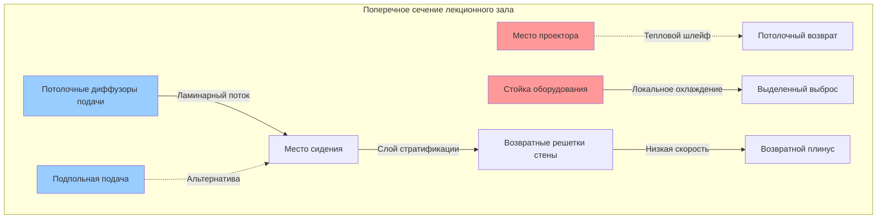
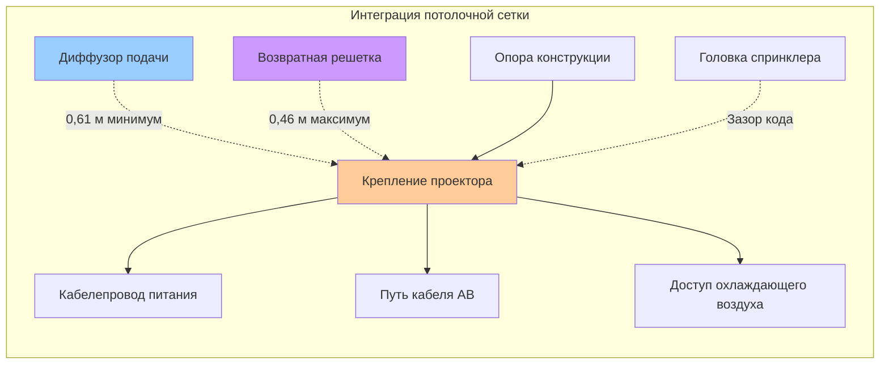

Интеграция аудиовизуального оборудования в лекционных залах и аудиториях требует тщательной координации между системами HVAC и инфраструктурой технологий. Проекционные системы, усилители, органы управления освещением и цифровые дисплеи генерируют существенные тепловые нагрузки, при этом требуя акустической изоляции и точного контроля окружающей среды. Эффективное проектирование HVAC должно решать требования по охлаждению оборудования, предотвращать помехи звуковым системам и учитывать ограничения по управлению кабелями без ущерба эффективности распределения воздуха.

## Тепловые нагрузки оборудования АВ

Аудиовизуальное оборудование вносит значительные явные тепловые приросты, которые должны быть включены в расчеты охлаждающих нагрузок.

### Нагрузки проекционных систем

Высокопроизводительные проекторы генерируют тепловые нагрузки в диапазоне от 1500 до 5000 Вт в зависимости от яркости и типа технологии.

| Тип проектора | Типовая мощность | Тепловая нагрузка | Требование охлаждения |
|----------------|----------------|-----------|---------------------|
| LED (6000 люмен) | 500–800 Вт | 1,8–2,9 кДж/ч | Стандартный воздух |
| На лампе (10000 люмен) | 1200–1800 Вт | 4,3–6,4 кДж/ч | Выделенный выброс |
| Лазер (15000+ люмен) | 1500–3000 Вт | 5,4–10,8 кДж/ч | Изолированное охлаждение |
| Цифровой кинопроектор | 3000–5000 Вт | 10,8–17,2 кДж/ч | Отдельная система |

Места установки проектора требуют либо распределения воздуха на уровне потолка для удаления тепловых шлейфов, либо выделенных вытяжных вентиляторов, подключенных к корпусам проекторов. Лампо-базированные проекторы, работающие выше 26,7 °C, испытывают сокращенный срок службы лампы и деградацию точности цветопередачи.

### Нагрузки стойки оборудования

Центральные стойки АВ оборудования, размещающие усилители, процессоры, коммутаторы и системы управления, генерируют сконцентрированные тепловые нагрузки, требующие сфокусированных стратегий охлаждения.

**Типичные тепловые нагрузки стойки:**
- Аудиоусилители: 200–800 Вт на канал (в зависимости от номинальной мощности)
- Видеопроцессоры: 150–400 Вт на блок
- Процессоры цифровых сигналов: 75–200 Вт на блок
- Сетевые коммутаторы: 50–150 Вт на блок
- Процессоры управления: 40–100 Вт на блок

Стойки оборудования, превышающие 3000 Вт (10,6 кДж/ч), выигрывают от выделенных решений охлаждения, включая внутристойковые вентиляторы, локальные охлаждающие блоки или изолированные системы вентиляции. Температура окружающей среды внутри стоек должна оставаться ниже 35 °C при относительной влажности между 30–55% для обеспечения надежной работы электроники.

## Координация HVAC с системами АВ

Механические системы должны работать без создания акустических помех или нарушения производительности оборудования АВ.

### Требования акустической изоляции

Шум HVAC, передаваемый в лекционные помещения, создает помехи разборчивости речи и производительности звуковой системы.

**Стратегии управления шумом:**
- Указать воздухообрабатывающие блоки с уровнями звуковой мощности на выходе ниже NC-25 (дБА < 35)
- Установить приглушители в воздуховодах на путях подачи и возврата в пределах 4,6 м от воздушных устройств
- Использовать акустически оцененные потолочные диффузоры с рейтингами NC, соответствующими критериям помещения (обычно NC-20 по NC-25)
- Расположить помещения механического оборудования вдали от критических зон прослушивания с минимальным разделением STC-60
- Применить виброизоляцию для всего вращающегося оборудования для предотвращения передачи шума через конструкцию

Проектирование воздуховодов с низкой скоростью (максимум 6,1 м/с в магистралях, 3,0 м/с на окончаниях) минимизирует турбулентный шум потока. Круглые воздуховоды производят на 3–5 дБ меньше шума, чем прямоугольные воздуховоды эквивалентной площади.

### Координация распределения подаваемого воздуха

Распределение воздуха должно избегать направления потока воздуха через микрофоны, проекционные пути или массивы громкоговорителей звуковой системы.

Системы вентиляции вытеснением, подающие воздух при температуре 18–20 °C через потолочные или низкие настенные диффузоры, обеспечивают акустические преимущества через сниженные скорости воздуха, при этом приспосабливаясь к путям прокладки кабелей. Оборудование, установленное на потолке, выигрывает от путей возврата воздуха на потолке, которые естественным образом захватывают тепловые шлейфы.

## Вентиляция помещения оборудования

Выделенные помещения оборудования АВ и проекционные кабины требуют независимых систем вентиляции.

### Параметры проектирования

Охлаждение помещения оборудования должно адресовать как установившиеся тепловые нагрузки, так и пиковые условия эксплуатации во время мероприятий.

**Критерии проектирования вентиляции:**
- Поддерживать температуру помещения: 20–24 °C
- Относительная влажность: 30–55% ОВ
- Воздухообмены: минимум 15–20 ACH
- Мощность выброса: 110% рассчитанной тепловой нагрузки оборудования
- Резервная вентиляция: аккумуляторная вытяжка для критических систем

Тепловые нагрузки должны учитывать одновременную работу всего установленного оборудования при максимальном потреблении мощности, не среднего использования. Спецификации производителей оборудования по тепловым характеристикам предоставляют максимальные рабочие температуры и требуемые расходы воздуха.

### Варианты системы охлаждения

Несколько подходов решают проблему теплового контроля помещения оборудования:

**Система кондиционирования воздуха типа сплит-система:** Обеспечивает точный температурный контроль со звукоизолированными наружными конденсаторными установками. Типовые диапазоны мощности составляют от 3,4–13,6 кВт для стандартных помещений оборудования.

**Выделенный выброс с подпиткой воздуха:** Экономичное решение с использованием вытяжных вентиляторов для удаления горячего воздуха с пассивной или механически подаваемой подпиткой воздуха. Требует кондиционированного подпиточного воздуха в климатических условиях отопления.

**Внутристойковые охлаждающие блоки:** Автономные охлаждающие модули, установленные внутри стоек оборудования, обеспечивают целевое охлаждение для высокоплотных установок, превышающих 5 кВт на стойку.

## Интеграция управления кабелями

Пути HVAC должны приспосабливаться к обширной прокладке кабелей АВ при сохранении противопожарного разделения.

### Совместимость с плинусом

Кабели АВ, проложенные через возвратные воздушные плинусы, требуют кабелей, оцененных для плинуса (рейтинг CMP или FT6), соответствующих стандартам горючести NFPA 90A. Пучки кабелей, занимающие более 15% площади поперечного сечения плинуса, ограничивают поток воздуха и требуют альтернативной прокладки.

**Стратегии управления кабелями:**
- Выделенные кабельные лотки, изолированные от воздуховодов HVAC
- Подпольные пути кабелей с поднимаемыми полами с доступом
- Системы настенного монтажа, обходящие пространства потолочного плинуса
- Уплотнения проходки, оцененные по пожарам, во всех границах путей кабелей

### Соединения проектора

Потолочные проекторы требуют координации кабелей питания, видео и управления с диффузорами подачи воздуха и возвратными решетками.

Поддерживайте минимум 0,61 м разделения между диффузорами подачи воздуха и входами проектора для предотвращения холодного воздуха от нарушения систем теплового управления проектора. Позиционируйте решетки возврата воздуха в пределах 0,46 м от портов выхлопа проектора для эффективного захвата тепла отходов.

## Координация системы освещения

Театральное освещение и органы управления архитектурным освещением генерируют тепловые нагрузки и требуют охлаждения помещения диммера.

### Вентиляция помещения диммера

Стойки диммеров освещения преобразуют 2–5% управляемой мощности в отходное тепло, требующее удаления. Система освещения мощностью 100 кВт генерирует приблизительно 2000–5000 Вт (7,1–17,6 кДж/ч) тепла в оборудовании диммера.

Помещения диммеров требуют:
- Выделенной вытяжной вентиляции на уровне минимум 1,7 м³/ч (1 CFM) на Вт подключенной нагрузки
- Максимальная температура окружающей среды: 40 °C (зависит от производителя)
- Прямой выброс наружного воздуха, избегающий рециркуляции в занятые помещения
- Фильтрация входного воздуха для предотвращения накопления пыли на электронных компонентах

### Рассмотрение светодиодного освещения

Современные системы светодиодного освещения снижают тепловые нагрузки на 60–80% в сравнении с лампами накаливания, при этом сосредотачивая тепло в местах расположения драйверов/дросселей. Драйверы светодиодов требуют температуры окружающей среды ниже 50 °C для номинального срока службы, обычно достигаемые через общее кондиционирование помещения, а не выделенное охлаждение.

## Лучшие практики интеграции системы

Успешная координация HVAC-АВ требует ранней совместной работы и постоянного общения.

**Координация на этапе проектирования:**
- Включить консультанта АВ в обзоры проектирования HVAC
- Выявить местоположение оборудования и тепловые нагрузки во время схемного проектирования
- Координировать макеты потолка, показывающие все системы перед конструкционными документами
- Указать акустические критерии для всего механического оборудования
- Планировать пути прокладки кабелей, избегая конфликтов с воздуховодами и трубопроводами

**Требования на этапе строительства:**
- Проверить фактические тепловые нагрузки оборудования против предположений проектирования
- Протестировать уровни шума HVAC перед вводом в эксплуатацию системы АВ
- Координировать последовательности запуска для предотвращения одновременной работы с высокой нагрузкой
- Задокументировать результаты балансировки воздуха в помещениях оборудования

Интерактивный характер современных лекционных залов требует систем HVAC, которые поддерживают инфраструктуру технологий при сохранении акустической производительности и теплового комфорта. Правильная интеграция обеспечивает надежную работу систем АВ и оптимальные учебные среды.
