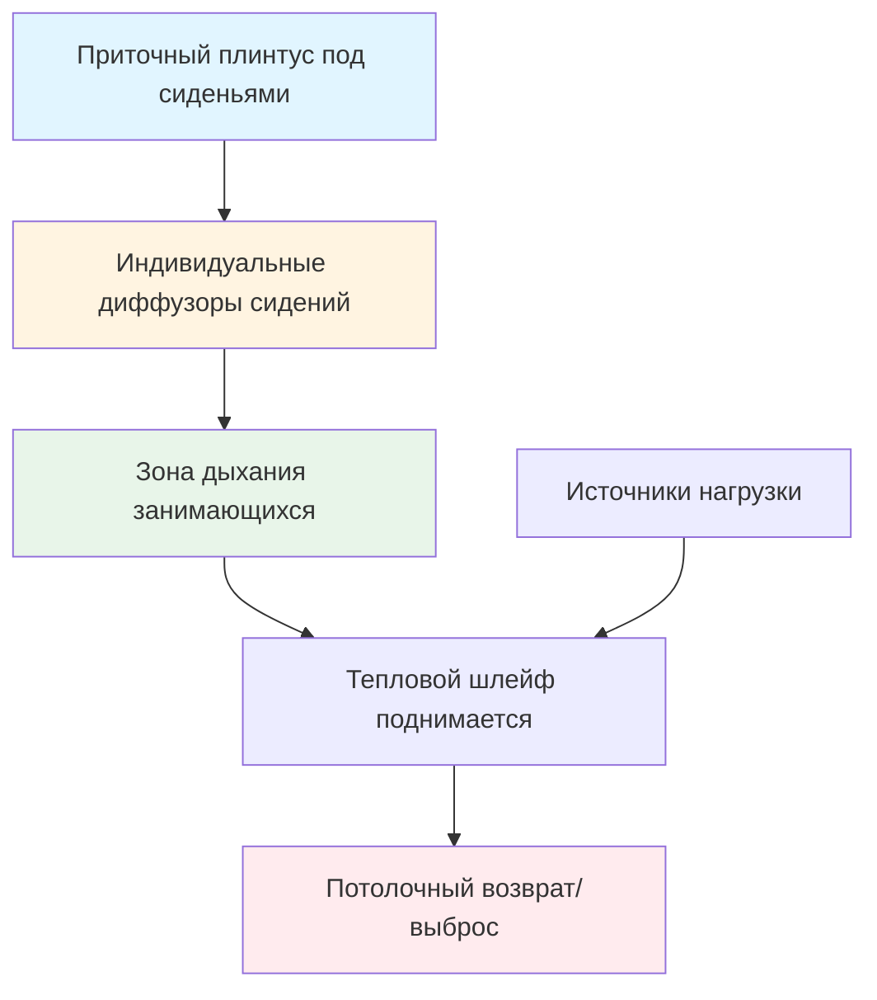
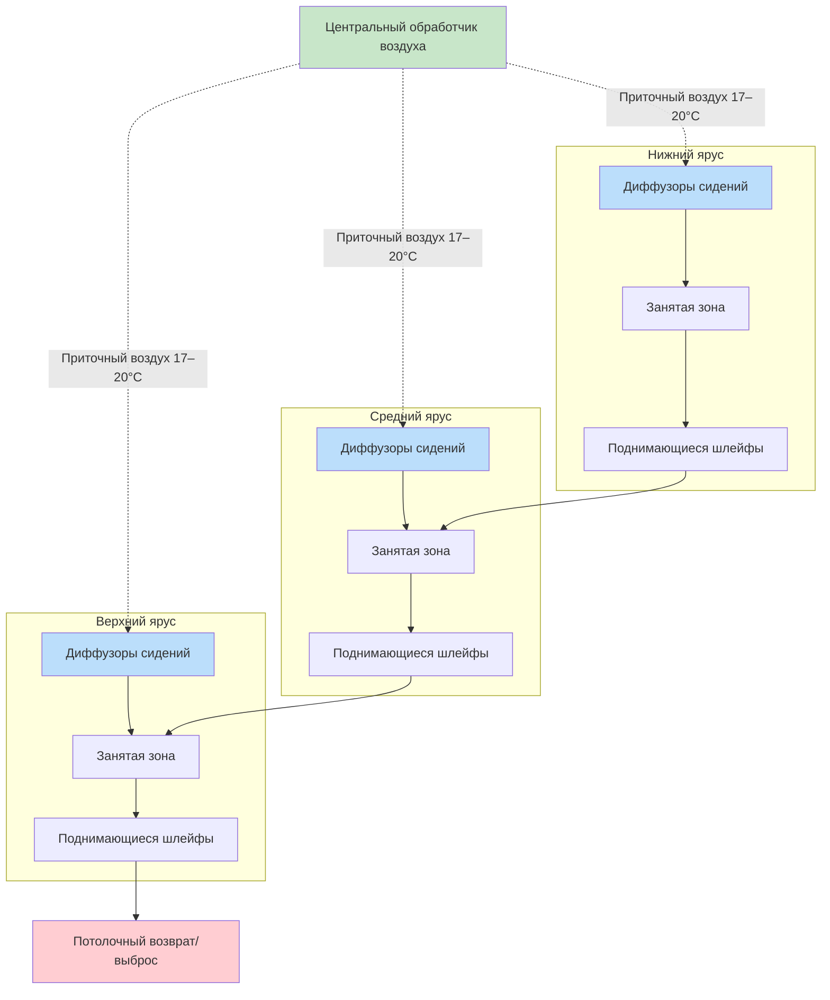

## Обзор

Амфитеатры и лекционные залы представляют уникальные задачи вентиляции из-за вертикальной стратификации, изменяющейся плотности занятости и акустических ограничений. Эффективные системы вентиляции должны доставлять кондиционированный воздух равномерно на несколько уровней высоты с сохранением теплового комфорта, качества воздуха в помещении и низкого уровня шума. Продвинутые стратегии распределения воздуха — включая подпольные системы, доставку через сиденья и вытеснительную вентиляцию — решают эти задачи посредством принципов физического проектирования.

## Стратегии распределения воздуха в амфитеатрах

### Подпольное распределение воздуха (UFAD)

Подпольное распределение воздуха использует естественную плавучесть теплого воздуха для создания зон вертикальной стратификации. Приточный воздух поступает в занятую зону на уровне пола через диффузоры, встроенные в перемычки или опоры сидений, поднимаясь через пространство по мере нагрева от людей и оборудования.

**Ключевые параметры проектирования:**

| Параметр | Типовое значение | Примечания |
|-----------|---------------|-------|
| Температура приточного воздуха | 17–20°C | Выше, чем в традиционных системах |
| Скорость приточного воздуха | 0,15–0,25 м/с | Низкая скорость на выходе диффузора |
| Давление в плинтусе | 25–75 Па | Обеспечивает равномерное распределение |
| Высота стратификации | 1,8–2,4 м над полом | Граница занятой зоны |

**Преимущества:**
- Улучшенная эффективность вентиляции (1,2–1,4 вместо 1,0 для потолочного смешивания)
- Снижение нагрузок охлаждения из-за стратификации
- Индивидуальное управление диффузорами в местах сидений
- Сокращение воздуховодов в потолочном плинтусе
- Снижение энергопотребления вентиляторов

**Проектные соображения:**
- Требования к глубине подпольного плинтуса (минимум 30–45 см)
- Герметичная конструкция подпола для поддержания давления
- Координация с несущими конструкциями и инженерными сетями
- Управление конденсацией во влажном климате

### Доставка воздуха через сиденья

Системы с доставкой через сиденья интегрируют диффузоры приточного воздуха непосредственно в конструкции сидений, обеспечивая персонализированную вентиляцию в зоне дыхания. Этот подход максимизирует эффективность вентиляции путем доставки свежего воздуха непосредственно туда, где люди его нуждаются.

**Методы реализации:**

1. **Встроенные диффузоры сидений**: Низкоскоростные выходы воздуха в спинках или подлокотниках сидений
2. **Спиральные диффузоры**: Вращающиеся схемы диффузоров для улучшенного смешивания в зоне дыхания
3. **Персональные воздушные сопла**: Регулируемые направленные выходы для индивидуального управления

**Типовые характеристики:**
- Расход воздуха: 4,7–9,4 м³/ч на человека (10–20 CFM на человека)
- Температура приточного воздуха: 18–21°C
- Критерий шума: NC-25 до NC-30 в местоположении сидения
- Скорость воздуха на выходе диффузора: <0,76 м/с для предотвращения ощущения сквозняка

### Применение вытеснительной вентиляции

Вытеснительная вентиляция использует тепловую плавучесть для создания вертикального движения воздуха от пола к потолку. Прохладный приточный воздух (17–20°C) поступает с низкой скоростью около пола, распространяется горизонтально и поднимается через занятую зону, поглощая тепло от людей и оборудования.

**Физические принципы:**

Число Архимеда (Ar) управляет режимами потока вытеснительной вентиляции:

Ar = (gβΔTH) / u₀²

Где:
- g = ускорение свободного падения (9,81 м/с²)
- β = коэффициент теплового расширения (1/T_абс)
- ΔT = разность температур между приточным и комнатным воздухом
- H = характерная высота
- u₀ = скорость приточного воздуха

Для эффективного вытеснения: Ar > 10

**Соображения для амфитеатров:**

**Требования к проектированию вытеснения:**
- Минимальная высота потолка: 3–3,6 м для развития стратификации
- Размещение диффузоров приточного воздуха на каждом уровне ярусов
- Низкие скорости приточного воздуха: <0,25 м/с на выходе диффузора
- Разность температур: 2,8–5°C между приточным и комнатным воздухом
- Места вытяжки выше интерфейса стратификации (высота 2,4–3 м)

## Одинаковость комфорта по ярусам высоты

Температурная стратификация в амфитеатрах создает вертикальные градиенты, которые могут нарушить одинаковость комфорта. Надлежащее проектирование системы должно учитывать:

**Управление вертикальным градиентом температуры:**

| Разность высот | Приемлемый градиент | Максимальный градиент |
|---------------------|---------------------|------------------|
| 0–1,8 м (занятая зона) | 1,7°C | 2,8°C |
| 1,8–3,6 м (зона стратификации) | 2,8–3,9°C | 5°C |
| Выше 3,6 м (зона выброса) | Неограниченный | Н/П |

**Стратегии обеспечения одинакового комфорта:**

1. **Зонированная доставка воздуха**: Независимый приток на каждый уровень ярусов с выделенными диффузорами
2. **Балансировка расходов**: Более высокие расходы приточного воздуха на верхние ярусы для компенсации поднимающегося тепла
3. **Управление сбросом температуры**: Модуляция температуры приточного воздуха на основе датчиков, специфичных для ярусов
4. **Смешанные системы**: Комбинирование вытеснительной вентиляции с дополнительным потолочным смешиванием для пиковых нагрузок

**Взаимодействие тепловых шлейфов:**

В плотно занятых амфитеатрах тепловые шлейфы от нижних ярусов взаимодействуют с людьми на верхних ярусах. Количество приточного воздуха должно учитывать кумулятивные тепловые нагрузки:

Q_ярус(n) = Q_база + Σ(Q_шлейф от ярусов 1 к n-1)

Где Q_база представляет местную явную нагрузку для яруса n.

## Интеграция системы и управление

**Стратегии управления для амфитеатров:**

- **Вентиляция по потребности**: Мониторинг CO₂ на нескольких уровнях ярусов регулирует приток наружного воздуха
- **Датчики занятости**: Инфракрасные или переключатели сидений позволяют модуляцию приточного воздуха, специфичную для зоны
- **Последовательности предварительного охлаждения**: Циклы промывки перед занятостью снижают начальные нагрузки охлаждения
- **Управление переменным объемом**: VAV терминальные блоки на каждом ярусе поддерживают уставку с минимальным наружным воздухом

**Акустические характеристики:**

Низкоскоростное распределение воздуха необходимо для разборчивости речи:
- Рейтинг NC диффузора: максимум NC-25 во время занятости
- Звукоглушители воздуховодов на ответвлениях к каждому ярусу
- Виброизоляция оборудования обработки воздуха
- Проектирование воздуховода с низкой скоростью: <7,6 м/с в занятых пространствах

## Визуализация картины воздушного потока

## Заключение

Вентиляция амфитеатров требует тщательной интеграции стратегии распределения воздуха с архитектурной геометрией и схемами занятости. Подпольное распределение воздуха, доставка через сиденья и вытеснительная вентиляция обеспечивают превосходные характеристики в сравнении с традиционными системами потолочного смешивания при надлежащем проектировании для эффектов вертикальной стратификации. Достижение одинакового комфорта по ярусам высоты требует зонированной доставки воздуха, управления тепловыми шлейфами и чутких стратегий управления, которые адаптируются к переменным условиям занятости.

---

*Эффективная вентиляция амфитеатров уравновешивает термодинамические принципы с практическими ограничениями акустики, архитектуры и ожиданий занимающихся, чтобы обеспечить стабильный комфорт по всему помещению.*
