Автономные климатические установки являются основным решением для управления климатом в мобильных учебных помещениях благодаря компактной конструкции, заводской сборке и упрощённым требованиям к установке. Эти комплектные системы интегрируют все компоненты холодильной машины, воздухораспределительное оборудование и системы управления в одном корпусе, исключая необходимость в раздельных системах с отдельными внутренними и наружными блоками.

## Компактные кровельные установки

Кровельные компактные установки представляют наиболее распространённую конфигурацию для мобильных учебных помещений. Эти установки монтируются непосредственно на кровельную конструкцию через адаптер-опору, распределяя кондиционируемый воздух по коротким воздуховодам к диффузорам класса. Типичные мощности охлаждения варьируются от 10,5 до 26,4 кВ для стандартных мобильных классов размерами 7,3 м на 12,2 м.

Требуемая мощность охлаждения рассчитывается на основе отношения явного тепла:

$$Q_{total} = \frac{Q_{sensible}}{SHR}$$

где $Q_{sensible}$ включает прирост тепла от занятых мест, освещения, ограждающих конструкций и солнечной радиации, а $SHR$ обычно находится в диапазоне от 0,75 до 0,85 для применения в учебных классах.

Кровельные установки обладают преимуществами, включая сохранение пространства на уровне земли, снижение воздействия вандализма и звуковую изоляцию от занятых помещений. Однако они создают нагрузки на конструкцию, требующие адекватного каркаса крыши, и образуют потенциальные точки утечки, требующие надлежащего оклада и установки опоры.

## Настенные сквозьстеновые установки

Настенные компактные терминальные установки (КТУ) предоставляют альтернативу для мобильных учебных помещений, где нагрузки на крышу создают проблемы или применение на существующих зданиях требует минимальной структурной переделки. Эти установки монтируются через отверстия во внешних стенах, обычно в мощностях от 10,5 до 17,6 кВ.

Конфигурации со сквозьстеновым размещением минимизируют требования к воздуховодам и упрощают процедуры замены. Сниженная высота установки улучшает доступность обслуживания по сравнению с кровельной установкой. Недостатки включают вторжение в учебное пространство, повышенные уровни шума в занятых помещениях и ограниченную применимость для крупных мобильных конфигураций классов.

## Одноблочное и многоблочное управление

**Одноблочные системы**

Большинство мобильных учебных помещений используют одноблочные компактные установки, обслуживающие всё пространство класса. Один терморегулятор управляет установкой, обеспечивая единообразные уставки температуры по всей занятой площади. Эта конфигурация обеспечивает простоту, низкие первоначальные затраты и простые процедуры обслуживания.

**Возможности многоблочного управления**

Большие мобильные учебные здания или здания с чётко выделенными функциональными зонами могут использовать многоблочные компактные установки. Эти системы включают несколько зональных заслонок и термостатов, что позволяет независимо управлять температурой в разных помещениях. Применение включает мобильные здания с отдельными кабинетами, хранилищами или несколькими классами под одной конструкцией.

Многоблочные системы требуют более сложных последовательностей управления и дополнительного воздухораспределительного оборудования. Положения зональных заслонок модулируются на основе спроса отдельной зоны:

$$CFM_{zone} = CFM_{total} \times \frac{Q_{zone}}{\sum Q_{zones}}$$

## Конфигурации с тепловыми насосами в сравнении с газо-электрическими

**Системы с тепловыми насосами**

Воздушные тепловые насосы обеспечивают как охлаждение, так и отопление через обращение цикла хладагента. Эти установки обеспечивают преимущества энергоэффективности в умеренных климатах, где число градусо-дней отопления остаётся ниже 4000 в год. Производительность теплового насоса снижается при наружных температурах ниже 0°C, требуя вспомогательного электрического сопротивления для увеличения мощности.

Показатели эффективности теплового насоса включают:
- SEER (сезонный коэффициент энергоэффективности охлаждения): типичный диапазон 14-18
- EER (коэффициент энергоэффективности): типичный диапазон 11-13
- HSPF (сезонный коэффициент производительности отопления): типичный диапазон 8,2-10

**Газо-электрические конфигурации**

Компактные газо-электрические установки включают газовые секции отопления с электрическим приводом охлаждения. Эта конфигурация подходит для применения в холодном климате, где доступность природного газа или пропана обеспечивает экономичное отопление. Газовые секции отопления достигают тепловой эффективности 80% для установок стандартной эффективности и до 95% для конденсационных моделей.

Электрическое сопротивление отопления представляет самый простой и наименее дорогой вариант, но имеет наибольшие эксплуатационные расходы. Эта конфигурация применяется в мягких климатах с минимальными требованиями к отоплению или в местах без инфраструктуры природного газа.

```mermaid
graph TB
    A[Автономная компактная установка] --> B[Секция наружного воздуха]
    A --> C[Секция фильтрации]
    A --> D[Секция охлаждения]
    A --> E[Секция отопления]
    A --> F[Вентиляторная секция]
    A --> G[Секция управления]

    B --> B1[Заслонки экономайзера]
    B --> B2[Забор свежего воздуха]

    C --> C1[Фильтровальная кассета]
    C --> C2[Фильтры MERV 8-13]

    D --> D1[Прямой испаритель]
    D --> D2[Компрессор]
    D --> D3[Конденсатор]

    E --> E1[Коил теплового насоса]
    E --> E2[Газовая печь]
    E --> E3[Электрическое сопротивление]

    F --> F1[Вентилятор подачи]
    F --> F2[Привод с переменной скоростью]

    G --> G1[Интерфейс термостата]
    G --> G2[Системы безопасности]
    G --> G3[Управление экономайзером]

    style A fill:#2563eb,color:#fff
    style D fill:#dc2626,color:#fff
    style E fill:#ea580c,color:#fff
    style F fill:#16a34a,color:#fff
```

## Требования экономайзера и его интеграция

California Title 24 и ASHRAE 90.1 предусматривают воздушные экономайзеры для компактных установок, превышающих определённые пороги мощности охлаждения (обычно 15,8 кВ в Калифорнии). Системы экономайзера используют наружный воздух для "бесплатного охлаждения" когда наружные условия позволяют, сокращая работу компрессора и потребление энергии.

Стратегии управления экономайзером включают:
- Дифференциальное управление по температуре воздуха
- Дифференциальное управление по энтальпии
- Фиксированное управление по температуре воздуха с ограничением по верхнему пределу

Заслонка экономайзера модулируется в зависимости от соотношения спроса на охлаждение:

$$Q_{economizer} = 1.08 \times CFM \times \Delta T$$

где $\Delta T$ представляет разность температур между наружным воздухом и уставкой помещения.

## Соображения доступности при техническом обслуживании

Климатические установки для мобильных учебных помещений требуют доступных панелей обслуживания для замены фильтров, очистки теплообменников и техническому обслуживанию компонентов. Кровельные установки требуют безопасного доступа на крышу через стационарные лестницы или морские лестницы, соответствующие требованиям OSHA. Требования по защите от падений применяются, когда высота крыши превышает 1,8 м.

Зазоры обслуживания должны предоставлять:
- Минимум 76 см на сторонах управления и обслуживания
- Минимум 61 см со всех остальных сторон
- Адекватная высота для доступа техника (минимум 2 м)

Замена фильтра представляет наиболее частое мероприятие обслуживания, происходящее ежемесячно или ежеквартально в зависимости от экологических условий. Доступные фильтровальные кассеты со съёмными панелями без инструментов упрощают эту рутинную задачу, снижая затраты на работы по обслуживанию.

## Стандарты энергоэффективности

Федеральные стандарты эффективности и региональные энергетические нормы устанавливают минимальные требования к производительности компактных климатических установок. Текущие федеральные минимумы по состоянию на 2023 год включают:

| Тип оборудования | Мощность охлаждения | Минимум SEER | Минимум EER | Минимум HSPF |
|---|---|---|---|---|
| Тепловой насос, одна упаковка | <18,4 кВ | 14,0 | 11,0 | 8,0 |
| Тепловой насос, одна упаковка | ≥18,4 кВ | 14,0 | 11,0 | 8,0 |
| Газо-электрическая установка | <18,4 кВ | 14,0 | 11,0 | N/A |
| Газо-электрическая установка | ≥18,4 кВ | 11,2 EER | 11,0 | N/A |

Установки с повышенной эффективностью обеспечивают экономию эксплуатационных затрат на протяжении жизненного цикла оборудования. Энергетическое моделирование должно оценивать период окупаемости оборудования повышенной эффективности на основе местных тарифов на коммунальные услуги и годовых часов работы.

## Сравнение типов автономных установок

| Тип установки | Диапазон мощности | Место установки | Воздействие шума | Доступность обслуживания | Климатическое применение | Типичная эффективность |
|---|---|---|---|---|---|---|
| Компактная кровельная тепловой насос | 10,5-26,4 кВ | На крыше с опорой | Низкое (изолировано от помещения) | Требуется доступ на крышу | Умеренный климат | SEER 14-16, HSPF 8,2-9,0 |
| Компактная кровельная газо-электрическая | 10,5-26,4 кВ | На крыше с опорой | Низкое (изолировано от помещения) | Требуется доступ на крышу | Холодный климат | SEER 14-15, 80-95% AFUE |
| Настенная тепловой насос | 10,5-17,6 кВ | Сквозьстеновое отверстие | Умеренное до высокого | Доступ уровня земли | Умеренный климат | SEER 13-15, HSPF 7,7-8,5 |
| Настенная газо-электрическая | 10,5-17,6 кВ | Сквозьстеновое отверстие | Умеренное до высокого | Доступ уровня земли | Холодный климат | SEER 13-14, 80% AFUE |
| Высокоэффективная кровельная тепловой насос | 10,5-26,4 кВ | На крыше с опорой | Низкое (изолировано от помещения) | Требуется доступ на крышу | Любой климат | SEER 16-18, HSPF 9,0-10,0 |

Критерии выбора должны учитывать климатические условия, затраты на коммунальные услуги, структурную ёмкость, чувствительность к шуму и анализ затрат на жизненный цикл. Современные компрессоры с переменной производительностью и электронно-коммутируемые двигатели улучшают эффективность при частичной нагрузке, учитывая переменные режимы занятости, типичные для образовательных учреждений.

Надлежащий расчёт размера оборудования остаётся критически важным — завышенные установки вызывают короткие циклы, снижая эффективность осушения и комфорт занятых мест при увеличении потребления энергии. Расчёты нагрузок в соответствии с методологией ACCA Manual J обеспечивают выбор надлежащей мощности для применения в мобильных учебных помещениях.
