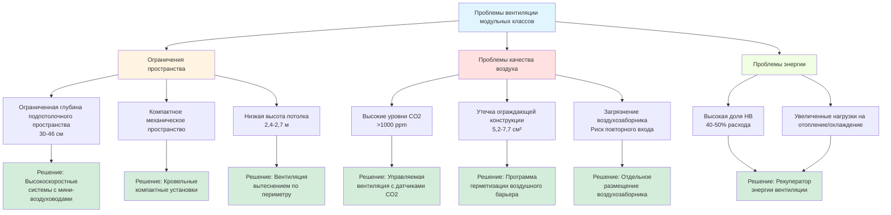

Модульные классы создают уникальные проблемы вентиляции, существенно отличающиеся от постоянных школьных зданий. Эти модульные структуры должны соответствовать тем же стандартам качества воздуха в помещении, при этом столкнувшись с ограничениями пространства, ограничениями конструкции и более высокой плотностью занятости относительно мощности механической системы.

## Требования ASHRAE 62.1 в ограниченном пространстве

Соответствие требованиям вентиляции ASHRAE 62.1 в модульных классах требует тщательного проектирования системы в условиях серьёзного пространственного ограничения. Стандарт предписывает нормы вентиляции наружным воздухом в зависимости от площади пола и численности людей:

$$V_{oz} = R_p \cdot P_z + R_a \cdot A_z$$

Где:
- $V_{oz}$ = требуемый наружный воздух для зоны (м³/ч)
- $R_p$ = 4,7 м³/(ч·чел) для классов (возраст 9+)
- $P_z$ = численность в зоне (обычно 25-35 учащихся)
- $R_a$ = 1,29 м³/(ч·м²) для классов
- $A_z$ = площадь пола зоны (обычно 74-89 м²)

Для стандартного модульного класса 7,3 м × 12,2 м (89 м²) с 30 учащимися:

$$V_{oz} = (4,7 \times 30) + (1,29 \times 89) = 141 + 115 = 256 \text{ м}^3\text{/ч}$$

Это требуемое количество наружного воздуха часто превышает 40% от общего расхода воздуха системы в модульных классах, создавая значительные трудности для подбора оборудования, энергопотребления и размещения оборудования в ограниченных механических пространствах.

## Соображения по размещению воздухозаборника

Местоположение воздухозаборника наружного воздуха критически влияет на производительность системы и качество воздуха в помещении. Модульные классы сталкиваются с несколькими ограничениями размещения:

**Ограничения по высоте**: Воздухозаборники следует располагать на минимальной высоте 2,4 м от земли, чтобы избежать загрязнений на уровне земли, пыли и выхлопов автотранспорта. Многие модули имеют общую высоту всего 3,6-4,3 м, что ограничивает варианты размещения.

**Близость к выходам**: Соблюдайте минимальное расстояние 3 м между воздухозабором наружного воздуха и выходными отверстиями. Компактный характер модульных установок часто затрудняет это разделение, создавая риск повторного входа воздуха выхлопа.

**Учёт преобладающего ветра**: Располагайте воздухозаборники в стороне от преобладающих ветров, несущих пыль со спортплощадок, выбросы автостоянок или выхлопы прилегающих зданий.

**Доступность для обслуживания**: Воздухозабирающие жалюзи и фильтры требуют регулярной чистки и замены. Размещение на крыше или на высоких боковых стенах затрудняет доступ для обслуживания.

Большинство модульных классов используют кровельные компактные установки с интегрированными воздухозабирающими устройствами, что снижает загрязнение на уровне земли, но повышает уязвимость к инфильтрации влаги и требует качественного управления заслонками, чтобы предотвратить чрезмерный забор наружного воздуха в периоды неиспользования.

## Утечки воздуха через ограждающую конструкцию в модульном строительстве

Модульное строительство создаёт врождённые пути утечки воздуха, которые снижают эффективность вентиляции:

**Швы соединения модулей**: Соединение между заводскими модулями создаёт непрерывные пути утечки по всей длине здания. Эти швы обычно демонстрируют скорость утечки воздуха в 3-5 раз выше, чем обычная конструкция.

**Установка окон и дверей**: Окна и двери, устанавливаемые на месте в модульных классах, часто не обладают качеством установки на стройплощадке, с расходом утечки воздуха 0,12-0,19 м³/(ч·м²) при 75 Па в сравнении с 0,05-0,07 м³/(ч·м²) для качественных постоянных установок.

**Проникновения через пол**: Проникновения инженерных систем через узел пола для электроснабжения, водопровода и соединений HVAC часто не имеют надлежащей герметизации воздуха.

Чрезмерная инфильтрация создаёт множество проблем:
- Снижает эффективность подачи вентилируемого воздуха
- Увеличивает нагрузки на отопление и охлаждение
- Создаёт риск конденсации влаги в полостях стен
- Обходит фильтрацию, вводя нефильтрованный наружный воздух

Испытания модульных классов выявляют эффективную площадь утечки воздуха 5,2-7,7 см² в сравнении с 2,6-3,9 см² для сравнимых постоянных классов, что указывает на скорость инфильтрации на 50-100% выше.

## Уровни CO2 и проблемы плотности занятости

Модульные классы обычно имеют более высокую плотность занятости, чем постоянные классы, из-за меньшей площади пола на одного учащегося. Эта концентрация интенсифицирует накопление CO2:

$$\text{Скорость образования CO2} = N \cdot V_{CO2}$$

Где:
- $N$ = число людей (30 учащихся + 1 учитель)
- $V_{CO2}$ = производство CO2 на одного человека (0,14 м³/ч для малоподвижной деятельности)

Общее производство: $31 \times 0,14 = 4,3$ м³/ч CO2

Концентрация CO2 в установившемся режиме может быть оценена как:

$$C_i = C_o + \frac{N \cdot V_{CO2}}{V_{oa} \cdot E}$$

Где:
- $C_i$ = концентрация CO2 в помещении (ppm)
- $C_o$ = концентрация CO2 снаружи (обычно 400-450 ppm)
- $V_{oa}$ = норма вентиляции наружным воздухом (м³/ч)
- $E$ = эффективность вентиляции (0,8-1,0)

Для предыдущего примера с 256 м³/ч наружного воздуха и эффективностью 0,9:

$$C_i = 420 + \frac{4,3 \times 10^6}{256 \times 0,9} = 420 + 18,665 = 19,085 \text{ ppm эквивалент}$$

Это превышает рекомендуемый максимум в 1000 ppm, указывая на потенциальную недостаточность вентиляции несмотря на соответствие предписывающим требованиям ASHRAE 62.1.

## Ограничения воздуховодов в помещениях с низким потолком

Модульные классы обычно имеют высоту готового потолка 2,4-2,7 м с только 30-46 см подпотолочного пространства, что серьёзно ограничивает проектирование воздуховодов:

**Размер приточного воздуховода**: Ограничения скорости 4,1-5,1 м/с для контроля шума требуют больших размеров воздуховодов, которые часто не помещаются в доступную глубину подпотолочного пространства. Это вынуждает использовать меньшие воздуховоды с более высокими скоростями (6,1-7,6 м/с), увеличивая уровни шума и потери давления.

**Пути возвращаемого воздуха**: Многие модули используют возврат через подпотолочное пространство из-за недостаточного места для воздуховодов возвращаемого воздуха. Этот подход обеспечивает плохое распределение воздуха и позволяет некондиционированному воздуху из полостей стен и потолка смешиваться с возвращаемым воздухом.

**Выбор воздухораспределителей**: Низкая высота потолка ограничивает дальность выброса и эффективность смешивания воздухораспределителей. Стандартные четырёхходовые потолочные воздухораспределители, разработанные для потолков 2,7 м, создают чрезмерные сквозняки в помещениях с потолками 2,4 м.

## Варианты рекуперации энергии для модульных установок

Рекуперация энергии может снизить значительный штраф энергоэффективности от высокого расхода наружного воздуха в модульных классах:

**Роторные теплообменники**: Колёса диаметром 61-76 см могут вмещаться в корпусы кровельных установок, обеспечивая 60-75% эффективность общей рекуперации энергии. Они требуют заводской интеграции или значительной доработки на месте.

**Пластинчатые теплообменники**: Противоточные пластинчатые теплообменники обеспечивают 50-60% чувствительной рекуперации с минимальными требованиями к обслуживанию. Конструкции с неподвижными пластинами более подходят для модульных приложений, чем ротационное оборудование.

**Замкнутые циркуляционные контуры**: Циркуляционные контуры с гликолем позволяют разделённое размещение воздухозаборника и выхода, приспосабливаясь к геометрии модульных установок. Эффективность обычно достигает 45-55%.

**Экономические соображения**: Периоды окупаемости рекуперации энергии 3-5 лет достижимы в климатах с градусо-днями отопления >2,222 или градусо-днями охлаждения >1,111. Высокая доля наружного воздуха в модульных классах улучшает экономику по сравнению с традиционными зданиями.

## Сравнение стратегий вентиляции

| Стратегия | Подача НВ | Энергоэффективность | Стоимость установки | Обслуживание | Требуемое пространство | Контроль CO2 |
|----------|---------------------|-------------------|-------------------|-------------|----------------|-------------|
| **Стандартная кровельная установка с фиксированной заслонкой НВ** | 226-283 м³/ч | Низкая (без рекуперации) | $$ | Низкое | Минимальное | Плохой (фиксированный расход) |
| **Кровельная установка с экономайзером** | 226-283 м³/ч минимум | Умеренное (бесплатное охлаждение) | $$ | Умеренное | Минимальное | Плохой (фиксированный минимум) |
| **Кровельная установка с управлением по CO2** | 170-340 м³/ч переменный | Умеренное | $$$ | Умеренное | Минимальное | Отличный |
| **Кровельная установка с роторным теплообменником** | 226-283 м³/ч | Высокая (60-75% рекуперация) | $$$$ | Высокое | Умеренное | Хороший |
| **Отдельная установка НВ + сплит-система** | 226-283 м³/ч | Высокая (с рекуперацией) | $$$$$ | Умеренное | Значительное | Отличный |
| **Система вентиляции вытеснением** | 226-283 м³/ч | Умеренное | $$$$ | Низкое | Высокое | Очень хороший |

**Шкала стоимости**: $ = <88,000 ₽ | $$ = 88,000-176,000 ₽ | $$$ = 176,000-294,000 ₽ | $$$$ = 294,000-441,000 ₽ | $$$$$ = >441,000 ₽

## Рекомендации по внедрению

Эффективная вентиляция модульного класса требует интегрированных подходов к проектированию:

1. **Задавайте минимальные требования производительности вентиляции** в документах закупки, включая ограничения концентрации CO2 (<1000 ppm) и проверку подачи наружного воздуха
2. **Проводите комиссионирование воздушного барьера** для герметизации швов соединения, проникновений и разрывов ограждающей конструкции, нацеливаясь на <0,03 м³/(ч·м²) при 75 Па
3. **Установите мониторинг CO2** в каждом модульном классе с логированием данных для проверки достаточности вентиляции и поддержки управляемой вентиляции
4. **Внедрите рекуперацию энергии** для всех новых модульных установок в климатах с >1,667 HDD или >833 CDD
5. **Установите протоколы обслуживания**, специфичные для HVAC-систем модульных классов, включая ежеквартальную проверку воздухозаборника и проверку заслонок

Компактная геометрия, методы модульного строительства и высокая плотность занятости модульных классов создают проблемы вентиляции, требующие специализированного внимания в проектировании, выходящего за пределы стандартных подходов HVAC для классов. Успешные реализации балансируют предписывающие требования кодекса с проверкой производительности, чтобы обеспечить фактически подаваемое качество воздуха в помещении, соответствующее потребностям образовательной среды.
