Столовые школ представляют сложные задачи проектирования ОВКВ из-за экстремальных колебаний плотности размещения, когда помещения переходят из пустого состояния к 400+ учащимся за несколько минут во время обеденных перерывов. Эффективное проектирование требует обращения к высоким пиковым охлаждающим нагрузкам, поддержанию надлежащих соотношений давления с кухней, предотвращению миграции запахов, управлению тепловым расслоением в помещениях с высокими потолками и контролю шума от оборудования ОВКВ в акустически чувствительных средах.

## Расчеты нагрузки при высокой плотности размещения

Пиковые охлаждающие нагрузки в столовых школ возникают во время обеденных перерывов, когда максимальная плотность учащихся совпадает с теплопередачей из соседних кухонь и высокой теплогенерацией от метаболизма человека. Полная охлаждающая нагрузка состоит из явной и скрытой составляющих от людей, освещения, прибыльности ограждающей конструкции и инфильтрации.

### Теплогенерация от людей

Учащиеся, сидящие в столовых, генерируют метаболическое тепло примерно 73,4 кДж/ч на человека (сидящие, легкая деятельность). Для типичной столовой на 400 учащихся явное теплогенерация от занятых составляет:

$$Q_{явное} = N \times q_s = 400 \times 42,5 = 17,000 \text{ кДж/ч}$$

где $N$ — количество занятых и $q_s$ — явная теплогенерация на человека (42,5 кДж/ч для сидящих в столовой при температуре помещения 24°C).

Скрытая теплогенерация от влаги, выделяемой при дыхании и потоотделении, составляет:

$$Q_{скрытое} = N \times q_l = 400 \times 30,7 = 12,280 \text{ кДж/ч}$$

где $q_l$ — скрытая теплогенерация на человека (30,7 кДж/ч для сидящих при легкой деятельности). Общая нагрузка от людей достигает 29,280 кДж/ч (примерно 8,1 кВт) при максимальной плотности.

### Полная охлаждающая нагрузка

Полный расчет охлаждающей нагрузки включает прибыль ограждающей конструкции, освещение, оборудование и вентиляционный воздух:

$$Q_{полная} = Q_{люди} + Q_{ограждение} + Q_{освещение} + Q_{вентиляция} + Q_{инфильтрация}$$

Для столовой площадью 464 м² с типовой конструкцией:

| Компонент нагрузки | Расчет | Нагрузка (кДж/ч) |
|----------------|-------------|---------------|
| Люди (400 учащихся) | 400 × 73,4 кДж/ч | 29,360 |
| Солнечная радиация + ограждение | 464 м² × 25,4 кДж/ч·м² | 11,786 |
| Освещение | 464 м² × 12,9 Вт/м² × 3,6 | 21,509 |
| Вентиляция | 1,416 м³/ч × 1,2 × 11°C ΔT | 18,651 |
| Инфильтрация | 464 м² × 0,05 м³/ч·м² × 1,2 × 11°C | 3,070 |
| **Итого** | | **84,376** |

Это дает полную пиковую охлаждающую нагрузку примерно 23,4 кВт. Практика проектирования добавляет коэффициент безопасности 15–25% для быстрого охлаждения и разнообразия нагрузок, в результате чего проектная мощность для этого примера составляет 27–29 кВт.

## Управление переменной плотностью размещения

Столовые школ испытывают самые резкие колебания плотности из любых школьных помещений, переходя из нулевой плотности к максимальной в течение 5–10 минут по мере выпуска учащихся на обеденный перерыв. Это представляет проблемы как для теплового контроля, так и для вентиляции.

### Режимы плотности размещения

Типовые школьные графики обедов создают 3–5 отдельных обеденных периодов, каждый длящийся 25–35 минут с 5–10-минутными переходными периодами. Репрезентативный график показывает:

```mermaid
gantt
    title Суточный профиль плотности размещения в школьной столовой
    dateFormat HH:mm
    axisFormat %H:%M

    section Плотность
    Завтрак (50 учащихся)     :07:00, 07:45
    Пусто                       :07:45, 10:45
    1-й обед (400 учащихся)    :10:45, 11:20
    Переход                    :11:20, 11:25
    2-й обед (400 учащихся)    :11:25, 12:00
    Переход                    :12:00, 12:05
    3-й обед (350 учащихся)    :12:05, 12:40
    Пусто                       :12:40, 14:30
    После школы (100 учащихся) :14:30, 15:15
    Пусто                       :15:15, 18:00
```

Этот профиль плотности требует систем ОВКВ, способных быстро реагировать на резкие изменения нагрузки, минимизируя потери энергии в неиспользуемые периоды.

### Вентиляция по требованию

Стандарт ASHRAE 62.1 указывает расходы наружного воздуха для вентиляции 2,36 м³/ч на человека для помещений обслуживания пищи и напитков. При максимальной плотности 400 учащихся:

$$Q_{ОВ,проект} = 400 \times 2,36 = 944 \text{ м³/ч}$$

Однако кондиционирование этого объема наружного воздуха в периоды неиспользования расходует значительную энергию. Вентиляция по требованию (ВТР), использующая датчики CO₂ или определение занятости, сокращает наружный воздух до кодового минимума (типично 0,02 м³/ч·м² или 9 м³/ч для помещения площадью 464 м²) в периоды низкой/нулевой плотности.

Годовая экономия энергии от ВТР может быть рассчитана путем сравнения постоянной энергии вентиляции с переменной вентиляцией:

$$E_{сбережение} = (Q_{ОВ,постоянная} - Q_{ОВ,средняя}) \times 1,2 \times ГД \times 24$$

Для школы в климате с 2,778 ГД охлаждения, при условии средней плотности 20% (занято только 2 часа из 10-часового школьного дня):

- Постоянный ОВ: 944 м³/ч
- Средний ОВ с ВТР: (944 × 0,2) + (9 × 0,8) = 196 м³/ч
- Сбережение: (944 - 196) × 1,2 × 2,778 × 24 = 71,700 ГДж/год

При стоимости $0,10/кДж отопления это представляет примерно $7,170 годовых сбережений для одной столовой.

### Стратегии быстрого реагирования

Для управления 5–10-минутными переходами плотности система ОВКВ должна быстро реагировать для предотвращения колебания температуры:

**Избыточная мощность оборудования**: Проектная охлаждающая мощность на 20–30% выше рассчитанной пиковой нагрузки для обеспечения возможности быстрого охлаждения, когда 400 учащихся внезапно займут ранее пустое помещение.

**Сброс температуры подаваемого воздуха**: Снизьте температуру подаваемого воздуха на 1,7–2,8°C в течение первых 10 минут занятости, чтобы обеспечить дополнительную явную охлаждающую мощность без увеличения расхода воздуха или шума.

**Упреждающее управление**: Запрограммируйте системы автоматизации зданий на предварительное охлаждение помещения за 10–15 минут до запланированных обеденных периодов, снижая температуру помещения до 22°C до занятости.

**Зонное управление**: Разделите зоны раздачи пищи от основных зон столовой, так как зоны раздачи поддерживают более высокую непрерывную плотность в течение обеденных периодов.

## Соотношения давления кухня-столовая

Надлежащие перепады давления между кухней и столовой предотвращают миграцию запахов при сохранении безопасной работы дверей. Иерархия давления следует:

**Соседние коридоры** (0 Па эталон) → **Столовая** (−0,75 до −1,5 Па) → **Кухня** (−2,25 до −3,75 Па)

Этот каскад гарантирует поток воздуха от более чистых к менее чистым зонам. Перепад давления на границе кухня-столовая предотвращает миграцию кулинарных запахов, аэрозолей жиров и влаги в столовую учащихся.

### Реализация контроля давления

Достижение стабильных соотношений давления требует балансировки выхлопа, подачи и переходящего воздуха:

$$Q_{выхлоп,кухня} = Q_{подача,кухня} + Q_{переход} + Q_{утечка}$$

Для кухни, требующей 2,264 м³/ч выхлопа (комбинированные вытяжки Type I и Type II):

- Подаваемый воздух на кухню: 1,698 м³/ч
- Переход из столовой: 424 м³/ч
- Инфильтрация/утечка: 142 м³/ч

Столовая должна быть рассчитана на обеспечение 424 м³/ч переходящего воздуха без создания чрезмерного шума через поддверные щели или переходящие решетки. Определение размера переходящей решетки следует:

$$A_{решетка} = \frac{Q_{переход}}{V_{лиц}}$$

где лицевая скорость $V_{лиц}$ не должна превышать 2,03–2,54 м/с для ограничения шума. Для 424 м³/ч переходящего воздуха:

$$A_{решетка} = \frac{424}{2,29} = 0,31 \text{ м}^2$$

Это требует решетки 0,6 м × 0,6 м или эквивалентной распределенной площади. Установите переходящие решетки рядом с потолком на стороне столовой, чтобы предотвратить прямой поток запахов в занятые зоны.

### Мониторинг и проверка

Установите датчики дифференциального давления между зонами для проверки надлежащего каскада давления:

- **Коридор к столовой**: +0,75 до +1,5 Па (столовая отрицательна к коридору)
- **Столовая к кухне**: +1,5 до +2,25 Па (кухня более отрицательна, чем столовая)

Системы автоматизации зданий поддерживают эти перепады, модулируя скорости вентиляторов подачи и выхлопа. Когда перепады давления отклоняются за пределы уставок, система автоматизации изменяет положение заслонок или скорости вентиляторов для восстановления надлежащих соотношений.

## Предотвращение миграции запахов

Помимо управления давлением, дополнительные стратегии минимизируют передачу запахов из кухни в столовую:

**Физическое разделение**: Разместите линии раздачи как буферную зону между кухней и основной столовой. Линия раздачи работает при промежуточном давлении (−1,5 до −2,25 Па) между столовой и кухней.

**Конструкция вестибюля**: Создайте входные шлюзы между кухней и столовой с самозакрывающимися дверями с обеих сторон. Выхлоп вестибюля поддерживает отрицательное давление относительно обеих соседних зон.

**Разделение выделенных воздуховодов**: Никогда не соединяйте кухонные выхлопные и возвратные/выхлопные системы столовой. Перекрестное загрязнение через общие воздуховоды нарушает все усилия по управлению давлением.

**Расположение выхлопного отверстия**: Расположите кухонные выхлопные отверстия подветренно от преобладающих ветров и на расстоянии не менее 7,6 м от любого воздухозаборника здания. Установите выхлопные стеки на высоте 0,9–1,5 м над кровлей с выпуском вверх для содействия разбавлению.

**Воздушные завесы**: Установите воздушные завесы на отверстиях линий раздачи для создания высокоскоростного воздушного барьера (2,54–4,06 м/с), предотвращающего миграцию запахов в периоды пиковой раздачи, когда двери остаются открытыми.

## Контроль стратификации при высоких потолках

Многие школьные столовые имеют высоту потолков 4,9–7,3 м для создания открытых, акустически контролируемых сред. Эти высокие потолки способствуют тепловой стратификации как в режимах отопления, так и охлаждения.

### Физика стратификации

Температурный градиент в стратифицированных помещениях следует:

$$\frac{dT}{dz} = \frac{T_{потолок} - T_{пол}}{H}$$

где $H$ — высота потолка. Для потолка высотой 6,1 м со стратификацией 5,6°C градиент составляет 0,92°C на метр высоты. Эта стратификация расходует энергию путем:

- Перегрева потолочных помещений зимой, увеличивая потери тепла через ограждение
- Недостаточного охлаждения занятых зон летом при чрезмерном охлаждении потолочных помещений
- Создания неудобных условий на высоте занятой зоны 1,2–1,8 м

### Конструкция распределения воздуха

Боритесь со стратификацией посредством надлежащего распределения подаваемого воздуха:

**Диффузоры высокой индукции**: Используйте линейные диффузоры или квадратные диффузоры высокой индукции, установленные на высоте 3,7–5,5 м над полом. Эти диффузоры выпускают воздух со скоростью 4,06–7,62 м/с, захватывая воздух помещения, чтобы создать перемешивание до достижения воздухом занятой зоны.

Дальность броска должна достигать 75–85% высоты от пола до диффузора:

$$L = \frac{V_t}{0,254} \times K$$

где $L$ — дальность броска до терминальной скорости 0,254 м/с, а $K$ — коэффициент диффузора (1,5–2,0 для высокоиндукционных установок). Для высоты монтажа 4,6 м:

$$L = 0,75 \times 4,6 = 3,45 \text{ м минимальная дальность броска}$$

**Температура подаваемого воздуха**: В режиме охлаждения температура подаваемого воздуха не должна превышать 8,3°C ниже температуры помещения, чтобы предотвратить опускание. Для температуры помещения 24°C максимум подаваемого воздуха составляет 15,6°C. Во время отопления поддерживайте температуру подаваемого воздуха ниже 35°C для предотвращения чрезмерной стратификации.

**Кратность воздухообмена**: Обеспечьте 6–10 кратности воздухообмена в час во время занятости для поддержания перемешивания. Для столовой площадью 464 м² с потолками высотой 6,1 м:

$$Q_{подача} = \frac{464 \times 6,1 \times 8}{60} = 375 \text{ м³/ч}$$

### Вентиляторы дестратификации

Потолочные вентиляторы дестратификации обеспечивают дополнительное перемешивание в отопительный сезон. Установите размеры вентиляторов на 4–6 кратности воздухообмена в час:

$$Q_{вентиляторы} = \frac{28,436 \times 5}{60} = 2,369 \text{ м³/ч}$$

Это переводит в 6–8 вентиляторов, рассчитанных на 300–425 м³/ч каждый, распределенных равномерно по потолку с интервалами, не превышающими 1,5 кратности высоты потолка (максимум 9,1 м для потолков высотой 6,1 м).

Работайте вентиляторами в обратном режиме (выпуск вверх) в охлаждающий сезон, чтобы уменьшить стратификацию без создания сквозняков в занятых зонах.

## Акустические соображения

Школьные столовые входят в число самых шумных образовательных помещений, уровни фонового шума в периоды обедов достигают 75–85 дBA. Системы ОВКВ не должны значительно способствовать этой акустической среде.

### Критерии шума ОВКВ

Справочник приложений ASHRAE рекомендует NC-35 до NC-40 для столовых. Это переводит максимальный вклад ОВКВ в фоновый звук 40–45 dBA. В неиспользуемые периоды (тестирование, подготовка пищевого обслуживания) ограничьте шум ОВКВ до NC-30 (35–40 dBA).

### Акустическое проектирование системы воздуховодов

Минимизируйте шум ОВКВ через:

**Низкие лицевые скорости**: Ограничьте лицевую скорость диффузора до 2,03–2,54 м/с. Высокоскоростные диффузоры (выпуск 4,06+ м/с) должны снижать скорость ниже 1,52 м/с через захватывающее перемешивание перед достижением занятой зоны.

**Скорости в воздуховодах**: Основные воздуховоды 6,1–9,1 м/с максимум, ответвленные воздуховоды 4,06–6,1 м/с, разводки к диффузорам 2,03–3,05 м/с.

**Глушители воздуховодов**: Установите глушители длиной 0,9–1,5 м в основные каналы подачи и возврата в пределах 6,1 м от воздухообрабатывающих установок. Глушители должны обеспечивать минимальное вставленное затухание 15 дB в октавных полосах 125–500 Гц, где преобладает шум вентилятора.

**Гибкие соединения**: Установите соединители гибкого воздуховода длиной 1,0–1,5 м на всех подключениях вентиляторов для предотвращения передачи структурного вибрационного шума.

**Виброизоляция**: Установите воздухообрабатывающие установки на пружинные изоляторы (прогиб 2,5–3,8 см) с инерционными основаниями для установок, превышающих 566 м³/ч.

### Конструкция пути возвратного воздуха

Решетки и жалюзи переходящего воздуха не должны создавать горячих точек шума. Установите размеры возвратных решеток для максимальной лицевой скорости 1,02–1,27 м/с:

$$A_{возврат} = \frac{Q_{возврат}}{V_{лиц}} = \frac{3,685}{1,15} = 3,2 \text{ м}^2$$

Распределите эту площадь по нескольким решеткам вместо сосредоточения на одной большой решетке. Настенные возвратные решетки должны располагаться вдали от путей с высокой интенсивностью движения и зон посадки учащихся.

## Типы систем ОВКВ и выбор

Несколько конфигураций систем подходят для столовых школ, каждая с определенными преимуществами:

| Тип системы | Преимущества | Ограничения | Типовое применение |
|-------------|------------|-------------|---------------------|
| Установки на крыше в упаковке | Низкая первоначальная стоимость, простое техническое обслуживание, хорошо для одноэтажных зданий | Ограниченный контроль влажности, проблемы с шумом без надлежащей работы воздуховодов | Начальные школы, <464 м² |
| Встроенные обработчики воздуха | Отличный контроль, управление влажностью, более низкий шум | Более высокая первоначальная стоимость, требует механического помещения | Средние/старшие школы, >464 м² |
| Раздельные системы (множество установок) | Зонное управление, избыточность, поэтапная установка | Сложность координации, трассировки хладагента | Реконструкции, поэтапное строительство |
| Выделенная система наружного воздуха + локальные установки | Превосходное качество воздуха в помещении, рекуперация энергии, независимое управление вентиляцией/теплом | Самая высокая первоначальная стоимость, сложные элементы управления | Новое строительство, высокопроизводительные школы |

### Итоговое определение размера оборудования

Для репрезентативной столовой площадью 464 м², обслуживающей 400 учащихся:

- **Охлаждающая мощность**: 7,0–8,8 кВт (25,2–31,7 ГДж/ч)
- **Отопительная мощность**: 88–117 кВт (318–422 ГДж/ч) (при условии 21°C в помещении, −18°C наружи)
- **Расход подаваемого воздуха**: 2,264–2,832 м³/ч (4,9–6,1 м³/ч·м²)
- **Наружный воздух**: 944 м³/ч при максимальной плотности, 85–142 м³/ч минимум
- **Выхлоп/сброс**: 142–283 м³/ч непрерывно (выхлоп туалетов, сброс давления)

## Интеграция систем управления и расписание

Координируйте ОВКВ столовой с выхлопными системами кухни и расписаниями занятости зданий:

**Подготовка перед занятостью**: Начните работу ОВКВ за 30–60 минут до первого обеденного периода, чтобы стабилизировать условия в помещении. Предварительно охладьте до 22°C в охлаждающий сезон, предварительно нагрейте до 21°C в отопительный сезон.

**Режимы занятости**: Переключитесь в режим высокой плотности (полный наружный воздух, максимальная охлаждающая мощность) на основе расписания обеденного периода или указания датчика CO₂ >260 ppm.

**Неиспользуемый спад**: Между обеденными периодами повысьте уставку охлаждения до 26°C и уменьшите наружный воздух до минимума. Во время продолжительных неиспользуемых периодов (после школы) установите 29°C охлаждение/18°C отопление.

**Режим выходных/праздников**: Поддерживайте помещение при уставке отопления 13°C зимой для предотвращения замерзания оборудования обслуживания линии раздачи. Отключите охлаждение, кроме защиты верхнего предела (32°C).

**Блокировка управления давлением**: Когда работает кухонный выхлоп, поддерживайте подачу воздуха столовой при расчетном расходе переходящего воздуха. Когда кухонный выхлоп отключен, уравновешивайте подачу/возврат столовой к нейтральному давлению здания.

Эти стратегии создают комфортабельные, не содержащие запахов столовые при минимизации потребления энергии во время разнообразного расписания эксплуатации школьных столовых.
