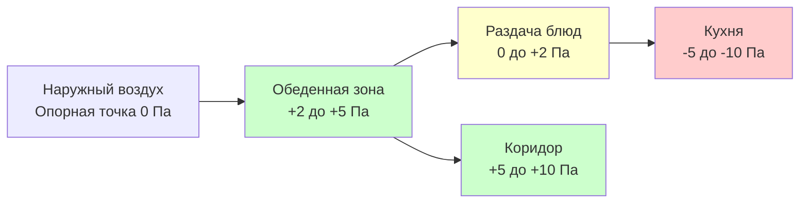
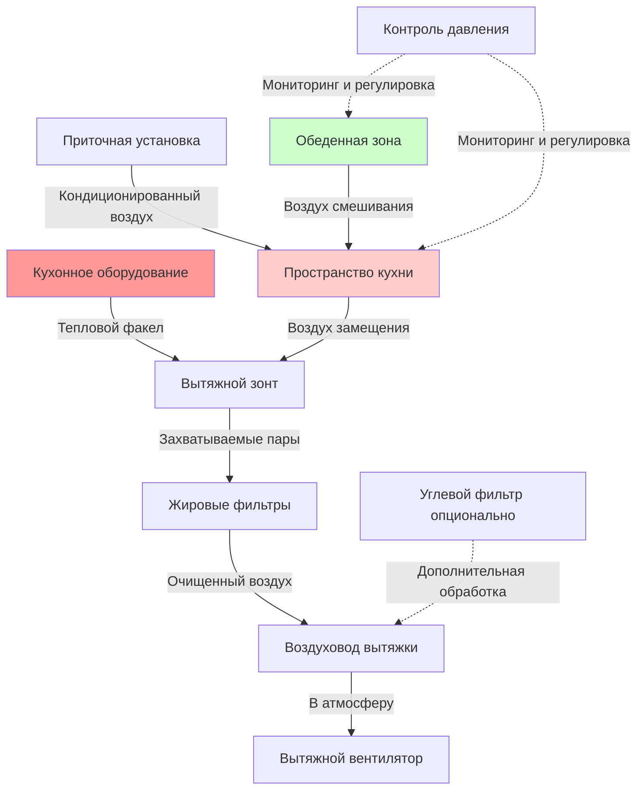

Эффективный контроль запахов в школьных столовых требует согласованного проектирования систем вытяжки, подачи приточного воздуха и управления давлением для предотвращения миграции кухонных запахов в соседние коридоры, классные комнаты и обеденные зоны.

## Расчет размеров кухонного вытяжного зонта

Размер зонта должен обеспечивать адекватную скорость захвата и объемный расход для улавливания и удаления кухонных паров до того, как они попадут в занятое пространство.

### Принципы эффективности захвата

Вытяжные зонты достигают эффективности захвата посредством:

- **Выступ навеса**: Зонт выступает на 15-30 см за пределы кухонного оборудования со всех открытых сторон
- **Высота монтажа**: Более низкие зонты (2,0-2,1 м от пола) улучшают захват при сниженном объеме вытяжки
- **Глубина зонта**: Минимум 60 см от переднего края к задней части для адекватного удержания теплового факела
- **Боковые панели**: Полные или частичные торцевые панели снижают необходимую вытяжку на 15-20%

Требуемый расход вытяжки для зонтов типа I с захватом жира зависит от типа зонта, режима работы оборудования и конфигурации:

$$Q_{hood} = A_{hood} \times \text{м}^3/(\text{ч} \cdot \text{м}^2)$$

где $A_{hood}$ — площадь фронта зонта в квадратных метрах, а м³/(ч·м²) варьируется в зависимости от применения.

### Расходы вытяжки по типам оборудования

| Тип оборудования | Легкая нагрузка (м³/(ч·м²)) | Средняя нагрузка (м³/(ч·м²)) | Тяжелая нагрузка (м³/(ч·м²)) |
|---|---|---|---|
| Печи (конвекционные) | 1 900 | 2 400 | 2 900 |
| Плиты (газовые) | 2 400 | 2 900 | 3 900 |
| Жарочные поверхности (плоские) | 2 400 | 2 900 | 3 400 |
| Фритюрницы (открытые глубокие) | 2 900 | 3 400 | 3 900 |
| Гриль-барбекю | 2 900 | 3 900 | 4 900 |
| Пароварки | 1 900 | 2 400 | — |
| Комбинированные печи | 2 400 | 2 900 | 3 400 |
| Посудомоечные машины | 1 400 | 1 900 | — |

Настенные навесные зонты, как правило, требуют 3 400-5 100 м³/ч на погонный метр, а задние полки требуют 5 100-8 500 м³/ч на погонный метр из-за их механизма захвата на основе близости.

## Баланс приточного воздуха

Система приточного воздуха должна заменять вытяжный воздух для предотвращения разрежения здания, которое вызывает проблемы с закрыванием дверей, обратную тягу горелок и инфильтрацию некондиционированного наружного воздуха.

### Расчет баланса воздуха

Для правильной работы приточный воздух должен составлять 80-100% от общей вытяжки:

$$Q_{MUA} = 0,8 \times Q_{exhaust,total}$$

Оставшиеся 10-20% поступают из воздуха смешивания из соседних обеденных зон, создавая желаемый каскад давлений.

### Методы подачи приточного воздуха

1. **Приточные установки с прямым нагревом**: Подают кондиционированный воздух непосредственно в кухню, наиболее энергоэффективны
2. **Отдельные приточные установки**: Обеспечивают обработанный воздух, выше эксплуатационные затраты
3. **Интегрированная подача в зонт**: Воздушная завеса или перфорированная подпотолочная камера, улучшенный захват
4. **Подача с вытеснением**: Подача на низком уровне или через боковые стенки с пониженной скоростью факела

Скорость выхода приточного воздуха не должна превышать 2,5 м/с на расстоянии 1,5 м от выхода, чтобы избежать нарушения захвата зонтом.

## Соотношения давлений кухня-коридор

Надлежащее управление давлением предотвращает миграцию запахов при поддержании адекватных скоростей вентиляции.

### Проектирование каскада давлений

Оптимальная иерархия давлений для школьных столовых:

Такое расположение обеспечивает:

- Кухня работает с разрежением относительно всех смежных пространств
- Обеденная зона с небольшим избыточным давлением к коридорам предотвращает инфильтрацию
- Раздача блюд с переходным давлением предотвращает чрезмерные скорости потока воздуха
- Коридор с избыточным давлением ограничивает инфильтрацию наружного воздуха

Требуемый перепад давления:

$$\Delta P = \frac{Q^2 \times \rho}{2 \times C_d^2 \times A^2}$$

где $Q$ — расход воздуха через отверстие, $\rho$ — плотность воздуха, $C_d$ — коэффициент выхода (обычно 0,65), $A$ — площадь отверстия.

## Воздух смешивания из обеденной зоны в кухню

Воздух смешивания обеспечивает контролируемый поток воздуха из обеденных зон в кухни, способствуя вентиляции кухни при поддержании надлежащих соотношений давлений.

### Критерии проектирования воздуха смешивания

Максимально рекомендуемые проценты воздуха смешивания:

- **20-40%** вытяжки кухни из обеденной зоны
- **Жалюзийная решетка или решетка смешивания** минимальная скорость на фронте 1,8 м/с
- **Расположение на стене** выше 2,1 м от пола во избежание дискомфорта для присутствующих
- **Акустическая обработка** требуется для предотвращения передачи звука

Требуемая площадь отверстия смешивания:

$$A_{transfer} = \frac{Q_{transfer}}{V_{face}}$$

Для 1 000 м³/ч воздуха смешивания при скорости 2,0 м/с: $A = 1000/2,0 = 500$ дм² ≈ 0,5 м²

## Фильтрация активированным углем

Фильтры из активированного угля удаляют соединения, вызывающие запахи, когда прямой выброс наружного воздуха невозможен или требуется дополнительное снижение запахов.

### Производительность углевого фильтра

Активированный уголь адсорбирует летучие органические соединения через:

- **Площадь поверхности**: 500-1 500 м²/г обеспечивает сайты адсорбции
- **Время контакта**: Минимум 0,1-0,2 сек времени контакта
- **Скорость на фронте**: 1,3-2,5 м/с через угольный материал
- **Толщина слоя**: 5-10 см для коммерческих применений

Эффективность удаления типичных кухонных запахов составляет 70-90% со свежим материалом, снижаясь до 40-60% в конце срока службы (обычно 6-12 месяцев в школьных применениях).

### Ограничения применения

Фильтрация углем работает лучше всего для:

- Рециркуляционных зонтов над оборудованием легкой нагрузки (нагреватели, пароварки)
- Дополнительной обработки общей вытяжки кухни
- Ситуаций, когда наружная вытяжка ограничена

Не рекомендуется как единственная обработка для оборудования, производящего жир, из-за требований норм пожарной безопасности к конструкции жироводов.

## Захват жира и взвешенных частиц

Эффективность захвата прямо влияет на контроль запахов, так как соединения, связанные с частицами, вызывающие запахи, должны быть удалены до попадания в воздуховод.

### Методы удаления жира

1. **Перегородочные фильтры**: 60-80% удаления жира, наиболее распространены в школах
2. **Картриджные фильтры**: 85-95% удаления, выше требования к обслуживанию
3. **Системы водяной промывки**: 90-98% удаления, требуется обработка воды
4. **Электростатические осадители**: 95%+ удаления, высокие начальные затраты

Соотношение между эффективностью захвата и проектированием зонта:

$$\eta_{capture} = 1 - e^{-\frac{V_{face} \times L}{V_{plume} \times H}}$$

где $V_{face}$ — скорость на фронте, $L$ — глубина зонта, $V_{plume}$ — скорость подъема теплового факела, $H$ — расстояние от поверхности варки до зонта.

## Интеграция системы

Полный контроль запахов требует координации всех компонентов:

### Процедуры балансировки

Введите систему в эксплуатацию посредством:

1. Проверьте расход вытяжки на каждом зонте (трубка Пито или расходомер)
2. Измерьте и отрегулируйте подачу приточного воздуха для достижения 80-90% от вытяжки
3. Проверьте перепады давлений при закрытых всех дверях
4. Протестируйте пути воздуха смешивания при нормальной работе
5. Убедитесь в отсутствии обратного потока из кухни в обеденную зону во время присутствия людей

Непрерывный мониторинг с использованием датчиков дифференциального давления на границе кухня/обеденная зона обеспечивает проверку эксплуатации и предупреждает обслуживание о засорении фильтра или отказе вентилятора.

## Соображения по энергетическому восстановлению

Кухонная вытяжка содержит значительное количество явного и скрытого тепла, но содержание жира усложняет рекупера­цию тепла.

Жизнеспособные подходы для школьных столовых:

- **Гликолевые контуры**: Раздельные воздушные потоки, средняя эффективность (45-60%)
- **Теплотрубные теплообменники**: Отсутствуют движущиеся части, более низкая эффективность (40-50%)
- **Отдельная система наружного воздуха**: Рекупер­ация из общей вытяжки, не из жиронасыщенной вытяжки зонта

Рекупер­ация тепла из вытяжки зонта требует размещения после удаления жира и регулярного обслуживания для предотвращения засорения.
