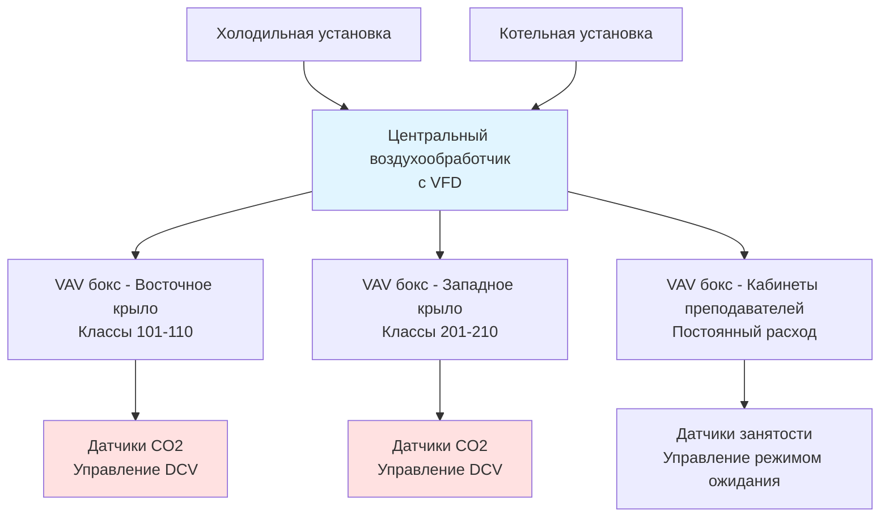
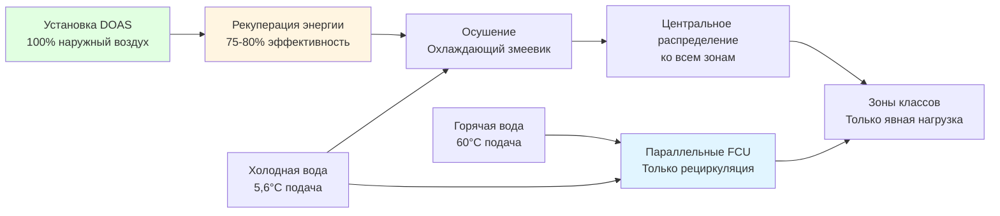

## Обзор

Здания учебных корпусов университетов и колледжей представляют уникальные задачи для проектирования HVAC из-за колеблющихся паттернов занятости, разнообразия типов помещений и сложности расписания. В отличие от специализированных лекционных залов или лабораторий, эти объекты со смешанным использованием включают стандартные учебные классы, семинарные комнаты, кабинеты преподавателей, компьютерные лаборатории и помещения для совместной работы в единой конструкции здания. Надлежащее проектирование HVAC должно обеспечивать быстрые изменения занятости между периодами занятий, широко варьирующиеся тепловые и вентиляционные нагрузки, а также требования энергоэффективности в периоды отсутствия людей.

## Разнообразие расписания и изменение нагрузок

### Паттерны занятости

Здания учебных корпусов испытывают резкие колебания занятости в течение дня:

- **Пиковые периоды**: 10:00–14:00 с использованием помещений на 80–90%
- **Периоды низкой активности**: Раннее утро и поздний день с использованием 20–40%
- **Вечерние занятия**: Отдельные классы для программ дополнительного образования и аспирантуры
- **Использование в выходные дни**: Минимальное использование, обычно менее 10% занятости

Такое разнообразие расписания создает возможности для экономии энергии, но требует сложных стратегий управления. Здание, рассчитанное на пиковые охлаждающие нагрузки, будет работать с частичной нагрузкой в течение 60–70% времени работы.

### Соображения при расчете нагрузок

Расчетные нагрузки для зданий учебных корпусов должны учитывать:

| Компонент нагрузки | Расчетное значение | Коэффициент разнообразия |
|---|---|---|
| Занятость | 20–25 человек на класс | 0,75–0,85 на здание |
| Освещение | 10,8–14,0 Вт/м² | 0,80 одновременного использования |
| Нагрузки от оборудования | 5,4–10,8 Вт/м² | 0,70 разнообразия |
| Вентиляция | По ASHRAE 62.1 | Переменная при DCV |

**Критически важно**: Применяйте коэффициенты разнообразия только на уровне центрального оборудования или воздухообработчика, никогда не применяйте их при расчетах отдельных зон. Одновременные пиковые условия в нескольких зонах происходят часто во время смены классов.

## Конфигурации систем HVAC

### Системы с переменным расходом воздуха

Системы VAV доминируют в применении к зданиям учебных корпусов благодаря их способности соответствовать изменяющимся нагрузкам:

**Характеристики системы**:
- Центральные воздухообработчики с минимальным расходом воздуха 40–60% во время отопления
- Управление вентиляцией по спросу на основе CO2 в каждом классе
- Независимые от давления VAV терминалы для точного управления
- Калориферы с горячей водой для одновременного отопления и охлаждения

### Системы с отдельной подачей наружного воздуха

Конфигурации DOAS разделяют вентиляцию и кондиционирование:

**Преимущества для зданий учебных корпусов**:
- Разделенная вентиляция позволяет независимое управление подачей свежего воздуха
- Рекуперация энергии снижает нагрузку кондиционирования на наружный воздух
- Вентиляторные конвекторы обеспечивают тихое и отзывчивое управление зонами
- Уменьшенные размеры воздуховодов в потолочных пространствах
- Превосходное управление влажностью во влажном климате

### Гибридные системы

Многие современные здания учебных корпусов используют гибридные подходы, комбинирующие различные системы в зависимости от функции помещения:

- **Учебные классы**: VAV с DCV для гибкости
- **Кабинеты преподавателей**: Вентиляторные конвекторы или сплит-системы для индивидуального управления
- **Компьютерные лаборатории**: Системы с постоянным расходом для охлаждения оборудования
- **Коридоры**: Системы циркуляции воздуха или минимальное кондиционирование
- **Санузлы**: Выделенная вытяжка с подпиткой воздуха из коридоров

## Управление вентиляцией по спросу

### Стратегия реализации

ASHRAE 62.1 требует расходов наружного воздуха 17 CFM (28,8 м³/ч) на человека плюс 1,3 CFM/м² (4,4 м³/(ч·м²)) для учебных классов. При занятости от 0 до 35 человек в типичном классе площадью 70 м², требования вентиляции варьируются существенно:

**Минимальное условие** (помещение пусто):
- Компонент площади: 70 м² × 1,3 CFM/м² = 91,2 CFM (155 м³/ч)

**Максимальное условие** (35 студентов):
- Компонент людей: 35 × 17 CFM/человека = 595 CFM (1 011 м³/ч)
- Компонент площади: 91,2 CFM (155 м³/ч)
- **Требуемый итого**: 686,2 CFM (1 166 м³/ч)

Системы DCV модулируют наружный воздух на основе измерений CO2 в реальном времени, обычно поддерживая уставки 1 000–1 200 ppm. Экономия энергии составляет от 25 до 40% по сравнению с постоянной вентиляцией при расчетной занятости.

### Размещение датчиков и калибровка

Надлежащая установка датчиков CO2 критична:

- Устанавливайте на высоте дыхательной зоны (120–150 см над полом)
- Размещайте вдали от окон, дверей и приточных диффузоров
- Устанавливайте в пути возвратного воздуха или в репрезентативном месте помещения
- Калибруйте датчики ежегодно по базовой линии наружного воздуха
- Используйте двухлучевые датчики NDIR для долгосрочной точности

## Последовательности и стратегии управления

### Расписание и режим ожидания

Здания учебных корпусов получают выгоду от агрессивных стратегий режима ожидания, связанных с академическим расписанием:

**Режим занятости** (за 15 минут до начала занятий):
- Уставки температуры: 22°C охлаждение / 21°C отопление
- Полная вентиляция согласно ASHRAE 62.1
- Системы освещения включены согласно расписанию занятости

**Режим отсутствия людей** (ночи и выходные):
- Уставки температуры: 25,6°C охлаждение / 18,3°C отопление
- Минимальный наружный воздух только для создания избыточного давления в здании
- Системы работают с пониженной мощностью

**Режим разогрева/охлаждения**:
- Начинается за 1–2 часа до занятости на основе температуры наружного воздуха
- Максимальная мощность отопления или охлаждения
- Минимальный наружный воздух во время снижения нагрузки

### Логика управления на уровне зоны

Отдельные VAV боксы учебных классов используют следующую последовательность:

1. **Нормальное охлаждение**: Заслонка модулирует от минимального до максимального расхода воздуха на основе температуры зоны
2. **Мертвая зона**: Заслонка остается в минимальном положении, нет отопления или охлаждения
3. **Отопление**: Заслонка остается в минимальном положении, клапан подогрева модулирует для поддержания уставки
4. **Отсутствие людей**: Заслонка закрывается в минимальное положение (обычно 30% для вентиляции), активны температуры режима ожидания

### Оптимизация центрального оборудования

Стратегии на уровне здания снижают общее энергопотребление:

- **Операция экономайзера**: Использование 100% наружного воздуха при благоприятных условиях (обычно ТНВ < 13–15,6°C)
- **Сброс температуры приточного воздуха**: Повышение ТПВ от 13°C до 15,6–18°C, когда ни одна зона не требует полного охлаждения
- **Сброс статического давления**: Снижение уставки статического давления воздуховода, когда VAV боксы не полностью открыты
- **Сброс температуры холодной воды**: Повышение температуры подачи ХВ на основе нагрузки здания

## Соответствие энергетическим кодексам

### Требования ASHRAE 90.1 и IECC

Современные здания учебных корпусов должны соответствовать строгим стандартам энергоэффективности:

**Вентиляция**:
- Управление вентиляцией по спросу требуется для помещений > 46,5 м² и > 0,43 человека/м² (ASHRAE 90.1-2019)
- Вентиляторы рекуперации энергии требуются при наружном воздухе > 236,5 м³/ч (варьируется в зависимости от климатической зоны)

**Оборудование HVAC**:
- Ограничения мощности вентилятора: 0,97–1,18 Вт/(м³/ч) в зависимости от конфигурации системы
- Приводы с переменной скоростью на всех вентиляторах > 5,6 кВт
- Экономайзеры требуются в большинстве климатических зон для систем > 15,87 кВт охлаждения

**Управление**:
- Автоматическое снижение в периоды отсутствия людей
- Управление температурой зон с точностью ±1,1°C
- Отключение системы HVAC при отсутствии людей в помещении > 30 минут

## Акустические соображения

Среда учебного класса требует низкого уровня фонового шума для разборчивости речи:

- **Критерий проектирования**: NC 30–35 для стандартных учебных классов
- **Скорость приточного воздуха**: Ограничивайте 2,0–2,5 м/с на диффузорах
- **Шум VAV бокса**: Используйте акустически облицованные боксы или удаленно установленные блоки
- **Проектирование воздуховодов**: Избегайте высокоскоростных воздуховодов рядом с диффузорами; используйте максимальные скорости воздуховодов 7,6–10,2 м/с
- **Виброизоляция**: Устанавливайте все вращающееся оборудование на пружинные или неопреновые изоляторы

## Специальные соображения

### Высокотехнологичные классы

Современные классы активного обучения требуют дополнительной охлаждающей мощности:

- Добавьте 5,4–10,8 Вт/м² для систем проекции, дисплеев и управляющего оборудования
- Обеспечьте выделенное охлаждение для стоек оборудования
- Рассмотрите системы с поднятым полом для прокладки кабелей и распределения воздуха под полом

### Гибкие учебные пространства

Передвижные перегородки и переоборудуемые помещения представляют трудности для управления:

- Используйте VAV боксы, независимые от давления, которые поддерживают точный расход воздуха независимо от давления в системе
- Обеспечьте индивидуальное управление зонами даже для делимых пространств
- Проектируйте на максимальную занятость в каждой конфигурации
- Установите датчики CO2 в каждой подделимой области

### Будущая адаптивность

Проектируйте системы с учетом изменяющихся моделей образования:

- Обеспечьте избыточную мощность 20–30% в распределении воздуховодов и трубопроводов
- Используйте модульное оборудование воздухообработки для легкого расширения
- Установите инфраструктуру управления, поддерживающую будущую интеграцию
- Проектируйте электрические и механические помещения с пространством для дополнительного оборудования

---

**Эталонные стандарты**:
- ASHRAE 62.1: Вентиляция для приемлемого качества внутреннего воздуха
- ASHRAE 90.1: Энергетический стандарт для зданий
- ASHRAE Handbook - HVAC Applications, Chapter 7: Educational Facilities
