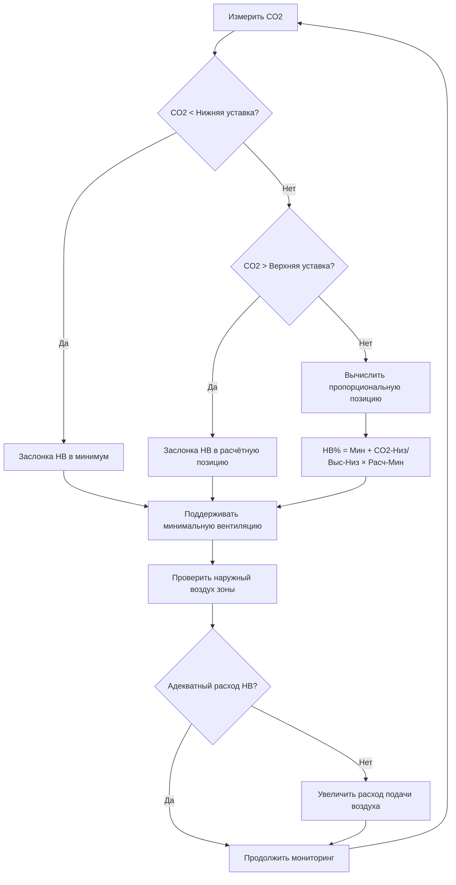
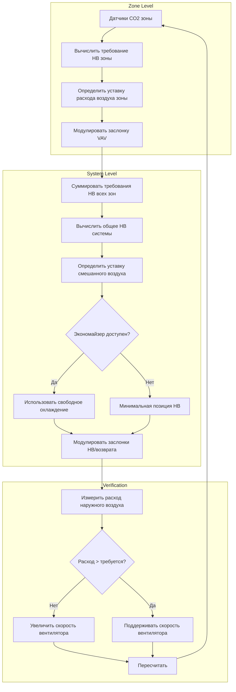

Управление вентиляцией по спросу регулирует подачу наружного воздуха на основе измеренной концентрации CO2, используя её как показатель фактической занятости в классах и других образовательных помещениях. Этот подход снижает потребление энергии на вентиляцию на 30-50% по сравнению с системами постоянной подачи наружного воздуха, одновременно обеспечивая соответствие ASHRAE 62.1 и приемлемое качество воздуха в помещении.

## Требования ASHRAE 62.1 для DCV

Стандарт ASHRAE 62.1, раздел 6.2.7, устанавливает конкретные условия, при которых управление вентиляцией по спросу разрешено для учебных заведений.

**Обязательные требования соответствия:**

1. **Минимальный расход вентиляции**: Система должна непрерывно подавать компонент площади (Ra × Az) в течение всех периодов занятости, независимо от измеренных уровней CO2. Для классов это равно 0,12 м³/(ч·м²).

2. **Предел установки CO2**: Концентрация CO2 в помещении не должна превышать концентрацию на улице более чем на 700 частей на миллион. При типичных наружных уровнях 400-450 частей на миллион максимальная внутренняя установка составляет 1100-1150 частей на миллион.

3. **Производительность датчика**: Датчики CO2 должны соответствовать минимальным характеристикам точности и сохранять калибровку согласно требованиям производителя. Технология недисперсионной инфракрасной спектроскопии (NDIR) требуется для надежного обнаружения.

4. **Управление на уровне зоны**: Каждая тепловая зона с независимым управлением подачей наружного воздуха требует отдельного измерения CO2. Многозонные системы с усреднением CO2 по зонам не соответствуют стандарту, если каждая зона не получает пропорциональное распределение наружного воздуха.

5. **Документация проектирования**: Проект системы вентиляции должен продемонстрировать, что минимальные расходы вентиляции поддерживаются при всех уровнях занятости и что управление предотвращает превышение установленных пределов CO2.

**Расчет расхода вентиляции:**

Требуемый наружный воздух для зон классов следует формуле:

Voz = Rp × Pz + Ra × Az

Где:
- Voz = Расход наружного воздуха в зоне (м³/ч)
- Rp = 5,4 м³/(ч·чел) для классов (возраст 9+)
- Pz = Расчётная занятость (люди)
- Ra = 0,12 м³/(ч·м²) для классов
- Az = Площадь пола зоны (м²)

Для типичного класса площадью 89 м² с 32 учениками:
- Компонент по людям: 5,4 м³/(ч·чел) × 32 = 173 м³/ч
- Компонент по площади: 0,12 м³/(ч·м²) × 89 = 10,7 м³/ч
- Общий расход наружного воздуха при проектировании: 184 м³/ч

DCV снижает компонент по людям пропорционально измеренной занятости, одновременно поддерживая компонент площади 10,7 м³/ч в любое время.

## Требования энергетических кодексов к DCV

Международный энергетический кодекс энергосбережения (IECC) и ASHRAE Standard 90.1 требуют DCV для конкретных применений в учебных заведениях.

**Триггеры DCV ASHRAE 90.1:**

Управление вентиляцией по спросу требуется, когда ВСЕ следующие условия выполнены:

- Расчётная занятость ≥ 7,5 человека на 100 м² площади
- Расход наружного воздуха при проектировании системы > 50 м³/мин
- В системе присутствует экономайзер по воздуху

Классы для учащихся в возрасте 9 лет и старше имеют плотность занятости по умолчанию 10,5 человека на 100 м² согласно ASHRAE 62.1, превышая порог 7,5 человека на 100 м². Кондиционеры многоклассных помещений, обслуживающие более 7-8 типичных классов, превышают 50 м³/мин расход наружного воздуха при проектировании, что требует DCV.

**Исключения:**

DCV НЕ требуется для:
- Систем с рекуперацией энергии вентиляции, при которой захватывается ≥ 70% чувствительной и скрытой энергии
- Многозонных VAV-систем с оптимизацией вентиляции на уровне зоны согласно ASHRAE 62.1, раздел 6.2.7
- Помещений с режимом занятости 24 часа в сутки

**Положения IECC:**

Последние редакции IECC (2018 и позже) согласуются с требованиями ASHRAE 90.1, требуя DCV для высокозанятых образовательных пространств, если только они не исключены благодаря рекуперации энергии или передовому управлению вентиляцией.

## Основы управления на основе CO2

Концентрация диоксида углерода обеспечивает эффективный показатель занятости на основе скоростей выработки метаболического CO2 человеком.

**Отношение CO2 в установившемся режиме:**

При условиях равновесия:

Css = Coa + (N × G) / Voa

Где:
- Css = Концентрация CO2 в помещении в установившемся режиме (частей на миллион)
- Coa = Наружный CO2 (обычно 400-450 частей на миллион)
- N = Количество находящихся в помещении
- G = Скорость выработки CO2 на человека (0,0028 м³/ч при сидячей деятельности)
- Voa = Расход наружного воздуха (м³/ч на человека)

**Пример:**

При расходе вентиляции 2,9 м³/(ч·чел):
Css = 450 + (1 × 0,0028) / (2,9) = 450 + 0,97 = 451 частей на миллион

При полной расчётной занятости с надлежащей вентиляцией CO2 в классе должен стабилизироваться между 900-1100 частей на миллион выше наружных уровней.

**Динамический отклик:**

Изменения концентрации CO2 следуют экспоненциальному приближению к установившемуся состоянию:

C(t) = Css - (Css - C0) × e^(-t/τ)

Где:
- τ = Постоянная времени = V / Voa (объём помещения / расход наружного воздуха)
- C0 = Начальная концентрация CO2

Для класса площадью 89 м² с высотой 3,0 м и расходом наружного воздуха 184 м³/ч:
τ = (89 × 3,0) / 184 = 1,5 часа

Помещение достигает 95% установившейся концентрации CO2 приблизительно за 3τ или 4,5 часа, объясняя задержку между изменениями занятости и откликом CO2.

## Последовательности управления DCV

Эффективное внедрение DCV требует надлежащей структуры логики управления, которая обеспечивает соответствие кодексу при одновременной максимизации экономии энергии.

### Алгоритм пропорционального управления

**Уравнение управления:**

OA_position = OA_min + [(CO2_meas - CO2_low) / (CO2_high - CO2_low)] × (OA_design - OA_min)

Где:
- OA_position = Командная позиция заслонки наружного воздуха (%)
- OA_min = Минимальная позиция для вентиляции компонента площади
- OA_design = Полная расчётная позиция для максимальной занятости
- CO2_low = Нижний порог управления (обычно 800 частей на миллион)
- CO2_high = Верхний порог управления (обычно 1100 частей на миллион)
- CO2_meas = Измеренная концентрация CO2 (частей на миллион)

**Выбор уставок:**

| Параметр | Рекомендуемое значение | Обоснование |
|----------|------------------------|-------------|
| CO2_low | 750-850 частей на миллион | Порог минимальной занятости |
| CO2_high | 1050-1150 частей на миллион | Соответствие ASHRAE 62.1 (700 частей на миллион выше наружного) |
| Гистерезис | 50-100 частей на миллион | Предотвращает колебания управления |
| Интервал опроса | 3-5 минут | Балансирует время отклика и стабильность |

### Последовательность управления многозонной VAV-системой

Системы, обслуживающие несколько классов, требуют скоординированного управления на уровне зоны и системы:

**Расчёт на уровне системы:**

Требование наружного воздуха на уровне системы:

Vtot = Σ(Voz,i) / Ez

Где:
- Vtot = Общий наружный воздух системы (м³/ч)
- Voz,i = Наружный воздух зоны i
- Ez = Эффективность распределения воздуха зоны (обычно 1,0 для потолочной подачи)

Заслонка наружного воздуха системы модулирует для подачи Vtot, в то время как отдельные заслонки зон регулируются для подачи требуемого Voz каждой зоне на основе локальных измерений CO2.

## Спецификация датчиков и их размещение

Надежная работа DCV зависит от правильно выбранных и установленных датчиков CO2.

**Технические характеристики:**

| Параметр | Минимальное требование | Предпочтительная спецификация |
|----------|------------------------|------------------------------|
| Технология | NDIR (недисперсионная инфракрасная) | Двухволновая NDIR |
| Диапазон | 0-2000 частей на миллион | 0-5000 частей на миллион |
| Точность | ±75 частей на миллион или ±5% | ±50 частей на миллион или ±3% |
| Время отклика (T90) | <3 минут | <2 минут |
| Дрейф | <100 частей на миллион за 5 лет | <50 частей на миллион за 5 лет |
| Калибровка | Ручная или автоматическая | Автоматическая фоновая калибровка |
| Температура эксплуатации | 0-50°C | 0-60°C |
| Влажность эксплуатации | 0-95% RH без конденсации | 0-95% RH без конденсации |

**Автоматическая фоновая калибровка:**

Большинство современных датчиков реализуют логику ABC, которая предполагает, что датчик периодически испытывает уровни CO2 на улице (приблизительно 400-450 частей на миллион). Датчик отслеживает минимальное считывание CO2 в течение 7-14 дней и калибруется на этот базовый уровень. Этот подход хорошо работает для школ с неиспользуемыми выходными и праздниками, но может не сработать в постоянно занятых помещениях.

**Требования к размещению:**

1. **Высота**: Установите на высоте 0,9-1,8 м над готовым полом в дыхательной зоне, где находятся сидящие люди

2. **Местоположение**: Разместите центрально в занятом пространстве, избегая:
   - Зон влияния воздуховода подачи (минимальное расстояние 1,8 м)
   - Прямых путей вытяжного или возвратного воздуха
   - Мест вблизи дверей снаружи или открываемых окон
   - Прямого солнечного света (влияет на электронику датчика)
   - Оборудования, выделяющего тепло (компьютеры, проекторы)

3. **Охват**: Один датчик на независимо управляемую вентиляционную зону. Большие помещения (>186 м²) выигрывают от нескольких датчиков с усреднением показаний.

4. **Доступность**: Установите датчики в местах, где они могут быть легко проверены и откалиброваны без использования лестниц или специального доступа.

**Особые соображения для класса:**

В типичных классах установите датчики на боковую стену на расстоянии приблизительно 4,5-6 м от входной двери на уровне головы сидящего человека (высота 1,1-1,2 м над полом). Избегайте передней стены вблизи стола учителя или задней стены вблизи двери, чтобы предотвратить нерепрезентативные показания от локализованных паттернов занятости.

## Анализ экономии энергии

DCV снижает три компонента энергии: отопление, охлаждение и энергию вентилятора.

**Экономия энергии на отопление:**

Qheat = 1,163 × ΔVoa × (Tin - Tout) × Hocc / ηheat

Где:
- Qheat = Сэкономленная энергия на отопление (кДж)
- ΔVoa = Среднее снижение расхода наружного воздуха (м³/ч)
- Tin = Уставка температуры в помещении (°C)
- Tout = Средняя наружная температура в сезон отопления (°C)
- Hocc = Занятые часы в сезон отопления (часы)
- ηheat = Эффективность системы отопления (доля)
- 1,163 = Коэффициент преобразования для м³/ч × °C в кДж/ч

**Пример расчёта - климат Чикаго:**

Параметры школы:
- 30 классов, 89 м² каждый
- Расход наружного воздуха при проектировании: 184 м³/ч на класс
- Средний расход наружного воздуха при DCV: 81 м³/ч (44% средняя занятость)
- Снижение расхода наружного воздуха на класс: 103 м³/ч
- Общее снижение НВ: 30 × 103 = 3090 м³/ч

Анализ отопления:
- Занятые часы отопления: 1400 часов/год (октябрь-апрель)
- Средняя наружная температура в занятые часы отопления: -2°C
- Уставка в помещении: 21°C
- Эффективность системы отопления: 82% (газовый котел)

Qheat = 1,163 × 3090 × (21 - (-2)) × 1400 / 0,82
Qheat = 128 ГДж/год

При стоимости природного газа $1,20 за терм (0,1 ГДж):
Экономия на отопление = 128 / 0,1 × $1,20 = $1536/год

**Экономия энергии на охлаждение:**

Экономия на охлаждение включает чувствительный и скрытый компоненты:

Qcool,sens = 1,163 × ΔVoa × (Tout - Tin) × Hcool

Qcool,lat = 2608 × ΔVoa × (Wout - Win) × Hcool

Где:
- W = Удельная влажность (г воды/кг сухого воздуха)
- 2608 = Коэффициент преобразования скрытого тепла

Для той же школы из 30 классов:
- Занятые часы охлаждения: 900 часов/год (май-сентябрь)
- Средняя наружная температура в занятые часы охлаждения: 26°C
- Средняя наружная удельная влажность: 11,5 г/кг
- Уставка в помещении: 23°C
- Удельная влажность в помещении: 9,5 г/кг

Qcool,sens = 1,163 × 3090 × (26 - 23) × 900 = 9,7 ГДж
Qcool,lat = 2608 × 3090 × (11,5 - 9,5) × 900 = 11,5 ГДж
Qcool,total = 21,2 ГДж

При COP холодильника 4,2 и стоимости электроэнергии 0,13 $ / кВт·ч:
Электроэнергия на охлаждение = 21,2 ГДж / (4,2 × 3,6 МДж/кВт·ч) = 1,409 MWh
Экономия на охлаждение = 1409 × $0,13 = $183/год

**Экономия энергии вентилятора:**

Снижение расхода наружного воздуха уменьшает статическое давление в системе, снижая мощность вентилятора:

Pfan = 0,0634 × ΔVoa × ΔPsys × Hocc / ηfan

Где:
- ΔPsys = Статическое давление системы (Па)
- ηfan = Общая эффективность вентилятора

Предполагаемые значения:
- Статическое давление системы: 375 Па
- Общая эффективность вентилятора: 0,62
- Общие занятые часы: 2300 часов/год
- Эффективные часы вентилятора при сниженном расходе: 40% занятых часов (920 часов)

Pfan = 0,0634 × 3090 × 375 × 920 / 0,62 = 1551 MWh
Экономия вентилятора = 1551 × $0,13 = $202/год

**Общая годовая экономия:**

$1536 (отопление) + $183 (охлаждение) + $202 (вентилятор) = $1921/год

**Анализ окупаемости:**

Затраты на внедрение DCV для школы из 30 классов:
- Датчики CO2: 30 датчиков × 400 $ = $12000
- Программирование управления: $8000
- Наладка: $5000
- Общая установленная стоимость: $25000

Простой период окупаемости = $25000 / $1921 = 13,0 лет

Окупаемость улучшается в более холодных климатических зонах с большими нагрузками отопления и более длительными сезонами отопления.

## Стратегии внедрения

**Новое строительство:**

1. Специфицируйте датчики CO2 во всех классах, аудиториях, столовых и помещениях собраний с расчётной занятостью ≥ 7,5 человека на 100 м²

2. Программируйте последовательности управления DCV в системе управления зданием с пропорциональной модуляцией между минимальным и расчётным наружным воздухом

3. Обеспечьте станции измерения расхода наружного воздуха на уровне системы для проверки общей подачи наружного воздуха

4. Наладьте работу DCV путём проверки точности датчика, отклика управления и соответствия минимальной вентиляции

**Модернизация существующих зданий:**

Существующие школы могут добавить DCV если:
- HVAC-система имеет модулирующие заслонки наружного воздуха с приводами (не заслонки с фиксированной минимальной позицией)
- Система управления зданием может принимать входные сигналы датчиков и выполнять логику управления
- Расход наружного воздуха можно измерить или рассчитать из кривых вентилятора и позиций заслонок

Модернизированные установки обычно достигают периодов окупаемости 2-4 года в климатических зонах с преобладанием отопления.

## Общие проблемы при внедрении

**Дрейф датчика:**

Некомпенсированный дрейф датчика приводит к недостаточной подаче вентиляции. Решение: Специфицируйте датчики с автоматической фоновой калибровкой и внедрите годовую проверку с использованием откалиброванного портативного измерителя CO2.

**Неадекватная минимальная вентиляция:**

Контроллеры, запрограммированные с неправильными значениями компонента площади, подают недостаточный наружный воздух при низкой занятости. Решение: Вычислите и проверьте минимальную вентиляцию (0,12 м³/(ч·м²) для классов) при наладке.

**Плохое размещение датчика:**

Датчики в потоках подаваемого воздуха или вблизи решёток возврата считывают нерепрезентативные концентрации. Решение: Следуйте указаниям по размещению и проверьте при функциональном тестировании.

**Колебания управления:**

Чрезмерное усиление управления или короткие интервалы опроса вызывают циклирование заслонок. Решение: Реализуйте интервалы опроса 3-5 минут, гистерезис 50-100 частей на миллион и ограничение скорости изменения позиции заслонки (максимум 10% за минуту).

**Конфликты экономайзера:**

Управление DCV и экономайзером должно скоординировано предотвратить одновременное снижение наружного воздуха (DCV) и увеличение наружного воздуха (экономайзер). Решение: Запрограммируйте экономайзер как приоритетное переопределение, которое вступает в действие при наличии условий для свободного охлаждения.

## Проверка производительности

**Функциональное тестирование:**

1. **Калибровка датчика**: Сравните показания установленного датчика с откалиброванным портативным измерителем на наружном воздухе (400-450 частей на миллион), в неиспользуемом помещении (400-500 частей на миллион) и в занятом помещении (900-1200 частей на миллион)

2. **Тест минимальной позиции**: Проверьте, что заслонка наружного воздуха подаёт требуемый компонент площади (0,12 м³/(ч·м²) × площадь зоны), когда CO2 ниже нижней уставки

3. **Пропорциональный отклик**: Подтвердите, что позиция заслонки увеличивается линейно по мере увеличения CO2 от нижней к верхней уставке

4. **Тест максимальной позиции**: Проверьте, что заслонка достигает расчётной позиции, когда CO2 превышает верхнюю уставку или приближается к пределу ASHRAE

5. **Анализ трендов**: Логируйте концентрацию CO2, позицию заслонки и расход наружного воздуха в течение нескольких занятых дней для проверки надлежащей работы

**Долгосрочный мониторинг:**

Внедрите обнаружение неисправностей и диагностику (FDD) для выявления:
- Датчиков, считывающих постоянные значения (отказ датчика)
- CO2 постоянно превышающего уставки (недостаточный размер вентиляции)
- Заслонок, не реагирующих на изменения CO2 (отказ управления)
- Наружного воздуха ниже минимальных требований (проблема с заслонкой или вентилятором)

Правильно спроектированные и обслуживаемые системы управления вентиляцией по спросу на основе CO2 обеспечивают существенную экономию энергии в учебных заведениях при одновременном обеспечении соответствия ASHRAE 62.1 и приемлемого качества воздуха в помещении для сред обучения учащихся.
