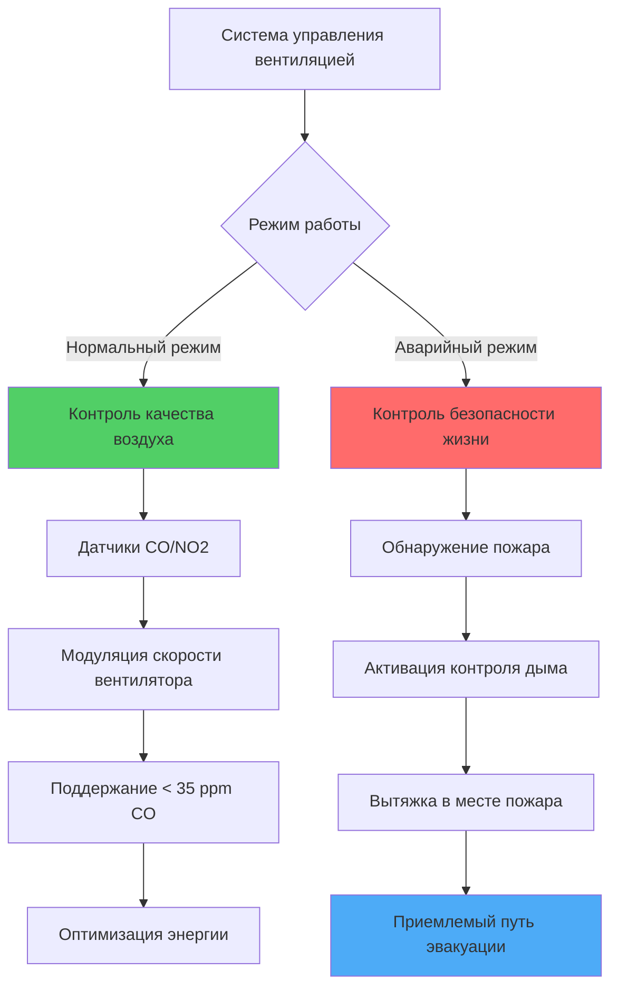

Закрытые объекты для движения транспорта представляют уникальные проблемы вентиляции из-за постоянного выброса продуктов сгорания и частиц от двигателей внутреннего сгорания. В отличие от обычных зданий, где доминируют нагрузки, генерируемые людьми, эти пространства требуют систем вентиляции, специально разработанных для разбавления токсичных газов, удаления твердых частиц и обеспечения защиты жизни во время аварийных ситуаций.

## Фундаментальная физика вентиляции

Разбавление загрязняющих веществ в закрытых пространствах с движением транспорта следует принципам баланса массы. Для контрольного объема с однородным смешиванием скорость изменения концентрации загрязнителя составляет:

$$\frac{dC}{dt} = \frac{G - Q \cdot C}{V}$$

Где:
- $C$ = концентрация загрязнителя (ppm или мг/м³)
- $G$ = скорость генерации (объем/время или масса/время)
- $Q$ = скорость вентиляционного потока воздуха (м³/с)
- $V$ = объем пространства (м³)

В установившемся состоянии ($\frac{dC}{dt} = 0$) требуемая вентиляция для поддержания концентрации $C_{max}$ составляет:

$$Q_{required} = \frac{G}{C_{max}}$$

Это соотношение определяет все расчеты скорости вентиляции для объектов с движением транспорта, причем скорость генерации $G$ определяется объемом трафика, распределением типов автомобилей и коэффициентами выбросов.

## Типы загрязняющих веществ от транспорта

Выбросы от транспорта содержат несколько опасных компонентов, требующих контроля:

| Загрязняющее вещество | Первичный источник | Влияние на здоровье | Типичный предел | Метод детектирования |
|-----------|---------------|---------------|---------------|------------------|
| Монооксид углерода (CO) | Неполное сгорание | Связывание с гемоглобином, асфиксия | 35 ppm (1-ч) | Электрохимический датчик |
| Диоксид азота (NO₂) | Сгорание при высокой температуре | Раздражение дыхательных путей | 0,5 ppm (1-ч) | Хемилюминесценция |
| Твердые частицы (PM2.5) | Выбросы дизеля, износ шин/тормозов | Респираторные/сердечно-сосудистые | 35 мкг/м³ (24-ч) | Оптический/гравиметрический |
| Летучие органические соединения (VOC) | Несгоревшие углеводороды | Канцерогенные, запах | Варьируется | Фотоионизация |

**Монооксид углерода** традиционно служит индексным загрязняющим веществом для парков бензиновых автомобилей, поскольку он коррелирует с другими продуктами сгорания и имеет хорошо установленную технологию обнаружения. Скорость генерации CO на один автомобиль составляет:

$$G_{CO} = \sum_{i} (n_i \cdot EF_i \cdot S_i)$$

Где $n_i$ — количество транспортных средств по типам, $EF_i$ — коэффициент выбросов (г/км), и $S_i$ — скорость движения. Современные парки, богатые дизельным транспортом, требуют **мониторинга NO₂ и PM**, так как эти выбросы имеют другие профили генерации, чем CO.

## Требования к проектированию конкретных объектов

### Дорожные туннели

NFPA 502 *Стандарт для дорожных туннелей, мостов и других ограниченных автомагистралей* устанавливает требования вентиляции на основе длины туннеля, уклона, объема трафика и аварийных сценариев.

**Нормальная вентиляция** поддерживает качество воздуха при обычной работе. Требуемый расход воздуха для продольных туннелей составляет:

$$Q = \frac{G_{total}}{C_{allowable} - C_{ambient}} + Q_{makeup}$$

Продольная вентиляция использует реактивные вентиляторы для создания однонаправленного потока, эффективна для туннелей длиной менее 1 км с уклонами менее 3%. Критическая скорость для предотвращения обратного потока дыма при пожаре составляет приблизительно:

$$V_{critical} = K \cdot (g \cdot H \cdot Q_{fire})^{1/3}$$

Где $K$ — эмпирический коэффициент (обычно 0,6-0,8), $g$ — ускорение свободного падения, $H$ — высота туннеля, и $Q_{fire}$ — скорость выделения тепла при пожаре.

**Поперечные и полупоперечные системы** используют воздухозаборные и вытяжные каналы с несколькими отверстиями, обеспечивая лучший контроль качества воздуха для более длинных туннелей, но требуя значительной инфраструктуры.

### Подземные парковки

ASHRAE Standard 62.1 и Международный механический кодекс предусматривают нормативные требования, обычно 0,075 CFM/фут² (75 л/с на 1000 м²) площади пола, что эквивалентно 6 кратным обменам воздуха в час при стандартной высоте потолка.

**Вентиляция с спросовым управлением (DCV)** снижает энергопотребление путем модуляции скорости вентилятора на основе показаний датчиков CO, обычно поддерживая 25-35 ppm средней концентрации. Коэффициент экономии энергии составляет:

$$SF = 1 - \frac{t_{occupied}}{t_{total}} \cdot \frac{C_{design}}{C_{limit}}$$

Естественная вентиляция через настенные отверстия может обеспечить соответствующую кодексу вентиляцию для объектов над уровнем земли, когда общая площадь отверстий равна 2,5% площади пола, распределенные по крайней мере на двух противоположных стенах. Эффективная скорость естественной вентиляции зависит от скорости ветра и термической плавучести:

$$Q_{natural} = C_d \cdot A \cdot \sqrt{2 \cdot g \cdot H \cdot \frac{\Delta T}{T_{avg}}}$$

Где $C_d$ — коэффициент расхода (0,6-0,65), $A$ — площадь отверстия, и $\Delta T$ — разница между внутренней и наружной температурой.

### Автобусные терминалы и ремонтные объекты

Эти объекты испытывают более высокую загрузку выбросами, чем подземные парковки, из-за более крупных дизельных двигателей и продолжительных периодов холостого хода. Критерии проектирования включают:

- **Повышенные скорости вентиляции**: 1,5-2,5 CFM/фут² (150-250 л/с на 1000 м²)
- **Локальная вытяжка**: Местная вытяжка у выхлопных труб при техническом обслуживании (300-500 CFM на одно транспортное средство)
- **Управление стратификацией**: Дизельный выхлоп теплее окружающего воздуха, создавая накопление у потолка, требующее высокоуровневой вытяжки

Эффективность захвата выхлопа для систем локальной вытяжки составляет:

$$\eta = \frac{Q_{capture}}{Q_{capture} + 10 \cdot V_{crossdraft} \cdot A_{source}}$$

Подчеркивая важность минимизации поперечных потоков в ремонтных зонах.

## Нормальные и аварийные режимы вентиляции

Системы вентиляции для закрытых объектов с движением транспорта работают в различных режимах:

**Нормальный режим** приоритизирует энергоэффективность при поддержании приемлемого качества воздуха:
- Переменная скорость работы на основе обратной связи датчиков
- Минимальная вентиляция при низкой степени занятости
- Операция экономайзера при благоприятных условиях окружающей среды

**Аварийный режим** приоритизирует безопасность жизни во время пожара:
- Переключение на полную мощность или определенную последовательность пожарного режима
- Вытяжка дыма из зоны пожара при скорости 6-10 кратных обменов воздуха в час
- Нагнетание воздуха в маршруты эвакуации для предотвращения инфильтрации дыма
- Поддержание температур ниже 60°C в путях эвакуации

Переход между режимами происходит автоматически при срабатывании пожарной сигнализации с возможностью ручного переключения для центров управления пожарными работами.

## Проектные соображения и выбор системы

Выбор стратегии вентиляции зависит от множества факторов:

**Продольные системы** (реактивные вентиляторы):
- Более низкие капитальные затраты
- Минимальные требования к пространству
- Эффективны для более коротких туннелей
- Ограниченный контроль качества воздуха
- Проблемы при затруднённом трафике (нулевая скорость)

**Поперечные/полупоперечные системы**:
- Превосходный контроль качества воздуха
- Эффективны для туннелей любой длины
- Повышенные капитальные и пространственные требования
- Лучший контроль в аварийном режиме
- Повышенная сложность технического обслуживания

**Гибридные подходы** сочетают продольную нормальную работу с поперечной аварийной вытяжкой, балансируя стоимость и производительность.

Критические параметры проектирования включают:
- **Объем и состав трафика**: Определяет генерацию загрязняющих веществ
- **Уклон**: Влияет на выбросы автомобилей и естественную стратификацию
- **Длина**: Влияет на выбор системы и время эвакуации
- **Условия окружающей среды**: Влияет на потенциал естественной вентиляции и тепловые нагрузки
- **Местные требования кодекса**: Могут требовать определенные подходы или коэффициенты безопасности

Современные объекты все чаще включают **мониторинг качества воздуха в реальном времени** с динамическими алгоритмами управления, которые оптимизируют энергопотребление при обеспечении соответствия пределам воздействия. Интеграция с системами управления трафиком позволяет прогностическое управление на основе ожидаемого количества транспортных средств, а не реактивный ответ на повышение концентрации.

**Интеграция обнаружения и тушения пожара** представляет критический компонент безопасности жизни, с последовательностями управления системой вентиляции, разработанными с использованием вычислительной гидродинамики (CFD) при моделировании сценариев пожара для обеспечения приемлемых условий во время эвакуации и тушения пожара.
