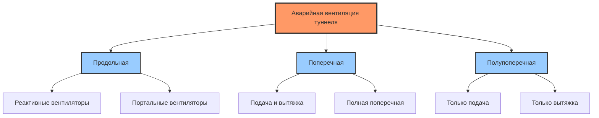
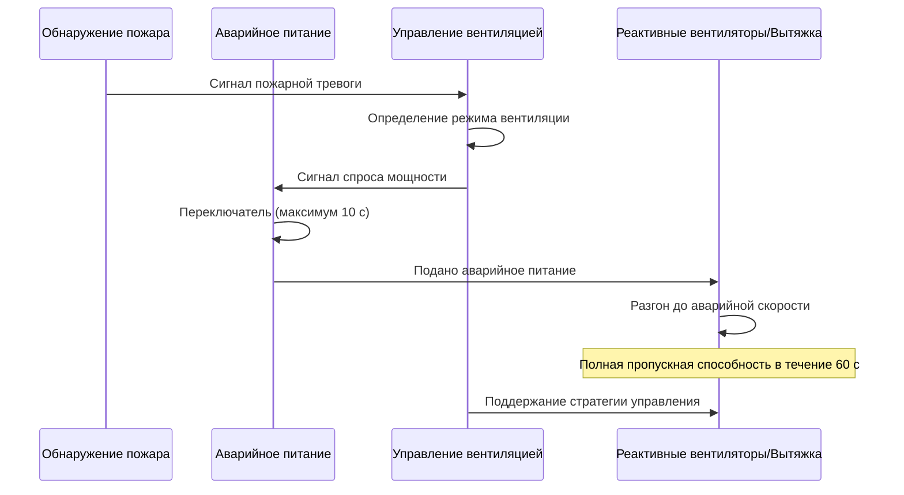

# Системы аварийной вентиляции туннелей

Системы аварийной вентиляции в автомобильных туннелях служат одной критической цели: поддержание условий, при которых возможна безопасная эвакуация во время пожарных чрезвычайных ситуаций. В отличие от обычных вентиляционных систем, управляющих качеством воздуха и удаляющих выбросы от транспортных средств, системы аварийной вентиляции должны контролировать движение дыма посредством мощных принципов гидродинамики при одновременной интеграции с обнаружением пожара, подавлением и инфраструктурой электроснабжения.

## Целевые показатели безопасности жизни

Основные целевые показатели безопасности жизни для аварийной вентиляции туннелей стратифицированы по времени и местоположению:

1. **Защита вверх по потоку**: Поддержание условий без дыма в направлении эвакуации
2. **Приемлемая среда**: Ограничение спуска слоя дыма, концентрации CO, снижения видимости и воздействия лучистого тепла
3. **Доступ для пожарных**: Обеспечение возможности приближения аварийных служб к источнику пожара
4. **Защита имущества**: Вторичная цель минимизации распространения огня и повреждения конструкций

NFPA 502 устанавливает, что аварийная вентиляция должна обеспечивать видимость не менее 10 м на путях эвакуации и ограничивать концентрацию CO ниже 1 400 ppm при воздействии менее 30 минут.

## Стратегии управления дымом

### Метод критической скорости

Для систем продольной вентиляции критическая скорость представляет минимальную скорость воздушного потока, необходимую для предотвращения обратного движения дыма против направления воздушного потока. Программа тестирования вентиляции пожара туннеля Memorial установила фундаментальную связь:

$$V_c = K \left(\frac{gHQ}{\rho_a C_p T_a A}\right)^{1/3}$$

Где:
- $V_c$ = критическая скорость (м/с)
- $K$ = безразмерная константа (0,61 для туннелей с нулевым уклоном)
- $g$ = ускорение свободного падения (9,81 м/с²)
- $H$ = высота слоя дыма ниже потолка (м)
- $Q$ = мощность теплоотдачи пожара (кВт)
- $\rho_a$ = плотность окружающего воздуха (кг/м³)
- $C_p$ = удельная теплоемкость воздуха (1,005 кДж/кг·К)
- $T_a$ = абсолютная температура окружающей среды (К)
- $A$ = площадь поперечного сечения туннеля (м²)

Для типичного автомобильного туннеля с пожаром мощностью 50 МВт (легковой автомобиль) критическая скорость составляет от 2,5 до 3,5 м/с в зависимости от геометрии туннеля и уклона.

### Типы вентиляционных систем

| Тип системы | Метод управления дымом | Типовое применение | Сложность управления |
|-------------|----------------------|-------------------|----------------------|
| Продольная | Поддержание критической скорости | Короткие туннели (<1 500 м) | Низкая |
| Поперечная | Распределенное дымоудаление | Длинные туннели, интенсивное движение | Высокая |
| Полупоперечная | Точечное дымоудаление или разбавление | Туннели средней длины | Средняя |

### Системы точечного дымоудаления

Системы точечного дымоудаления используют стратегически расположенные выходные точки для удаления дыма вблизи источника пожара. Требуемый расход вытяжки следует:

$$\dot{m}_e = \frac{Q}{C_p \Delta T_e}$$

Где:
- $\dot{m}_e$ = массовый расход вытяжки (кг/с)
- $Q$ = мощность теплоотдачи пожара (кВт)
- $\Delta T_e$ = повышение температуры удаляемого дыма (обычно 200–400 К)

Эффективное точечное дымоудаление требует срабатывания заслонок в течение 60 секунд после обнаружения пожара для захвата дыма перед значительным нарушением стратификации.

## Интеграция с обнаружением пожара и системами подавления

### Интерфейс системы обнаружения

Активация аварийной вентиляции зависит от быстрого обнаружения пожара посредством нескольких технологий датчиков:

**Сравнение технологий датчиков:**

| Тип датчика | Время отклика | Вероятность ложной тревоги | Пригодность для туннеля |
|------------|---------------|--------------------------|------------------------|
| Линейное тепловое обнаружение | 30–90 секунд | Очень низкая | Высокая |
| CCTV с видеоаналитикой | 15–45 секунд | Средняя | Высокая |
| CO дифференциал | 60–180 секунд | Средняя | Средняя |
| Обнаружение пламени (ИК/УФ) | 5–15 секунд | Низкая | Средняя |

Система управления вентиляцией должна получать дискретные сигналы тревоги от панели управления пожарной сигнализацией (FACP) и инициировать надлежащий аварийный режим без ручного вмешательства. NFPA 502 требует автоматической активации с возможностью ручного переопределения.

### Согласование с системами подавления

Системы пожаротушения на водной основе (дренчерные, водяно-туманные) создают критические взаимодействия с вентиляцией:

- **Охлаждение водяным туманом**: Снижает плавучесть, вызывая оседание дыма, если скорости вентиляции недостаточны
- **Импульс распыла**: Высокоскоростные капли воды могут нарушить стратификацию дыма
- **Образование пара**: Добавляет массовый расход к слою дыма, потенциально перегружая пропускную способность вытяжки

Проектирование системы вентиляции должно учитывать работу системы подавления, обычно требуя 20–30% повышенной пропускной способности для поддержания управления.

## Требования к источникам питания в аварийных ситуациях

Системы аварийной вентиляции туннелей требуют резервного питания со специальными критериями производительности:

**Стандарты аварийного питания NFPA 502:**

- Время переключения: максимум 10 секунд от потери питания до поступления аварийного питания
- Объем топлива: минимум 4 часа работы на полной нагрузке
- Автоматическое еженедельное тестирование с сигнализацией отказа
- Пропускная способность по нагрузке: 100% аварийного спроса вентиляции плюс освещение безопасности жизни

Размеры генератора должны учитывать одновременные пусковые токи, когда несколько крупных вентиляторов активируются. Типичный коэффициент разнообразия составляет 0,75 для систем более чем с 4 вентиляторами.

## Надежность системы управления

Система управления вентиляцией является критической системой безопасности жизни, требующей высокой надежности:

**Архитектура надежности:**

- **Избыточность**: Двойные программируемые логические контроллеры (PLC) с горячим резервным переходом
- **Связь**: Резервные сети оптического волокна с автоматическим переходом
- **Питание**: Двойные питающие линии от отдельных источников аварийного питания
- **Датчики**: Несколько датчиков на зону с логикой голосования (2 из 3)

Среднее время между отказами (MTBF) полной системы управления должно превышать 50 000 часов с допуском к отказу одной точки.

Алгоритмы управления должны выполнять изменения режима плавно, чтобы избежать колебаний давления, которые могут нарушить стратификацию дыма. Скорости изменения скорости вентилятора не должны превышать 10% в секунду.

## Тестирование и пусконаладка

### Функциональные испытания производительности

Пусконаладка систем аварийной вентиляции требует прогрессивной проверки:

1. **Проверка компонентов**: Кривые производительности отдельных вентиляторов, время хода заслонки, калибровка датчиков
2. **Тестирование подсистем**: Проверка управления зоной, последовательность переходов режимов
3. **Полные испытания системы с холодным дымом**: Неогневое испытание трассирующим газом для проверки картин воздушного потока
4. **Испытание горячим дымом (при необходимости)**: Контролируемое испытание пожара под наблюдением регулятора

Процедура испытания критической скорости включает:
- Установление целевой продольной скорости
- Развертывание трассирующих дымов в нескольких местах
- Проверка отсутствия обратного движения в течение 10-минутного периода стабилизации
- Документирование профиля скорости по поперечному сечению туннеля

### Критерии приемки

| Параметр | Требование NFPA 502 | Метод проверки |
|----------|-------------------|----------------|
| Время активации | ≤60 секунд от тревоги | Отмеченная по времени последовательность событий |
| Достижение критической скорости | Проектное значение ±10% | Измерения прохода скорости |
| Расстояние обратного движения | Ноль при расчетном пожаре | Визуализация дыма |
| Отклик системы управления | Изменение режима в течение 30 с | Тестирование логического моделирования |
| Передача аварийного питания | ≤10 секунд | Имитируемый отказ питания |

Ежегодное тестирование должно проверить продолжающееся соответствие исходным критериям приемки. Любые изменения геометрии туннеля, характера движения транспорта или оборудования вентиляции требуют инженерной переоценки адекватности аварийной вентиляции.

## Заключение

Системы аварийной вентиляции туннелей представляют пересечение гидродинамики, науки о пожарах и инженерии систем управления. Подход к проектированию, основанный на физических принципах и сосредоточенный на критической скорости и дымоудалении, обеспечивает, что эти системы выполняют свою миссию безопасности жизни при одновременной безупречной интеграции с инфраструктурой обнаружения, подавления и аварийного питания. Тщательное тестирование и пусконаладка подтверждают, что теоретическое проектирование преобразуется в надежную производительность в реальных условиях, когда от этого зависят жизни людей.
