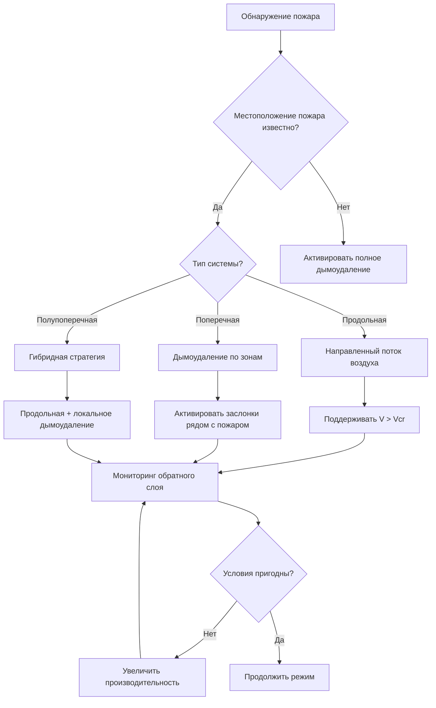
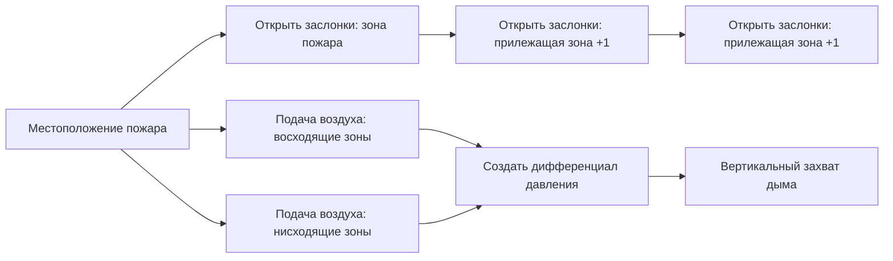
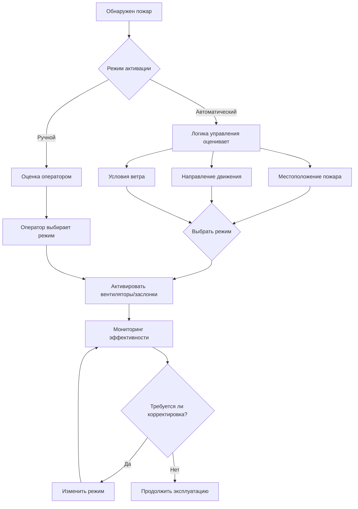

Режимы аварийной вентиляции представляют критические системы безопасности жизни при пожаре, которые активируются при обнаружении условий пожара внутри автомобильных туннелей. В отличие от нормальной вентиляции, которая поддерживает качество воздуха и удаляет выбросы транспортных средств, режимы аварийной работы приоритизируют управление дымом для поддержания пригодности условий эвакуации для занимающих туннель и обеспечения путей доступа для пожарных. Выбор и реализация стратегий аварийной вентиляции фундаментально зависят от геометрии туннеля, режимов движения транспорта и физики движения плавучего дыма.

## Физика движения дыма в условиях пожара

Дым, образующийся при пожаре, ведет себя как плавучая струя, приводимая в движение перепадом температур и импульсом. Объемный расход дымообразования масштабируется с тепловыделением пожара в соответствии с:

$$\dot{V}_s = 0.071 \cdot \dot{Q}_c^{1/3} \cdot (z - z_0)^{5/3}$$

где $\dot{V}_s$ — объемный расход дыма (м³/с), $\dot{Q}_c$ — конвективное тепловыделение (кВт), $z$ — высота над источником пожара (м), и $z_0$ — высота виртуального начала. Это соотношение демонстрирует, что производство дыма быстро увеличивается с интенсивностью пожара, требуя пропорциональной производительности вентиляции.

В конфигурациях туннелей расслоение дыма происходит, когда силы плавучести превышают силы смешивания от вентиляции. Критическая скорость для предотвращения обратного слоя дыма в продольных системах составляет:

$$V_{cr} = K_1 \cdot K_g \cdot \left(\frac{g \cdot \dot{Q}_c \cdot H}{C_p \cdot \rho_{\infty} \cdot T_{\infty} \cdot W}\right)^{1/3}$$

где $K_1$ — безразмерный коэффициент (типично 0.606), $K_g$ учитывает влияние уклона, $g$ — ускорение свободного падения (9,81 м/с²), $H$ — высота туннеля (м), $W$ — ширина туннеля (м), $C_p$ — удельная теплоемкость воздуха (1,005 кДж/кг·К), $\rho_{\infty}$ — плотность окружающего воздуха (кг/м³), и $T_{\infty}$ — температура окружающей среды (К).

## Классификация режимов аварийной работы

### Продольная аварийная вентиляция

Продольные системы устанавливают однонаправленный поток воздуха вдоль оси туннеля для предотвращения обратного слоя дыма выше по потоку от пожара. Этот подход основан на поддержании скорости потока воздуха выше критической скорости на всем пораженном участке туннеля.

**Характеристики эксплуатации:**

| Параметр | Типичный диапазон | Основание проектирования |
|-----------|--------------|--------------|
| Критическая скорость | 2,5–3,5 м/с | Тепловыделение 100–300 МВт |
| Время отклика | 30–120 секунд | Ускорение вентилятора |
| Ограничение дыма | Только ниже по потоку | Физический анализ |
| Пригодная длина | 100–400 м выше по потоку | Валидация CFD |

Уравнение импульса, управляющее продольным потоком с теплоотдачей от пожара, имеет вид:

$$\frac{dP}{dx} = -\rho \cdot V \cdot \frac{dV}{dx} - \rho \cdot g \cdot \sin(\theta) - \frac{f \cdot \rho \cdot V^2}{2 \cdot D_h} + \frac{\dot{Q}_c}{A \cdot C_p \cdot T}$$

Это соотношение показывает, что поддержание скорости требует преодоления потерь давления от ускорения, гравитационных эффектов на уклоне, трения стенок и теплового расширения от теплоотдачи пожара.

### Поперечная аварийная вентиляция

Поперечные системы удаляют дым через потолочные заслонки или точки выпуска, расположенные рядом с пожаром, при этом подавая свежий воздух на уровне проезжей части. Эта конфигурация создает вертикальную схему потока воздуха, которая захватывает дым до значительного продольного распространения.

**Конфигурация зоны дымоудаления:**

Требуемый расход дымоудаления на единицу длины туннеля определяется как:

$$\dot{V}_{extract} = \frac{\dot{Q}_c}{C_p \cdot \rho_{\infty} \cdot (T_{smoke} - T_{\infty})} + V_{makeup} \cdot A_{tunnel}$$

где $T_{smoke}$ — температура дыма (типично 400–600°C рядом с пожаром) и $V_{makeup}$ — скорость подпиточного воздуха на уровне проезжей части (0,5–1,5 м/с).

## Влияние обнаружения местоположения пожара

Эффективность режима аварийной работы критически зависит от точного обнаружения местоположения пожара. Современные системы используют множество технологий обнаружения:

| Метод обнаружения | Время отклика | Точность местоположения | Коэффициент надежности |
|------------------|---------------|-------------------|-------------------|
| Линейное тепловое обнаружение | 10–30 секунд | ±10 м | Высокий (0,95–0,99) |
| Видеообнаружение | 20–60 секунд | ±20 м | Средний (0,85–0,95) |
| Отбор воздуха (VESDA) | 30–90 секунд | ±50 м | Высокий (0,90–0,98) |
| Матрица датчиков CO | 60–180 секунд | ±100 м | Средний (0,80–0,90) |

Неточное обнаружение местоположения может привести к дымоудалению из неправильных зон, потенциально направляя дым через занимаемые пути эвакуации. Вероятность правильного выбора режима $P_{correct}$ связана с точностью обнаружения через:

$$P_{correct} = 1 - \left(\frac{\Delta x_{error}}{L_{zone}}\right) \cdot e^{-\lambda \cdot t_{response}}$$

где $\Delta x_{error}$ — ошибка местоположения, $L_{zone}$ — длина зоны вентиляции, $\lambda$ — скорость роста пожара (с⁻¹), и $t_{response}$ — время отклика системы.

## Возможности разворота вентилятора

Обратимые реактивные вентиляторы или основные вентиляторы вентиляции позволяют адаптироваться к местоположению пожара относительно портальных позиций. Процесс разворота включает:

1. **Фаза замедления**: Снизить работающие вентиляторы до нулевой скорости (15–45 секунд)
2. **Переключение стартера**: Переключить электрические соединения двигателя (5–15 секунд)
3. **Фаза ускорения**: Увеличивать скорость вентиляторов до целевой скорости в обратном направлении (30–90 секунд)

Общее время разворота типично варьируется от 60–180 секунд, во время которого скорость потока воздуха может упасть ниже критической скорости, позволяя временному обратному слою дыма. Требуемое изменение импульса составляет:

$$\Delta (m \cdot V) = \rho \cdot A \cdot L \cdot (V_{final} - V_{initial})$$

Для участка туннеля длиной 1000 м, разворачивающегося с +3 м/с на -3 м/с, это представляет значительный импульс жидкости, который не может быть изменен мгновенно.

## Автоматическая или ручная активация

**Сравнение стратегий управления:**

| Аспект | Автоматическое управление | Ручное управление |
|--------|------------------|----------------|
| Время отклика | 30–90 секунд | 120–300 секунд |
| Точность режима | 92–98% (зависит от алгоритма) | 85–95% (зависит от оператора) |
| Адаптивность | Ограничена запрограммированными сценариями | Высокая гибкость |
| Надежность | Зависит от сети датчиков | Зависит от присутствия оператора |
| Соответствие NFPA 502 | Удовлетворяет требованию быстрого отклика | Требует резервной автоматизации |

NFPA 502 требует автоматического инициирования аварийной вентиляции в течение периода времени, который предотвращает непригодные условия на путях эвакуации. Чисто ручные системы типично не могут соответствовать этому требованию из-за задержек обнаружения и времени принятия решения оператором. Лучшая практика реализации использует автоматическую активацию с возможностью ручного переопределения, позволяя операторам изменять режим аварийной работы на основе видеонаблюдения в реальном времени и координации с пожарной службой.

## Матрица выбора режима

Оптимальный режим аварийной работы зависит от факторов, специфичных для туннеля:

| Характеристика туннеля | Предпочтительный режим | Обоснование |
|----------------------|----------------|-----------|
| Длина < 500 м | Естественная вентиляция или продольная | Простая, рентабельная |
| Длина 500–1500 м | Продольная с реактивными вентиляторами | Достижимая критическая скорость |
| Длина > 1500 м | Поперечная или полупоперечная | Ограничения ограничения дыма |
| Двусторонний трафик | Поперечная | Непредсказуемое местоположение пожара |
| Крутой уклон (>4%) | Поперечная или продольная вверх по уклону | Уклон способствует движению дыма |
| Большой объем трафика | Поперечная с управлением по зонам | Максимизирует пригодную площадь эвакуации |

Выбор режима аварийной вентиляции фундаментально уравновешивает физику движения дыма, требования надежности систем и целевые показатели безопасности жизни для создания пригодных условий для эвакуации занимающих туннель и доступа аварийных служб спасения во время событий пожара в туннеле.
