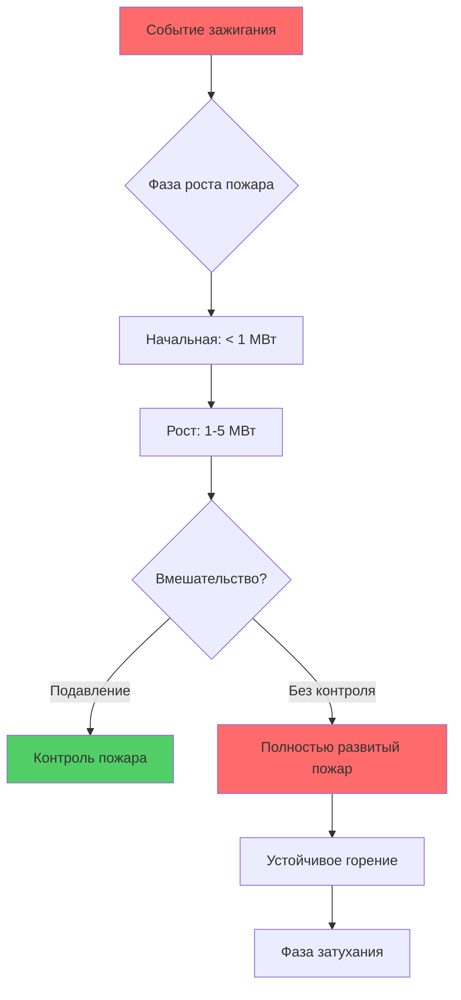
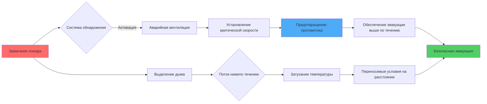

## Мощность теплового выделения проектного пожара

Мощность теплового выделения (МТВ) определяет тепловую энергию, выделяемую пожаром, и определяет все расчеты проектирования вентиляции туннеля. МТВ прямо определяет конвективный теплообмен с воздухом, движение дыма, обусловленное плавучестью, и требуемую производительность вентиляции.

### Категории размера пожара

Сценарии проектного пожара классифицируются по типу транспортного средства и груза, при этом значения МТВ устанавливаются на основе полномасштабных испытаний пожаров и анализа данных инцидентов.

| Тип транспортного средства | Проектная МТВ | Основание | Ссылка NFPA 502 |
|--------------|-----------|-------|-------------------|
| Легковой автомобиль | 5 МВт | Пожар одиночного транспортного средства | Раздел 4.3.1 |
| Автобус | 20-30 МВт | Высокая нагрузка топлива, множество сидений | Раздел 4.3.2 |
| Грузовой автомобиль (ГА) | 20-100 МВт | Зависит от груза | Раздел 4.3.3 |
| Пожар цистерны | 200-300 МВт | Углеводородные пожары разлива | Требуется специальный анализ |

Проектный пожар легкового автомобиля мощностью 5 МВт представляет пик горения со всеми горючими материалами (сиденья, пластмассы, топливо). Современные автомобили с повышенным содержанием пластмасс могут достичь 8-10 МВт, но 5 МВт остается отраслевым стандартом для проектирования.

Пожары ГА демонстрируют широкую изменчивость в зависимости от груза. Тягач с прицепом, перевозящий инертные грузы, производит примерно 20 МВт, в то время как легковоспламеняющийся груз (мебель, упакованные товары) может достичь 50-100 МВт. Сценарий 100 МВт представляет тяжелое вероятное событие, используемое для проектирования систем спасения жизни.

## Характеристики роста пожара

Рост пожара следует предсказуемым закономерностям на основе силы источника зажигания и расположения топлива. Модель пожара по закону t² описывает скорость роста.

### Модель пожара по закону t²

Мощность теплового выделения увеличивается пропорционально квадрату времени во время фазы роста:

$$Q(t) = \alpha t^2$$

где:
- $Q(t)$ = мощность теплового выделения в момент времени $t$ (кВт)
- $\alpha$ = коэффициент роста пожара (кВт/с²)
- $t$ = время от зажигания (с)

Коэффициенты роста классифицируются по интенсивности горения:

| Скорость роста | α (кВт/с²) | Время достижения 1 МВт | Применение |
|-------------|-----------|--------------|-------------|
| Медленная | 0,00293 | 585 с (~10 мин) | Материалы, трудно воспламеняющиеся |
| Средняя | 0,0117 | 293 с (~5 мин) | Деревянные поддоны, обычные горючие материалы |
| Быстрая | 0,0466 | 147 с (~2,5 мин) | Мебель с обивкой, штабелированные товары |
| Очень быстрая | 0,1874 | 73 с (~1,2 мин) | Легковоспламеняющиеся жидкости, пластмассы с большой площадью поверхности |

Пожары транспортных средств обычно демонстрируют быстрый рост для легковых автомобилей (пластиковые салоны, обивка) и средне-быстрый рост для ГА в зависимости от доступности груза.

Время достижения проектной МТВ определяет требования к обнаружению и доступное время эвакуации:

$$t_{design} = \sqrt{\frac{Q_{design}}{\alpha}}$$

Для пожара легкового автомобиля мощностью 5 МВт с быстрым ростом:

$$t_{design} = \sqrt{\frac{5000}{0,0466}} = 328 \text{ с} \approx 5,5 \text{ мин}$$

Этот период роста определяет временную шкалу для уведомления, принятия решений и инициирования эвакуации.

## Выделение дыма и массовый расход

Горение генерирует дым со скоростями, пропорциональными МТВ и составу топлива. Скорость выделения дыма определяет требования объемного расхода воздуха для систем вентиляции.

### Конвективное тепловыделение

Только конвективная часть полной МТВ способствует плавучести дыма и повышению температуры:

$$Q_c = \chi_c Q_{total}$$

где $\chi_c$ — коэффициент конвективной доли (обычно 0,6-0,7 для пожаров транспортных средств).

### Массовый расход дыма

Массовый расход дыма в точке пожара рассчитывается на основе конвективного теплового выделения:

$$\dot{m} = \frac{Q_c}{c_p \Delta T}$$

где:
- $\dot{m}$ = массовый расход дыма (кг/с)
- $Q_c$ = конвективная МТВ (кВт)
- $c_p$ = удельная теплоемкость воздуха (1,005 кДж/кг·К)
- $\Delta T$ = повышение температуры выше окружающей (К)

Для пожара легкового автомобиля мощностью 5 МВт с $\chi_c = 0,7$ и $\Delta T = 600$ К:

$$\dot{m} = \frac{0,7 \times 5000}{1,005 \times 600} = 5,8 \text{ кг/с}$$

Преобразование в объемный расход при средней температуре дыма (300°C выше окружающей):

$$\dot{V} = \frac{\dot{m}}{\rho} = \frac{5,8}{0,62} \approx 9,4 \text{ м}^3/\text{с} = 560 \text{ CFM (м³/ч)}$$

Это представляет минимальную скорость извлечения, необходимую для удаления дыма со скоростью его выделения, без учета предотвращения противотока.

## Критическая скорость для управления противотоком дыма

Критическая скорость — это минимальная продольная скорость воздуха, необходимая для предотвращения движения дыма вверх против потока вентиляции (противоток дыма). Противоток дыма блокирует маршруты эвакуации и должен быть предотвращен.

### Физическая основа

Дым поднимается благодаря плавучести от теплового расширения. Продольный поток воздуха создает силу сопротивления на дымовой поток. Критическая скорость достигается, когда сила сопротивления равна силе плавучести, ограничивая дым нижней стороной потока.

Сила плавучести на единицу объема:

$$F_b = \rho_{\infty} g \left(1 - \frac{T_{\infty}}{T_s}\right)$$

Сила сопротивления от потока воздуха:

$$F_d = \frac{1}{2} \rho_{\infty} C_d v^2$$

### Уравнение критической скорости Memorial Tunnel

На основе полномасштабных испытаний пожаров в туннеле Memorial Tunnel (1995) критическая скорость составляет:

$$V_{crit} = K_1 K_g \left(\frac{Q}{W}\right)^{1/3}$$

где:
- $V_{crit}$ = критическая скорость (м/с)
- $K_1$ = размерная постоянная = 0,606 для единиц СИ
- $K_g$ = коэффициент уклона, учитывающий наклон туннеля
- $Q$ = конвективная МТВ (кВт)
- $W$ = ширина туннеля (м)

Для туннелей с уклоном:

$$K_g = \left(1 + 0,04G\right)^{0,5}$$

где $G$ — уклон в процентах (положительное значение для направления потока вверх).

### Пример проектирования

Для туннеля шириной 10 м, уклон 3% вверх, пожар 5 МВт ($Q_c = 3,5$ МВт):

$$K_g = \sqrt{1 + 0,04(3)} = \sqrt{1,12} = 1,058$$

$$V_{crit} = 0,606 \times 1,058 \times \left(\frac{3500}{10}\right)^{1/3} = 0,641 \times 7,05 = 4,52 \text{ м/с}$$

Проектная скорость обычно включает коэффициент безопасности 1,25-1,5:

$$V_{design} = 1,25 \times 4,52 = 5,65 \text{ м/с} \approx 1115 \text{ CFM (м³/ч)}$$

| Размер пожара (МВт) | Ширина туннеля (м) | Критическая скорость (м/с) | Проектная скорость (м/с) |
|----------------|------------------|------------------------|----------------------|
| 5 (легковой) | 8 | 4,9 | 6,1 |
| 5 (легковой) | 12 | 4,2 | 5,3 |
| 20 (ГА) | 8 | 7,4 | 9,3 |
| 20 (ГА) | 12 | 6,4 | 8,0 |
| 100 (ГА) | 12 | 11,3 | 14,1 |

Критическая скорость увеличивается с размером пожара (соотношение МТВ^1/3) и уменьшается с шириной туннеля. Более широкие туннели требуют меньших скоростей благодаря снижению скорости дымового слоя и влияния плавучести.

## Переносимые условия и критерии эвакуации

Переносимость определяет условия окружающей среды, пригодные для выживания эвакуирующихся людей. Пределы проектирования обеспечивают, чтобы люди могли достичь безопасности до того, как условия станут невыносимыми.

### Пределы переносимости

| Параметр | Переносимый предел | Основание |
|-----------|---------------|-------|
| Температура | 60°C на высоте 2 м | Тепловая переносимость, боль при дыхании |
| Видимость | 10 м | Ориентирование, снижение скорости ходьбы |
| Концентрация CO | 1500 ppm в течение 30 мин | Порог потери дееспособности |
| Истощение кислорода | 15% O₂ | Начало нарушения когнитивных функций |

Температура на высоте головы (2 м) является основным критерием проектирования. Температура дымового слоя снижается с расстоянием от пожара из-за потерь тепла на поверхности туннеля и втягивания воздуха.

### Затухание температуры

Продольная вентиляция охлаждает дым через смешивание и теплопередачу поверхности. Эмпирические корреляции из испытаний пожаров в туннелях:

$$\Delta T(x) = \Delta T_{max} \exp\left(-\frac{x}{L_d}\right)$$

где:
- $\Delta T(x)$ = повышение температуры на расстоянии $x$ от пожара (К)
- $\Delta T_{max}$ = максимальное повышение температуры в месте пожара (К)
- $L_d$ = постоянная длины затухания (м)

Длина затухания зависит от скорости вентиляции и геометрии туннеля. Более высокие скорости увеличивают турбулентное смешивание и теплопередачу, сокращая $L_d$.

Поддержание продольной скорости выше критической скорости обеспечивает пути эвакуации без дыма выше по течению от пожара, в то время как контроль температуры нижепо течения осуществляется через достаточный расход воздуха и расстояние.

## Сценарии расположения проектного пожара

Расположение пожара относительно геометрии туннеля и аварийных выходов определяет стратегию вентиляции и требования производительности.

**Пожар в центре**: Максимальное расстояние до выходов в обоих направлениях. Критично для естественно вентилируемых туннелей или систем с двусторонней возможностью потока.

**Пожар у портала**: Асимметричная эвакуация с одним коротким и одним длинным маршрутом эвакуации. Направление вентиляции должно быть выбрано для защиты более длинного маршрута.

**Пожар у поперечного хода**: Сокращенное расстояние в пути, но требуется координация между трубами туннеля, если вентиляция создает разности давлений.

Неопределенность в расположении пожара требует надежных систем вентиляции, способных управлять дымом независимо от положения пожара в защищаемой зоне. NFPA 502 требует анализа множественных сценариев пожаров для проверки адекватной защиты.
