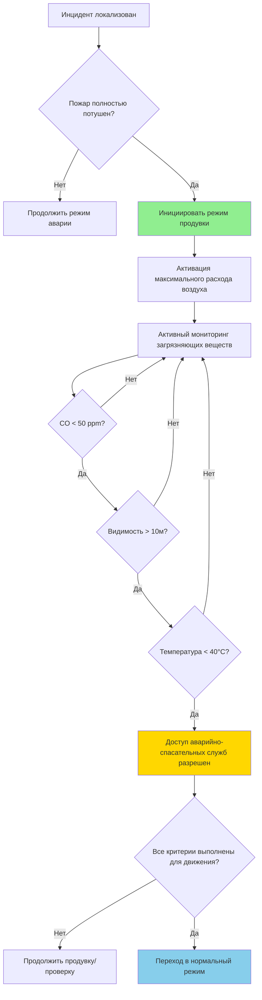
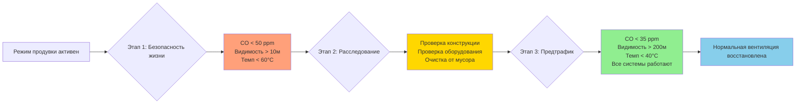

## Обзор

Продувочная вентиляция представляет завершающий этап аварийной вентиляции туннеля, переходящий от активного управления дымом к полному удалению загрязняющих веществ и восстановлению нормальных атмосферных условий. Этот режим обеспечивает максимальный воздухообмен для устранения остаточных продуктов сгорания, восстановления видимости и создания безопасных условий для аварийно-спасательных служб и последующего возобновления движения.

Процесс продувки включает сложную гидродинамику жидкости, при которой загрязненный воздух должен систематически вытесняться свежим воздухом при сохранении положительных градиентов давления для предотвращения переконтаминации из соседних зон.

## Фундаментальная физика продувочной вентиляции

### Материальный баланс и теория разбавления

Процесс продувки следует кинетике первого порядка для снижения концентрации загрязняющих веществ. Фундаментальное соотношение, определяющее удаление загрязняющих веществ:

$$C(t) = C_0 \cdot e^{-\frac{Q}{V} \cdot t}$$

Где:
- $C(t)$ = концентрация загрязняющего вещества в момент времени $t$ (ppm или мг/м³)
- $C_0$ = начальная концентрация загрязняющего вещества
- $Q$ = объемный расход воздуха (м³/с)
- $V$ = объем туннеля (м³)
- $t$ = время продувки (с)

Кратность воздухообмена $N$ (ACH) определяется как:

$$N = \frac{Q}{V} \times 3600 \text{ (ACH)}$$

### Экспоненциальная модель разбавления

Для практического применения количество воздухообменов, необходимых для достижения целевого снижения концентрации, следует:

$$n = -\ln\left(\frac{C_f}{C_0}\right)$$

Где $n$ — количество теоретических воздухообменов, необходимых для снижения концентрации с $C_0$ до $C_f$.

Для 99% удаления загрязняющего вещества: $n = -\ln(0,01) = 4,6$ воздухообменов

Для удаления 99,9%: $n = 6,9$ воздухообменов

**Критическое замечание:** Эти расчеты предполагают идеальное перемешивание, которое никогда не происходит в геометрии туннелей. Должен быть применен коэффициент эффективности смешивания $\eta_m$ (обычно 0,6–0,8):

$$n_{actual} = \frac{n_{theoretical}}{\eta_m}$$

## Оперативные стратегии режима продувки

### Продольная конфигурация продувки

Максимальный односторонний воздушный поток выводит загрязняющие вещества к порталам. Требования к скорости:

$$V_{purge} = 1,5 \text{ до } 3,0 \text{ м/с}$$

Ниже, чем скорости аварийного режима (3–5 м/с), для снижения энергопотребления при сохранении эффективного пробойного потока.

### Поперечная/полупоперечная продувка

Системы подачи и вытяжки воздуха работают на максимальной мощности. Эффективная кратность воздухообмена:

$$N_{effective} = \frac{Q_{supply} + Q_{exhaust}}{2V} \times 3600 \times \eta_m$$

Для обеспечения надежности обе системы работают, даже если теоретические расчеты предполагают достаточность одной системы.

## Расчеты времени очистки

### Стандартное время продувки туннеля

Учитывая параметры туннеля:
- Длина: $L = 1000$ м
- Площадь поперечного сечения: $A = 50$ м²
- Объем: $V = 50 000$ м³
- Расход воздуха при продувке: $Q = 150$ м³/с
- Требуемое снижение: 99% (4,6 воздухообменов)
- Эффективность смешивания: $\eta_m = 0,7$

**Расчет:**

Кратность воздухообмена:
$$N = \frac{150 \times 3600}{50 000} = 10,8 \text{ ACH}$$

Время одного воздухообмена:
$$t_{AC} = \frac{3600}{10,8} = 333 \text{ секунды} = 5,55 \text{ минут}$$

Требуемые воздухообмены:
$$n_{actual} = \frac{4,6}{0,7} = 6,57$$

**Общее время продувки:**
$$t_{purge} = 6,57 \times 5,55 = 36,5 \text{ минут}$$

## Мониторинг загрязняющих веществ во время продувки

### Критические параметры и пороги

| Параметр | Место измерения | Порог для аварийно-спасательных служб | Порог для возобновления движения | Частота мониторинга |
|-----------|---------------------|-------------------------------|------------------------------|---------------------|
| Окись углерода (CO) | Множественные точки каждые 100м | < 50 ppm | < 35 ppm | Непрерывно |
| Видимость (коэффициент экстинкции) | Портал и середина туннеля | > 10 м | > 200 м | Непрерывно |
| Температура | На уровне потолка | < 60°C | < 40°C | Непрерывно |
| Двуокись углерода (CO₂) | Представительные точки | < 5000 ppm | < 1000 ppm | Каждые 5 мин |
| Твердые частицы (PM₂.₅) | Точки вытяжки | < 500 мкг/м³ | < 35 мкг/м³ | Каждые 5 мин |
| Кислород (O₂) | Множественные зоны | > 19,5% | > 20,5% | Непрерывно |

**Требование пространственного распределения:** NFPA 502 рекомендует точки мониторинга, расположенные не более чем на 150 м друг от друга для туннелей длиной более 300 м.

### Физика восстановления видимости

Оптическая плотность дыма следует закону Бера–Ламберта:

$$I = I_0 \cdot e^{-K \cdot L}$$

Где:
- $I$ = интенсивность переданного света
- $I_0$ = интенсивность падающего света
- $K$ = коэффициент экстинкции (м⁻¹)
- $L$ = длина пути (м)

Расстояние видимости $S$ (расстояние, на котором объекты становятся различимы) связано с коэффициентом экстинкции:

$$S = \frac{C}{K}$$

Где $C$ — константа контраста (обычно 2–3 для освещенных объектов, 8 для самосветящихся объектов).

Для возобновления движения, требующего видимости 200 м:

$$K_{max} = \frac{3}{200} = 0,015 \text{ м}^{-1}$$

## Критерии возврата к нормальной работе

### Многоуровневый подход к очистке

**Уровень 1 — Доступ аварийно-спасательных служб (целевой диапазон 10–15 минут):**
- Основной приоритет: безопасность жизни при проведении спасательных операций
- Пониженная видимость приемлема с надлежащими средствами защиты
- Повышенное содержание CO допустимо для краткосрочных операций с SCBA

**Уровень 2 — Доступ персонала обслуживания (целевой диапазон 30–45 минут):**
- Проверка оборудования и оценка повреждений
- Дыхательная защита все еще требуется, но менее строгая
- Видимость должна поддерживать детальный визуальный осмотр

**Уровень 3 — Возобновление движения (обычно 60+ минут):**
- Полное восстановление атмосферы
- Дыхательная защита не требуется
- Нормальная видимость для безопасного движения транспорта
- Все системы безопасности проверены и работают

## Требования NFPA 502 для режима продувки

Ключевые спецификации из стандарта NFPA 502 для дорожных туннелей, мостов и других ограниченных проездов:

**Раздел 7.7 — Проектирование аварийной системы вентиляции:**
- Режим продувки должен обеспечивать способность достичь минимум 6 воздухообменов в час
- Мониторинг загрязняющих веществ требуется на всех этапах аварийной работы
- Переход системы вентиляции в режим продувки должен происходить автоматически или по команде оператора в течение 2 минут

**Раздел 7.8.4 — Производительность продувочной вентиляции:**
- Система должна поддерживать продольную скорость, достаточную для предотвращения обратного слоя при переходе
- Минимальный расход воздуха при продувке: больший из 6 ACH или расход, создающий скорость 1,5 м/с

**Критическое замечание по проектированию:** Производительность продувки часто определяет размер вентилятора, несмотря на то, что аварийный режим получает основное внимание при проектировании.

## Продвинутая оптимизация продувки

### Стратегия продувки с переменной скоростью

Вместо работы при постоянной максимальной мощности интеллектуальное управление модулирует расход воздуха на основе измерений загрязняющих веществ в реальном времени:

$$Q_{controlled}(t) = Q_{max} \times \left(0,3 + 0,7 \times \frac{C(t)}{C_{threshold}}\right)$$

Такой подход снижает энергопотребление на 30–40% при сохранении адекватных скоростей очистки по мере снижения концентрации.

### Зональная продувка для длинных туннелей

Туннели длиной более 2 км выигрывают от последовательной зональной продувки, а не одновременной полной продувки. Каждая зона достигает критериев очистки перед инициированием максимальной продувки в следующей зоне, что снижает пиковый спрос на электроэнергию.

## Практические аспекты внедрения

**Предотвращение срыва вентилятора:** Внезапный переход из режима высокого давления в режим продувки создает риск срыва вентилятора. Последовательности управления должны включать периоды разгона продолжительностью 30–60 секунд.

**Нарушение термической стратификации:** Остаточные горячие газы накапливаются у потолка. Режим продувки должен поддерживать достаточную скорость для нарушения стратификации и обеспечения полной очистки верхних уровней.

**Эффекты порталов:** Загрязненный воздух, выходящий из порталов, может циркулировать, если метеорологические условия создают зоны низкого давления у входов туннеля. Воздушные завесы на порталах или периметральный мониторинг предотвращает переконтаминацию.

**Электрическая мощность:** Режим продувки может представлять пиковый спрос на электроэнергию, если все вентиляторы работают одновременно. Стратегии управления нагрузкой координируют последовательность запуска вентиляторов.

---

**Связанные темы:**
- [Последовательности управления аварийной вентиляцией](../control-sequences/)
- [Стратегии управления дымом](../smoke-management/)
- [Динамика пожара в туннелях](../tunnel-fire-scenarios/)
