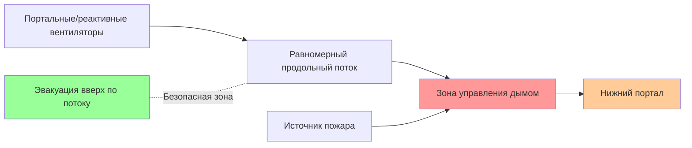
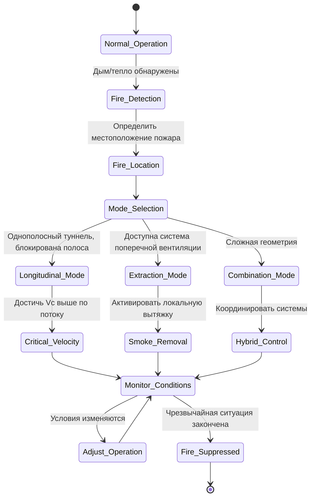

Управление дымом в туннелях представляет одну из наиболее критичных задач безопасности жизни в технике HVAC. Во время пожара поток дыма, вызванный плавучестью, взаимодействует с принудительной вентиляцией, создавая сложную динамику жидкости, которая определяет выживание людей. Основная цель — поддержание приемлемых условий эвакуации выше по потоку от пожара и предотвращение обратного потока дыма.

## Основная физика дыма

Генерируемый пожаром дым обладает плавучестью из-за его меньшей плотности по сравнению с окружающим воздухом. Сила плавучести на единицу объема составляет:

$$F_b = g(\rho_a - \rho_h)$$

где $\rho_a$ — плотность окружающего воздуха, а $\rho_h$ — плотность горячего газа. Эта сила плавучести вызывает стратификацию дыма и вертикальное движение. В туннеле продольная скорость воздуха может контролировать направление миграции дыма, но взаимодействие между плавучестью и принудительным потоком определяет поведение дыма.

Скорость выделения тепла (HRR) от пожара определяет скорость производства дыма и повышение температуры. NFPA 502 указывает размеры расчетных пожаров в диапазоне от 20 МВт для пассажирских автомобилей до 100+ МВт для тяжелых грузовых автомобилей. Коэффициент конвективного выделения тепла $Q_c$ (обычно 70% от общего HRR) определяет массовый расход дыма:

$$\dot{m}_{smoke} = \frac{Q_c}{c_p \Delta T}$$

где $c_p = 1,005 \text{ кДж/кг·К}$ — удельная теплоемкость воздуха, $\Delta T$ — повышение температуры над окружающей температурой.

## Концепция критической скорости

Критическая скорость $V_c$ представляет минимальную продольную скорость воздуха, необходимую для предотвращения обратного потока дыма (миграции дыма выше по потоку) при пожаре в туннеле. Ниже критической скорости движение дыма, вызванное плавучестью, преодолевает принудительный воздушный поток, вызывая распространение дыма против направления вентиляции. Это создает неприемлемые условия для эвакуируемых выше по потоку от пожара.

Программа испытаний вентиляции при пожаре в туннеле Memorial Tunnel установила эмпирические корреляции для критической скорости. Для нормальных уклонов туннеля основное соотношение имеет вид:

$$V_c = K_1 \left(\frac{Q^*}{A}\right)^{1/3}$$

где $Q^* = Q_c / (\rho_\infty c_p T_\infty \sqrt{g H} A)$ — безразмерная скорость выделения тепла, $A$ — площадь поперечного сечения туннеля, $H$ — высота туннеля, $\rho_\infty$ — плотность окружающего воздуха, $T_\infty$ — окружающая температура, и $K_1 \approx 0,606$ для большинства конфигураций туннелей.

Для уклонов туннеля критическая скорость корректируется в соответствии с:

$$V_c(\theta) = V_c(0) \left(1 + 0,0385 \theta \right)^{-0,5}$$

где $\theta$ — уклон в процентах. Восходящие уклоны снижают требуемую критическую скорость, поскольку плавучесть и вентиляция действуют вместе; нисходящие уклоны увеличивают её, так как они противодействуют потоку, вызванному плавучестью.

## Системы продольной вентиляции

Продольная вентиляция использует реактивные вентиляторы или портальные вентиляторы для создания равномерной скорости воздуха по всей длине туннеля. Система работает по принципам передачи импульса: высокоскоростные потоки из сопел вентилятора вовлекают воздух туннеля, создавая основной поток.

Тяга реактивного вентилятора $T$ связана с вовлеченным расходом воздуха через коэффициент тяги:

$$Q_{induced} = \frac{V_c \cdot A}{\eta_{system}}$$

где $\eta_{system}$ учитывает трение туннеля, блокировку и эффективность расположения вентилятора (обычно 0,65–0,85). Каждый реактивный вентилятор обеспечивает тягу в соответствии с:

$$T = \dot{m}_{jet}(V_{jet} - V_{tunnel}) + A_{jet}(P_{jet} - P_{tunnel})$$

Доминирует член импульса; член давления незначителен для дозвуковых потоков.

NFPA 502 требует, чтобы системы продольной вентиляции достигали критической скорости в сценариях расчетного пожара при одновременном поддержании приемлемых условий ниже по потоку от пожара. Система должна учитывать влияние пробок на дороге, которые могут уменьшить эффективную площадь туннеля на 30–50% и локально увеличить требуемые скорости.

## Поперечная и полупоперечная вентиляция

Системы поперечной вентиляции обеспечивают независимое снабжение воздухом и вытяжку через воздуховоды, проходящие по длине туннеля, с распределёнными точками подачи и вытяжки. Такая конфигурация позволяет локализованное управление дымом и поддерживает приемлемые условия в обе стороны от пожара.

| Тип системы | Подача воздуха | Вытяжка дыма | Преимущества | Ограничения |
|-------------|-----------|---------------|------------|-------------|
| Полная поперечная | Воздуховод к потолку | Воздуховод от потолка/пола | Отличное управление дымом, двусторонняя эвакуация | Высокие капитальные затраты, требования к пространству |
| Полупоперечная (подача) | Воздуховод к потолку | Портальная вытяжка | Хорошее разбавление дыма, более низкие затраты | Ограниченная вытяжка дыма |
| Полупоперечная (вытяжка) | Портальная подача | Воздуховод от потолка | Эффективное удаление дыма | Требует достаточного подпиточного воздуха |
| Продольная | Нет воздуховодов | Портальная вытяжка | Наиболее низкие затраты, простая эксплуатация | Только односторонняя эвакуация |

В полной системе поперечной вентиляции вытяжка дыма происходит через вытяжные отверстия на уровне потолка. Объёмный расход вытяжки на единицу длины должен превышать локальное производство дыма, чтобы предотвратить опускание слоя дыма:

$$\dot{V}_{exhaust/m} > \frac{\dot{m}_{smoke}}{\rho_{smoke} \cdot L_{active}}$$

где $L_{active}$ — длина активированной зоны вытяжки (обычно 60–120 м, центрированной на пожаре).

Системы поперечной вентиляции создают в туннеле плоскость нейтрального давления. Ниже этой плоскости подача свежего воздуха поддерживает положительное давление; выше неё вытяжка создаёт отрицательное давление для захвата дыма. Расположение этой плоскости критически влияет на эффективность захвата дыма.

## Режимы аварийной работы

NFPA 502 требует автоматического обнаружения пожара и активации аварийной вентиляции. Режимы аварийной работы адаптируют стратегию вентиляции к месторасположению, масштабу пожара и условиям дорожного движения.

Основные принципы эксплуатации:

**Поддержание приемлемых условий**: Аварийная вентиляция должна поддерживать видимость >10 м, температуру <60°C и концентрацию CO <1400 ppm в путях эвакуации в течение требуемого безопасного времени эвакуации (RSET). NFPA 502 указывает минимум 6 минут для коротких туннелей, более длительное время для протяженных туннелей.

**Стратификация дыма**: Чрезмерная скорость вентиляции нарушает тепловую стратификацию, смешивая дым вниз и снижая видимость. Для систем продольной вентиляции скорости не должны превышать $1,5 \times V_c$ для сохранения преимуществ стратификации.

**Реагирование на скопление транспорта**: Остановленный транспорт значительно изменяет аэродинамику. Коэффициент блокировки $\beta = A_{vehicles}/A_{tunnel}$ может достигать 0,3–0,5, требуя более высокой производительности вентилятора для достижения целевых скоростей через ограниченное поперечное сечение:

$$V_{required} = \frac{V_c}{1-\beta}$$

**Адаптация к расположению происшествия**: Пожар рядом с портальными отверстиями может позволить естественной вентиляции, подкреплённой вентиляторами. Пожары в середине туннеля длинных туннелей требуют максимальной мощности вентиляции. Конструкция системы должна предусматривать наихудший сценарий расположения пожара.

**Координация с системами подавления**: Водяное пожаротушение снижает HRR, но вырабатывает пар, временно увеличивая объём дыма. Системы вентиляции должны выдерживать этот переходный рост нагрузки.

Высота интерфейса слоя дыма над проезжей частью определяет жизнеспособность эвакуации. Для стратифицированного слоя со скоростью выделения тепла $Q_c$:

$$z_{interface} \approx 0,166 Q_c^{2/5}$$

Поддержание $z_{interface} > 2,5 \text{ м}$ обеспечивает видимость для эвакуируемых. Системы поперечной вытяжки обеспечивают лучший контроль высоты интерфейса по сравнению с системами продольной вентиляции, которые в первую очередь контролируют направление миграции дыма, а не вертикальное распространение.
