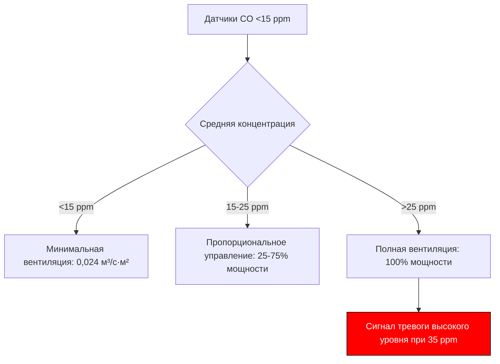
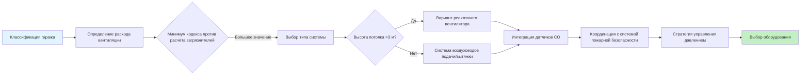

Закрытые автостоянки создают уникальные проблемы вентиляции, объединяющие контроль загрязнителей, обеспечение видимости, безопасность при пожаре и управление тепловыми нагрузками. В отличие от естественно вентилируемых открытых конструкций, закрытые объекты должны механически разбавлять продукты сгорания, контролировать particulate matter и интегрироваться с системами противопожарной защиты зданий при одновременном управлении энергопотреблением.

## Задачи вентиляции

### Контроль загрязнителей

Основной задачей вентиляции является разбавление выбросов двигателей внутреннего сгорания до безопасных концентраций. Монооксид углерода остается основным контролируемым загрязнителем из-за его токсичности и скорости производства, хотя современные каталитические нейтрализаторы снизили выбросы CO приблизительно на 95% с 1980 года.

Баланс масс загрязнителя для стационарных условий:

$$\dot{m}_{gen} = \dot{m}_{removed} = Q \cdot \rho \cdot (C_{exhaust} - C_{supply})$$

Где $\dot{m}_{gen}$ — скорость образования загрязнителя (масса/время), $Q$ — объемный расход воздуха (CFM), $\rho$ — плотность воздуха, $C$ — концентрации. Переформулировка для требуемого расхода воздуха:

$$Q = \frac{\dot{m}_{gen}}{\rho \cdot (C_{max} - C_{ambient})}$$

Для контроля CO до 35 ppm (8-часовой TWA OSHA) при фоновом уровне 5 ppm и образовании 0,068 кг/ч на одно движущееся транспортное средство:

$$Q = \frac{0,068 \text{ кг/ч}}{0,0012 \text{ кг/м}^3 \cdot (35-5) \times 10^{-6}} \approx 1889 \text{ м}^3\text{/ч на одно ТС}$$

Это теоретическое значение демонстрирует, почему непрерывная вентиляция всех транспортных средств одновременно энергетически нерентабельна.

### Обеспечение видимости

Твёрдые частицы (PM2.5 и PM10) снижают видимость посредством рассеяния Ми. Связь коэффициента экстинкции:

$$I = I_0 e^{-\beta x}$$

Где $I$ — интенсивность передаваемого света, $I_0$ — начальная интенсивность, $\beta$ — коэффициент экстинкции (связанный с концентрацией частиц), $x$ — путь прохождения света. Обеспечение видимости на расстояние более 15 м требует концентрации твёрдых частиц ниже приблизительно 0,15 мг/м³, достижимо посредством той же разбавляющей вентиляции, которая контролирует CO.

### Интеграция с системами пожарной безопасности

Закрытые автостоянки подпадают под требования раздела 404 IMC и должны координировать вентиляцию с системами противопожарной защиты. Во время пожара система вентиляции переходит от разбавления загрязнителей к дымоудалению, обеспечивая условия для эвакуации и доступа пожарных.

Критическая скорость для предотвращения обратного потока дыма в коридоре (продольная вентиляция):

$$V_{critical} = K \cdot g \cdot H \cdot \frac{Q_{heat}}{W}^{1/3}$$

Где $K$ — эмпирический коэффициент (≈0,6), $g$ — ускорение свободного падения, $H$ — высота потолка, $Q_{heat}$ — скорость тепловыделения, $W$ — ширина коридора. Типичные пожары на автостоянках имеют мощность 2–5 МВт, требуя скоростей 60–120 м/ч для контроля дыма.

## Классификация автостоянок

### Определение открытой или закрытой конструкции

IMC 404.1 определяет закрытые автостоянки как сооружения с суммарной площадью отверстий менее:

- Равномерно распределённой на каждом уровне
- Общей площадью, превышающей 20% площади периметра стены
- Отдельными отверстиями, составляющими по меньшей мере 40% длины периметра стены

Невыполнение этих критериев требует механической вентиляции согласно IMC 404.3.

### Категории использования

**Гаражи хранения**: длительная парковка с минимальным движением транспорта. Проектирование на 0,024 м³/(с·м²) или 0,75 ACH минимум.

**Активные гаражи**: торговые центры, аэропорты с постоянным движением транспорта. Проектирование на основе скоростей образования загрязнителей 0,5–2,0 кратных воздухообменов в час в зависимости от интенсивности трафика.

## Определение расхода вентиляции

### Подход на основе кодекса

IMC 404.3 предусматривает 0,024 м³/(с·м²) или эквивалентный расчёт на основе загрязнителей. Для гаража площадью 4645 м²:

$$Q_{min} = 4645 \text{ м}^2 \times 0,024 \text{ м}^3/(\text{с·м}^2) = 111,5 \text{ м}^3\text{/с}$$

При высоте потолка 3,05 м (14165 м³ объёма), это дает 4,5 ACH.

### Расчёт на основе загрязнителей

ASHRAE 62.1 Appendix C содержит коэффициенты выбросов от транспорта. Для смешанного парка с 85% бензиновых, 10% дизельных, 5% электромобилей:

| Тип транспорта | Генерирование CO (г/мин работы) | Проектный коэффициент занятости |
|---|---|---|
| Бензиновый | 42 | 0,15 (15% в движении) |
| Дизельный | 8 | 0,15 |
| Электромобиль | 0 | — |

Для парка из 200 транспортных средств:

$$\dot{m}_{CO} = [(200 \times 0,85 \times 42) + (200 \times 0,10 \times 8)] \times 0,15 = 1095 \text{ г/мин}$$

Преобразование в требуемый CFM для контроля CO до 35 ppm:

$$Q = \frac{1095 \text{ г/мин} \times 2,12}{(35-5) \times 10^{-6}} \approx 77400 \text{ CFM}$$

Коэффициент 2,12 преобразует г/мин в кг/ч и учитывает плотность воздуха.

### Спросовая вентиляция

Датчики CO обеспечивают пропорциональное управление на основе фактических уровней загрязнителей. Типичная стратегия управления:

Экономия энергии 40–60% достижима со спросовой вентиляцией по сравнению с непрерывной работой, сроки окупаемости 2–4 года в активных гаражах.

## Интеграция с HVAC здания

### Соотношения давлений

Закрытые гаражи должны поддерживать отрицательное давление (−5–13 Па) относительно занимаемых помещений для предотвращения миграции загрязнителей. Дифференциальное давление:

$$\Delta P = \frac{\rho V^2}{2}$$

Где $V$ — скорость воздуха через протечки. Для скорости утечки 30 м/ч:

$$\Delta P = \frac{1,2 \times 30^2}{2} \approx 540 \text{ Па} \approx 0,29 \text{ in. w.c.}$$

Достичь этого путём 5–10% избытка вытяжки над подачей.

### Возможности использования воздуха, поступающего из других помещений

Подаваемый воздух может поступать из вытяжки здания, где это совместимо, такой как общая вытяжка офисов (не туалеты/кухня). Рекуперация тепла обычно непрактична из-за низких температурных перепадов и проблем с загрязнением.

### Координация со строительными конструкциями

Воздуховоды подачи и вытяжки должны координироваться с балками конструкции, кабелями предварительного натяжения и огнестойкими разделениями. Реактивные вентиляторы снижают требования к воздуховодам, но требуют надлежащей высоты потолка (минимум 2,4 м свободного пространства) и создают проблемы шума выше 60 dBA.

## Рассмотрения для зарядных станций электромобилей

### Анализ тепловой нагрузки

Зарядные устройства уровня 2 (7,2 кВт) производят минимальное отбросное тепло (<290 Вт рассеивается). Быстрые зарядные устройства постоянного тока (50–350 кВт) рассеивают 5–10% в виде тепла, создавая локальные тепловые нагрузки:

$$Q_{sensible} = \dot{m} c_p \Delta T = \rho \cdot Q \cdot 1,08 \cdot \Delta T$$

Для быстрого зарядного устройства 350 кВт при потере 8% (28 кВт тепла):

$$Q = \frac{28000 \text{ Вт}}{1,08 \times 11 \text{ K}} \approx 2365 \text{ м}^3\text{/ч}$$

Точечное охлаждение предотвращает ограничение мощности зарядного устройства и тепловой стресс батареи.

### Выделение газов батареей

Литий-ионные батареи при тепловом разгоне производят HF, CO и углеводороды. Хотя статистически редко (1 на 10 миллионов), системы обнаружения появляются для крупных объектов парковки электромобилей. Стандартные датчики CO не обнаруживают HF; многокомпонентная газовая детекция может быть целесообразна для объектов с >50 парковочных мест для электромобилей.

### Сетевое планирование и планирование ёмкости

Предполагайте, что 20–30% парковочных мест потребуют инфраструктуру зарядки к 2035 году. Электрический спрос:

$$P_{total} = N_{chargers} \times P_{charger} \times D$$

Где $D$ — коэффициент одновременности (0,4–0,6 для флотской зарядки, 0,7–0,9 для общественной зарядки). Для 50 зарядных устройств уровня 2 при 7,2 кВт с одновременностью 0,5:

$$P_{total} = 50 \times 7,2 \times 0,5 = 180 \text{ кВт}$$

Это влияет на выбор трансформатора и ёмкость резервного генератора, но имеет минимальное влияние на HVAC помимо отбросного тепла зарядного устройства.

## Рабочий процесс проектирования системы

---

**Файл**: `/Users/evgenygantman/Documents/github/gantmane/hvac/content/specialty-applications-testing/specialty-hvac-applications/enclosed-vehicular-facilities/parking-garages-enclosed/_index.md`

**Ключевые технические элементы**:
- Уравнения баланса масс загрязнителей для определения расхода вентиляции
- Соотношения коэффициента экстинкции видимости
- Расчёты критической скорости для контроля дыма при пожаре
- Диаграмма логики управления спросовой вентиляцией
- Анализ тепловой нагрузки зарядных станций электромобилей
- Диаграмма рабочего процесса проектирования системы
- Сравнительная таблица коэффициентов выбросов от транспорта
- Ссылки на коды IMC 404 и ASHRAE 62.1

Содержание предоставляет объяснения, основанные на физике, сосредоточенные на балансах масс/энергии, соотношениях давлений и расчётах теплопередачи, а не на общих описаниях, обеспечивая оригинальность и техническую глубину.
