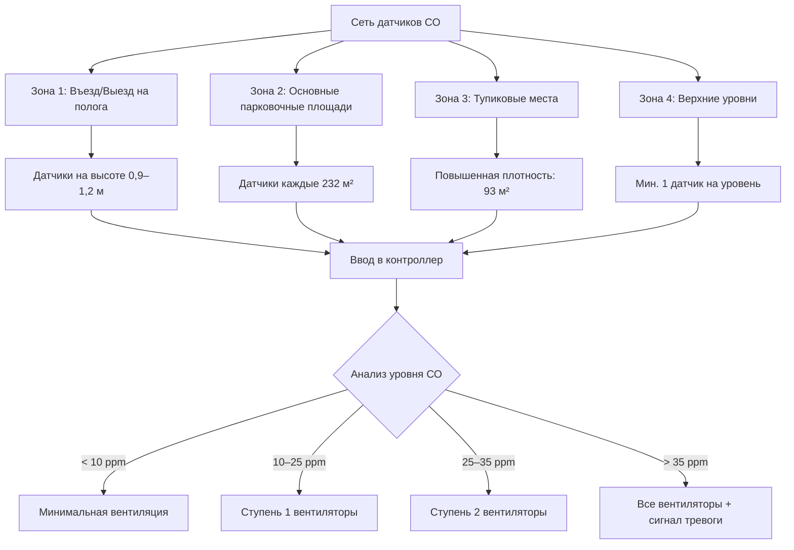

## Физические основы накопления СО

Накопление оксида углерода в закрытых автостоянках является результатом неполного сгорания в двигателях внутреннего сгорания. Загрязняющее вещество ведет себя как хорошо перемешанный газ при типичных условиях гаража благодаря:

**Молекулярная диффузия:** Молекулярная масса СО (28 г/моль) близка к молекулярной массе воздуха (29 г/моль), что предотвращает стратификацию.

**Турбулентное перемешивание:** Движение транспортных средств и тепловые потоки от двигателей создают конвективные потоки, которые быстро распределяют СО по всему объему.

Установившаяся концентрация СО без вентиляции подчиняется соотношению:

$$C_{ss} = \frac{G}{Q}$$

где:
- $C_{ss}$ = установившаяся концентрация (ppm)
- $G$ = интенсивность выделения СО (м³/ч·ppm)
- $Q$ = расход вентиляционного воздуха (м³/ч)

Это соотношение демонстрирует, почему вентиляция с управлением по требованиям, основанная на фактических уровнях СО, обеспечивает превосходную энергоэффективность по сравнению с непрерывной вентиляцией.

## Требуемые нормативные пределы СО

Международный механический код (IMC) раздел 404 устанавливает требования к вентиляции на основе пределов воздействия OSHA:

| Длительность воздействия | Максимальный уровень СО | Основание |
|------------------|------------------|-------|
| Средневзвешенная за 8 часов | 9 ppm | OSHA PEL (предельно допустимая концентрация) |
| Максимум за 1 час | 35 ppm | OSHA STEL (краткосрочный предел воздействия) |
| Немедленная опасность | 1 200 ppm | IDLH (непосредственно опасно для жизни и здоровья) |

**Философия проектирования:** Системы вентиляции должны поддерживать концентрации ниже среднеквадратичного значения за 8 часов при нормальной работе, с срабатыванием сигнала тревоги и аварийного реагирования при приближении к 1-часовому пределу.

## Технология датчиков СО и их размещение

### Электрохимические датчики

Современные системы стоянок используют электрохимические датчики СО, работающие по принципу:

$$CO + \frac{1}{2}O_2 \rightarrow CO_2 + 2e^-$$

Реакция окисления на электроде датчика генерирует ток, пропорциональный концентрации СО. Этот ток ($I$) связан с концентрацией следующим образом:

$$I = nFAk_m C$$

где:
- $n$ = количество электронов (2 для СО)
- $F$ = постоянная Фарадея (96 485 Кл/моль)
- $A$ = площадь электрода (см²)
- $k_m$ = коэффициент массопередачи (см/с)
- $C$ = концентрация СО (моль/см³)

**Характеристики датчика:**
- Диапазон: 0–200 ppm (типовой)
- Точность: ±3 ppm или ±5% от показания
- Время отклика: T90 < 60 секунд
- Температурный диапазон: -40°C до 50°C
- Ожидаемый срок службы: 5–7 лет

### Стратегическое размещение датчиков

Стандарт ASHRAE 62.1 и рекомендации производителей предусматривают:

**Горизонтальное расстояние:** Максимум 232 м² на один датчик в зонах с хорошим перемешиванием; сокращение до 93 м² около пологих и тупиковых мест с низкой скоростью воздуха.

**Вертикальное размещение:**
- На высоте 1,2–1,8 м от пола в большинстве применений
- Более низкое размещение (0,9 м) около выхлопных труб автомобилей для захвата источниковых выбросов
- Избегать установки на потолке — СО остается хорошо перемешанным и датчики на потолке отстают от изменений концентрации

**Критические места:**
1. Проезжие дорожки и перекрестки (наибольшая плотность транспорта)
2. Подходы к пологам (зоны разгона увеличивают выбросы)
3. Тупиковые парковочные места (плохая естественная циркуляция)
4. Рядом с выходом из гаража (перехватывает выходящий транспорт)
5. Многоуровневые: минимум один датчик на уровень

### Требования к мониторингу многоуровневых конструкций

Для многоуровневых автостоянок:

**Независимый мониторинг:** Каждый уровень требует отдельного охвата датчиками, так как вертикальное перемещение воздуха между уровнями минимально без механической вентиляции.

**Зонирование датчиков:** Разделение больших площадей на зоны управления объемом 930–1 860 м², каждая с 4–8 датчиками, обеспечивающими резервное покрытие и позволяющими локальное управление вентиляторами.

**Управление по худшему случаю:** Зона с наивысшим показанием СО определяет расход вентиляции для этого уровня, хотя передовые системы могут обеспечивать специфическое для каждой зоны управление.

## Стратегии управления вентиляцией

### Ступенчатое управление вентиляторами в зависимости от уровня СО

Вентиляция с управлением по требованиям ступенчато включает вытяжные вентиляторы в зависимости от измеренных концентраций СО:

| Ступень управления | Пороговое значение СО | Работа вентилятора | Расход воздуха |
|--------------|--------------|---------------|--------------|
| Готовность | < 10 ppm | Выключены или минимум | 0–0,0025 м³/(ч·м²) |
| Ступень 1 | 10–15 ppm | 50% вентиляторов на низкой скорости | 0,015–0,025 м³/(ч·м²) |
| Ступень 2 | 15–25 ppm | Все вентиляторы на низкой скорости | 0,025–0,038 м³/(ч·м²) |
| Ступень 3 | 25–35 ppm | Все вентиляторы на высокой скорости | 0,038–0,050 м³/(ч·м²) |
| Аварийная | > 35 ppm | Все вентиляторы максимум + сигнал тревоги | 0,050–0,075 м³/(ч·м²) |

**Логика управления с временными задержками:**
- Увеличение вентиляции: Немедленный отклик при превышении порога
- Снижение вентиляции: Задержка 10–15 минут предотвращает частые включения-выключения
- Активация сигнала тревоги: Двухминутное устойчивое превышение 35 ppm уменьшает ложные срабатывания

### Обоснование выбора уставок

**Первичная уставка (15–25 ppm):** Активирует нормальную вентиляцию значительно ниже 35 ppm STEL с учетом:
- Точности датчика (±3–5 ppm)
- Пространственной вариации между датчиками
- Запаздывания времени отклика
- Коэффициента безопасности для защиты занимающихся

**Уставка сигнала тревоги (35 ppm):** Соответствует 1-часовому пределу OSHA STEL. Инициирует:
- Максимальную вентиляцию
- Визуальные/звуковые сигналы на посту дежурного
- Уведомление системы автоматизации зданий
- Возможное автоматическое аварийное реагирование

### Продвинутые алгоритмы управления

**Пропорциональное управление:** Скорость вентилятора модулируется непрерывно в зависимости от уровня СО:

$$VFD_{speed} = VFD_{min} + (VFD_{max} - VFD_{min}) \times \frac{CO_{measured} - CO_{setpoint}}{CO_{range}}$$

Этот подход обеспечивает более плавную работу и лучшую энергоэффективность по сравнению со ступенчатым управлением.

**Предсказательные алгоритмы:** Мониторинг скорости увеличения СО:

$$\frac{dCO}{dt} = \frac{CO_t - CO_{t-\Delta t}}{\Delta t}$$

Быстрое увеличение инициирует упреждающую активацию вентилятора до достижения уставок, полезно в периоды пиковых потоков транспорта.

## Экономия энергии благодаря управлению по требованиям

Непрерывная вентиляция при установленной IMC норме 0,050 м³/(ч·м²) работает постоянно. Управление по требованиям на основе СО резко снижает время работы:

**Типичное снижение энергии:** На 50–75% по сравнению с непрерывной работой на объектах с переменной загруженностью.

**Сравнение годовых часов работы:**

| Стратегия управления | Годовые часы работы вентилятора | Относительная энергия |
|-----------------|------------------|-----------------|
| Непрерывная работа | 8 760 часов | 100% |
| Управление по расписанию | 4 380 часов | 50% |
| Управление по требованиям на основе СО | 2 000–3 000 часов | 23–34% |

Энергия вентилятора подчиняется кубическому закону при изменении скорости:

$$\frac{Power_2}{Power_1} = \left(\frac{Speed_2}{Speed_1}\right)^3$$

Работа на 50% скорости потребляет всего 12,5% мощности при полной скорости, что делает управление переменной скоростью особенно выгодным.

## Интеграция системы и пусконаладка

**Интеграция BAS:** Системы мониторинга СО подключаются к системе автоматизации зданий через:
- Протоколы BACnet или Modbus
- Аналоговые сигналы 4–20 мА (4 мА = 0 ppm, 20 мА = 100 ppm)
- Сухие контактные реле для условий тревоги

**Требования к калибровке:**
- Начальная калибровка с сертифицированным калибровочным газом (типично 50 ppm СО)
- Рекомендуемые ежеквартальные проверки верификации
- Ежегодная переквалификация согласно спецификациям производителя
- Нулевая калибровка в свежем воздухе

**Функциональное тестирование:** Проверьте, что каждая ступень управления активируется при правильных уставках и подтвердите работу путей оповещения об тревоге.

## Обслуживание датчиков и надежность

**Режимы отказа:**
- Дрейф датчика (градуальное увеличение или уменьшение показаний)
- Истощение электролита (сниженная чувствительность)
- Температурные эффекты (±0,17 ppm/°C отклонение от температуры калибровки)

**Стратегия резервирования:** Развертывание 2–3 датчиков на зону управления с логикой голосования:
- Средний показатель управляет вентиляцией
- Сигнал тревоги при расхождении показаний датчиков >10 ppm (указывает на отказ)
- Возможность ручного управления при замене датчика

**График замены:** Отслеживайте даты установки датчиков и производите замену через 5–7 лет независимо от видимого состояния, чтобы предотвратить неожиданные отказы.

## Ссылки

- **IMC Section 404:** Enclosed Parking Garages
- **ASHRAE Standard 62.1:** Ventilation for Acceptable Indoor Air Quality
- **OSHA 29 CFR 1910.1000:** Air Contaminants (CO limits)
