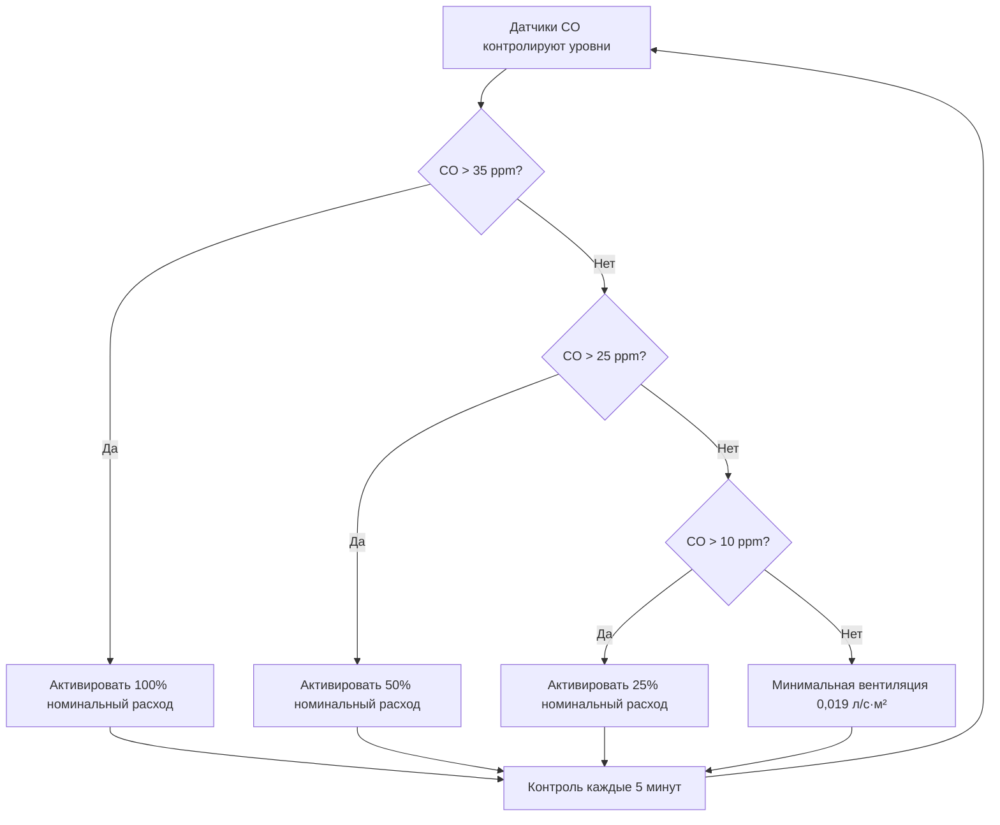
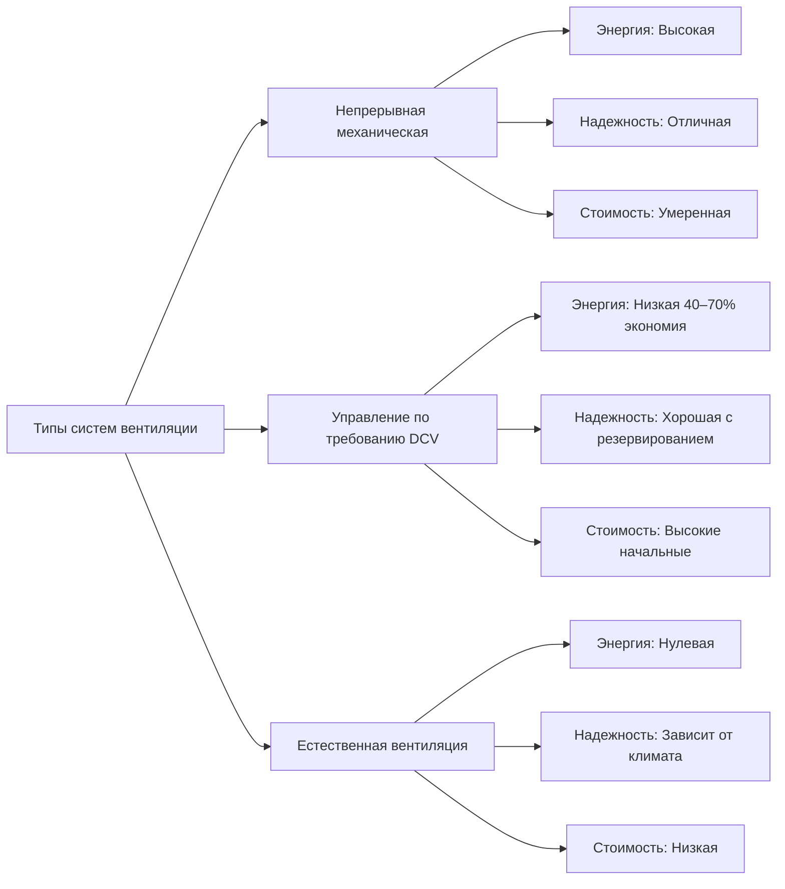

## Обзор

Системы вентиляции закрытых гаражей автостоянок решают основную задачу удаления выбросов транспортных средств — прежде всего монооксида углерода (CO), диоксида азота (NO₂) и взвешенных частиц — при поддержании приемлемого качества воздуха в помещении. Физика рассеивания загрязнителей в этих замкнутых пространствах требует спроектированных механических систем вентиляции, учитывающих интенсивность выбросов, режимы использования и эффекты термической стратификации.

## Физика образования загрязнителей

Выбросы транспортных средств в гаражах автостоянок следуют динамике концентрации, определяемой принципами материального баланса. Концентрация CO в установившемся режиме может быть выражена как:

$$C_{ss} = \frac{G}{Q \cdot \eta}$$

Где:
- $C_{ss}$ = концентрация в установившемся режиме (ppm)
- $G$ = интенсивность образования загрязнителя (м³/ч·ppm или л/с·ppm)
- $Q$ = расход вентиляционного воздуха (м³/ч или л/с)
- $\eta$ = коэффициент эффективности смешивания (0,7–0,9 для гаражей автостоянок)

Интенсивность образования зависит от активности транспорта:

$$G = N_v \cdot E_v \cdot t_r \cdot f_c$$

Где:
- $N_v$ = количество транспортных средств в час
- $E_v$ = интенсивность выброса на одно транспортное средство (обычно 0,0425 м³/ч CO на транспортное средство)
- $t_r$ = время пребывания в гараже (минуты)
- $f_c$ = коэффициент холодного пуска (1,5–3,0 для холодных двигателей)

## Требования к вентиляции согласно IMC

Международный механический кодекс (IMC Section 404) устанавливает базовые скорости вентиляции для закрытых гаражей автостоянок:

| Тип объекта | Скорость вентиляции | Ссылка на кодекс |
|---------------|------------------|----------------|
| Закрытые гаражи автостоянок | 3,8 л/с·м² | IMC 404.1 |
| Закрытые гаражи с мониторингом CO | Переменная в зависимости от уровня CO | IMC 404.1 Exception |
| Гаражи по ремонту | 7,6 л/с·м² | IMC 403.3 |

ASHRAE 62.1 Table 6-1 указывает:
- **Закрытые гаражи автостоянок**: 3,8 л/с·м² площади пола
- **Гаражи автостоянок с управлением по требованию**: Сниженные скорости при CO < 25 ppm

## Стратегия вентиляции с управлением по требованию

Вентиляция с управлением по требованию (DCV) снижает потребление энергии путем модуляции расхода воздуха на основе реальных уровней загрязнителей, а не работы на непрерывных номинальных скоростях. Логика управления выглядит следующим образом:

### Размещение датчиков мониторинга CO

Размещение датчиков должно охватывать зоны наихудшей концентрации. Физика указывает, что CO, будучи немного легче воздуха (молекулярный вес 28 против 29 для воздуха), демонстрирует минимальный эффект плавучести, но накапливается в зонах с низким потоком. Оптимальное размещение:

1. **Вертикальное положение**: 0,9–1,5 м над полом — высота дыхательной зоны
2. **Горизонтальное расстояние**: Максимум 43,2 м² на один датчик
3. **Критические места**:
   - Тупиковые проезды
   - Зоны ожидания в выездных рампах
   - Зоны с низким потолком
   - Области с плохой циркуляцией воздуха

Время отклика датчика влияет на стабильность управления. Динамика первого порядка датчика:

$$C_{sensor}(t) = C_{actual} \cdot (1 - e^{-t/\tau})$$

Где $\tau$ = постоянная времени датчика (обычно 30–60 секунд для электрохимических датчиков CO)

## Проектирование системы вытяжки

### Расчет расхода воздуха

Требуемый расход вытяжки объединяет методы, основанные на площади и количестве машин:

**Метод по площади:**
$$Q_{area} = 0,065 \cdot A_{floor}$$

**Метод по количеству машин:**
$$Q_{vehicle} = N_{spaces} \cdot f_{peak} \cdot q_{vehicle}$$

Где:
- $A_{floor}$ = площадь пола гаража (м²)
- $N_{spaces}$ = общее количество парковочных мест
- $f_{peak}$ = коэффициент пиковой часа (0,15–0,20 для типичных гаражей)
- $q_{vehicle}$ = расход воздуха на активное транспортное средство (3554 м³/ч обычно)

Используйте большее из двух значений.

### Эффекты термической стратификации

Температурные градиенты создают вызванные плавучестью потоки, которые влияют на эффективность вентиляции. Число Ричардсона характеризует стратификацию:

$$Ri = \frac{g \cdot \beta \cdot \Delta T \cdot H}{U^2}$$

Где:
- $g$ = ускорение свободного падения (9,81 м/с²)
- $\beta$ = коэффициент теплового расширения (1/T_abs)
- $\Delta T$ = разность температур между уровнями (°C)
- $H$ = высота потолка (м)
- $U$ = характеристическая скорость (м/с)

При $Ri > 1$: Сильная стратификация — плавучесть доминирует
При $Ri < 0,1$: Слабая стратификация — принудительная конвекция доминирует

## Системы подпиточного воздуха

Системы только с вытяжкой создают отрицательное давление, которое должно быть сбалансировано подпиточным воздухом, чтобы предотвратить:
- Обратное срабатывание устройств сгорания
- Затруднение открывания дверей (давление > 75 Па)
- Неконтролируемую инфильтрацию

### Требования к подпиточному воздуху

Подпиточный воздух должен составлять 90–100% вытяжного воздуха, чтобы поддерживать небольшое отрицательное давление (–10–25 Па) для контроля запахов:

$$Q_{MA} = Q_{exhaust} - Q_{infiltration}$$

Оценка скорости инфильтрации:

$$Q_{infiltration} = A_{openings} \cdot v_{wind} \cdot C_d$$

Где:
- $A_{openings}$ = общая площадь открытий (м²)
- $v_{wind}$ = скорость ветра (м/с)
- $C_d$ = коэффициент расхода (0,6–0,65)

### Распределение подпиточного воздуха

Надлежащее распределение предотвращает короткое замыкание между подачей и вытяжкой:

| Метод распределения | Характеристики | Применение |
|---------------------|-----------------|-------------|
| Низкая боковая стенка периметра | Равномерное распределение, минимальные воздуховоды | Открытые гаражи, мягкий климат |
| Система воздуховодов над головой | Контролируемое распределение | Холодные климаты, несколько уровней |
| Выделенные агрегаты подпиточного воздуха | Возможность нагрева/охлаждения | Экстремальные климаты |
| Естественные отверстия | Нет эксплуатационных затрат | Подходит только для мягких климатов |

## Сравнение систем

## Соображения при проектировании

### Выбор вентилятора

Вытяжные вентиляторы должны работать в коррозионной среде. Критерии выбора:

1. **Устойчивость материала**: Эпоксидное покрытие или нержавеющая сталь для CO и влаги
2. **Тип двигателя**: TEFC (Totally Enclosed Fan Cooled) для загрязненного воздуха
3. **Эффективность**: Соответствие стандартам энергоэффективности AMCA 205
4. **Резервирование**: Конфигурация N+1 для систем > 1180 м³/ч

### Соотношения давления

Поддержание надлежащих зон давления предотвращает миграцию загрязнителей:

$$\Delta P = \frac{\rho \cdot v^2}{2 \cdot g_c} + \rho \cdot g \cdot \Delta z$$

Целевые значения статического давления:
- Гараж автостоянки: –10–25 Па относительно наружного
- Лестничные клетки/лифты: +15–25 Па относительно гаража

## Оптимизация энергопотребления

Расчет экономии энергии DCV:

$$E_{savings} = (Q_{design} - Q_{average}) \cdot h_{annual} \cdot \Delta P \cdot \frac{1}{\eta_{fan}}$$

Где:
- $Q_{design}$ = полный номинальный расход (м³/ч)
- $Q_{average}$ = средний расход DCV (м³/ч)
- $h_{annual}$ = годовые часы эксплуатации
- $\Delta P$ = давление системы (Па)
- $\eta_{fan}$ = комбинированная эффективность вентилятора и двигателя

Типичные системы DCV достигают экономии энергии 40–70% по сравнению с непрерывной работой, периоды окупаемости 2–5 лет в зависимости от местных затрат на энергию и режимов использования.

## Требования к наладке

Функциональное испытание производительности должно подтвердить:

1. Расходы воздуха достигают ±10% номинала во всех последовательностях управления
2. Датчики CO отградуированы с точностью ±5 ppm
3. Время отклика управления < 10 минут от изменения уставки до изменения расхода на 90%
4. Отслеживание подпиточного воздуха поддерживает давление в пределах ±10 Па от уставки
5. Аварийное переопределение активирует 100% вентиляцию при срабатывании пожарной сигнализации

Надлежащее проектирование вентиляции закрытых гаражей автостоянок объединяет соответствие кодексам, расчеты на основе физики и энергоэффективные стратегии управления для поддержания безопасного качества воздуха при минимизации операционных затрат.
