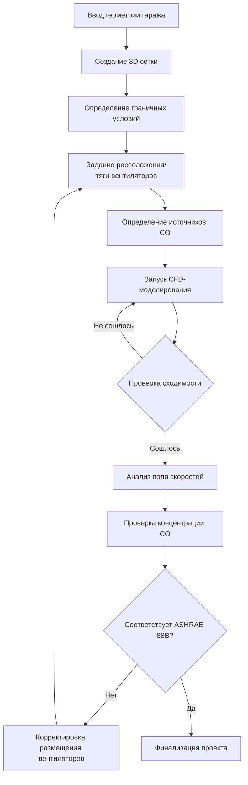
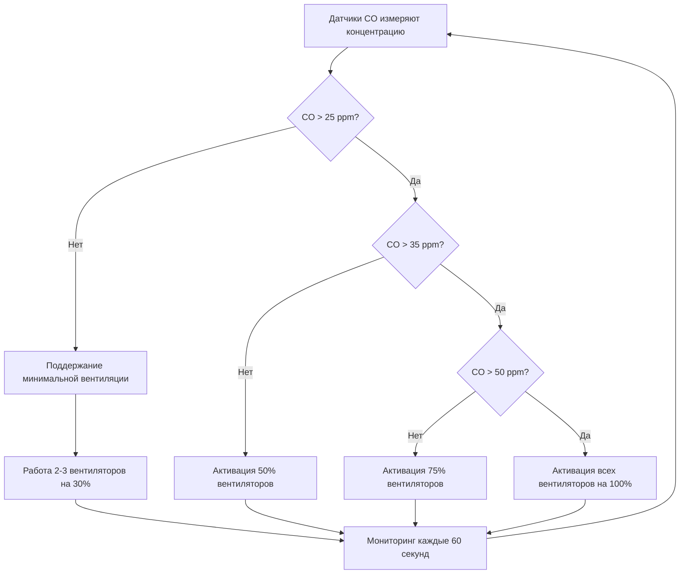

## Принцип импульсной вентиляции

Системы струйных вентиляторов работают на основе принципа импульсной вентиляции, передавая импульс от высокоскоростных воздушных струй большой массе застойного воздуха в гараже. В отличие от канальных систем, которые физически транспортируют воздух через воздуховоды, струйные вентиляторы вызывают движение большого объема воздуха благодаря обмену импульсом, создавая направленные потоки воздуха, которые разбавляют и удаляют загрязнители.

Фундаментальная физика основана на законе сохранения импульса. Струйный вентилятор производит узкую высокоскоростную струю, которая увлекает окружающий воздух через турбулентное перемешивание. Передача импульса происходит непрерывно вдоль траектории струи, скорость струи уменьшается, а объем воздействующего воздуха увеличивается.

**Ключевые операционные преимущества:**
- Исключает воздуховоды и связанные с этим затраты на установку
- Обеспечивает установку при низком потолке (обычно 20-30 см)
- Позволяет гибкие схемы воздушных потоков благодаря стратегическому размещению вентиляторов
- Снижает структурные нагрузки по сравнению с канальными системами
- Обеспечивает визуальный осмотр всей системы вентиляции

## Расчеты тяги и дальности струйного вентилятора

Производительность струйного вентилятора характеризуется тягой (усилие, передаваемое воздуху) и дальностью (расстояние, на котором струя сохраняет эффективную скорость). Тяга представляет скорость изменения импульса и является основным параметром проектирования.

**Расчет тяги:**

$$F = \rho Q (V_j - V_a)$$

Где:
- $F$ = сила тяги (Н)
- $\rho$ = плотность воздуха (кг/м³)
- $Q$ = объемный расход воздуха (м³/с)
- $V_j$ = скорость выброса струи (м/с)
- $V_a$ = скорость подходящего потока (обычно ноль для стационарной установки)

При стандартных условиях ($\rho$ = 1,2 кг/м³) это упрощается до:

$$F = 1,2 \times Q \times V_j$$

**Дальность струи** зависит от скорости выброса, диаметра сопла и окружающей турбулентности:

$$L = K \times D \times \frac{V_j}{V_{terminal}}$$

Где:
- $L$ = дальность струи (м)
- $K$ = эмпирический коэффициент (обычно 5-8)
- $D$ = диаметр сопла (м)
- $V_{terminal}$ = минимальная эффективная скорость (обычно 1 м/с)

### Расчет потока импульса

Поток импульса уменьшается вдоль пути струи из-за увлечения и турбулентной диффузии. На расстоянии $x$ от сопла:

$$V_x = V_j \times \frac{D}{K_e \times x}$$

Где $K_e$ — коэффициент расширения струи (0,08-0,12 для свободных струй).

| Размер струйного вентилятора | Тяга (Н) | Расход (м³/с) | Скорость выброса (м/с) | Типичный шаг (м) |
|-------------------------------|----------|---------------|------------------------|------------------|
| Малый                         | 40-60    | 1,5-2,5       | 25-30                  | 15-20            |
| Средний                       | 80-120   | 3,0-4,5       | 28-35                  | 20-30            |
| Большой                       | 150-250  | 5,0-8,0       | 30-40                  | 30-40            |

## CFD-моделирование размещения вентиляторов

Вычислительное гидродинамическое (CFD) моделирование необходимо для оптимизации размещения струйных вентиляторов в сложных геометриях гаража. CFD численно решает уравнения Навье-Стокса для прогнозирования трехмерных полей скорости и концентрации загрязнителей.

**Критические параметры моделирования:**
1. Модель турбулентности (k-ε или k-ω для приложений в автостоянках)
2. Граничные условия (тяга вентилятора, трение стенок, места входа/выхода)
3. Источники загрязнителей (скорости выброса CO от транспортных средств)
4. Разрешение сетки (минимум 0,5 м для надлежащего захвата струи)

**Критерии проверки проекта:**
- Средняя скорость >0,25 м/с во всех занятых зонах
- Отсутствие застойных зон со скоростью <0,1 м/с
- Концентрация CO <50 ppm максимум (ASHRAE 88B)
- Равномерное разбавление загрязнителей без короткого замыкания потока

## Возможности дымоудаления

Системы струйных вентиляторов обеспечивают эффективное дымоудаление во время пожарных ситуаций, создавая определенные пути воздушных потоков, которые содержат и удаляют дым. Система работает в двух режимах: нормальная вентиляция и экстренное извлечение дыма.

**Принцип работы системы дымоудаления:**

Во время пожара струйные вентиляторы создают высокоскоростной воздушный поток (2-3 м/с), который устанавливает перепад давления, предотвращающий обратный поток дыма и направляющий продукты сгорания к установленным точкам выхода. Это поддерживает приемлемые условия на путях эвакуации.

**Требование к тяге для дымоудаления:**

$$F_{smoke} = \rho A V^2 + \Delta P \times A$$

Где:
- $\Delta P$ = перепад давления через границу дыма (обычно 25-50 Па)
- $A$ = площадь поперечного сечения пути воздушного потока (м²)
- $V$ = требуемая скорость воздуха (2-3 м/с согласно NFPA 92)

**Требования соответствия NFPA 92:**
- Минимальная скорость воздуха 2 м/с в зоне дыма
- Интерфейс слоя дыма поддерживается выше 2,5 м
- Приемлемые условия для 20-минутной эвакуации
- Резервная работа вентиляторов (минимум N+1)

## Энергосбережение по сравнению с канальными системами

Системы струйных вентиляторов обеспечивают значительное энергосбережение по сравнению с традиционной канальной вентиляцией благодаря снижению мощности вентилятора, устранению потерь в воздуховодах и управлению, зависящему от требуемого уровня.

**框架сравнения энергии:**

Мощность канальной системы:
$$P_{duct} = \frac{Q \times \Delta P_{total}}{\eta_{fan} \times \eta_{motor}}$$

Где $\Delta P_{total}$ включает трение в воздуховодах, фитинги и потери на выходе (обычно 500-1200 Па).

Мощность системы струйных вентиляторов:
$$P_{jet} = n \times P_{fan} \times DF$$

Где:
- $n$ = количество струйных вентиляторов
- $P_{fan}$ = мощность одного вентилятора (обычно 0,5-2,0 кВ)
- $DF$ = коэффициент нагрузки (0,3-0,6 при управлении на основе CO)

| Параметр | Канальная система | Система струйных вентиляторов | Экономия |
|----------|-------------------|-------------------------------|---------|
| Установленная мощность вентилятора (кВ) | 45-60 | 25-35 | 40-45% |
| Средняя рабочая мощность (кВ) | 30-40 | 12-18 | 55-60% |
| Годовая энергия (MWh) | 260-350 | 105-160 | 60-65% |
| Теплопередача/потери в воздуховодах (кВ) | 8-15 | 0 | 100% |
| Доступ для обслуживания | Ограниченный | Полный | N/A |

Энергосбережение обусловлено:
1. **Устранением потерь давления в воздуховодах** (60-70% сопротивления канальной системы)
2. **Сниженными требованиями к объему воздуха** (передача импульса vs. транспорт большого объема)
3. **Управлением, зависящим от требуемого уровня**, на основе датчиков CO в реальном времени
4. **Отсутствием тепловых потерь** через воздуховоды в некондиционируемых пространствах

## Интеграция датчиков CO

Датчики монооксида углерода обеспечивают управление вентиляцией в зависимости от требуемого уровня, работающее струйные вентиляторы только при необходимости разбавления загрязнителей. Эта вариативная операция оптимизирует энергопотребление, сохраняя качество воздуха.

**Стратегия размещения датчиков:**
- Минимум один датчик на 2000 м² площади пола
- Размещение в местах наибольшей концентрации транспортных средств
- Установка на высоте 1,5-2,0 м над полом (плотность CO ≈ плотность воздуха)
- Вдали от точек выброса вентиляторов во избежание ложных срабатываний

**Алгоритм управления:**

$$N_{fans} = \left\lceil \frac{C_{measured} - C_{setpoint}}{C_{threshold}} \times N_{total} \right\rceil$$

Где:
- $C_{measured}$ = измеренная концентрация CO (ppm)
- $C_{setpoint}$ = целевой уровень CO (обычно 25 ppm согласно IMC раздел 404.1)
- $C_{threshold}$ = мертвая зона управления (5-10 ppm)
- $N_{total}$ = общее количество установленных струйных вентиляторов

**Требования IMC раздел 404.1:**
- Максимальная концентрация CO 50 ppm (ASHRAE 62.1 позволяет 9 ppm для непрерывного воздействия)
- Минимальная скорость вентиляции 0,75 CFM/ft² (3,8 л/с·м²)
- Автоматическое управление на основе датчиков загрязнителей или занятости помещения
- Возможность ручного переопределения для обслуживания

**Продвинутые стратегии управления:**
- Предсказательные алгоритмы на основе исторических данных об использовании
- Зональная активация вентиляторов для локализованных участков высокого CO
- Интеграция с системами управления зданием (BACnet/Modbus)
- Трендовый анализ и сигнализация для проверки производительности системы

Системы струйных вентиляторов представляют парадигму сдвига от объемного воздушного транспорта к управлению воздухом на основе импульса, достигая превосходной энергоэффективности при одновременном снижении затрат на установку и требований к пространству в закрытых автостоянках.
