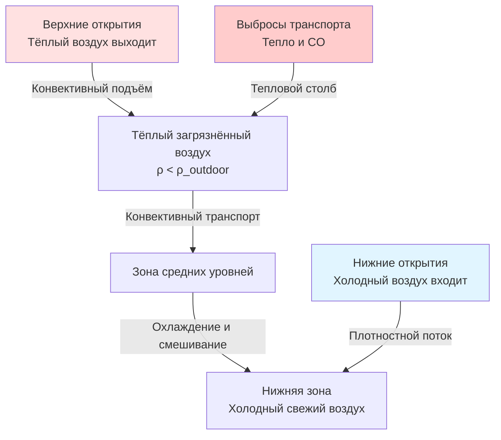

Естественная вентиляция предлагает энергоэффективную альтернативу механическим системам вытяжки для паркингов, используя ветровое давление и тепловую плавучесть для разбавления и удаления выбросов транспортных средств. Раздел 404.1 Международного кодекса механических систем (IMC) устанавливает критерии для открытых парковочных сооружений, которые соответствуют требованиям для естественной вентиляции вместо механических систем.

## Определение открытого парковочного сооружения

Открытый паркинг, как определено в IMC 404.1, должен иметь равномерно распределённые открытия на двух или более сторонах, составляющие по крайней мере 20% от общей площади периметральной стены на каждом уровне. Минимальный размер открытий должен быть 76 см, измеренный перпендикулярно к стене. Это определение признаёт, что надлежащим образом спроектированные открытия создают достаточный воздухообмен за счёт естественных сил для поддержания приемлемого качества воздуха без механической поддержки.

Требование 20% открытий основывается на эмпирических данных о скорости разбавления загрязнителей и эффективности проникновения ветра. Ниже этого порога образуются мёртвые зоны, где концентрация монооксида углерода превышает допустимые пределы безопасности в периоды пиковой нагрузки.

## Минимальные требования к открытиям

IMC определяет два параллельных требования для открытий естественной вентиляции:

| Требование | Значение | Ссылка на код |
|-------------|-------|----------------|
| Соотношение открытий периметральной стены | ≥20% на уровень | IMC 404.1 |
| Минимальный размер открытия | 76 см | IMC 404.1 |
| Распределение | Две или более сторон | IMC 404.1 |
| Соотношение открытий полового уровня | ≥2,5% общей площади пола | Альтернативный расчёт |

Общая площадь открытий $A_o$ должна удовлетворять:

$$A_o \geq 0.20 \times A_w$$

где $A_w$ представляет общую площадь периметральной стены для каждого уровня паркинга. Это обеспечивает адекватное проникновение наружного воздуха по всей глубине парковочного пола.

## Проектирование перекрестной вентиляции

Эффективная перекрестная вентиляция требует надлежащего выравнивания впускных и выпускных открытий для максимизации глубины проникновения потока воздуха. Средняя скорость воздуха через парковочное пространство зависит от скорости ветра, конфигурации открытий и внутреннего сопротивления:

$$v_{int} = C_d \times v_{wind} \times \sqrt{\frac{A_{inlet}}{A_{cross}}}$$

где:
- $C_d$ = коэффициент расхода (обычно 0,6–0,65 для открытий паркинга)
- $v_{wind}$ = скорость внешнего ветра на высоте здания
- $A_{inlet}$ = эффективная площадь впускного открытия
- $A_{cross}$ = площадь поперечного сечения паркинга, перпендикулярного к потоку

Разность давления, приводящая в действие перекрестную вентиляцию, возникает в результате воздействия ветра на фасад здания:

$$\Delta P = 0.5 \times \rho_{air} \times C_p \times v_{wind}^2$$

где $C_p$ представляет разность коэффициентов давления между сторонами, обращёнными к ветру и подветренными (обычно 0,5–0,8 для прямоугольных зданий).

## Ветровая вентиляция

Ветровая вентиляция доминирует в естественном воздухообмене низкоэтажных парковочных сооружений и при умеренных температурах. Объёмный расход воздуха через конструкцию зависит от геометрии открытий и характеристик ветра:

$$Q = C_d \times A_{eff} \times v_{wind}$$

Эффективная площадь открытия $A_{eff}$ учитывает объединённое сопротивление впускных и выпускных путей:

$$\frac{1}{A_{eff}^2} = \frac{1}{A_{inlet}^2} + \frac{1}{A_{outlet}^2}$$

Это соотношение показывает, что сбалансированные площади впуска и выпуска максимизируют воздушный поток. Асимметричные конфигурации открытий значительно снижают эффективность вентиляции.

## Вентиляция, управляемая плавучестью (эффект дымохода)

Когда температуры вне помещения отличаются от температур в паркинге, тепловая плавучесть создаёт вертикальный воздушный поток независимо от ветра. Этот эффект дымохода становится критичным при спокойных условиях и в холодную погоду, когда загрязнители имеют тенденцию к расслоению.

Разность давления плавучести между уровнями впуска и выпуска составляет:

$$\Delta P_{stack} = \rho_{out} \times g \times h \times \left(1 - \frac{T_{out}}{T_{in}}\right)$$

где:
- $\rho_{out}$ = плотность наружного воздуха (кг/м³)
- $g$ = ускорение свободного падения (9,81 м/с²)
- $h$ = вертикальное расстояние между открытиями (м)
- $T_{out}$, $T_{in}$ = абсолютные температуры (К)

Полученный расход вентиляции только от эффекта дымохода:

$$Q_{stack} = C_d \times A \times \sqrt{2 \times g \times h \times \frac{\Delta T}{T_{avg}}}$$

Этот механизм обеспечивает минимальную вентиляцию в летние ночи и зимние условия, когда ветровой поток уменьшается.

## Гибридные системы естественной и механической вентиляции

Многие юрисдикции разрешают гибридные системы, сочетающие естественные открытия с дополнительной механической вытяжкой. Эти проекты активируют механические вентиляторы только когда естественная вентиляция оказывается недостаточной, обычно определяемой мониторингом CO или сезонными графиками.

Требуемая механическая поддержка зависит от нехватки между естественной производительностью и установленными кодексом воздухообменными показателями:

$$Q_{mech} = Q_{required} - Q_{natural}$$

Типичные гибридные конфигурации включают:

| Тип системы | Описание | Стратегия активации |
|-------------|-------------|---------------------|
| Управляемая датчиком CO | Механические вентиляторы включаются выше установки CO | Порог 25–50 ppm |
| Компенсированная по температуре | Вентиляторы работают при низком ветре/температурах | Ветер <2 м/с или ΔT <2°C |
| Пиковый спрос | Механическая поддержка в часы пик | Работа по расписанию |
| Естественный периметр + центральная механика | Естественная вентиляция на краях здания, механика в центре | Непрерывная зонная работа |

Гибридные системы обеспечивают 40–70% экономии энергии по сравнению с полной механической вентиляцией при одновременном поддержании соответствия кодексу в течение всего года. Размеры механических компонентов обычно составляют 50–75% производительности, требуемой для полностью механических систем.

## Проверка проекта

Производительность естественной вентиляции должна быть подтверждена посредством анализа вычислительной гидродинамики (CFD) или испытаний масштабных моделей для сложной геометрии. Ключевые параметры проверки включают:

- Число воздухообменов в час (минимум 6 ACH согласно IMC для механических систем в качестве эталона)
- Максимальная концентрация CO на уровне дыхания
- Процент площади пола со скоростью воздуха <0,15 м/с (застойные зоны)
- Сезонное варьирование эффективности вентиляции

Местные поправки к IMC могут налагать дополнительные требования, особенно в регионах с низкими преобладающими скоростями ветра или высокими уровнями загрязнения. Некоторые юрисдикции требуют механического резервирования независимо от процентов открытий или требуют систем мониторинга CO в естественно вентилируемых паркингах.
