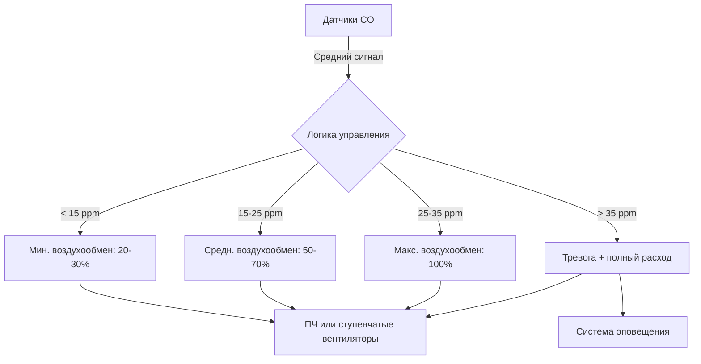

## Нормативные подходы к вентиляции

Международный механический кодекс и ASHRAE 62.1 устанавливают два основных методологических подхода к вентиляции закрытых автостоянок. Выбор между этими подходами существенно влияет на капитальную стоимость системы, эксплуатационную энергию и сложность управления.

### Предписанная непрерывная вентиляция

Базовое требование предусматривает непрерывный механический воздухообмен **0,75 CFM (1,27 м³/ч) на квадратный метр** площади пола автостоянки. Этот метод представляет консервативный подход, предполагающий постоянную наихудшую загруженность и активность транспортных средств. Физическая основа вытекает из эмпирических исследований, коррелирующих типичные выбросы от автомобилей с требованиями разбавления для поддержания концентрации оксида углерода ниже 35 ppm в среднем за 8-часовой период.

Для автостоянки площадью $A_{\text{floor}}$ в квадратных метрах необходимый воздухообмен составляет:

$$Q_{\text{req}} = 1.27 \times A_{\text{floor}} \quad \text{[м³/ч]}$$

Этот подход исключает необходимость в газоанализаторах, но приводит к непрерывной работе на полный расход независимо от фактической активности транспортных средств. Энергетический штраф становится значительным для автостоянок с периодическим режимом использования.

### Управление вентиляцией по спросу на основе CO

Системы вентиляции, основанные на производительности, модулируют воздухообмен в ответ на измеренные концентрации оксида углерода. Этот подход признает, что генерация загрязняющих веществ сильно варьируется в зависимости от количества автомобилей, типа двигателя и времени пребывания. Потенциал экономии энергии варьируется от 50% до 85% по сравнению с непрерывной работой в зависимости от режимов использования.

Алгоритм управления вентиляцией поддерживает концентрацию CO ниже установленных кодом пороговых значений путем регулирования скорости вентилятора или поэтапного включения нескольких вытяжных вентиляторов. Связь между скоростью генерации и необходимой вентиляцией следует принципам массового баланса:

$$Q = \frac{G_{\text{CO}}}{\left(C_{\text{set}} - C_{\text{ambient}}\right)} \times k$$

Где:
- $Q$ = необходимый воздухообмен [м³/ч]
- $G_{\text{CO}}$ = скорость генерации CO [м³/ч CO]
- $C_{\text{set}}$ = уставка концентрации [ppm]
- $C_{\text{ambient}}$ = концентрация CO в наружном воздухе [ppm]
- $k$ = коэффициент пересчета единиц

## Физика рассеивания загрязняющих веществ

Выхлопные газы транспортных средств содержат оксид углерода, диоксид азота, углеводороды и твердые частицы. Поведение рассеивания определяет оптимальное размещение датчиков и расположение точек вытяжки.

### Стратификация, вызванная плавучестью

Горячие выхлопные газы (обычно от 65°C до 200°C) первоначально имеют положительную плавучесть относительно воздуха в автостоянке. Однако быстрое смешивание с окружающим воздухом снижает это различие температур в пределах 1–2 метров от выхлопной трубы. Параметр потока плавучести управляет переходом от потока, управляемого импульсом, к потоку, управляемому плавучестью:

$$\Gamma = \frac{g \beta Q_{\text{heat}}}{c_p \rho_{\text{air}} T_{\text{ambient}}}$$

Где $g$ — ускорение свободного падения, $\beta$ — коэффициент объемного расширения, $Q_{\text{heat}}$ — скорость выделения явного тепла, $c_p$ — удельная теплоемкость и $\rho_{\text{air}}$ — плотность воздуха.

Для типичных условий в автостоянке CO ведет себя как нейтрально плавучий газ после начального смешивания. Это требует распределения точек вытяжки по всей дыхательной зоне вместо концентрации у потолка.

### Мертвые зоны и короткое замыкание потока

Неадекватное распределение воздуха создает застойные зоны, где накапливаются загрязняющие вещества. Эффективный воздухообмен в этих областях падает ниже номинального значения для всей автостоянки. Глубина проникновения струи подаваемого воздуха определяет эффективность смешивания:

$$x_{\text{throw}} = k_{\text{jet}} \cdot d_0 \cdot \sqrt{\frac{V_0}{V_{\text{term}}}}$$

Где $x_{\text{throw}}$ — расстояние до конечной скорости $V_{\text{term}}$, $d_0$ — диаметр выпуска, $V_0$ — начальная скорость и $k_{\text{jet}}$ — эмпирический коэффициент (обычно 5–7 для круглых струй).

## Стратегии проектирования систем вытяжки

### Конфигурация с разветвленной вытяжкой

Специальное воздуховодное оборудование с стратегически расположенными входами обеспечивает лучший захват загрязняющих веществ по сравнению с неканальными потолочными вентиляторами. Ключевые параметры проектирования включают:

| Параметр | Типовой диапазон | Рекомендация проектирования |
|----------|------------------|----------------------------|
| Высота входа вытяжки | 2,4–3,0 м от пола | Выше линии крыши автомобиля, в пределах дыхательной зоны |
| Расстояние между входами | 18–24 м | На основе расчетов дальности струи |
| Скорость в воздуховоде | 9–12,7 м/с | Минимизировать потери давления при сохранении самоочистки |
| Выброс вытяжки | 3 м выше крыши | Предотвратить повторное поступление в воздухозаборы здания |

Падение давления в системе вытяжки определяет требования к мощности вентилятора:

$$\Delta P_{\text{total}} = \Delta P_{\text{duct}} + \Delta P_{\text{inlets}} + \Delta P_{\text{fittings}}$$

Каждый компонент вносит вклад в соответствии с соотношениями скоростного давления, при этом общие потери давления обычно колеблются от 75 до 150 Па для хорошо спроектированных систем.

### Распределение подаваемого воздуха

Подаваемый воздух выполняет две функции: заменяет вытяжной воздух и способствует смешиванию для предотвращения мертвых зон. Общие методы распределения включают:

1. **Периметральные жалюзи с естественной инфильтрацией воздуха** — минимальная стоимость, но слабый контроль смешивания
2. **Разветвленная подача с потолочными диффузорами** — лучшее смешивание, но более высокая стоимость установки
3. **Циркуляционные вентиляторы для перемешивания воздуха** — дополняют первичную вентиляцию путем улучшения распределения

Соотношение подаваемого к вытяжному воздухообмену обычно варьируется от 0,95 до 1,0, поддерживая небольшое отрицательное давление для предотвращения миграции загрязняющих веществ в соседние пространства.

## Проектирование системы мониторинга газов

### Методология размещения датчиков

Датчики CO и NO₂ должны представлять средние условия в автостоянке при фиксировании локальных пиков. Рекомендуемый подход разделяет автостоянку на зоны на основе:

- Площади пола на один датчик (типично: 500–1000 м² на датчик)
- Характеристик движения транспорта и плотности парковки
- Геометрических ограничений (колонны, пандусы, тупиковые зоны)

Вертикальное размещение на высоте 1,2–1,8 м от готового пола фиксирует концентрации в дыхательной зоне. Избегайте расположения непосредственно рядом с выхлопными трубами транспортных средств или диффузорами подачи воздуха, которые создают нерепрезентативные показания.

### Уставки управления и отклик

Стандартные последовательности управления используют многоступенчатое или регулирование переменной скорости вентилятора:

Алгоритм управления включает временные задержки (обычно 2–5 минут) для предотвращения чрезмерного циклирования при сохранении отзывчивого управления загрязнением. Дрейф датчика и требования к калибровке требуют квартальной проверки с использованием эталонных приборов.

## Соображения по эксплуатации системы

### Оптимизация энергии

Потребление мощности вентилятором подчиняется кубическому закону отношения к снижению воздухообмена:

$$P_{\text{fan}} \propto Q^3$$

Снижение воздухообмена до 40% от расчетного во время низкой загруженности снижает мощность вентилятора примерно до 6% от полной нагрузки. Годовая экономия энергии для систем управляемой вентиляции обычно обеспечивает период окупаемости 2–4 года для автостоянок с переменными режимами использования.

### Работа в холодную погоду

Введение наружного воздуха при отрицательной температуре может привести к образованию льда и дискомфорту из-за температуры. Стратегии включают:

- Снизить минимальный воздухообмен в неиспользуемые периоды
- Использовать вентиляторы дестратификации для использования тепла от автомобилей
- Обеспечить периметральное отопление на входах подачи воздуха

Скорость потерь тепла определяет требования к дополнительному отоплению:

$$Q_{\text{heat}} = \dot{m} c_p \left(T_{\text{set}} - T_{\text{outdoor}}\right) = 1.08 \times \text{м³/ч} \times \Delta T \quad \text{[кДж/ч]}$$

## Сводка требований кодекса

| Требование | Раздел IMC | ASHRAE 62.1 | Ключевое положение |
|-----------|-------------|------------|-------------------|
| Минимум воздухообмена | 404.1 | 5.14.4 | 1,27 м³/ч/м² непрерывно или на основе CO |
| Порог тревоги CO | 404.1 | - | 35 ppm среднее за 8 ч, 200 ppm за 1 ч |
| Опция естественной вентиляции | 404.2 | - | Минимум 2,5% площади пола, распределено |
| Выброс механической вытяжки | 501.3 | - | 3 м от границы участка/открытий |

Проектирование на основе производительности требует документации, демонстрирующей эквивалентное или лучшее управление загрязнением по сравнению с предписанными методами. Это обычно включает моделирование вычислительной гидродинамики или измерения при вводе в эксплуатацию, проверяющие адекватное смешивание и удаление загрязняющих веществ по всему пространству.

---

**Ссылки**: IMC 2021 раздел 404; ASHRAE 62.1-2022 раздел 5.14.4; ASHRAE Fundamentals (2021) глава 15
