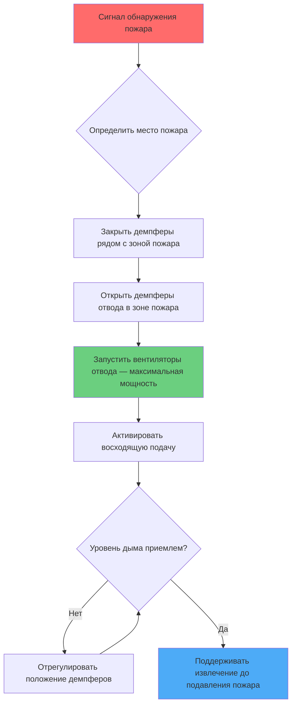

Системы аварийной вентиляции представляют наиболее критичный компонент защиты жизни в закрытых автомобильных туннелях. Во время пожара эти системы должны контролировать движение дыма, чтобы поддерживать приемлемые условия для эвакуации, одновременно управляя мощностью тепловыделения, которая может превышать 100 МВт при пожарах тяжелых грузовиков.

## Динамика пожара в туннелях

Пожары в туннелях создают уникальные термодинамические условия, определяемые ограниченной геометрией и потоками, вызванными плавучестью. Мощность тепловыделения (HRR) определяет производство дыма и температуры потолочной струи:

$$Q = \dot{m}_f \cdot \Delta H_c \cdot \chi$$

где $Q$ — мощность тепловыделения (кВт), $\dot{m}_f$ — массовый расход горящего топлива (кг/с), $\Delta H_c$ — теплота сгорания (кДж/кг), и $\chi$ — эффективность сгорания.

Плавучий слой дыма поднимается и образует потолочную струю с velocityю:

$$u_{max} = 0.96 \left(\frac{Q}{H}\right)^{1/3}$$

где $u_{max}$ — максимальная скорость потолочной струи (м/с) и $H$ — высота над источником пожара (м). Это поведение стратифицированного потока определяет выбор стратегии аварийной вентиляции.

## Концепция критической скорости

Критическая скорость ($V_{cr}$) представляет минимальную продольную скорость воздуха, необходимую для предотвращения обратного слоя дыма против направления потока вентиляции. Этот параметр определяет проектирование продольной системы и вытекает из баланса сил между импульсом плавучего дыма и импульсом потока вентиляции.

Программа испытаний вентиляции при пожаре в туннеле Мемориал установила широко применяемую зависимость:

$$V_{cr} = K_g \cdot K_1 \left(\frac{g \cdot H \cdot Q}{C_p \cdot \rho_{\infty} \cdot T_{\infty} \cdot A}\right)^{1/3}$$

где:
- $V_{cr}$ = критическая скорость (м/с)
- $K_g$ = коэффициент уклона = $(1 + 0.0387 \cdot G)$ для восходящих уклонов
- $K_1$ = безразмерная постоянная ≈ 0.606
- $g$ = ускорение свободного падения (9.81 м/с²)
- $H$ = высота туннеля (м)
- $Q$ = мощность тепловыделения (кВт)
- $C_p$ = удельная теплоемкость воздуха (1.005 кДж/кг·К)
- $\rho_{\infty}$ = плотность окружающего воздуха (кг/м³)
- $T_{\infty}$ = температура окружающей среды (К)
- $A$ = площадь поперечного сечения туннеля (м²)

NFPA 502 предусматривает проектные пожары размером от 20 МВт (легковой автомобиль) до 100 МВт (тяжелое грузовое транспортное средство) с соответствующими критическими скоростями, обычно 2.5-3.5 м/с для горизонтальных туннелей.

## Системы продольной вентиляции

Продольные системы создают однонаправленный поток воздуха по всей длине туннеля, используя реактивные вентиляторы, установленные на потолке или в нишах. Эта конфигурация направляет дым вниз по потоку от места пожара.

### Принципы эксплуатации

Реактивные вентиляторы передают импульс воздуху туннеля через высокоскоростные выходные струи. Создаваемая сила тяги равна:

$$F = \dot{m} \cdot \Delta V = \rho \cdot Q_{fan} \cdot (V_{jet} - V_{tunnel})$$

где $F$ — сила тяги (Н), $\dot{m}$ — массовый расход (кг/с), $Q_{fan}$ — объемный расход вентилятора (м³/с), $V_{jet}$ — скорость выходной струи (м/с), и $V_{tunnel}$ — существующая скорость в туннеле (м/с).

Несколько реактивных вентиляторов работают поэтапно для достижения критической скорости с учетом:
- Затухания импульса по длине туннеля
- Эффектов транспортных средств, блокирующих поток
- Дифференциалов давления на входах
- Изменений давления, вызванных уклоном

### Преимущества и ограничения

**Преимущества:**
- Более низкие первоначальные затраты на капитальное строительство
- Не требуется воздуховодов
- Более простое строительство в существующих туннелях
- Эффективна для однонаправленного движения

**Ограничения:**
- Дым распространяется на значительное расстояние вниз по потоку
- Неопределенность места пожара усложняет предварительное планирование
- Дорожные пробки влияют на производительность
- Ограниченная эффективность в двусторонних туннелях

## Системы поперечной вентиляции

Поперечные системы используют выделенные воздуховоды подачи и отвода, проходящие по всей длине туннеля с демпфирующими устройствами или отверстиями через регулярные интервалы. Эта конфигурация обеспечивает локализованное извлечение дыма независимо от места пожара.

### Конфигурации системы

Существуют три основные схемы:

| Конфигурация | Подача | Отвод | Применение |
|---|---|---|---|
| **Полупоперечная подача** | Воздуховод | Вход/естественная | Восходящие уклоны, свежий воздух |
| **Полупоперечный отвод** | Вход/естественная | Воздуховод | Нисходящие уклоны, удаление дыма |
| **Полная поперечная** | Воздуховод | Воздуховод | Двусторонняя, самые длинные туннели |

### Аварийное извлечение дыма

Во время пожара система активирует отверстия для отвода, расположенные ближайшими к месту пожара, одновременно закрывая соседние отверстия для максимизации эффективности извлечения. Требуемый объемный расход извлечения вытекает из:

$$\dot{V}_{exhaust} = \frac{Q}{\rho \cdot C_p \cdot \Delta T}$$

где $\dot{V}_{exhaust}$ — объемный расход отвода (м³/с) и $\Delta T$ — повышение температуры отводимого воздуха выше окружающей среды (К).

NFPA 502 рекомендует расходы отвода 150-250 м³/с на точку извлечения для проектных сценариев пожара, отрегулированные для:
- Размера и интенсивности пожара
- Высоты стратификации слоя дыма
- Площади поперечного сечения туннеля
- Требуемой скорости очистки от дыма

### Стратегии управления

Автоматизированные последовательности управления реагируют на сигналы обнаружения пожара:

1. **Фаза обнаружения**: Датчики тепла, дыма или CO идентифицируют место пожара
2. **Фаза изоляции**: Демпферы изолируют зону пожара в течение 60 секунд
3. **Фаза извлечения**: Вентиляторы отвода активируются на максимальную мощность
4. **Фаза нагнетания**: Восходящая подача поддерживает положительное давление
5. **Фаза мониторинга**: Постоянная обратная связь датчиков регулирует положение демпферов

## Защита пути эвакуации

Поддержание приемлемых условий на путях эвакуации является главной целью аварийной вентиляции. Критерии приемлемости согласно NFPA 502 требуют:

| Параметр | Предел | Основание |
|---|---|---|
| Видимость | > 10 м | Способность ориентирования |
| Температура | < 60°C | Тепловая переносимость |
| Концентрация CO | < 1400 ppm | Предел воздействия за 30 мин |
| Поток лучистого тепла | < 2.5 кВт/м² | Переносимость кожей |

### Коридоры эвакуации без дыма

Для туннелей с проходами в соседний туннель или коридоры аварийной эвакуации системы вентиляции должны поддерживать положительные дифференциалы давления:

$$\Delta P = \frac{1}{2} \rho V^2 \left(\frac{A_{opening}}{A_{corridor}}\right)^2$$

Типичные дифференциалы давления составляют 25-75 Па для предотвращения проникновения дыма через дверные проемы. Расходы подачи воздуха в коридоры эвакуации обычно обеспечивают 20-30 воздухообменов в час.

## Валидация производительности системы

Моделирование вычислительной гидродинамики (CFD) валидирует производительность аварийной вентиляции перед строительством. Модели решают уравнения Навье-Стокса с членами источника сгорания и теплопередачей излучением:

$$\frac{\partial \rho}{\partial t} + \nabla \cdot (\rho \mathbf{u}) = 0$$

$$\frac{\partial (\rho \mathbf{u})}{\partial t} + \nabla \cdot (\rho \mathbf{u} \otimes \mathbf{u}) = -\nabla p + \nabla \cdot \boldsymbol{\tau} + \rho \mathbf{g}$$

Критерии валидации включают:
- Достижение критической скорости при проектной HRR
- Поддержание высоты слоя дыма выше 2.5 м
- Пределы видимости и температуры на пути эвакуации
- Время отклика системы < 120 секунд

Полномасштабные испытания при вводе в эксплуатацию верифицируют производительность установленной системы, используя трассирующие газы или контролируемые выпуски дыма для измерения:
- Фактической критической скорости в сравнении с проектной величиной
- Скоростей очистки от дыма
- Дифференциалов давления на проходах
- Точности отклика системы управления

## Рекомендации по проектированию

Выбор системы аварийной вентиляции зависит от множества факторов:

**Длина и геометрия туннеля:**
- Продольная система эффективна для туннелей < 1000 м
- Поперечная система требуется для более длинных туннелей
- Площадь поперечного сечения влияет на критическую скорость

**Характеристики движения:**
- Однонаправленное движение позволяет использовать продольные системы
- Двусторонний трафик требует поперечного извлечения
- Процент тяжелых грузовиков определяет проектную HRR

**Уклон и выравнивание:**
- Восходящие уклоны снижают требуемую критическую скорость
- Нисходящие уклоны увеличивают потребность в вентиляции
- Кривые создают неравномерные распределения потока

**Интеграция с системами пожаротушения:**
- Системы водяного распыления изменяют температуру дыма
- Системы затопления требуют повышенной емкости отвода
- Пенные системы могут снизить эффективность вентиляции

Аварийная вентиляция остается специализированной инженерной дисциплиной, требующей интеграции анализа динамики пожара, механики жидкостей и анализа защиты жизни. Надлежащее проектирование в соответствии с рекомендациями NFPA 502 обеспечивает, что пользователи туннелей смогут безопасно эвакуироваться в самых суровых сценариях пожара.
