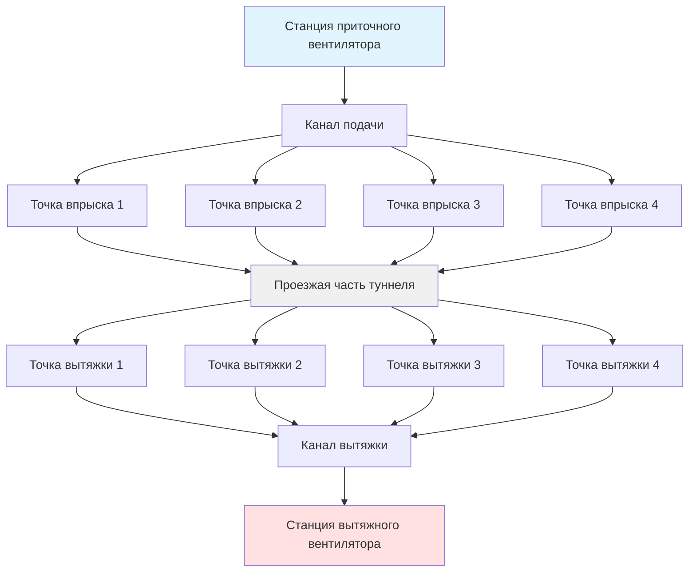
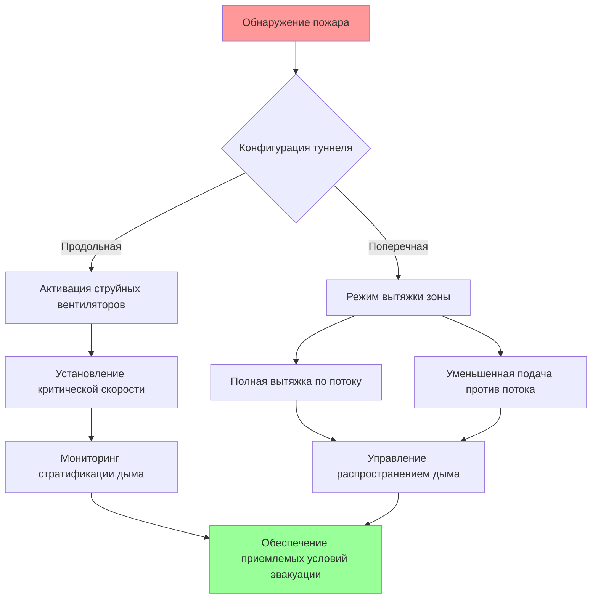

## Основные требования к вентиляции

Системы вентиляции автомобильных туннелей решают две различные задачи эксплуатации с принципиально различной физикой и критериями производительности. Нормальная работа сосредоточена на постоянном разбавлении выбросов двигателей внутреннего сгорания и поддержании приемлемой видимости. Аварийная работа приоритизирует безопасность жизни посредством дымоудаления и обеспечения приемлемых условий для эвакуации во время пожара.

Балансовое уравнение накопления загрязняющих веществ в сечении туннеля устанавливает базовое требование по вентиляции:

$$\dot{m}_{gen} = \dot{m}_{removed} + \frac{dM}{dt}$$

Для установившегося режима слагаемое накопления равно нулю, и требуемый объемный расход становится:

$$Q = \frac{E \cdot N \cdot L}{C_{max} - C_{ambient}}$$

где $E$ представляет уровень выбросов на одно транспортное средство (г/с), $N$ — плотность транспортного потока (транспортных средств/км), $L$ — длина туннеля (м), и $C_{max}$ — максимально допустимая концентрация загрязняющего вещества (ppm или мг/м³).

## Особенности автомобильных и железнодорожных туннелей

Автомобильные и железнодорожные туннели представляют различные вызовы для вентиляции, обусловленные их эксплуатационными характеристиками:

| Параметр | Автомобильные туннели | Железнодорожные туннели |
|-----------|----------------------|------------------------|
| Характер потока | Непрерывный, переменная скорость | Периодический, по расписанию |
| Профиль выбросов | Распределенные источники | Сосредоточены на локомотивах |
| Поршневой эффект | Минимальный (скорость <100 км/ч) | Значительный (отношение блокировки 0,6–0,8) |
| Пожарная нагрузка | Несколько независимых источников | Один сосредоточенный источник |
| Стратегия эвакуации | Выход к порталам или через проходы | Остаться в поезде или контролируемая эвакуация |
| Управление вентиляцией | Непрерывная модуляция | Активация при наступлении события |

Железнодорожные туннели значительно выигрывают от поршневого эффекта, когда движение поезда индуцирует поток воздуха, пропорциональный:

$$Q_{piston} = v \cdot A_{train} \cdot \beta$$

где $v$ — скорость поезда, $A_{train}$ — площадь поперечного сечения поезда, и $\beta$ — отношение блокировки (обычно 0,6–0,8 для систем метро). Этот механизм естественной вентиляции может обеспечить 60–80% требуемой нормальной вентиляции во многих железнодорожных приложениях.

## Конфигурации систем вентиляции

### Естественная вентиляция

Естественная вентиляция полагается на перепады давления, создаваемые термической плавучестью, ветровыми эффектами на порталах и поршневыми эффектами от движения транспорта. Поток, управляемый плавучестью, описывается:

$$\Delta P = \rho \cdot g \cdot h \cdot \frac{\Delta T}{T_{avg}}$$

Естественная вентиляция остается жизнеспособной только для коротких туннелей (обычно L < 300 м для автомобильных, L < 500 м для железнодорожных) с низкими объемами трафика и благоприятными перепадами высот портальных отверстий. Число Фруда характеризует переход от естественной к принудительной вентиляции:

$$Fr = \frac{v}{\sqrt{g \cdot h \cdot \frac{\Delta T}{T_{avg}}}}$$

### Продольная вентиляция

Продольные системы создают однонаправленный поток воздуха, параллельный направлению движения, используя струйные вентиляторы, установленные в потолке или боковых стенах туннеля. Впрыск импульса от массива струйных вентиляторов создает движение воздуха через:

$$\Delta P_{total} = \sum_{i=1}^{n} \frac{\rho \cdot v_{jet,i}^2 \cdot A_{jet,i}}{A_{tunnel}} - \Delta P_{friction}$$

Потеря давления на трение по длине туннеля $L$ следует соотношению Дарси-Вейсбаха:

$$\Delta P_{friction} = f \cdot \frac{L}{D_h} \cdot \frac{\rho \cdot v^2}{2}$$

где $f$ — коэффициент трения (обычно 0,015–0,025 для бетонных туннелей) и $D_h$ — гидравлический диаметр.

Продольные системы превосходят по простоте и капитальным затратам, но создают несколько операционных ограничений. Загрязняющие вещества проходят всю длину туннеля перед выпуском, выбросы у портала концентрируются в одном месте, а аварийное дымоудаление требует поддержания критической скорости для предотвращения обратного потока дыма.

### Поперечная и полупоперечная вентиляция

Поперечные системы используют отдельные каналы подачи и вытяжки, проходящие по длине туннеля с распределенными точками впрыска и вытяжки. Полупоперечные варианты используют либо каналы только подачи, либо только вытяжки в сочетании с потоком у портала.

Распределение давления в канале подачи с равномерной вытяжкой следует:

$$\frac{dP}{dx} = -f \cdot \frac{\rho \cdot v(x)^2}{2 \cdot D_h} - \rho \cdot v(x) \cdot \frac{dv}{dx}$$

Второе слагаемое представляет потерю импульса при боковой вытяжке. Достижение равномерного распределения воздуха требует тщательного калибрования размеров канала и конфигурации заслонок для поддержания напора давления по длине канала.

## Критерии проектирования и нормы

NFPA 502 (Стандарт для дорожных туннелей, мостов и других объектов с ограниченным доступом) и справочник ASHRAE устанавливают количественные критерии производительности:

| Загрязняющее вещество | Предел нормальной работы | Предел аварийной работы | Период усреднения |
|----------------------|--------------------------|----------------------|------------------|
| Угарный газ (CO) | 50 ppm | 400 ppm (приемлемость) | 15 минут |
| Диоксид азота (NO₂) | 1 ppm | 25 ppm (приемлемость) | 15 минут |
| Видимость (коэффициент экстинкции) | > 0,005 м⁻¹ | > 0,1 м⁻¹ (видимость 4 м) | Мгновенное |
| Температура | < 40°C | < 60°C (предел приемлемости) | — |

Длина туннеля и объем трафика устанавливают базовое требование по вентиляции. Коэффициент трафика $TF$ объединяет эти параметры:

$$TF = \frac{N_{vehicles} \cdot L}{3600 \cdot v_{avg}}$$

где $N_{vehicles}$ — объем трафика в час и $v_{avg}$ — средняя скорость транспорта (м/с).

## Аварийная работа и критическая скорость

Сценарии пожара трансформируют требования вентиляции с разбавления на дымоудаление. Критическая скорость $v_{cr}$ представляет минимальный продольный поток воздуха, необходимый для предотвращения обратного потока дыма:

$$v_{cr} = K \cdot \left(\frac{g \cdot Q_{fire} \cdot H}{A \cdot \rho \cdot c_p \cdot T_0}\right)^{1/3}$$

где $Q_{fire}$ — выделение тепла от пожара (кВ), $H$ — высота туннеля, $A$ — площадь поперечного сечения, и $K$ — безразмерный коэффициент (обычно 0,6–0,8, учитывающий геометрию туннеля).

Для пожара расчетной мощностью 100 МВт в типичном автомобильном туннеле (площадь сечения 50 м², высота 5 м) критическая скорость обычно составляет 2,5–3,5 м/с.

Поперечные системы обеспечивают превосходную производительность при аварийной работе посредством непосредственной вытяжки дыма над местом пожара, ограничивая загрязнение прилегающих участков туннеля. Требуемый расход вытяжки для захвата дыма до достижения потолка туннеля следует:

$$Q_{exhaust} = K \cdot P \cdot \sqrt{\frac{Q_{fire}}{P}}$$

где $P$ — периметр пожара и $K$ находится в диапазоне 0,3–0,5 в зависимости от конфигурации вытяжки.

Фундаментальная физика, управляющая вентиляцией туннеля — переносом массы, передачей импульса и плавучестью-управляемой стратификацией — остается постоянной во всех приложениях. Выбор системы уравновешивает капитальные затраты, операционную сложность и специфические требования безопасности каждой установки.
