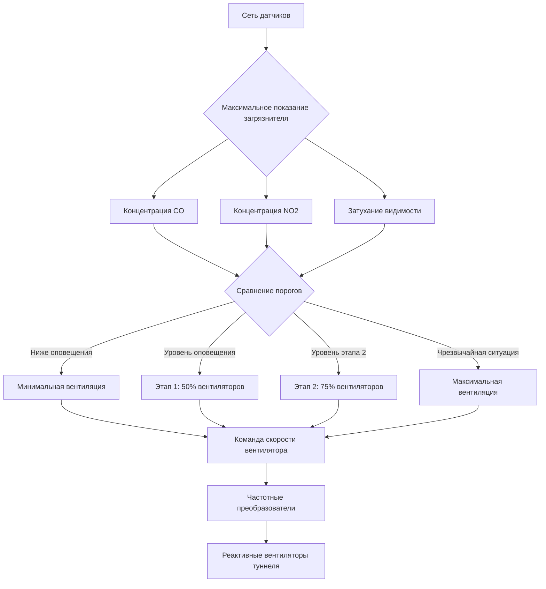

## Обзор

Мониторинг качества воздуха в закрытых объектах для автомобильного транспорта служит механизмом обратной связи для управления вентиляцией на основе спроса. Основными загрязняющими веществами, требующими постоянного измерения, являются монооксид углерода (CO), диоксид азота (NO₂) и твердые частицы, снижающие видимость. Эти системы мониторинга непосредственно взаимодействуют с управлением вентиляторами для поддержания безопасных условий дыхания и достаточной дальности видимости для движения транспортных средств.

## Мониторинг монооксида углерода

### Технология датчиков CO

Современные датчики CO в туннелях используют электрохимическую или инфракрасную абсорбционную технологию. Электрохимические элементы генерируют ток, пропорциональный концентрации CO, через окислительно-восстановительные реакции на поверхностях электродов:

$$\text{CO} + \text{H}_2\text{O} \rightarrow \text{CO}_2 + 2\text{H}^+ + 2e^-$$

Электрический ток, создаваемый в результате, прямо пропорционален концентрации CO, обычно измеряемой в частях на миллион (ppm). Инфракрасные датчики работают на принципе, что молекулы CO поглощают определенные длины волн в инфракрасном спектре (4,6 мкм), при этом интенсивность поглощения подчиняется закону Бера-Ламберта:

$$I = I_0 e^{-\alpha C L}$$

Где:
- $I$ = интенсивность прошедшего света
- $I_0$ = начальная интенсивность света
- $\alpha$ = коэффициент поглощения
- $C$ = концентрация CO
- $L$ = оптическая длина пути

### Проектирование сети датчиков

NFPA 502 требует мониторинга CO с интервалами, не превышающими 91 метра в дорожных туннелях. Расположение датчиков следует этим принципам:

**Горизонтальное расстояние**: Датчики расположены для обнаружения локальных карманов загрязнения до того, как они превысят пороговые уровни. Время смешивания для диспергирования загрязнителей управляется турбулентной диффузией:

$$\frac{\partial C}{\partial t} = D_t \frac{\partial^2 C}{\partial x^2} + v \frac{\partial C}{\partial x}$$

Где $D_t$ представляет турбулентную диффузивность и $v$ - среднюю скорость потока воздуха.

**Вертикальное размещение**: Плотность CO (1,25 г/л при нормальных условиях) приблизительно равна плотности воздуха (1,29 г/л), что приводит к нейтральной плавучести. Датчики устанавливаются на высоте дыхательной зоны (1,2-1,8 метра над дорогой) для точного измерения воздействия на водителя.

**Метод отбора проб**: Точечное отбирание проб в сравнении с усредненным отбором по нескольким местоположениям определяет стабильность управления. Усредненные показания снижают ложные тревоги от переходных скачков, но могут задержать реагирование на развивающиеся условия.

| Тип датчика | Время отклика | Точность | Интервал обслуживания | Типовой срок службы |
|-------------|--------------|----------|---------------------|--------------|
| Электрохимический | 30-90 секунд | ±5 ppm | 6 месяцев | 2-3 года |
| Инфракрасный (NDIR) | 10-30 секунд | ±2 ppm | 12 месяцев | 10+ лет |

### Уставки управления

Типичные пороги управления CO для активации вентиляции:

- **Уровень оповещения**: 35 ppm (предельно допустимая концентрация за 8 часов)
- **Активация этапа 1**: 50 ppm
- **Активация этапа 2**: 70 ppm
- **Уровень чрезвычайной ситуации**: 100 ppm (повышенный поток воздуха на максимум)

Соотношение между скоростью вентиляции и концентрацией CO предполагает стационарное разбавление:

$$Q = \frac{G}{C - C_0}$$

Где:
- $Q$ = требуемая скорость вентиляции (CFM)
- $G$ = скорость выработки загрязнителя (ppm·CFM)
- $C$ = целевая концентрация CO
- $C_0$ = концентрация CO наружного воздуха

## Мониторинг видимости

### Технология трансмиссометра

Счетчики видимости (трансмиссометры) измеряют коэффициент светового затухания в атмосфере ($b_{ext}$) путем проецирования коллимированного светового луча по ширине туннеля и измерения прошедшей интенсивности. Основное соотношение:

$$\frac{I}{I_0} = e^{-b_{ext} \cdot L}$$

Коэффициент затухания напрямую связан с расстоянием видимости через уравнение Кошмидера:

$$V = \frac{-\ln(\epsilon)}{b_{ext}} \approx \frac{3,912}{b_{ext}}$$

Где $\epsilon$ - порог контрастности (обычно 0,02 для человеческого зрения).

### Физическая основа непрозрачности

Световое затухание в атмосфере туннеля происходит в результате рассеяния Ми дизельными частицами (диаметр 0,1-1,0 мкм). Эффективность рассеяния максимальна, когда диаметр частицы приближается к длине волны видимого света (0,4-0,7 мкм), что создает максимальное снижение видимости на единицу массы.

Массовая концентрация частиц связана с затуханием через:

$$b_{ext} = Q_{ext} \cdot \rho_p \cdot A_c$$

Где:
- $Q_{ext}$ = эффективность затухания (безразмерная)
- $\rho_p$ = плотность частиц
- $A_c$ = площадь поперечного сечения частицы на единицу объема

### Требования к установке

Трансмиссометры устанавливаются с:
- **Длина пути**: 30-50 метров типичная (полная ширина туннеля)
- **Высота монтажа**: Выше габаритов транспортного средства, защищено от брызг
- **Допуск выравнивания**: Максимум ±0,5 градуса
- **Источник света**: LED или лазер (880 нм инфракрасный обычно используется для избежания помех от солнца)

| Диапазон видимости | Коэффициент затухания | Ответ вентиляции |
|------------------|----------------------|---------------------|
| >400 м | <0,01 м⁻¹ | Нормальная работа |
| 200-400 м | 0,01-0,02 м⁻¹ | Вентиляция этапа 1 |
| 100-200 м | 0,02-0,04 м⁻¹ | Вентиляция этапа 2 |
| <100 м | >0,04 м⁻¹ | Максимальная вентиляция |

## Мониторинг диоксида азота

### Образование и значение NO₂

Диоксид азота образуется при окислении оксида азота (NO), выбрасываемого при горении:

$$2\text{NO} + \text{O}_2 \rightarrow 2\text{NO}_2$$

Эта реакция протекает медленно при температурах окружающей среды, но ускоряется в присутствии озона и солнечного света. NO₂ более токсичен, чем CO при эквивалентных концентрациях, и вызывает раздражение дыхательных путей при уровнях выше 1 ppm.

### Технология датчиков

Датчики NO₂ обычно используют хемилюминесценцию или электрохимическое обнаружение. Метод хемилюминесценции реагирует NO₂ с люминолом, производя свет, пропорциональный концентрации. Электрохимические датчики работают аналогично ячейкам CO, но с селективными электродами, чувствительными к NO₂.

### Интеграция управления

Пороги управления NO₂:
- **Оповещение**: 1 ppm
- **Активация**: 3 ppm
- **Чрезвычайная ситуация**: 5 ppm (потолочный предел NIOSH)

## Интегрированное управление вентиляцией

### Архитектура логики управления

Системы мониторинга качества воздуха подают данные в иерархические алгоритмы управления:

### Алгоритм управления

Система управления определяет требуемую скорость вентиляции путем сравнения множественных измерений загрязнителей:

$$Q_{required} = \max\left(Q_{CO}, Q_{NO_2}, Q_{vis}, Q_{min}\right)$$

Где каждый компонент представляет поток воздуха, необходимый для поддержания этого параметра в пределах допусков. Система реагирует на наиболее требовательное условие.

### Постоянные времени и реагирование

Ответ системы вентиляции включает множественные задержки во времени:

1. **Ответ датчика**: 30-90 секунд
2. **Обработка управления**: 1-5 секунд
3. **Ускорение вентилятора**: 20-60 секунд до полной скорости
4. **Транспортировка воздушной массы**: $\tau = L/v$ где $L$ - длина туннеля

Общая постоянная времени системы для туннеля длиной 305 метров при скорости потока 4,6 м/с:

$$\tau_{total} = \tau_{sensor} + \tau_{fan} + \frac{305 \text{ м}}{4,6 \text{ м/с}} \approx 90 + 40 + 66 = 196 \text{ секунд}$$

Эта задержка в 3 минуты требует консервативных уставок для предотвращения превышения пределов безопасности для здоровья во время переходных событий.

## Ввод в эксплуатацию и калибровка системы

### Требования к калибровке

**Датчики CO**: Калибруйте по сертифицированным газовым стандартам (50 ppm и 100 ppm) каждые 6 месяцев. Проверьте нулевую точку отфильтрованным воздухом.

**Трансмиссометры**: Калибруйте, используя нейтральные фильтры плотности с известными значениями пропускания. Проверяйте оптическое выравнивание и чистоту окон ежемесячно.

**Датчики NO₂**: Калибруйте по стандартам 1 ppm и 5 ppm каждые 6 месяцев. Перекрестная чувствительность к NO должна быть проверена ниже 10%.

### Проверка производительности

Введите системы в эксплуатацию с дымовыми тестами или контролируемыми выбросами CO для проверки:
- Обнаружение датчиком в каждом местоположении
- Время отклика системы управления
- Правильное включение этапов оборудования вентиляции
- Сигналы тревоги и регистрация данных

Система мониторинга служит критически важным контуром обратной связи, обеспечивая энергоэффективную вентиляцию на основе спроса при одновременном поддержании безопасности пассажиров в рамках уникальных ограничений закрытых объектов для автомобильного транспорта.

## Стандарты и ссылки

**NFPA 502**: Стандарт для дорожных туннелей, мостов и других автомагистралей ограниченного доступа
- Раздел 7.4: Требования к мониторингу окружающей среды
- Раздел 7.5: Пороги контроля качества воздуха
- Приложение D: Критерии проектирования систем вентиляции

**ASHRAE**: Прямых стандартов для вентиляции туннелей нет, но психрометрические принципы применяются к влиянию влаги и температуры на датчики.
