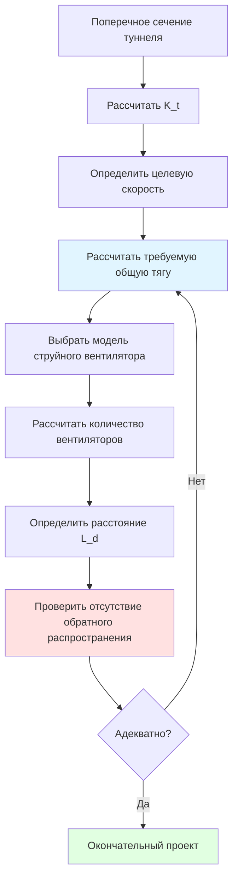
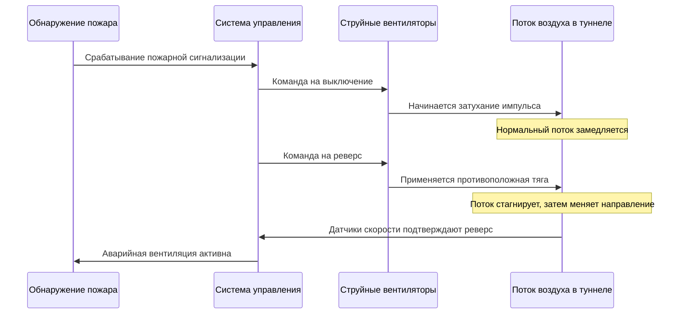

## Введение

Струйные вентиляторы обеспечивают продольную вентиляцию автомобильных туннелей путем передачи импульса потоку воздуха в туннеле без необходимости дорогостоящих воздуховодов. Эти осевые устройства создают тягу посредством передачи импульса, ускоряя столб воздуха, который увлекает окружающий воздух туннеля для создания объемного потока. В отличие от традиционных канальных систем, струйные вентиляторы устанавливаются непосредственно на своде туннеля, обеспечивая гибкость монтажа и сниженные капитальные затраты для туннелей длиной более 300 м.

## Создание тяги и передача импульса

Производительность струйного вентилятора основана на втором законе Ньютона, применяемом к потоку жидкости. Сила тяги $F_t$, создаваемая струйным вентилятором, равна скорости изменения импульса, передаваемого воздуху:

$$F_t = \dot{m}(V_e - V_i) = \rho A_e V_e(V_e - V_i)$$

где $\dot{m}$ — расход массы, $V_e$ — скорость на выходе, $V_i$ — скорость на входе, $\rho$ — плотность воздуха и $A_e$ — площадь выхода.

Для стационарных установок, где $V_i \approx 0$, это упрощается до:

$$F_t = \rho A_e V_e^2$$

Эффект сопла Саккардо усиливает эту тягу на 15-25% посредством действия диффузора. Правильно спроектированная конфигурация сужающегося расширяющегося сопла на выходе вентилятора создает восстановление давления, которое увеличивает эффективную передачу импульса. Угол расширения не должен превышать 7° для предотвращения отделения потока; оптимальные конструкции используют угол 4-6° по включению.

Коэффициент тяги $C_t$ характеризует эффективность сопла:

$$C_t = \frac{F_{actual}}{F_{theoretical}} = \frac{F_{actual}}{\rho A_e V_e^2}$$

Высокоэффективные сопла Саккардо достигают $C_t = 1,15$ до $1,25$, по сравнению с $C_t = 1,0$ для вентиляторов без сопла.

## Требования к тяге системы

Необходимая общая тяга зависит от аэродинамического сопротивления туннеля и целевой скорости воздуха. Сила сопротивления туннеля $F_r$ составляет:

$$F_r = \frac{1}{2}\rho V^2 A_t K_t$$

где $V$ — скорость объемного потока, $A_t$ — площадь поперечного сечения туннеля и $K_t$ — коэффициент сопротивления туннеля.

Коэффициент сопротивления объединяет трение кожи и местные потери:

$$K_t = \frac{f L}{D_h} + \sum K_{local}$$

где $f$ — коэффициент трения Дарси (0,015-0,025 для бетонных туннелей), $L$ — длина туннеля, $D_h$ — гидравлический диаметр и $\sum K_{local}$ учитывает портальные сечения, изгибы и изменения уклона.

NFPA 502 требует достаточной пропускной способности для поддержания минимальной критической скорости во время пожара—обычно 3-4 м/с для предотвращения обратного распространения дыма против потока трафика.

## Расстояние и размещение струйных вентиляторов

Оптимальное расстояние балансирует распределение тяги против затрат на монтаж. Длина диффузии импульса $L_d$ определяет эффективное расстояние:

$$L_d = \frac{A_t}{P_t} \cdot \frac{V}{V_e} \cdot C_e$$

где $P_t$ — периметр туннеля и $C_e$ — коэффициент увлечения (обычно 0,1-0,15).

Вентиляторы, расположенные ближе, чем $L_d$, работают в развивающейся струе, снижая эффективность. Расстояние более $2L_d$ создает стратификацию скорости. Практические установки используют расстояние 30-60 м в зависимости от геометрии туннеля и требований к тяге.

Высота установки влияет на характер увлечения. Монтаж на своде на высоте 80-90% от высоты туннеля максимизирует увлечение воздуха, сохраняя зазор. Монтаж по осевой линии является предпочтительным; смещенные установки создают асимметричные картины потока, которые снижают эффективную тягу на 10-15%.

## Реверсивная работа для аварийной вентиляции

Аварийные ситуации при пожаре требуют быстрого изменения направления потока для удаления дыма или предотвращения загрязнения маршрутов эвакуации. Реверсивные струйные вентиляторы достигают этого путем реверса двигателя или изменяемого угла лопастей, обеспечивая полную обратную тягу за 60-90 секунд.

Процесс изменения направления потока включает три этапа:

1. **Фаза торможения**: Существующий импульс затухает при выключении вентиляторов ($t = 0$ до $t_1$)
2. **Инициирование реверса**: Вентиляторы перезапускаются в противоположном направлении, создавая противоположные струи ($t = t_1$ до $t_2$)
3. **Установление потока**: Объемный поток меняет направление и стабилизируется ($t = t_2$ до $t_3$)

Общее время реверса зависит от длины туннеля и сопротивления:

$$t_{total} = \frac{\rho L A_t V}{F_{net}} + t_{fan}$$

где $t_{fan}$ — время механического реверса вентилятора (30-45 секунд для современных установок).

## Огнестойкие струйные вентиляторы

Огнестойкие струйные вентиляторы должны работать при температурах до 250°C или 400°C в зависимости от классификации NFPA 502. Критические конструктивные особенности включают:

| Компонент | Стандартный вентилятор | Огнестойкий (250°C) | Огнестойкий (400°C) |
|-----------|----------------------|-------------------|-------------------|
| Изоляция двигателя | Класс F (155°C) | Класс H (180°C) с охлаждением | Увеличенный класс H с принудительным охлаждением |
| Материал рабочего колеса | Алюминиевый сплав | Термообработанный алюминий | Нержавеющая сталь или титан |
| Тип подшипников | Защищенные шарикоподшипники | Высокотемпературная смазка, внешнее охлаждение | Керамические или высокотемпературная сталь |
| Кожух | Углеродистая сталь | Нержавеющая сталь 304 | Нержавеющая сталь 316 или керамическое покрытие |
| Номинальная длительность | Н/Д | 60-120 минут | 120-240 минут |

Охлаждение двигателя зависит от внешнего воздуха, поступающего из более холодных сечений туннеля, или специальных вентиляторов охлаждения, которые активируются при пожаре. Передача тепла от двигателя к охлаждающему воздуху составляет:

$$Q = \dot{m}_c c_p (T_{out} - T_{in}) = \frac{P_{motor}}{\eta_{cooling}}$$

где $\dot{m}_c$ — расход охлаждающего воздуха и $\eta_{cooling}$ — эффективность системы охлаждения (0,7-0,85).

## Рассмотрения при монтаже

Монтаж на своде требует структурного анализа нагрузок на подвеску. Динамическая нагрузка включает:

- Статический вес: 500-2000 кг на единицу вентилятора
- Сила реакции тяги: Равная и противоположная номинальной тяге
- Вибрационная нагрузка: Частота обычно 20-60 Гц при частоте прохождения лопастей

Изолирующие крепления должны ослаблять вибрацию при сопротивлении нагрузкам тяги. Пружинные изоляторы с прогибом 25-50 мм обеспечивают изоляцию 90-95% при рабочих частотах.

Электроснабжение должно учитывать одновременный пуск при аварийной работе. Пусковой ток достигает 6-8 кратного номинального тока при прямом запуске; мягкие пускатели снижают это до 3-4 кратного, но увеличивают время запуска.

## Шумоподавление

Струйные вентиляторы создают широкополосный шум от турбулентного смешивания и тональные компоненты при частоте прохождения лопастей. Уровень звуковой мощности коррелирует с мощностью вентилятора:

$$L_w = 10 \log_{10}(P_{fan}) + C_{fan}$$

где $C_{fan}$ составляет от 35-45 дБ в зависимости от качества конструкции.

Стратегии смягчения включают:

- **Акустическая облицовка**: Перфорированный металл с поглощением минеральной ватой (NRC 0,7-0,9)
- **Конструкции с низкой окружной скоростью**: Больший диаметр при сниженных оборотах снижает шум на 3-6 дБ на каждые 10% снижения скорости
- **Секции глушителей**: Добавляемые диффузоры с поглощающей футеровкой, затухание 10-15 дБ
- **Оптимизированное количество лопастей**: 7 или 9 лопастей распределяют тональную энергию по большему количеству частот

Реверберация туннеля усиливает шум; обработка поглощением стен туннеля в пределах 15 м от установок вентилятора снижает отраженный звук на 5-8 дБ.

## Операционная эффективность

Эффективность струйного вентилятора $\eta_j$ представляет созданную тягу на единицу потребляемой мощности:

$$\eta_j = \frac{F_t \cdot V}{\frac{P_{fan}}{\rho A_t}}$$

Типичные значения составляют 0,5-0,7 для стандартных конструкций; оптимизированные высокоэффективные установки достигают 0,7-0,85. Потребление энергии для системы туннеля составляет:

$$P_{total} = \frac{n \cdot F_t \cdot V}{\eta_j}$$

где $n$ — количество работающих вентиляторов.

Преобразователи частоты позволяют ступенчатую работу на основе интенсивности трафика и качества воздуха, снижая годовое потребление энергии на 30-50% по сравнению с работой на постоянной скорости.

## Заключение

Системы струйных вентиляторов обеспечивают экономичную, гибкую продольную вентиляцию автомобильных туннелей посредством прямой передачи импульса. Надлежащее проектирование требует точных расчетов тяги с учетом сопротивления туннеля, тщательного расстояния для оптимизации увлечения и огнестойкой конструкции для аварийной работы. Эффект сопла Саккардо и реверсивная способность повышают производительность, тогда как монтаж на своде и акустическая обработка решают проблемы монтажа. Соответствие NFPA 502 обеспечивает безопасность жизни при пожаре посредством адекватного поддержания критической скорости и быстрого изменения направления потока.
