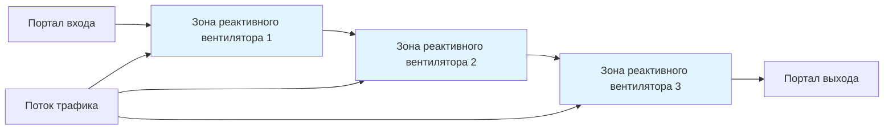
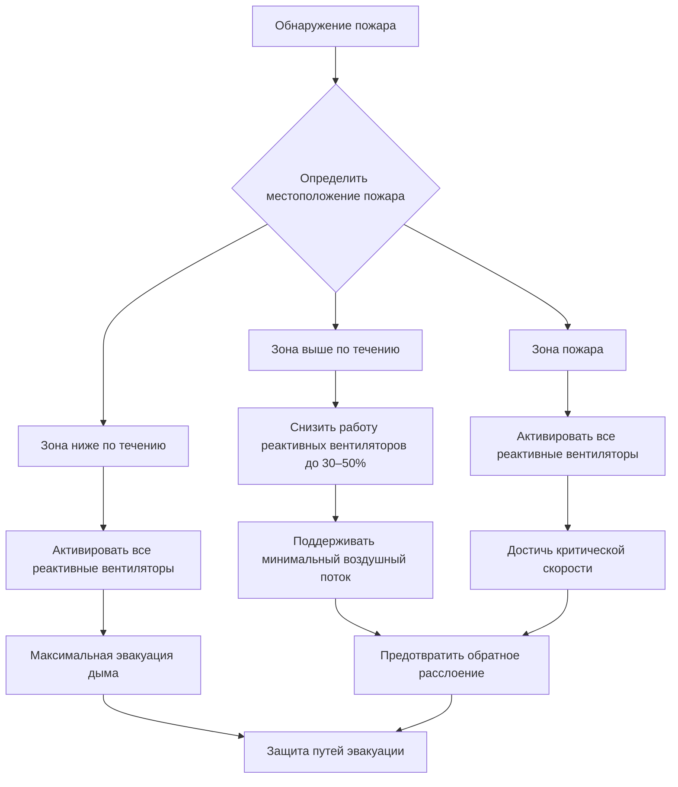

## Основы продольной вентиляции

Системы продольной вентиляции создают однонаправленный воздушный поток по всей длине туннеля, перемещая воздух от одного портала к другому. Этот подход основывается на придании импульса воздушной массе, а не на физическом перемещении воздуха через воздуховоды. Система использует саму геометрию туннеля в качестве пути распределения воздуха, что делает её наиболее экономичным решением для туннелей длиной менее 914 м.

Фундаментальный принцип заключается в добавлении тяги для преодоления сопротивления системы и поддержания достаточной скорости воздуха для разбавления выбросов от транспорта во время нормальной работы и контроля движения дыма во время аварийных пожаров. Общее требование по тяге зависит от аэродинамического сопротивления туннеля, сопротивления, вызванного трафиком, влияния уклона и требуемой скорости воздуха.

## Проектирование реактивных вентиляторов и механика тяги

Реактивные вентиляторы работают на принципе передачи импульса, описанном вторым законом Ньютона. Реактивный вентилятор ускоряет воздух через рабочее колесо, выбрасывая его с высокой скоростью. Изменение импульса придает тягу окружающему туннельному воздуху, постепенно ускоряя общий воздушный поток.

### Расчет тяги

Теоретическая тяга, производимая одним реактивным вентилятором:

$$T = \dot{m}(V_j - V_t) = \rho A_j V_j(V_j - V_t)$$

Где:
- $T$ = сила тяги (Н)
- $\dot{m}$ = массовый расход через реактивный вентилятор (кг/с)
- $V_j$ = скорость выброса реактивного вентилятора (м/с)
- $V_t$ = скорость воздуха в туннеле (м/с)
- $\rho$ = плотность воздуха (кг/м³)
- $A_j$ = площадь выброса реактивного вентилятора (м²)

Эффективная тяга с учетом потерь установки и затухания реактивной струи:

$$T_{eff} = \eta_i \cdot T = \eta_i \cdot \rho A_j V_j(V_j - V_t)$$

Где $\eta_i$ = коэффициент эффективности установки (обычно 0,85–0,95 в зависимости от конфигурации монтажа и зазоров).

### Эффективность реактивного вентилятора

Аэродинамическая эффективность самого реактивного вентилятора связывает входную мощность с добавленным импульсом:

$$\eta_{jet} = \frac{\dot{m}(V_j - V_t)}{P_{motor}} = \frac{\rho A_j V_j(V_j - V_t)}{P_{motor}}$$

Современные осевые реактивные вентиляторы достигают аэродинамической эффективности 50–60% при работе в номинальных условиях. Двухступенчатые вентиляторы могут превысить 65% эффективности.

## Требования к системной тяге

Общая тяга, необходимая для поддержания продольного воздушного потока, учитывает несколько компонентов сопротивления:

$$T_{total} = T_{friction} + T_{grade} + T_{portal} + T_{traffic}$$

### Сопротивление трению туннеля

Сопротивление трению следует соотношению Дарси–Вейсбаха, адаптированному для потоков в туннелях:

$$T_{friction} = f \cdot \frac{L}{D_h} \cdot \frac{\rho V_t^2}{2} \cdot A_t$$

Где:
- $f$ = коэффициент трения (безразмерный, обычно 0,015–0,025 для бетонных туннелей)
- $L$ = длина туннеля (м)
- $D_h$ = гидравлический диаметр (м), $D_h = \frac{4A_t}{P}$
- $A_t$ = площадь поперечного сечения туннеля (м²)
- $P$ = периметр туннеля (м)

Коэффициент трения зависит от шероховатости поверхности туннеля и числа Рейнольдса. Для бетонных туннелей со стандартной отделкой обычно используется $f = 0,020$.

### Влияние уклона

Силы плавучести, вызванные уклоном туннеля, либо способствуют, либо противодействуют воздушному потоку:

$$T_{grade} = \rho g A_t L \sin(\theta)$$

Где:
- $g$ = ускорение свободного падения (9,81 м/с²)
- $\theta$ = угол уклона туннеля (радианы или градусы)

Для малых углов: $\sin(\theta) \approx \tan(\theta) = \frac{\text{подъем}}{\text{пролет}}$

Положительный уклон (вверх по направлению потока) требует дополнительной тяги; отрицательный уклон (вниз) обеспечивает вспомогательную силу.

### Потери на портале

Потери на входе и выходе в портальных участках туннеля:

$$T_{portal} = K_p \cdot \frac{\rho V_t^2}{2} \cdot A_t$$

Где $K_p$ = коэффициент потери портала (обычно 1,0–1,5 в зависимости от геометрии портала).

### Сопротивление, вызванное трафиком

Дорожный трафик создает дополнительное сопротивление через трение кожи и лобовое сопротивление:

$$T_{traffic} = 0,5 \rho C_d A_v n V_{rel}^2$$

Где:
- $C_d$ = коэффициент лобового сопротивления транспорта (обычно 0,6–0,8)
- $A_v$ = средняя площадь фронтальной проекции транспорта (м²)
- $n$ = количество транспортных средств в туннеле
- $V_{rel}$ = относительная скорость между транспортом и воздухом

Этот компонент значительно варьируется в зависимости от плотности и состава трафика.

## Поршневой эффект

Поршневой эффект описывает воздушный поток, вызванный движением транспорта. Когда транспортные средства движутся по туннелю, они вытесняют воздух вперед и создают потоки следования, фактически действуя как движущиеся поршни. Этот феномен значительно влияет на проектирование и эксплуатацию системы продольной вентиляции.

### Количественная оценка поршневого эффекта

Объемный расход, создаваемый одним транспортным средством:

$$Q_{piston} = V_{vehicle} \cdot A_{blockage} \cdot \eta_{drag}$$

Где:
- $V_{vehicle}$ = скорость транспорта (м/с)
- $A_{blockage}$ = эффективная площадь блокировки, обычно 0,7–0,8 фронтальной площади транспорта
- $\eta_{drag}$ = коэффициент эффективности сопротивления (0,5–0,7)

Для типичных пассажирских автомобилей на скоростях автомагистралей (100 км/ч), поршневой эффект может генерировать 40–60 м³/с (1,415–2,122 CFM) на один автомобиль.

### Влияние потока трафика

При интенсивном однонаправленном трафике кумулятивный поршневой эффект может превышать расчетный вентиляционный расход, потенциально создавая избыточную вентиляцию в направлении трафика и недостаточную вентиляцию в направлении возврата. NFPA 502 требует рассмотрения сценариев двусторонного трафика, где поршневые эффекты частично взаимно компенсируются.

| Условие трафика | Влияние поршневого эффекта | Стратегия вентиляции |
|------------------|---------------------|---------------------|
| Легкий трафик, однонаправленный | Минимальный, ~10% расчетного расхода | Нормальная работа реактивных вентиляторов |
| Интенсивный однонаправленный трафик | Значительный, 50–100% расчетного | Снижение или остановка реактивных вентиляторов |
| Заторы двусторонние | Взаимно компенсирующиеся эффекты | Полная работа реактивных вентиляторов |
| Остановленный трафик (инцидент) | Нулевой поршневой эффект | Максимальная вентиляционная мощность |

## Скорость воздуха при нормальной работе

ASHRAE рекомендует, а NFPA 502 устанавливает скорости продольного воздуха при нормальной работе на основе требований контроля выбросов:

- Минимум: 2,0 м/с для эффективного разбавления загрязняющих веществ
- Максимум: 11 м/с для предотвращения чрезмерного сопротивления транспорта и дискомфорта водителя

Расчетная скорость обычно находится в диапазоне 3–6 м/с в зависимости от:
- Объема и состава трафика
- Длины и геометрии туннеля
- Скоростей образования выбросов (CO, NO₂, твердые частицы)
- Условий окружающей среды на портале

### Разбавление загрязняющих веществ

Требуемая скорость воздуха для контроля загрязняющих веществ:

$$V_t = \frac{E_{total}}{C_{limit} \cdot A_t - C_{ambient}}$$

Где:
- $E_{total}$ = общая скорость образования выбросов (масса/время)
- $C_{limit}$ = допустимое предельное значение концентрации
- $C_{ambient}$ = концентрация окружающей среды на портале

## Критическая скорость для безопасности при пожаре

Критическая скорость представляет минимальную продольную скорость воздуха, необходимую для предотвращения обратного расслоения дыма во время пожара в туннеле. Обратное расслоение происходит, когда плавучие горячие газы преодолевают продольный воздушный поток и распространяются вверх по течению, создавая опасные условия для эвакуации.

### Формула критической скорости

Программа испытаний вентиляции при пожаре в Мемориальном туннеле (1995) установила широко используемую корреляцию критической скорости:

$$V_{critical} = K \cdot \left(\frac{gHQ}{A_t \rho C_p T_{amb}}\right)^{1/3}$$

Где:
- $K$ = безразмерный коэффициент (обычно 1,0–1,2)
- $g$ = ускорение свободного падения (9,81 м/с²)
- $H$ = высота туннеля (м)
- $Q$ = скорость тепловыделения (кВт)
- $A_t$ = поперечное сечение туннеля (м²)
- $C_p$ = удельная теплоемкость воздуха (1,005 кДж/кг·К)
- $T_{amb}$ = температура окружающей среды (К)

Для практического применения со скоростью тепловыделения в МВт:

$$V_{critical} \approx 1,53 \left(\frac{Q_{MW}}{A_t}\right)^{1/3} \text{ м/с}$$

### Сценарии расчетного пожара

NFPA 502 классифицирует расчетные пожары по скорости тепловыделения:

| Категория пожара | Скорость тепловыделения | Представительное транспортное средство | Критическая скорость (туннель 10 м²) |
|--------------|-------------------|----------------------|----------------------------------|
| Легковой автомобиль | 5 МВт | Легковой автомобиль, мотоцикл | 2,6 м/с |
| Пассажирское транспортное средство | 20 МВт | Седан, внедорожник | 4,1 м/с |
| Автобус/крупное транспортное средство | 30 МВт | Автобус, грузовой фургон | 4,7 м/с |
| Грузовой автомобиль | 50–100 МВт | Тягач с полуприцепом | 5,8–7,3 м/с |

Большинство конструкций туннелей ориентированы на пожары 50–100 МВт, требующие критических скоростей 6–8 м/с.

### Влияние уклона на критическую скорость

Уклон туннеля модифицирует требуемую критическую скорость:

$$V_{critical,grade} = V_{critical,level} + K_g \cdot \tan(\theta)$$

Где $K_g$ = коэффициент уклона (эмпирически 0,05–0,10). Восходящие уклоны увеличивают требования; нисходящие уклоны снижают их.

## Аварийная операция при пожаре

Во время пожарных аварий системы продольной вентиляции работают в совершенно иных режимах, чем нормальная вентиляция:

### Операционные стратегии

1. **Полный продольный поток**: Все реактивные вентиляторы работают для проталкивания дыма вниз по потоку, поддерживая критическую скорость по всей длине туннеля. Эвакуирующиеся движутся вверх по потоку против потока в свежем воздухе.

2. **Зональная работа**: Реактивные вентиляторы разделены на контрольные зоны, вентиляторы выше по течению работают с пониженной мощностью для минимизации распространения дыма, при этом вентиляторы ниже по течению максимизируют эвакуацию.

3. **Возможность реверса**: Некоторые системы могут обратить направление потока в зависимости от местоположения пожара относительно портальных участков, всегда проталкивая дым к ближайшему выходу.

### Интеграция системы управления

Современные системы интегрируют:
- Детекторы тепла и дыма (каждые 50–100 м согласно NFPA 502)
- Мониторы CO/видимости
- CCTV с автоматическим обнаружением инцидентов
- Системы аварийной связи
- Автоматизированные алгоритмы управления реактивными вентиляторами
- Ручное управление из центра управления

Система управления должна достичь полной аварийной вентиляционной мощности в течение 120 секунд после обнаружения пожара согласно требованиям NFPA 502.

## Расположение и расстояние реактивных вентиляторов

Надлежащее размещение реактивных вентиляторов максимизирует эффективность тяги и обеспечивает равномерное развитие скорости:

### Продольное расстояние

Реактивные вентиляторы обычно размещены на расстоянии 200–400 м в группах по 2–4 единицы. Оптимальное расстояние балансирует:
- Длину смешивания реактивной струи и передачи импульса
- Требования инфраструктуры электрораспределения
- Требования доступа для обслуживания
- Оптимизацию капитальных затрат

### Высота установки

Реактивные вентиляторы монтируются на 0,3–0,5 м ниже потолка туннеля для:
- Максимизации зазора для крупногабаритного транспорта
- Позиционирования выброса в верхнем слое дыма во время пожаров
- Минимизации акустического воздействия на пассажиров транспорта

### Распределение тяги

Общая тяга распределена равномерно по длине туннеля для предотвращения градиентов скорости и обеспечения эффективного контроля загрязняющих веществ:

$$n_{fans} = \frac{T_{total}}{T_{fan,rated}} \cdot SF$$

Где $SF$ = коэффициент безопасности (обычно 1,2–1,5) для учета деградации и будущего увеличения трафика.

## Проверка производительности

Испытания при пуске подтверждают производительность системы:

1. **Испытание холодного потока**: Измерение фактических скоростей воздуха в нескольких поперечных сечениях с использованием сеток анемометра или исследований с помощью трассирующего газа. Проверка достижения расчетной скорости в пределах ±10%.

2. **Измерение тяги**: Горячее анемометрическое измерение в выбросе реактивного вентилятора для подтверждения номинальной мощности тяги.

3. **Испытание аварийного реагирования**: Демонстрация перехода в режим чрезвычайной ситуации в течение установленных временных пределов.

4. **Испытание дымом**: Визуальная проверка с использованием нетоксичных генераторов дыма для подтверждения контроля дыма и отсутствия обратного расслоения при расчетной критической скорости.

NFPA 502 требует полного функционального тестирования перед открытием туннеля и периодической переверификации каждые 3–5 лет.

## Преимущества и ограничения системы

**Преимущества:**
- Минимальная стоимость капитала для коротких туннелей (<914 м)
- Не требуется воздуховодов, максимизируя поперечное сечение туннеля
- Гибкая работа, адаптирующаяся к условиям трафика
- Простое обслуживание с доступным оборудованием

**Ограничения:**
- Скорости воздуха ниже 2 м/с трудно достичь надежно
- Эффекты портала и условия ветра влияют на производительность
- Максимальная эффективная длина ~3 км перед чрезмерными требованиями тяги
- Отказы в одной точке влияют на большие участки туннеля
- Менее точный контроль вентиляции, чем поперечные системы

**Применение:**
- Автомобильные туннели длиной менее 3 км
- Подземные городские дороги
- Горные туннели с однонаправленным трафиком
- Модернизация вентиляции

## Справочники

- NFPA 502: Стандарт для дорожных туннелей, мостов и других сооружений ограниченного доступа
- Справочник ASHRAE - HVAC Приложения, Глава 15: Сооружения для закрытых транспортных средств
- Программа испытаний вентиляции при пожаре в Мемориальном туннеле, 1995
- PIARC: Дорожные туннели - выбросы от транспорта и требования воздуха для вентиляции

---

*Физико-базированный анализ продольной вентиляции, включающий принципы передачи импульса, теорию критической скорости и стратегии аварийного контроля дыма в соответствии с действующими стандартами NFPA 502.*
