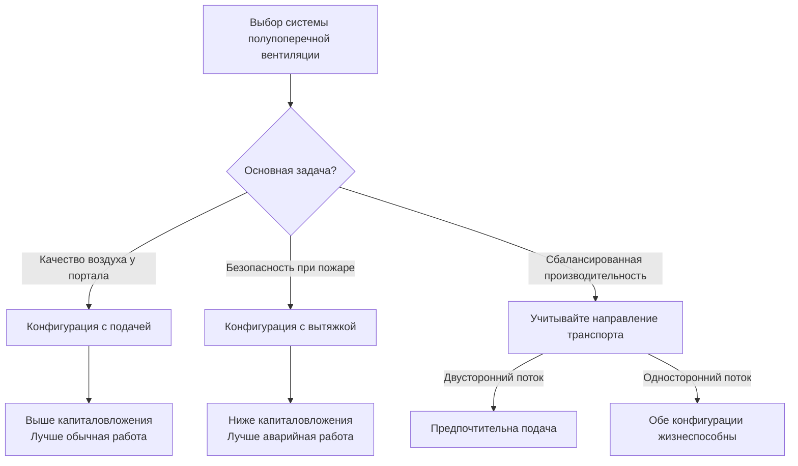

Системы полупоперечной вентиляции представляют собой гибридный подход между полнопоперечными и продольными конфигурациями, используя воздуховодные распределительные системы либо на стороне подачи, либо на стороне вытяжки, допуская при этом естественный воздушный поток на противоположной стороне. Эти системы обеспечивают превосходный контроль по сравнению с чисто продольными системами, требуя при этом меньших капиталовложений в инфраструктуру, чем полнопоперечные конфигурации, что делает их экономически целесообразными для тоннелей средней длины (обычно 300–1800 м).

## Фундаментальные принципы работы

Системы полупоперечной вентиляции используют обмен импульса между воздушным потоком из воздуховода и средой тоннеля для установления контролируемых паттернов вентиляции. В конфигурациях с подачей свежего воздуха происходит выброс через отверстия воздуховода по длине тоннеля, создавая локальные зоны повышенного давления, которые направляют загрязнители к выходам портала. Системы с вытяжкой извлекают загрязненный воздух через распределённые отверстия, индуцируя поступление свежего воздуха через порталы за счёт перепада давления.

Эффективность полупоперечной вентиляции зависит от поддержания достаточных градиентов давления по длине тоннеля. Профиль статического давления в воздуховоде должен преодолеть как потери на трение, так и динамическое давление, необходимое для выброса воздуха в пространство тоннеля:

$$\Delta P_{total} = \Delta P_{friction} + \Delta P_{discharge} + \Delta P_{portal}$$

где эффекты давления на портале становятся значительными в тоннелях длиной более 900 м.

## Конфигурация полупоперечной системы с подачей воздуха

Системы с подачей распределяют свежий воздух через воздуховод, проходящий по длине тоннеля, с отверстиями выброса на регулярных интервалах. Воздух выходит через порталы вместе с выхлопом транспортных средств и загрязненным воздухом. Эта конфигурация поддерживает положительное давление на большей части длины тоннеля, обеспечивая естественное разбавление загрязнителей.

### Динамика воздушных потоков

Скорость выброса из отверстий воздуховода должна быть достаточной для проникновения потока через автомобильный поток и установления перемешивания по поперечному сечению тоннеля. Расстояние проникновения зависит от соотношения импульсов:

$$\frac{x}{d} = K \sqrt{\frac{\rho_{jet} V_{jet}^2}{\rho_{\infty} V_{\infty}^2}}$$

где $x$ — глубина проникновения, $d$ — диаметр отверстия, $K$ — эмпирическая константа (обычно 1,5–2,0), $\rho$ представляет плотность воздуха, и $V$ обозначает скорость (выброс из струи и индуцированный транспортом поток).

Для эффективного перемешивания в тоннелях с высотой потолка 4,9–6,1 м скорости выброса обычно находятся в диапазоне 450–760 м/ч, требуя перепадов давления 100–270 Па между воздуховодом и пространством тоннеля.

### Эффекты порталов в системах с подачей

По мере движения свежего воздуха к порталам он накапливает загрязнители из автомобильного потока. Градиент загрязнения увеличивается линейно с расстоянием от последнего отверстия подачи до портала:

$$C(x) = C_0 + \frac{E \cdot x}{Q_{supply}}$$

где $C(x)$ — концентрация загрязнителя на расстоянии $x$, $C_0$ — базовая концентрация из подаваемого воздуха, $E$ — скорость выброса загрязнителей от транспортных средств, и $Q_{supply}$ — объёмная скорость подачи воздуха.

NFPA 502 предписывает, что концентрации СО не должны превышать 125 ppm в среднем за любой 15-минутный период при нормальной работе, что обычно ограничивает неснабженное расстояние до портала 120–240 м в зависимости от интенсивности движения.

## Конфигурация полупоперечной системы с вытяжкой воздуха

Конфигурации с вытяжкой извлекают загрязненный воздух через систему воздуховодов, в то время как свежий воздух естественным образом поступает через порталы. Этот подход создает градиент отрицательного давления, который втягивает свежий воздух через тоннель, предотвращая расслоение загрязнителей на уровне потолка.

### Оптимизация точек вытяжки

Расстояние и размер отверстий вытяжки напрямую влияют на производительность системы. Каждое отверстие создает зону влияния с радиусом $r_{influence}$:

$$r_{influence} = 0.35 \sqrt{\frac{Q_{opening}}{V_{traffic}}}$$

где $Q_{opening}$ — объёмная скорость вытяжки на одно отверстие и $V_{traffic}$ — средняя продольная скорость, вызванная транспортом.

Отверстия, расположенные ближе, чем удвоенный радиус влияния, обеспечивают перекрывающееся покрытие, гарантируя полный захват загрязнителей. В типичных автомобильных тоннелях со скоростью проектирования 90 км/ч (скорость, вызванная движением, приблизительно 90–150 м/ч), отверстия вытяжки требуют расстояния 24–45 м при 400–750 CFM (680–1275 м³/ч) на отверстие.

### Эффекты порталов в системах с вытяжкой

Свежий воздух, поступающий через порталы, должен пройти всю длину тоннеля, постепенно становясь загрязненным. Профиль концентрации следует:

$$\frac{dC}{dx} = \frac{E}{Q_{portal}} - \frac{Q_{exhaust}(x)}{Q_{portal}} \cdot C(x)$$

Это дифференциальное уравнение показывает, что вытяжка воздуха по длине тоннеля снижает скорость накопления загрязнения. Решение для установившихся условий:

$$C(x) = \frac{E}{Q_{exhaust}} \left(1 - e^{-\frac{Q_{exhaust} \cdot x}{Q_{portal} \cdot L}}\right)$$

где $L$ — длина тоннеля.

## Сравнительный анализ

| Параметр производительности | С подачей | С вытяжкой |
|----------------------|-------------|--------------|
| Качество воздуха у портала (выход) | Низкое | Высокое |
| Контроль дыма при пожаре | Ограниченный | Отличный |
| Стоимость капитала ($/м) | $3900–$5900 | $2900–$4600 |
| Мощность вентилятора (кВ на 300 м) | 18–30 | 15–26 |
| Требуемое пространство в потолке | 1,2–1,8 м | 1,2–1,8 м |
| Доступность обслуживания | Хорошая | Лучше |
| Контроль расслоения СО | Слабый | Отличный |

## Возможности аварийного функционирования

При пожарных чрезвычайных ситуациях системы полупоперечной вентиляции должны перейти из режима нормальной вентиляции в режим аварийного контроля дыма. NFPA 502 раздел 6.4.2 требует, чтобы системы аварийной вентиляции поддерживали приемлемые условия на протяжении 1370 м ниже по потоку от пожара для проектных пожаров мощностью до 100 МВт.

### Режим аварийной работы с подачей

Системы с подачей переключаются в режим вытяжки при пожарных чрезвычайных ситуациях, требуя обратимых вентиляторов или выделенных аварийных вытяжных вентиляторов. Время переходного процесса не должно превышать 2 минут в соответствии с требованиями NFPA 502. Мощность извлечения дыма должна достичь:

$$Q_{smoke} = \frac{\dot{Q}_{fire}}{c_p \cdot \rho \cdot \Delta T}$$

где $\dot{Q}_{fire}$ — тепловыделение (обычно 20–100 МВт база проектирования), $c_p$ — удельная теплоёмкость воздуха (1,005 кДж/кг·°C), и $\Delta T$ — повышение температуры (обычно 165–280 °C выше окружающей).

Для пожара мощностью 50 МВт это требует примерно 190 000–285 000 CFM (320 000–485 000 м³/ч) пропускной способности извлечения.

### Режим аварийной работы с вытяжкой

Системы с вытяжкой работают в своём естественном режиме при пожарах, но могут требовать повышенные скорости вытяжки. Критическая скорость для предотвращения обратного потока дыма в тоннеле составляет:

$$V_{critical} = K \left(\frac{g \cdot \dot{Q}_{fire}}{c_p \cdot T_{\infty} \cdot \rho_{\infty} \cdot A_{tunnel}}\right)^{1/3}$$

где $g$ — ускорение свободного падения, $T_{\infty}$ — температура окружающей среды, $A_{tunnel}$ — площадь поперечного сечения тоннеля, и $K$ — эмпирический коэффициент (приблизительно 0,6–0,8).

Для тоннеля с поперечным сечением 37 м² при пожаре мощностью 50 МВт критическая скорость находится в диапазоне 195–260 м/ч, требуя минимальной общей пропускной способности системы 123 000–161 000 CFM (210 000–275 000 м³/ч).

## Диапазон применения и ограничения

Системы полупоперечной вентиляции обеспечивают оптимальную производительность в тоннелях средней длины, где:

- Длина составляет 300–1800 м
- Объём трафика превышает 1000 автомобилей в час на одну полосу
- Уклон не превышает 4% (более крутые уклоны благоприятствуют полнопоперечным системам)
- Требования к защите от пожаров допускают односторонний контроль дыма

**Преимущества:**
- Ниже капиталовложения, чем полнопоперечные системы (снижение на 30–40%)
- Упрощённое строительство с единой системой воздуховодов
- Сниженные требования к пространству в потолке по сравнению с двойными воздуховодами
- Адекватный контроль для большинства условий нормальной работы
- Доказанная надежность с меньшим количеством механических компонентов

**Ограничения:**
- Асимметричная эффективность вентиляции (лучше на одном портале, чем на другом)
- Ограниченная гибкость в аварийных сценариях по сравнению с полнопоперечными системами
- Проблемы качества воздуха у портала в конфигурациях с подачей
- Потенциальные мертвые зоны между точками подачи/вытяжки при неправильном проектировании
- Менее эффективно для тоннелей с промежуточными точками доступа или сложной геометрией

Выбор между конфигурациями с подачей и вытяжкой зависит главным образом от относительного приоритета качества воздуха при нормальной работе в сравнении с производительностью безопасности при пожаре в аварийных ситуациях. Системы с вытяжкой в целом предпочтительны для тоннелей, где обеспечение безопасности жизни при пожаре представляет главный критерий проектирования.
