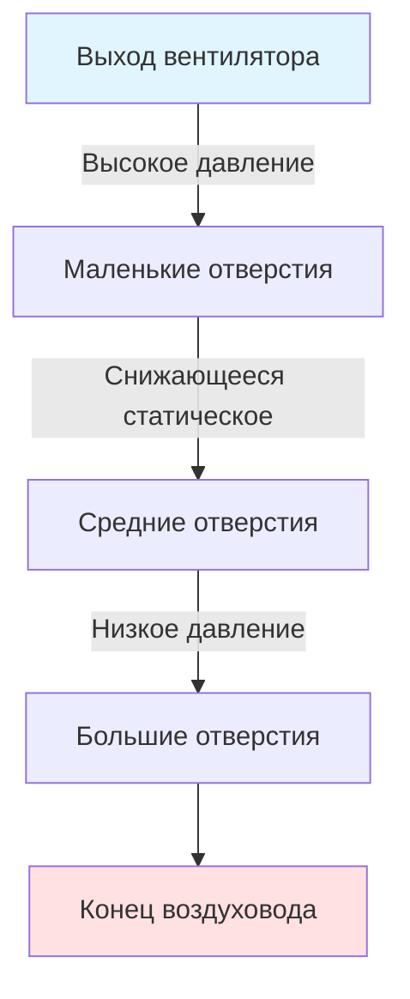
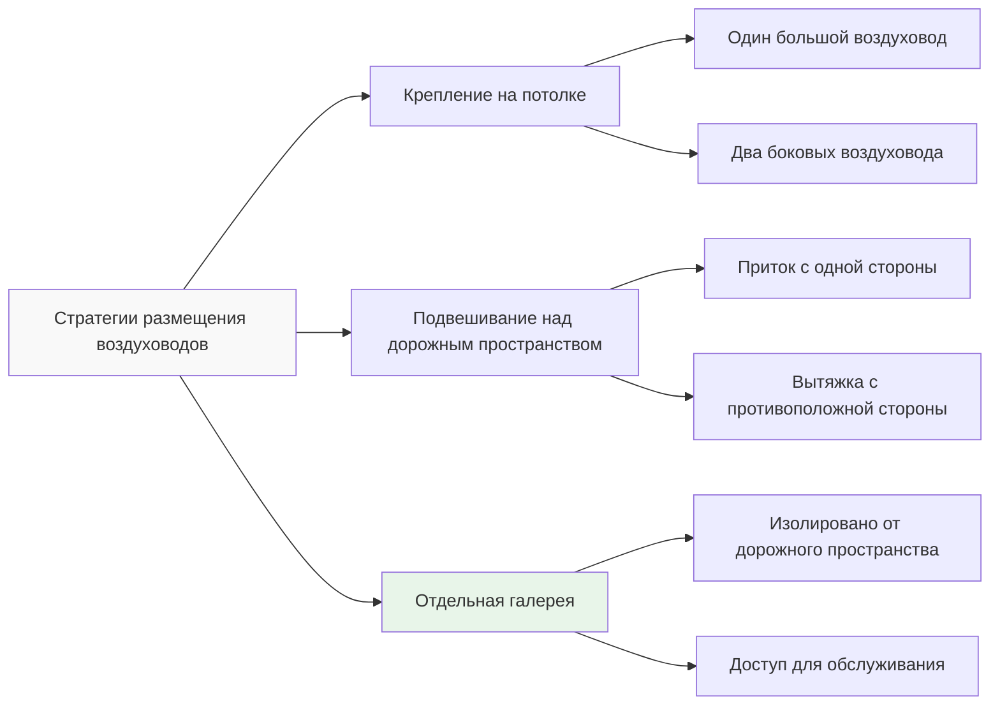
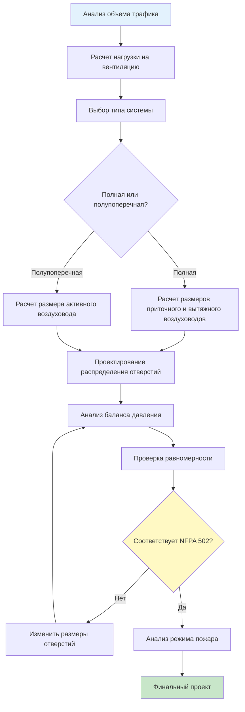

Поперечные системы вентиляции обеспечивают отдельные каналы для подачи свежего воздуха и удаления загрязненного воздуха в туннелях для транспортных средств через отдельные воздуховоды. Такой подход обеспечивает превосходный контроль качества воздуха, управление дымом и равномерность вентиляции по сравнению с продольными системами, особенно в туннелях длиной свыше 1000 м.

## Конфигурации систем

Поперечная вентиляция делится на две основные конфигурации в зависимости от разделения потоков воздуха.

### Полные поперечные системы

Полная поперечная вентиляция использует независимые воздуховоды приточного и вытяжного воздуха, проходящие по всей длине туннеля. Свежий воздух поступает через приточные отверстия, распределённые вдоль одного воздуховода, а загрязненный воздух выходит через вытяжные отверстия в отдельном воздуховоде. Эта конфигурация исключает продольную скорость воздуха в дорожном пространстве при нормальной работе.

Материальный баланс для полной поперечной системы требует:

$$\dot{m}_{supply} = \dot{m}_{exhaust} + \dot{m}_{portal\ losses}$$

где потери через порталы обычно составляют 5-15% от общего потока приточного воздуха в зависимости от эффекта поршня и ветровых условий.

### Полупоперечные системы

Полупоперечная вентиляция использует либо приточный, либо вытяжной воздуховод. В конфигурациях только с приточным воздухом свежий воздух распределяется через приточные воздуховоды, а удаление воздуха происходит естественным путем через порталы за счет индуцированного продольного потока. И наоборот, системы только с вытяжкой удаляют загрязненный воздух через воздуховоды, а свежий воздух поступает из порталов.

Индуцированная продольная скорость в полупоперечных системах соответствует:

$$V_L = \frac{Q_{net}}{A_t}$$

где $Q_{net}$ представляет дисбаланс между расходами приточного и вытяжного воздуха, а $A_t$ — площадь поперечного сечения туннеля. Нормативные проектные значения обычно ограничивают $V_L$ до 2-3 м/с для предотвращения чрезмерных сквозняков при сохранении адекватного обмена воздуха через порталы.

## Проектирование приточного и вытяжного воздуховодов

### Методология расчета размеров воздуховодов

Приточные и вытяжные воздуховоды должны обеспечивать равномерное распределение воздуха по всей длине туннеля. Распределение давления в перфорированном воздуховоде соответствует:

$$\frac{dP}{dx} = -\rho \frac{V^2}{2D_h} f - \rho V \frac{dV}{dx}$$

Первый член представляет потери на трение, а второй отражает восстановление давления по мере снижения скорости потока в воздуховоде из-за выпуска воздуха. Для достижения равномерности требуется, чтобы член восстановления компенсировал потери на трение.

Для воздуховода с равномерно расположенными отверстиями профиль скорости имеет вид:

$$V(x) = V_0 \sqrt{1 - \frac{x}{L}}$$

где $V_0$ — начальная скорость на выходе вентилятора, а $L$ — длина воздуховода. Эта квадратно-корневая зависимость позволяет рассчитать распределение давления и размеры отверстий.

### Проектирование отверстий

Приточные и вытяжные отверстия требуют тщательного расчета размеров для поддержания единообразия скорости в пределах ±15% согласно NFPA 502. Коэффициент расхода для каждого отверстия должен учитывать:

$$Q_i = C_d A_i \sqrt{\frac{2\Delta P_i}{\rho}}$$

Площади отверстий обычно изменяются вдоль длины воздуховода, чтобы компенсировать изменение статического давления. Общепринятая практика размещает меньшие отверстия рядом с выходом вентилятора, где статическое давление наибольшее, и большие отверстия на дальнем конце.

### Балансирование давления

Поддержание баланса давления между воздуховодами приточного и вытяжного воздуха предотвращает неконтролируемые продольные потоки. Перепад давления между воздуховодами в любой точке не должен превышать:

$$|\Delta P_{supply} - \Delta P_{exhaust}| < 25 \text{ Па}$$

Этот критерий ограничивает индуцируемые продольные скорости до приемлемых уровней при нормальной вентиляции.

## Требования к равномерному распределению воздуха

NFPA 502 требует равномерность вентиляции для предотвращения мертвых зон и обеспечения согласованного разбавления загрязняющих веществ. Индекс равномерности составляет:

$$U = 1 - \frac{\sigma_V}{\bar{V}}$$

где $\sigma_V$ — стандартное отклонение скоростей воздуха, измеренных в дискретных точках, а $\bar{V}$ — средняя скорость. Нормативные проектные значения указывают $U \geq 0.85$, что соответствует колебаниям скорости в пределах ±15% от среднего значения.

### Анализ распределения

| Параметр | Полная поперечная | Полупоперечная (приточная) | Полупоперечная (вытяжная) |
|-----------|-------------------|--------------------------|---------------------------|
| Продольная скорость | <0,5 м/с | 2-3 м/с | 2-3 м/с |
| Индекс равномерности | 0,90-0,95 | 0,80-0,88 | 0,80-0,88 |
| Обмен через порталы | Минимальный | Значительный | Значительный |
| Контроль CO | Отличный | Хороший | Хороший |
| Контроль дыма | Отличный | Ограниченный | Хороший |

## Преимущества для длинных туннелей

Поперечная вентиляция становится все более выгодной по мере увеличения длины туннеля свыше 1000 м.

**Контроль загрязняющих веществ**: Продольные системы развивают градиенты концентрации, которые ухудшаются с увеличением длины. Поперечные системы поддерживают равномерные уровни загрязняющих веществ благодаря непрерывному обмену воздуха по всей длине.

**Управление дымом при пожаре**: Полные поперечные системы могут переходить в режим полной вытяжки во время пожаров, удаляя дым до того, как он распространится в дорожном пространстве. Расход дыма при пожаре должен соответствовать:

$$\dot{m}_{smoke} = \frac{Q_{fire}}{c_p \Delta T_{rise}}$$

Для типичных туннельных пожаров (20-50 МВт) требуется мощность вытяжки 200-400 м³/ч.

**Энергоэффективность**: Несмотря на более высокие затраты на установку, поперечные системы снижают эксплуатационную энергию, устраняя необходимость разгонять всю массу воздуха в туннеле, как требуется в продольных системах с реактивными вентиляторами.

**Операционная гибкость**: Независимый контроль приточного и вытяжного воздуха позволяет оптимизировать работу при различных транспортных нагрузках и условиях окружающей среды.

## Конструкция и требования к пространству

### Варианты размещения воздуховодов

### Требования к пространству

Приточные и вытяжные воздуховоды обычно занимают 15-25% площади поперечного сечения туннеля. Для туннеля с площадью $A_t = 60$ м² площади воздуховодов варьируются от 9-15 м² в сумме. Этот штраф по пространству увеличивает затраты на земляные работы на 20-30% по сравнению с продольной вентиляцией.

Отдельные вентиляционные галереи снижают вторжение в дорожное пространство, но требуют дополнительных земляных работ. Экономическая точка баланса наступает примерно при длине туннеля около 2000 м, где эксплуатационные преимущества оправдывают строительные затраты.

### Конфигурация вентиляторной комнаты

Поперечные системы требуют централизованных или распределенных вентиляторных комнат, вмещающих приточные и вытяжные вентиляторы. Размер комнаты определяется по формуле:

$$A_{fan\ room} \geq 2.5 \times A_{fan} + A_{maintenance}$$

Типичные установки размещают вентиляторные комнаты в середине туннеля для длинных туннелей или у портальных входов для более коротких установок.

## Сводка процесса проектирования

Поперечная вентиляция представляет наивысший уровень контроля качества воздуха в туннелях для транспортных средств и управления дымом. Сложность и стоимость системы оправданы в длинных туннелях, туннелях с высокой интенсивностью трафика или установках, где требования пожарной безопасности требуют максимальной способности контроля дыма. Надлежащее проектирование воздуховодов, обеспечивающее равномерное распределение и баланс давления, имеет критическое значение для достижения эксплуатационных преимуществ, которые предлагает эта система.
