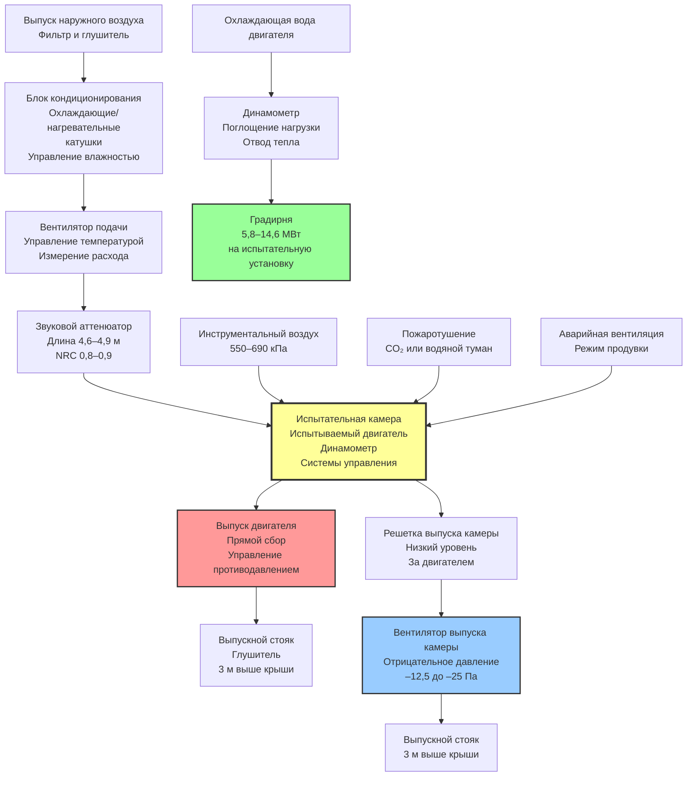

# Системы HVAC для объектов испытания двигателей

Объекты испытания двигателей требуют специализированных систем HVAC, которые обеспечивают большие объемы кондиционированного воздуха для горения, управляют огромными нагрузками отвода тепла, контролируют выхлопные газы и шум, интегрируют с системами безопасности для защиты персонала и оборудования. Эти объекты испытывают двигатели внутреннего сгорания от небольших автомобильных агрегатов до крупных морских и стационарных энергетических двигателей, каждый с уникальными требованиями вентиляции и управления окружающей средой. Основные задачи HVAC включают поддержание тепловых условий испытательной камеры в узких допусках, поставку отфильтрованного воздуха для горения при контролируемой температуре и влажности, безопасный выпуск продуктов горения, управление высоким уровнем шума и размещение значительного количества тепла, генерируемого как самим испытываемым двигателем, так и динамометром, поглощающим его мощность.

## Требования к условиям окружающей среды в испытательной камере

### Управление температурой и влажностью

Точное испытание производительности двигателя требует точного управления условиями воздуха для горения, так как как температура, так и влажность непосредственно влияют на объемный КПД, характеристики горения и измеренную выходную мощность.

**Спецификации кондиционирования испытательной камеры:**

| Тип объекта | Температура воздуха для горения | Относительная влажность воздуха для горения | Температура камеры | Требование точности тестирования |
|--------------|-------------------|------------------|----------------|-------------------------|
| Автомобильные исследования | 25°C ± 1°C | 50% ± 5% | 21–24°C | ±0,5% повторяемость мощности |
| Автомобильная разработка | 16–38°C регулируемая | 30–80% регулируемая | 18–27°C | ±1,0% повторяемость мощности |
| Тяжелый дизель | 25°C ± 1°C | 50% ± 5% | 21–27°C | ±1,0% повторяемость мощности |
| Морской двигатель | 25°C ± 1°C | 60% ± 5% | 21–29°C | ±1,5% повторяемость мощности |
| Авиационный двигатель | 15°C (стандарт ISA) | Переменная | 16–24°C | ±0,3% повторяемость тяги |
| Стационарная энергетика | 25°C ± 1°C | 50% ± 5% | 21–29°C | ±2,0% повторяемость мощности |

Стандартные атмосферные условия для испытания двигателя соответствуют SAE J1349 (автомобильная промышленность) или ISO 1585 (международная), которые указывают 25°C и 99 кПа барометрического давления. Многие научно-исследовательские учреждения имеют климатические камеры, способные имитировать условия высоты от уровня моря до 4 500 м и температуры от –40°C до 54°C для оценки производительности двигателя во всем диапазоне работы.

**Коррекция плотности воздуха для горения:**

Выходная мощность двигателя варьируется прямо пропорционально плотности воздуха. Связь между измеренной мощностью и стандартными условиями следует:

$$P_{std} = P_{obs} \times \sqrt{\frac{99}{P_{b}}} \times \sqrt{\frac{T_{a}}{298}}$$

Где:
- $P_{std}$ = Мощность, скорректированная к стандартным условиям (л.с. или кВт)
- $P_{obs}$ = Наблюдаемая мощность при условиях испытания
- $P_{b}$ = Барометрическое давление при испытании (кПа)
- $T_{a}$ = Абсолютная температура воздуха для горения (К)
- 99 = Стандартное барометрическое давление (кПа)
- 298 = Стандартная абсолютная температура (298 К = 25°C)

Эта коррекция демонстрирует, почему точный контроль температуры и давления воздуха для горения является важным для повторяемого тестирования. Изменение температуры на 3°C вызывает приблизительно 1% изменение измеренной выходной мощности.

### Системы подачи воздуха для горения

Испытательные камеры двигателя требуют значительные объемы воздуха для горения, рассчитанные на основе рабочего объема двигателя, скорости работы и объемного КПД.

**Расчет потребления воздуха для горения:**

$$Q_{eng} = \frac{D \times N \times \eta_{v} \times AFR}{27000}$$

Где:
- $Q_{eng}$ = Спрос на воздухоток двигателя (м³/ч)
- $D$ = Рабочий объем двигателя (см³)
- $N$ = Частота вращения двигателя (об/мин)
- $\eta_{v}$ = Объемный КПД (обычно 0,85–0,95 для естественной аспирации, 1,2–2,0 для турбокомпрессора)
- $AFR$ = Соотношение воздуха и топлива (обычно 14,7:1 стехиометрическое для бензина, 20–30:1 для дизеля)
- 27000 = Преобразование единиц (см³ в м³/ч)

**Пример для 373 кВт турбодизеля:**
- Рабочий объем: 9,8 л
- Скорость: 2 100 об/мин при номинальной мощности
- Объемный КПД: 1,8 (турбокомпрессор)
- $Q_{eng} = \frac{9800 \times 2100 \times 1,8}{27000} = 1 356$ м³/ч

**Общее требование вентиляции камеры:**

$$Q_{cell} = Q_{eng} + Q_{cooling} + Q_{safety}$$

Где:
- $Q_{cooling}$ = Дополнительная вентиляция для отвода тепла (обычно 2–4× воздухоток двигателя)
- $Q_{safety}$ = Воздухообмены безопасности (минимум 30 воздухообменов в час для испытательных камер)

Для примера 373 кВт дизеля в камере 9,1 м × 12,2 м × 4,6 м (510 м³):
- Воздух для горения двигателя: 1 356 м³/ч
- Вентиляция охлаждения камеры: 6 800 м³/ч (на основе отвода тепла 4,4 МВт)
- Воздухообмены безопасности: $(30 \times 510)/60 = 255$ м³/ч
- **Общее требование подачи: 6 800 м³/ч** (требование безопасности является определяющим)

## Системы выпуска и вентиляции

### Сбор выхлопа двигателя

Прямой сбор выхлопа предотвращает попадание продуктов сгорания в атмосферу испытательной камеры. Системы выпуска должны справляться с высокотемпературными газами (427–649°C на выходе турбины) при сохранении отрицательного давления в точке выхлопа двигателя.

**Компоненты системы выпуска:**
- Гибкое соединение выпуска (выдерживает 649°C, компенсирует движение двигателя)
- Выпускной трубопровод (нержавеющая сталь, размер для максимальной скорости 30,5 м/сек)
- Клапан управления противодавлением (имитирует противодавление транспортного средства или установки)
- Глушитель выпуска (снижает шум на 20–30 дБ)
- Вентилятор выпуска (поддержание отрицательного давления)
- Выпуск трубопровода (минимум 3 м выше уровня крыши)

**Определение размера выпускного трубопровода:**

$$D = \sqrt{\frac{4 \times Q_{exh}}{\pi \times V_{max}}}$$

Где:
- $D$ = Внутренний диаметр трубопровода (см)
- $Q_{exh}$ = Расход выхлопных газов (м³/ч при температуре выпуска)
- $V_{max}$ = Максимальная скорость (18 м/сек)

Для дизеля 373 кВт с потоком выхлопа 3 400 м³/ч при 427°C:

$$Q_{exh,hot} = Q_{exh,cold} \times \frac{T_{hot}}{T_{ambient}} = 3400 \times \frac{700}{288} = 8 229 \text{ м³/ч}$$

$$D = \sqrt{\frac{4 \times 8229}{\pi \times 18}} = 0,54 \text{ м} = 54 \text{ см}$$

### Стратегия вентиляции испытательной камеры

Испытательные камеры используют вентиляцию с отрицательным давлением для изоляции шума двигателя и утечек выхлопа, с подачей воздуха через входы с звуковой атттенюацией и выпуском через высокопроизводительные вентиляторы.

**Соотношения давлений:**
- Наружная ссылка: 0,00 Па
- Воздухопровод подачи: +375 до +750 Па
- Испытательная камера: –12,5 до –25 Па (отрицательная относительно прилегающих пространств)
- Выпускной канал: –750 до –1500 Па
- Комната управления: +5 Па (положительная относительно испытательной камеры)

## Отвод тепла и системы охлаждения

### Анализ тепловой нагрузки

Объекты испытания двигателей генерируют огромные нагрузки отвода тепла из трех основных источников: неэффективность двигателя, поглощение динамометром и вспомогательное оборудование.

**Общий отвод тепла объекта:**

$$Q_{total} = Q_{engine} + Q_{dyno} + Q_{aux}$$

**Отвод тепла двигателя:**

$$Q_{engine} = P_{brake} \times 3,6 \times \left(\frac{1}{\eta} - 1\right)$$

Где:
- $Q_{engine}$ = Отвод тепла двигателя в охлаждающую воду и излучение (кВт)
- $P_{brake}$ = Выходная мощность на тормозе (кВт)
- $\eta$ = Тепловой КПД двигателя (0,30–0,42 для дизеля, 0,25–0,35 для бензина)
- 3,6 = Преобразование единиц кВт

**Поглощение тепла динамометром:**

$$Q_{dyno} = P_{brake} \times 3,6 \times 0,95$$

Приблизительно 95% поглощенной мощности преобразуется в тепло в охлаждающей воде динамометра (оставшиеся 5% излучаются в камеру).

**Пример для испытания 373 кВт дизеля на полной нагрузке:**
- Тепловой КПД двигателя: 0,38
- Отвод тепла двигателя: $373 \times 3,6 \times (1/0,38 - 1) = 3,3$ МВт
- Отвод тепла динамометра: $373 \times 3,6 \times 0,95 = 1,3$ МВт
- Общий отвод тепла: 4,6 МВт

Эта значительная тепловая нагрузка требует специальные градирни или теплообменники, размер которых соответствует непрерывной работе при максимальных уровнях мощности испытания.

## Акустическая обработка и управление шумом

### Характеризация источников шума

Работающие двигатели генерируют интенсивный шум из пульсаций выпуска (120–140 дBA), механических компонентов (90–110 dBA) и турбулентности поступающего воздуха (85–100 dBA). Конструкция испытательной камеры должна ослабить этот шум для защиты персонала и соответствия ограничениям шума на объекте.

**Типичные уровни шума:**
- Внутри испытательной камеры во время полнонагрузочного испытания: 110–120 dBA
- Комната управления (рядом): 65–75 dBA (с надлежащей изоляцией)
- Линия границы собственности на объекте: 55–65 dBA (пределы местного постановления)
- Необходимое ослабление: 45–65 дБ во всем частотном спектре

**Стратегии акустической обработки:**
- Барьерные стены массы (30,5–45,7 см бетона или двойной каркасной конструкции, STC 60–70)
- Двери испытательной камеры с рейтингом звука (10 см толщины, автоматические уплотнения нижнего края, STC 55)
- Входные и выпускные глушители (диссипативные или реактивные, 20–35 дБ вставка потерь)
- Изоляция вибрации (крепления двигателя/динамометра, инерционные основания)
- Структурное развязывание (плавающие полы, изолированные стены)

Входные глушители должны обеспечивать акустическое ослабление без чрезмерного падения давления, так как потеря давления снижает плотность воздуха для горения и влияет на результаты испытания. Максимально допустимое падение давления обычно составляет 250–500 Па, ограничивая длину глушителя и плотность набивки.

## Интеграция систем безопасности

### Пожаротушение и обнаружение

Испытательные камеры двигателя представляют значительные пожарные опасности из-за утечек топлива, горячих поверхностей и электрооборудования. Системы HVAC интегрируют с пожаротушением через последовательности автоматического отключения и режимы аварийной продувки.

**Обнаружение пожара и пожаротушение:**
- Датчики тепла (скорость повышения и фиксированная температура, активация 57°C)
- Датчики пламени (УФ или ИК, время отклика 5 секунд)
- Ручные станции включения (при входе в камеру и в комнате управления)
- Система затопления CO₂ (34% концентрация, проектирование полного затопления)
- Предварительная сигнализация (15-секундное предупреждение об эвакуации)
- Последовательность отключения HVAC (закрытие клапанов подачи, поддержание выпуска в течение 5 минут, затем отключение)

**Аварийная вентиляция продувки:**

После активации пожаротушения или обнаружения разлива топлива испытательные камеры требуют аварийную продувку для удаления CO₂ или паров топлива перед повторным входом персонала.

$$T_{purge} = \frac{V_{cell} \times ln(C_{initial}/C_{safe})}{Q_{purge}} \times 60$$

Где:
- $T_{purge}$ = Время продувки (минуты)
- $V_{cell}$ = Объем камеры (м³)
- $C_{initial}$ = Начальная концентрация загрязнителя
- $C_{safe}$ = Безопасная концентрация входа (обычно 5% от начальной)
- $Q_{purge}$ = Скорость вентиляции продувки (м³/ч)
- ln = Натуральный логарифм
- 60 = Преобразование секунд в минуты

Для камеры объемом 566 м³ с возможностью продувки 425 м³/ч:

$$T_{purge} = \frac{566 \times ln(1,0/0,05)}{425} \times 60 = 120 \text{ минут}$$

Это представляет три полных воздухообмена (566/425 × 60 = 80 минут на воздухообмен) для достижения 95% снижения загрязнителя.

## Стратегии энергоэффективности

### Системы рекуперации тепла

Значительный отвод тепла из операций испытания двигателя предоставляет возможности для рекуперации энергии, особенно для объектов, требующих обогрев помещения или технологическое тепло.

**Источники восстанавливаемой энергии:**
- Охлаждающая жидкость двигателя (82–93°C, явное тепло)
- Выхлоп двигателя (427–649°C, явное тепло)
- Охлаждающая вода динамометра (60–71°C, явное тепло)
- Выпускной воздух испытательной камеры (27–38°C во время работы двигателя)

**Приложения рекуперации тепла:**
- Предварительный нагрев подачи воздуха для горения (снижение нагрузки кондиционирования зимой)
- Обогрев помещения прилегающих зданий (утилизация тепла низкого уровня)
- Генерация горячей воды для домашнего использования (спрос круглый год)
- Работа абсорбционного холодильного агрегата (летнее охлаждение из отходящего тепла)

**Рассмотрения экономического анализа:**
- График доступности тепла (прерывистая работа испытания снижает коэффициент использования)
- Совместимость температуры (согласование температуры источника к требованиям приложения)
- Расстояние между источником и точкой использования (энергия насоса и потери тепла штрафов)
- Капитальные затраты (теплообменники, трубопровод, системы управления)
- Требования к техническому обслуживанию (потенциал загрязнения в рекуперации тепла выхлопных газов)

Объекты, работающие несколько испытательных камер в течение 16–24 часов в день, достигают лучшей экономики для систем рекуперации тепла по сравнению с отдельными научно-исследовательскими объектами со спорадической работой.

### Вентиляция переменного объема

Испытательные камеры тратят значительное время в режиме холостого хода или при условиях без нагрузки, при которых полные скорости вентиляции тратят энергию. Системы переменного объема снижают расход воздуха при операциях низкой мощности при сохранении требований безопасности.

**Стратегия управления:**
- Полная вентиляция (30–40 воздухообменов в час) при испытании номинальной мощности
- Сокращенная вентиляция (15–20 воздухообменов в час) при испытании с частичной нагрузкой
- Минимальная вентиляция (10–12 воздухообменов в час) при холостом ходе или подготовке
- Аварийная продувка (60+ воздухообменов в час) после автоматического отключения

Температура камеры и концентрация CO обеспечивают обратную связь для модуляции скорости вентиляции, с вентиляторами подачи и выпуска с приводом VFD, отслеживающими спрос при сохранении соотношения отрицательного давления.

## Заключение

Системы HVAC для объектов испытания двигателей представляют специализированные инженерные приложения, требующие интеграции вентиляции больших объемов, точного управления окружающей средой, обработки выхлопа высокой температуры, акустической обработки и координации системы безопасности. Успешные разработки уравновешивают требования точности испытания (точные условия воздуха для горения), мандаты безопасности (отрицательное давление, интеграция защиты от пожара), управление шумом (интенсивная акустическая обработка) и экономическую деятельность (рекуперация тепла, вентиляция переменного объема). Значительные капитальные и операционные затраты этих объектов требуют тщательного анализа требований программы испытания, требования будущего расширения и возможности энергоэффективности на этапе проектирования для достижения оптимальной долгосрочной производительности.
