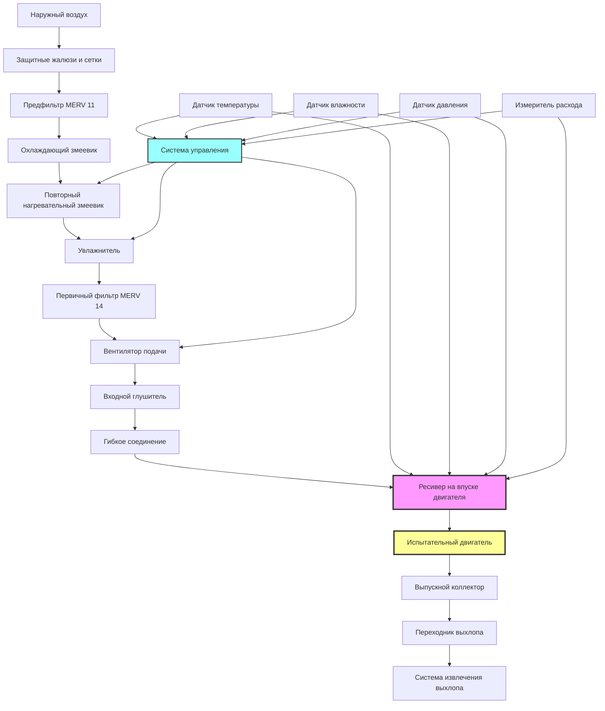

## Обзор

Системы подачи воздуха для сгорания на объектах испытания двигателей обеспечивают необходимые точные объем, качество и кондиционирование воздуха на впуске для точного и повторяемого испытания двигателей. Система подачи воздуха для сгорания должна доставлять чистый, температурно-управляемый воздух при постоянных давлении и уровнях влажности, чтобы обеспечить надежные результаты испытаний и защитить дорогостоящее испытательное оборудование.

Подача воздуха для сгорания отделена от общей вентиляции испытательной ячейки и должна быть спроектирована в соответствии со строгими требованиями к качеству воздуха, расходу и экологическому контролю. Плохое качество воздуха для сгорания или непостоянные условия подачи прямо снижают точность данных испытаний и могут повредить испытательные двигатели.

## Требования к качеству воздуха

Объекты испытания двигателей требуют воздуха для сгорания, который соответствует или превосходит качество типичного окружающего воздуха, чтобы предотвратить преждевременный износ двигателя и обеспечить валидность испытаний.

**Пределы загрязнения частицами:**
- ISO 8573-1 Класс 4 или лучше (максимум 8 мг/м³)
- Мониторинг распределения размера частиц для частиц >5 мкм
- Нулевое содержание масляного пара от компрессоров или оборудования на объекте
- Отсутствие перекрестного загрязнения от выхлопных газов

**Химические загрязнители:**
- Уровни углеводородов <1 ppm (эквивалент метана)
- Диоксид серы <0,1 ppm
- Оксиды азота <0,1 ppm
- Оксид углерода <5 ppm в окружающей среде

Испытательные объекты в промышленных районах требуют фильтрации активированным углем для удаления углеводородов и химических загрязнителей, которые влияют на характеристики сгорания и измерения выбросов.

## Требования по объему в зависимости от типа двигателя

Требования по объему воздуха для сгорания зависят от рабочего объема двигателя, скорости и мощности. Система подачи должна обеспечивать пиковый расход воздуха с адекватным запасом для переходных нагрузок.


| Тип двигателя | Рабочий объем | Макс. мощность | Расход воздуха | Запас подачи |
|-------------|--------------|-----------|---------------|---------------|
| Малый бензиновый | 0,5–2,0 л | 50–150 кВт | 150–450 м³/ч | 25% |
| Автомобильный | 2,0–6,0 л | 100–400 кВт | 360–1440 м³/ч | 30% |
| Тяжелый дизель | 6,0–15,0 л | 200–500 кВт | 720–1800 м³/ч | 35% |
| Крупный промышленный | 15,0–50,0 л | 500–2000 кВт | 1800–7200 м³/ч | 40% |
| Морской/Локомотивный | 50,0–200,0 л | 2000–8000 кВт | 7200–28800 м³/ч | 50% |


### Расчет расхода воздуха

Теоретический расход воздуха, необходимый для полного сгорания, рассчитывается на основе стехиометрического соотношения воздуха и топлива и расхода топлива:

$$\dot{m}_{air} = AFR \times \dot{m}_{fuel}$$

где $\dot{m}_{air}$ — массовый расход воздуха (кг/ч), $AFR$ — стехиометрическое соотношение воздуха и топлива (обычно 14,7:1 для бензина, 14,5:1 для дизеля), $\dot{m}_{fuel}$ — расход топлива.

Преобразование в объемный расход при стандартных условиях:

$$\dot{V}_{air} = \frac{\dot{m}_{air}}{\rho_{air}} \times 3600$$

где $\dot{V}_{air}$ — объемный расход воздуха (м³/ч) и $\rho_{air}$ — плотность воздуха при стандартных условиях (1,225 кг/м³ при 15°C, 101,325 кПа).

Для двигателя, потребляющего 50 кг/ч дизельного топлива:

$$\dot{V}_{air} = \frac{14,5 \times 50}{1,225} \times 3600 = 2143 \text{ м³/ч}$$

Добавление 35% запаса для переходных условий: $\dot{V}_{design} = 2143 \times 1,35 = 2893$ м³/ч.

## Системы фильтрации

Многоступенчатая фильтрация защищает двигатели и обеспечивает постоянное качество воздуха на протяжении всех испытаний.

**Ступень предварительной фильтрации:**
- Фильтры MERV 8–11 для удаления основного количества частиц
- Защитные жалюзи и сетки от насекомых на впуске
- Сепараторы влаги в влажном климате
- Эффективность определения пыли 30–45%

**Первичная фильтрация:**
- Фильтры MERV 13–14 (эффективность 85–95% при 1,0 мкм)
- Конструкция с низким перепадом давления (<250 Па в чистом состоянии)
- Мешочная или коробчатая конструкция для больших расходов воздуха
- Мониторинг дифференциального давления для отслеживания загрязнения фильтра

**Финальная фильтрация:**
- HEPA-фильтры (H13 или H14) для критических приложений
- Эффективность 99,95–99,995% при 0,3 мкм
- Абсолютная фильтрация для испытаний выбросов
- Крепление со стекломатом для предотвращения утечек

Слои активированного угля следуют за фильтрацией частиц, когда требуется удаление углеводородов или запахов. Глубина углеродного слоя 50–100 мм обеспечивает адекватное время пребывания для химической адсорбции.

## Кондиционирование температуры и влажности

Температура и влажность воздуха для сгорания значительно влияют на производительность двигателя, выбросы и повторяемость испытаний. Большинство стандартов испытаний определяют коэффициенты коррекции, но прямое кондиционирование дает превосходные результаты.

**Регулирование температуры:**
- Стандартная температура на впуске: 25°C ±2°C
- Диапазон возможностей: 0–50°C для экологических испытаний
- Время отклика: <5 минут при изменении ±10°C
- Однородность: ±1°C по площади сечения впуска

**Регулирование влажности:**
- Стандартные условия: 50% ОВ ±5%
- Управление точкой росы: ±2°C для прецизионных испытаний
- Осушение до минимума 20% ОВ
- Увлажнение до максимума 90% ОВ

Система кондиционирования температуры и влажности обычно использует охлаждающие змеевики с холодной водой, нагрев горячей водой или электрический, и паровое увлажнение. Повторный нагревательный змеевик следует за охлаждающим змеевиком для независимого регулирования температуры и влажности.

Коэффициент коррекции влажности для мощности двигателя:

$$P_{corrected} = P_{measured} \times \left(\frac{99}{p_d - \frac{p_v \cdot \phi}{100}}\right)^{0.5}$$

где $P$ — мощность, $p_d$ — парциальное давление сухого воздуха (кПа), $p_v$ — давление водяного пара (кПа), $\phi$ — относительная влажность (%).

## Регулирование давления

Постоянное давление на впуске обеспечивает повторяемые испытания и предотвращает влияние колебаний атмосферного давления на результаты.

**Требования регулирования давления:**
- Абсолютное давление: 98–102 кПа (типично на уровне моря)
- Точность управления: ±0,5 кПа
- Перепад давления по системе: <1,5 кПа всего
- Динамический отклик: поддержание давления при переходных нагрузках

**Стратегия управления:**
- Вентиляторы подачи переменной скорости с PID-управлением
- Измерение давления в ресивере на впуске двигателя
- Каскадное управление с мониторингом давления выше по потоку
- Предохранительный байпас при отказе вентилятора

Вентилятор подачи должен преодолевать потери давления в системе:

$$\Delta P_{total} = \Delta P_{filters} + \Delta P_{ductwork} + \Delta P_{conditioning} + \Delta P_{silencer}$$

Типичный бюджет давления: фильтры (250–400 Па), воздуховоды (150–300 Па), кондиционирующие змеевики (200–350 Па), глушитель (100–200 Па), всего 700–1250 Па.

## Интеграция с системами выхлопа

Система подачи воздуха для сгорания и система извлечения выхлопа должны быть скоординированы для поддержания правильного давления в испытательной ячейке и предотвращения рециркуляции.

**Баланс давления:**
- Испытательная ячейка слегка отрицательная (–10 до –25 Па) относительно атмосферы
- Предотвращает утечку горячих выхлопных газов в помещение объекта
- Система подпиточного воздуха отделена от подачи воздуха для сгорания
- Мощность извлечения выхлопа превышает подачу воздуха на 10–15%

**Требования разделения:**
- Впуск воздуха для сгорания минимум 15 м от выхлопного отверстия
- Рассмотрение преобладающего направления ветра в компоновке
- Расчет высоты выхлопной трубы с использованием моделей дисперсии EPA
- Мониторинг CO рядом с впуском воздуха с автоматическим отключением

**Блокировки системы:**
- Система выхлопа должна работать до разрешения запуска двигателя
- Потеря давления воздуха для сгорания вызывает отключение двигателя
- Сигнал тревоги высокой температуры ячейки снижает нагрузку на двигатель
- Системы обнаружения пожара отключают как подачу, так и выхлоп

## Рассмотрения при проектировании

**Калибровка воздуховодов:**
- Скорость 8–12 м/с в воздуховодах подачи
- Скорость <6 м/с в ресивере на впуске
- Плавные переходы с максимальным включенным углом 15°
- Минимизировать колена и препятствия

**Акустическая обработка:**
- Входные и выходные глушители для <NC 55 в испытательной ячейке
- Виброизоляция вентилятора для предотвращения передачи вибрации по конструкции
- Обшивка воздуховодов акустической изоляцией
- Избежать резонанса на частотах воспламенения двигателя

**Приборы:**
- Измеритель массового расхода воздуха (±1% точность)
- Датчик температуры (±0,5°C точность)
- Датчик влажности (±2% ОВ точность)
- Датчик давления (±0,1 кПа точность)
- Все датчики с выходом 4–20 мА в систему сбора данных

Система подачи воздуха для сгорания представляет собой критический компонент конструкции испытательного объекта двигателя, напрямую влияющий на точность испытаний, повторяемость и защиту оборудования. Надлежащее проектирование требует координации со спецификациями двигателя, системами выхлопа и экологическим контролем испытательной ячейки для создания интегрированной испытательной среды.
