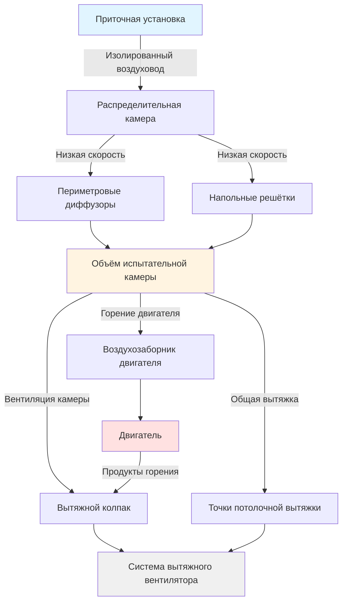

Системы приточного воздуха в испытательных объектах двигателей заменяют воздух, удаляемый из испытательных камер, при одновременном поддержании надлежащего подпирания и условий окружающей среды. Эти системы должны уравновешивать высокие скорости выброса из камер, возникающие при горении двигателя и охлаждении, с контролируемым введением воздуха для предотвращения понижения давления в камере и обеспечения безопасных условий эксплуатации.

## Расчёт объёма приточного воздуха

Требуемый объём приточного воздуха равен сумме всего воздуха, выходящего из камеры через системы вытяжки и процессы горения:

$$Q_{makeup} = Q_{exhaust} + Q_{combustion} + Q_{leakage}$$

Где:
- $Q_{makeup}$ = общий объём приточного воздуха (м³/ч)
- $Q_{exhaust}$ = механический расход вытяжного воздуха (м³/ч)
- $Q_{combustion}$ = воздух, потребляемый горением двигателя (м³/ч)
- $Q_{leakage}$ = утечка через ограждающую конструкцию здания (м³/ч)

Потребление воздуха для горения двигателя напрямую связано с расходом топлива и коэффициентом воздушно-топливной смеси:

$$Q_{combustion} = \frac{m_{fuel} \times AFR}{\rho_{air} \times 60}$$

Где:
- $m_{fuel}$ = расход топлива (кг/ч)
- $AFR$ = коэффициент воздушно-топливной смеси (типично 14,7:1 для бензина, 14,5:1 для дизеля)
- $\rho_{air}$ = плотность воздуха при условиях на входе (кг/м³)
- 60 = коэффициент преобразования (мин/ч)

Для дизельного двигателя мощностью 373 кВт при полной нагрузке с расходом топлива 16 кг/ч:

$$Q_{combustion} = \frac{16 \times 14,5}{1,2 \times 60} = 3,222 \text{ м³/ч}$$

## Баланс воздуха и требования к системе вытяжки

Приточный воздух должен быть тщательно сбалансирован с общей вытяжкой для поддержания желаемого подпирания камеры:

$$\Delta P_{cell} = K \times (Q_{makeup} - Q_{total\ exhaust})^2$$

Где $K$ — коэффициент, зависящий от здания и определяемый герметичностью ограждения и характеристиками утечек.

**Типичные соотношения баланса воздуха:**

| Условие камеры | Соотношение приточной/вытяжной | Перепад давления |
|---|---|---|
| Положительное давление | 1,05–1,10 | +5 до +12 Па |
| Нейтральное давление | 0,98–1,02 | ±2,5 Па |
| Отрицательное давление | 0,90–0,95 | –5 до –12 Па |
| Аварийная вытяжка | 0,50–0,70 | –25 до –37 Па |

Большинство испытательных камер двигателей работают при небольшом отрицательном давлении (–5 до –7 Па) для предотвращения выхода горячих выхлопных газов или испарений в смежные помещения.

## Требования к подпиранию камеры

Подпирание камеры должно контролироваться во всех режимах эксплуатации:

**Нормальная эксплуатация:**
- Поддерживать –5 до –7 Па относительно прилегающих контрольных комнат
- Предотвратить обратную тягу через двери для персонала
- Обеспечить достаточный воздух для горения
- Минимизировать инфильтрацию некондиционируемого воздуха

**Запуск двигателя:**
- Обеспечить приточный воздух за 2–3 минуты до зажигания двигателя
- Установить стабильное давление в камере перед началом горения
- Постепенно увеличивать приточный воздух с увеличением нагрузки двигателя

**Аварийные условия:**
- Повысить приточный воздух до 150–200 % при срабатывании системы пожаротушения
- Поддерживать минимум –12 Па при аварийной вытяжке
- Предотвратить чрезмерное отрицательное давление, которое нарушает работу дверей

## Проектирование приточной установки

Приточные установки для испытательных камер должны обеспечивать экстремальные тепловые и объёмные требования:

**Тепловая мощность нагрева:**

Нагрев приточного воздуха зимой учитывает повышение температуры наружного воздуха:

$$Q_{heating} = 0,33 \times Q_{makeup} \times (T_{supply} - T_{outdoor})$$

Для 17 000 м³/ч приточного воздуха от –18°C до 15°C:

$$Q_{heating} = 0,33 \times 17000 \times (15 - (-18)) = 185,010 \text{ кДж/ч}$$

**Мощность охлаждения:**

Летнее охлаждение может потребоваться для управления температурой камеры:

$$Q_{cooling} = 0,33 \times Q_{makeup} \times (T_{outdoor} - T_{supply}) + 0,68 \times Q_{makeup} \times (W_{outdoor} - W_{supply})$$

**Выбор компонентов приточной установки:**

| Компонент | Типичные технические характеристики | Соображения при проектировании |
|---|---|---|
| Вентилятор подачи | 17 000–85 000 м³/ч | VFD для модуляции, 125–375 Па |
| Нагревательный теплообменник | 0,12–0,24 кДж/(ч·м³) | Горячая вода или газ-пожар |
| Охлаждающий теплообменник | 0,06–0,12 кДж/(ч·м³) | Охлаждённая вода, 6–8 рядов |
| Фильтры | MERV 8–13 | Двойная банк для непрерывной работы |
| Заслонки | Модулирующие наружный/рециркуляционный | Блокировки минимального положения |
| Управление | DDC с интеграцией PLC | Логика компенсации давления |

## Распределение в испытательной камере

Распределение приточного воздуха предотвращает короткое замыкание на выхлопные точки и обеспечивает однородные условия в камере:

**Стратегии распределения:**

1. **Периметровая приточка низкого уровня:**
   - Диффузоры на высоте 0,9–1,5 м от пола
   - Горизонтальный выброс к центру камеры
   - Предотвращает расслоение в высоких камерах

2. **Приточка через напольные решётки:**
   - Распределение через приподнятый пол или подпольное пространство
   - Низкоскоростной восходящий выброс (1–1,3 м/с)
   - Эффективна для камер с приподнятыми динамометрическими платформами

3. **Потолочное распределение:**
   - Высокоиндукционные диффузоры для перемешивания
   - Используется при ограничении площади пола
   - Требует тщательного проектирования для предотвращения короткого замыкания на потолочную вытяжку

4. **Вентиляция вытеснением:**
   - Низкоскоростная приточка на уровне пола (0,25–0,5 м/с)
   - Тепловой поток переносит загрязнения вверх
   - Подходит для камер с постоянными источниками тепла

## Интеграция аварийной вентиляции

Системы приточного воздуха должны взаимодействовать с аварийной вытяжкой во время пожара или опасных газовых событий:

**Требования режима аварийной работы:**

| Условие | Реакция приточного воздуха | Целевые параметры |
|---|---|---|
| Обнаружение пожара | Увеличить до 150 % нормы | Поддерживать минимум –12 Па |
| Обнаружение газа | Увеличить до 200 % нормы | Максимальная эффективность вытяжки |
| Активация пожаротушения | Продолжить работу | Предотвратить истощение агента |
| Очистка после инцидента | Максимальный объём | 10–15 воздухообменов |

**Последовательность управления:**

1. Получен сигнал аварии от системы пожарной сигнализации или датчика газа
2. Вентилятор приточного воздуха ускоряется до аварийной скорости (10–20 секунд ускорения)
3. Теплообменники модулируют для предотвращения теплового удара
4. Давление в камере контролируется непрерывно; приточный воздух корректируется для поддержания минимум –12 Па
5. Аварийная вытяжка активируется с задержкой 5–10 секунд после повышения приточного воздуха
6. Система остаётся в режиме аварии до ручного сброса

**Защитные блокировки:**

- Отказ приточного воздуха инициирует остановку двигателя и аварийную вытяжку
- Потеря управления подпиранием инициирует сигнализацию и контролируемое отключение
- Требуется подтверждение работы вентилятора приточного воздуха перед разрешением запуска двигателя
- Проверка позиции заслонки наружного воздуха предотвращает рециркуляцию

Система приточного воздуха является основой управления окружающей средой испытательной камеры, работая совместно с системами вытяжки, подачей воздуха для горения и охлаждением двигателя для поддержания безопасных и контролируемых условий испытаний во всех сценариях эксплуатации.
