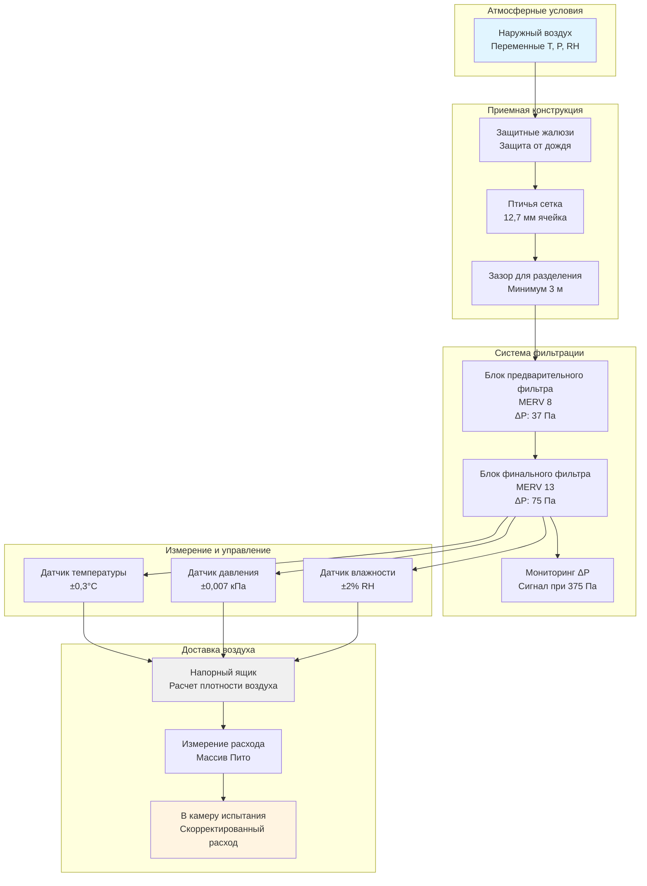

Наружный воздух служит основным источником воздуха для сгорания в камерах испытания двигателей, непосредственно влияя на точность и повторяемость испытаний. Проектирование систем приема наружного воздуха должно учитывать колеблющиеся атмосферные условия, контроль загрязнения и фундаментальную взаимосвязь между плотностью воздуха и производительностью двигателя.

## Проектирование и размещение приемных отверстий наружного воздуха

Расположение и конфигурация приемных отверстий наружного воздуха критически влияют на качество воздуха и производительность системы. Приемные отверстия должны быть расположены так, чтобы минимизировать загрязнение от:

- Выхлопов автомобилей с близлежащих дорог или парковок
- Точек выброса выхлопов зданий
- Источников промышленных выбросов
- Пыли на уровне земли и других загрязнений

**Рекомендуемые критерии размещения:**

- Минимум 4,6 м над уровнем земли для предотвращения загрязнения на уровне земли
- Горизонтальное расстояние 15 м от выхлопных отверстий
- Учет преобладающего направления ветра для захвата чистого воздуха
- По возможности ориентация на север для минимизации солнечного нагрева
- Свободное пространство, равное 3-кратному размеру входного отверстия от препятствий

Скорость входного потока не должна превышать 4-5 м/с на входе, чтобы избежать чрезмерного перепада давления и увлечения воды. Для камер испытания с высокой производительностью, требующих 1400+ м³/ч (50000+ CFM), могут потребоваться несколько приемных отверстий для сохранения приемлемых скоростей на входе.

## Защита от погодных условий и дождевые жалюзи

Защита окружающей среды предотвращает попадание воды при поддержании низкого перепада давления. Выбор жалюзи уравновешивает эти противоречивые требования.

**Технические характеристики жалюзи:**

| Тип жалюзи | Перепад давления (Па) | Проникновение воды | Свободная площадь |
|-------------|---------------------|-------------------|------------------|
| Стандартные дренажные лопасти | 20-30 при 2,5 м/с | 0,02% при 12,7 м/с | 45-50% |
| Высокопроизводительные дренажные | 37-62 при 2,5 м/с | 0,005% при 12,7 м/с | 40-45% |
| Устойчивые к штормам | 62-87 при 2,5 м/с | 0,001% при 15,2 м/с | 35-40% |

Дренажные жалюзи с интегрированными желобами и дренажными каналами являются обязательными. Блок жалюзи должен включать:

- Непрерывное уплотнение по периметру с дренажными отверстиями
- Наклонный подоконник (минимум 15°) с дренажом наружу
- Птичьи сетки (12,7 мм) за жалюзи
- Расстояние не менее 3 м от входа жалюзи до фильтрующего блока

## Требования к фильтрации для загрязняющих частиц окружающей среды

Фильтрация воздуха для сгорания защищает испытываемые двигатели от истирающего износа и предотвращает накопление частиц в системах доставки воздуха. Выбор фильтра зависит от условий окружающей среды и чувствительности двигателя.

**Минимальные стандарты фильтрации:**

- Предварительный фильтр: MERV 8 (35% эффективность на частицах 3-10 мкм)
- Финальный фильтр: MERV 13 (85% эффективность на частицах 3-10 мкм)

Для прецизионного тестирования или турбированных двигателей может потребоваться фильтрация MERV 14-15. Промышленные среды с интенсивной нагрузкой частицами требуют предварительных фильтров с низким начальным перепадом давления (37-50 Па) для продления срока службы финального фильтра.

Фильтрующие блоки должны вмещать фильтры глубиной 61 см для максимизации пылеудерживающей способности и минимизации частоты замены. Мониторинг перепада давления с помощью датчиков дифференциального давления оповещает операторов, когда требуется замена фильтров (обычно при 250-375 Па).

## Сезонные колебания свойств воздуха

Атмосферные условия значительно варьируются в зависимости от сезона и погоды, напрямую влияя на плотность воздуха и производительность двигателя. Изменения температуры и влажности изменяют массовый расход воздуха, поступающего в двигатель при заданном объемном расходе.

**Типичные сезонные колебания (40° северной широты):**

| Сезон | Температура (°C) | Относительная влажность | Плотность воздуха (кг/м³) |
|--------|-----------------|----------------------|------------------------|
| Зима | -1 | 60% | 1,30 |
| Весна | 13 | 55% | 1,22 |
| Лето | 29 | 70% | 1,14 |
| Осень | 16 | 60% | 1,20 |

Масса воздуха, поступающего в двигатель, напрямую влияет на мощность, требуя коэффициентов коррекции для точного сравнения производительности между испытаниями, проводимыми при различных атмосферных условиях.

## Влияние барометрического давления на производительность двигателя

Колебания барометрического давления, вызванные погодными системами и высотой, значительно влияют на плотность воздуха и мощность двигателя. Естественно аспирируемый двигатель производит примерно на 3% меньше мощности при увеличении высоты на 305 м над уровнем моря.

Стандартное атмосферное давление составляет 101,325 кПа на уровне моря. Ежедневные колебания погоды ±3,4 кПа могут вызывать изменения плотности воздуха на 1,5-2%, напрямую влияя на:

- Эффективность объемного наполнения
- Стехиометрию сгорания
- Среднее эффективное давление в тормозе
- Удельный расход топлива

Прецизионные испытательные установки оснащены датчиками барометрического давления с точностью ±0,007 кПа для обеспечения точных коррекций плотности.

## Коррекция плотности воздуха для результатов испытаний

Стандартизированные коэффициенты коррекции приводят результаты испытаний к эталонным условиям, обеспечивая возможность корректного сравнения между испытаниями. SAE J1349 и ISO 1585 определяют процедуры коррекции.

**Расчет плотности воздуха:**

Фактическая плотность воздуха рассчитывается из измеренных условий:

$$\rho = \frac{P_b}{R \cdot T} \cdot \left(1 - 0.378 \cdot \frac{P_v}{P_b}\right)$$

Где:
- $\rho$ = плотность воздуха (кг/м³)
- $P_b$ = барометрическое давление (кПа)
- $R$ = удельная газовая постоянная для сухого воздуха = 287 Дж/(кг·К)
- $T$ = абсолютная температура (К = °C + 273,15)
- $P_v$ = парциальное давление водяного пара (кПа)

**Коэффициент коррекции SAE J1349:**

$$CF = \left(\frac{101.325}{P_b}\right)^{0.7} \cdot \left(\frac{T + 273.15}{298.15}\right)^{1.2}$$

Где $P_b$ в кПа и $T$ в °C.

**Таблица коррекции плотности воздуха:**

| Температура (°C) | Давление (кПа) | Относительная влажность | Плотность (кг/м³) | Коэффициент коррекции |
|-----------------|-----------------|----------------------|-------------------|---------------------|
| 15 | 101,325 | 0% | 1,225 | 1,000 |
| 21 | 101,325 | 50% | 1,194 | 1,027 |
| 29 | 99,925 | 60% | 1,141 | 1,074 |
| 35 | 98,930 | 70% | 1,096 | 1,118 |
| 10 | 102,675 | 40% | 1,254 | 0,977 |

Измеренная мощность делится на коэффициент коррекции для получения стандартизированной мощности при эталонных условиях (25°C, 101,325 кПа, 0% влажности).

## Конфигурация системы приема наружного воздуха

Надлежащее проектирование системы приема наружного воздуха обеспечивает постоянную и чистую подачу воздуха для сгорания, одновременно обеспечивая точные коррекции плотности для повторяемого тестирования производительности двигателя при всех атмосферных условиях.
