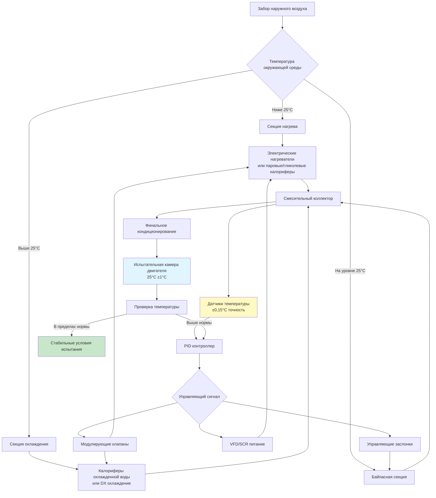

## Стандартные условия температуры при испытаниях

Испытание двигателей требует точного контроля температуры воздуха горения для обеспечения воспроизводимости и сравнимости результатов на различных испытательных объектах и в различных условиях окружающей среды. Международные стандарты определяют конкретные целевые значения температуры, которые должны поддерживаться во время испытаний.

### Стандартные условия SAE и ISO

SAE J1349 и ISO 1585 устанавливают стандартизированные контрольные условия для испытания двигателей внутреннего сгорания. Стандартная температура испытания составляет **25°C** на уровне моря при атмосферном давлении. Эта температура представляет контролируемую основную линию, которая позволяет напрямую сравнивать данные производительности двигателя независимо от географического местоположения или условий окружающей среды.

Стандарты признают, что фактические условия испытания могут отклоняться от идеальных значений. Коэффициенты коррекции применяются при проведении испытаний при температурах от **13°C** до **35°C**. За пределами этого диапазона необходимо прямое кондиционирование температуры для поддержания действительности испытания и точности измерений.


| Стандарт | Температура испытания | Допуск | Диапазон коррекции | Применение |
|----------|-----------------|-----------|------------------|-------------|
| SAE J1349 | 25°C | ±2°C | 13-35°C | Автомобильные двигатели |
| ISO 1585 | 25°C | ±2°C | 15-35°C | Все ДВС |
| ISO 3046 | 25°C | ±3°C | 0-40°C | Поршневые двигатели |
| DIN 70020 | 20°C | ±2°C | 10-30°C | Европейские автомобили |
| JIS D 1001 | 25°C | ±2°C | 15-35°C | Японские стандарты |


## Требования к стабильности температуры

Воспроизводимость испытаний требует исключительной стабильности температуры на протяжении всего периода испытания. Температура воздуха горения должна оставаться в пределах **±1°C** от заданного значения при непрерывной работе. Более строгие приложения, такие как испытания на сертификацию выбросов, могут требовать стабильности **±0,5°C**.

Однородность температуры по всему впускному коллектору одинаково критична. Пространственные вариации, превышающие **2°C**, могут вносить ошибки измерения в многоцилиндровых двигателях, где отдельные цилиндры получают воздух из различных мест коллектора.

Время отклика на изменения нагрузки влияет на эффективность испытания. Системы кондиционирования температуры должны восстанавливать заданное значение в течение **2-3 минут** после скачкообразных изменений нагрузки двигателя или требуемого расхода воздуха для минимизации продолжительности цикла испытания.

## Системы отопления при холодных условиях окружающей среды

Объекты, расположенные в холодном климате, требуют значительную мощность нагрева для повышения температуры наружного воздуха от зимних условий до стандартной температуры испытания. Испытательная камера, требующая **10000 кг/ч** воздуха горения, должна преодолеть перепад температуры **40°C** при достижении внешних условий **-15°C**.

Требуемая мощность нагрева соответствует уравнению явного тепла:

$$Q_h = \dot{m} \times c_p \times \Delta T$$

Где:
- $Q_h$ = мощность нагрева (кВт)
- $\dot{m}$ = массовый расход (кг/с)
- $c_p$ = удельная теплоёмкость воздуха ≈ 1,006 кДж/(кг·К)
- $\Delta T$ = повышение температуры (К)

Для приведённого выше примера:

$$Q_h = \frac{10000}{3600} \times 1,006 \times (25-(-15)) = 111,8 \text{ кВт}$$

### Электрическое сопротивление нагрева

Электрические нагревательные элементы обеспечивают чистое, безмасляное тепло без продуктов горения, которые могут загрязнить воздух испытания. Оребрённые трубчатые нагреватели или открытые спиральные элементы обеспечивают **20-40 кВт/м²** теплового потока с температурой поверхности достигая **650°C**.

Многоступенчатое расположение нагревательных батарей с модуляцией мощности SCR (кремниевый управляемый выпрямитель) позволяет точный температурный контроль. Типичная установка использует **три-пять ступеней** с финальной ступенью пропорционально управляемой для подстройки.

### Паровое и горячее водяное отопление

Объекты с центральными котельными обычно используют паровые или водяные калориферы. Оребрённые трубчатые калориферы с паром **1030-1210 кПа** обеспечивают высокие скорости теплопередачи в компактных конфигурациях. Системы горячей воды с температурой подачи **120-180°C** обеспечивают лучшие характеристики модуляции, но требуют большей площади поверхности калорифера.

Теплопередача калорифера рассчитывается как:

$$Q = U \times A \times \Delta T_{lm}$$

Где:
- $U$ = коэффициент теплопередачи, обычно 60-100 Вт/(м²·К) для нагрева воздуха
- $A$ = площадь фронта калорифера (м²)
- $\Delta T_{lm}$ = логарифмическая средняя разность температур (К)

### Системы нагрева гликолем

Замкнутые системы с гликолем обеспечивают защиту от замерзания и позволяют рекуперировать тепло из охлаждающих контуров двигателя. Раствор этиленгликоля 50% остаётся текучим вплоть до **-37°C**, обеспечивая мощность нагрева при температуре подачи **90-120°C**.

Теплообменники с гликолем требуют **на 30-40% большую площадь поверхности** по сравнению с паровыми калориферами из-за более низких коэффициентов теплопередачи со стороны жидкости. Однако способность рекуперировать отходящее тепло от охлаждающей жидкости двигателя, охладителей масла и систем рекуперации тепла выхлопных газов значительно снижает энергопотребление объекта.

## Системы охлаждения при жарких условиях окружающей среды

Испытательные объекты в жарком климате требуют охлаждения для снижения температуры наружного воздуха до стандартных условий. Расчёт нагрузки охлаждения включает удаление явного и скрытого тепла:

$$Q_c = Q_s + Q_l = \dot{m} \times c_p \times \Delta T + \dot{m} \times \Delta \omega \times h_{fg}$$

Где:
- $Q_s$ = нагрузка явного охлаждения (кВт)
- $Q_l$ = нагрузка скрытого охлаждения (кВт)
- $\Delta \omega$ = изменение коэффициента влажности (кг/кг)
- $h_{fg}$ = скрытая теплота парообразования ≈ 2450 кДж/кг

### Прямое расширение (DX) охлаждения

Пакетные системы DX с несколькими ступенями компрессора обеспечивают эффективное охлаждение для небольших испытательных камер, требующих **50-200 кВт** мощности охлаждения. Многоступенчатые спиральные или поршневые компрессоры с возможностью разгрузки поддерживают стабильную температуру воздуха на выходе при изменяющихся условиях нагрузки.

### Системы охлажденной воды

Большие испытательные объекты используют центральные холодильные установки, обслуживающие несколько испытательных камер. Калориферы охлаждения получают подачу охлажденной воды **5-7°C**, производя воду на возврате **10-12°C**. Скорости воздуха у фронта калорифера **2,5-3,0 м/с** балансируют перепад давления против эффективности теплопередачи.

Водяные управляющие клапаны модулируют расход в ответ на температуру воздуха на выходе. Трёхходовые смесительные клапаны предотвращают обледенение калорифера при низконагруженных условиях, тогда как двухходовые управляющие клапаны обеспечивают превосходную энергоэффективность в переменных системах охлажденной воды.

### Воздухо-воздушные теплообменники

Косвенное испарительное охлаждение или воздухо-воздушные теплообменники на основе хладагента устраняют добавление влажности, связанное с прямым испарением воды. Пластинчато-рамные или трубчато-в-трубе конструкции передают тепло между входящим воздухом горения и кондиционированным воздухом обратки или контурами хладагента.

Эти системы поддерживают низкие уровни влажности, критически важные для некоторых протоколов испытания, обеспечивая мощность охлаждения, пропорциональную разнице температур между воздушными потоками.

## Точность управления и архитектура системы

Достижение требуемой стабильности **±1°C** требует каскадных стратегий управления с быстродействующими исполнительными элементами. Главный контроллер поддерживает заданное значение температуры воздуха на выходе, тогда как вторичные контроллеры управляют очередностью работы и модуляцией оборудования нагрева и охлаждения.

### Датчики температуры

Несколько датчиков RTD (датчик сопротивления) с **точностью класса A (±0,15°C при 0°C)** контролируют температуру воздуха во впускном коллекторе, на выходе оборудования кондиционирования и в критических точках управления. Усредняющие датчики с **чувствительным элементом 1,5-3,0 м** обеспечивают репрезентативное измерение температуры по большому сечению канала.

### Отклик управления

PID (пропорционально-интегрально-дифференциальные) контроллеры с надлежащо настроенными параметрами обеспечивают стабильный температурный контроль. Типичные значения настройки включают:
- Пропорциональная полоса: **5-10°C**
- Время интегрирования: **30-60 секунд**
- Время дифференцирования: **5-15 секунд**

Быстродействующие управляющие клапаны с временем хода **3-5 секунд** и модулирующие заслонки с временем перемещения **10-15 секунд** позволяют быстрое реагирование на отклонения температуры.

## Рекуперация тепла и оптимизация энергии

Современные испытательные объекты интегрируют системы рекуперации тепла, которые улавливают отходящее тепло от работы двигателя и перенаправляют его на предварительный нагрев воздуха горения при холодных условиях окружающей среды. Выхлопные газы двигателя при **400-600°C** проходят через газо-воздушные теплообменники, восстанавливая **40-60%** доступной тепловой энергии.

Восстановленное тепло существенно снижает покупную тепловую энергию. Объект, работающий **200 часов/месяц** в зимний период со средней нагрузкой нагрева **100 кВт**, экономит примерно **12000-15000 долл. в год** в расходах на отопление при надлежащем проектировании систем рекуперации тепла.

Точность температурного контроля напрямую влияет на воспроизводимость результатов испытания. Объекты, поддерживающие жесткие допуски температуры, производят данные с **коэффициентом вариации ниже 1,5%** для ключевых показателей производительности, позволяя точное разработку двигателя и сертификационное испытание при всех условиях окружающей среды.

---

**Связанные темы:**
- Контроль влажности
- Системы воздушной фильтрации
- Измерение и контроль расхода
