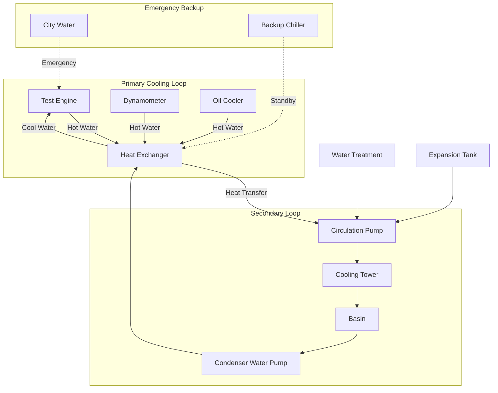

Системы охлаждающей воды на объектах испытания двигателей должны справляться с экстремальными и переменными тепловыми нагрузками при сохранении точного контроля температуры для получения согласованных результатов испытаний. Эти системы удаляют тепло от испытательных двигателей, динамометров и вспомогательного оборудования в условиях динамического режима работы.

## Типы и конфигурации систем

Объекты испытания двигателей обычно используют одну из трёх конфигураций охлаждающей воды:

**Системы прямоточного охлаждения** используют городскую воду или подземные воды для однопроходного охлаждения, сбрасывая воду в канализацию после использования. Эти системы отличаются простотой и минимальными капитальными затратами, но влекут высокие затраты на потребление и утилизацию воды, что делает их пригодными только для периодических испытаний или объектов с обилием дешёвой воды.

**Замкнутые системы циркуляции с градирнями** обеспечивают наиболее распространённую конфигурацию для непрерывных испытаний. Первичный замкнутый контур циркулирует обработанную воду через рубашки двигателя и масляные охладители, отводя тепло во вторичный контур, подключённый к градирням или сухим охладителям. Эта схема минимизирует потребление воды при сохранении контроля температуры.

**Системы на основе холодильников** используют механическое охлаждение для приложений, требующих температуры охлаждающей воды ниже влажной температуры окружающего воздуха, или в случаях, когда точный контроль температуры имеет приоритет над энергоэффективностью. Холодильники обеспечивают согласованные температуры подачи независимо от условий окружающей среды, но потребляют значительно больше энергии, чем системы с градирнями.

## Расчёты тепловой нагрузки

Точные расчёты отвода тепла обеспечивают адекватную мощность системы охлаждения для всех условий испытания. Общая тепловая нагрузка состоит из отвода тепла от двигателя, потерь динамометра и вспомогательного оборудования:

**Отвод тепла от двигателя** зависит от расхода топлива и тепловой эффективности:

$$Q_{engine} = \dot{m}_f \times LHV \times (1 - \eta_{thermal})$$

где $Q_{engine}$ — отвод тепла (кВт), $\dot{m}_f$ — массовый расход топлива (кг/с), $LHV$ — низшая теплотворная способность (кДж/кг), $\eta_{thermal}$ — тепловой КПД (обычно 0,30-0,40 для дизельных двигателей).

Для двигателей с водяным охлаждением охлаждение рубашки обычно удаляет 25-35% от общего отвода тепла:

$$Q_{jacket} = 0,30 \times Q_{engine}$$

**Отвод тепла динамометром** учитывает поглощённую мощность и механические потери:

$$Q_{dyno} = P_{brake} + P_{losses}$$

где $P_{brake}$ — тормозная мощность поглощённая, $P_{losses}$ — потери на трение подшипников и в вихревых токах (обычно 2-5% от номинальной мощности).

**Общая мощность охлаждения** должна включать коэффициент безопасности для различных условий испытания:

$$Q_{total} = (Q_{jacket} + Q_{dyno} + Q_{auxiliary}) \times SF$$

где $SF$ — коэффициент безопасности 1,15-1,25 для расчётного запаса.

## Требования к охлаждению по типам двигателей

| Тип двигателя | Диапазон мощности | Отвод тепла рубашкой | Общий отвод тепла | Темп. подачи | Расход |
|-------------|-------------|----------------------|---------------------|-------------|-----------|
| Легковой бензиновый | 75-375 кВт | 60-300 кВт | 200-1 000 кВт | 82-90°C | 76-380 л/мин |
| Легковой дизельный | 110-450 кВт | 80-400 кВт | 250-1 200 кВт | 82-93°C | 95-450 л/мин |
| Дизельный средней мощности | 150-600 кВт | 120-600 кВт | 350-1 800 кВт | 82-96°C | 150-680 л/мин |
| Дизельный высокой мощности | 300-1 500 кВт | 300-1 500 кВт | 900-4 500 кВт | 85-99°C | 340-1 700 л/мин |
| Двигатель на природном газе | 375-2 250 кВт | 400-2 200 кВт | 1 200-6 500 кВт | 88-96°C | 450-2 460 л/мин |
| Морской дизельный | 750-3 750 кВт | 750-3 800 кВт | 2 200-11 000 кВт | 79-90°C | 850-4 350 л/мин |

## Выбор градирни и холодильника

**Варианты градирен** для объектов испытания двигателей включают:

Индукционные противоточные градирни обеспечивают максимальную эффективность и минимальный размер, что делает их идеальными для объектов с ограниченным пространством. Эти установки достигают приближения к влажной температуре 3-4°C.

Испарительные жидкостные охладители объединяют градирню и теплообменник в одном устройстве, исключая открытый вторичный контур. Эта конфигурация снижает риск замерзания и минимизирует потенциал загрязнения, но увеличивает первоначальные затраты.

Сухие охладители полностью исключают потребление воды, но требуют значительно большей площади теплообмена и могут охлаждать только до температуры сухого воздуха плюс приближение (обычно 6-8°C). Эти установки подходят для засушливого климата или объектов с ограничениями на использование воды.

**Системы холодильников** используются в испытательных камерах, требующих охлаждения ниже температуры окружающей среды или точного контроля температуры:

Воздушные холодильники предлагают гибкость установки и исключают обслуживание градирни, но потребляют больше энергии и обеспечивают меньшую мощность в жаркую погоду.

Водяные холодильники с градирнями обеспечивают высшую эффективность и согласованные характеристики, но требуют дополнительного оборудования и обработки воды.

## Требования к обработке воды

Надлежащая обработка воды предотвращает образование накипи, коррозию и биологический рост, которые нарушают теплообмен и надёжность системы:

**Обработка замкнутого контура** поддерживает щёлочность между 8,5-9,5 pH с ингибиторами коррозии (молибдатные, нитритные или силикатные) и биоцидами для биологического контроля. Добавление гликоля к концентрации 25-40% обеспечивает защиту от замерзания и дополнительное ингибирование коррозии.

**Обработка открытого контура** для градирен контролирует циклы концентрирования для баланса между экономией воды и образованием накипи, обычно поддерживая 3-5 циклов. Химическая обработка включает ингибиторы накипи (фосфонаты или полимеры), ингибиторы коррозии и альгициды/биоциды.

**Системы фильтрации** удаляют твёрдые частицы, которые засоряют теплообменники, с типичными требованиями фильтрации 50-100 микрон для замкнутых контуров и непрерывной боковой фильтрацией для бассейнов градирен.

## Стратегии контроля температуры

Согласованность испытаний требует стабильности температуры подачи охлаждающей воды в пределах ±1-3°C при различных тепловых нагрузках:

**Модулирующие регулирующие клапаны** на линиях байпаса градирни поддерживают температуру подачи, смешивая воду из градирни с байпассированной тёплой водой. Трёхходовые клапаны обеспечивают лучший контроль, чем двухходовые конфигурации для этого применения.

**Управление переменной скоростью вентилятора** на градирнях согласует мощность отвода тепла с мгновенной нагрузкой при минимизации потребления энергии и шума при лёгких нагрузках.

**Тепловой аккумулятор** с использованием изолированных буферных резервуаров обеспечивает тепловую инерцию, которая снижает колебания температуры при быстрых изменениях нагрузки, особенно ценна для нестационарных протоколов испытания.

## Аварийные системы охлаждения

Безопасность испытательной камеры требует резервного охлаждения, способного предотвратить повреждение двигателя при отказе первичной системы:

**Резерв городской воды** с автоматическими переключающимися клапанами обеспечивает немедленное аварийное охлаждение, хотя прямоточный сброс может нарушать природоохранные разрешения, кроме как при подлинных чрезвычайных ситуациях.

**Резервное механическое оборудование**, включая конфигурации насосов N+1 и резервные холодильники или секции градирен, обеспечивает непрерывную работу во время обслуживания или отказа оборудования.

**Стратегии тепловой инерции**, такие как увеличенные буферные резервуары, продлевают доступное время работы при отказах системы охлаждения, предоставляя время для контролируемого выключения двигателя вместо катастрофического отказа.

**Аварийное питание** критических насосов охлаждения через генератор или источник бесперебойного питания поддерживает минимальную циркуляцию при сбоях питания, предотвращая тепловой удар и повреждение двигателя.

Надлежащее проектирование системы охлаждения балансирует капитальные затраты, эксплуатационную эффективность и надёжность для поддержки согласованных результатов испытаний при защите дорогостоящих испытательных активов.
