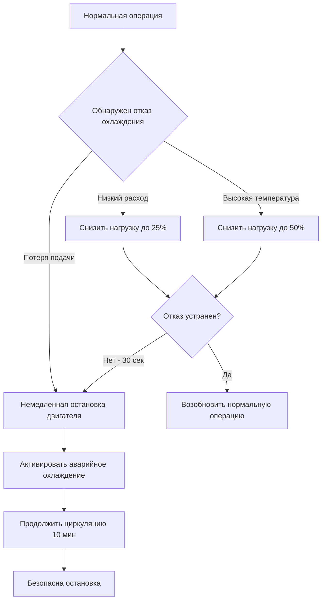

## Требования к охлаждению гидравлического динамометра

Гидравлические динамометры поглощают мощность двигателя, преобразуя механическую энергию в тепло через сдвиг жидкости. Охлаждающая вода служит двойной цели: она является рабочей жидкостью для поглощения мощности и теплоносителем для управления тепловым режимом.

**Основные требования к охлаждению:**

- **Постоянная емкость поглощения тепла:** должна соответствовать максимальной мощности двигателя
- **Расход, пропорциональный крутящему моменту:** больший крутящий момент требует большего расхода
- **Температура входа под контролем:** обычно 15–25°C для стабильных характеристик нагрузки
- **Требования по давлению:** 275–550 кПа для поддержания надлежащих зазоров ротора
- **Качество воды:** фильтрация для предотвращения повреждения ротора, контролируемая жесткость для минимизации отложений

Общая тепловая нагрузка равна мощности двигателя:

$$Q_{total} = P_{engine} = \frac{2\pi \cdot N \cdot T}{60000}$$

где $Q_{total}$ — тепловая нагрузка (кВт), $N$ — частота вращения (об/мин), $T$ — крутящий момент (Н·м).

Гидравлические динамометры требуют значительно больших расходов, чем вихретоковые устройства, потому что вода непосредственно поглощает механическую энергию. Типичные установки требуют 0,15–0,30 л/с на килватт поглощаемой мощности.

## Рассеивание тепла вихретоковым динамометром

Вихретоковые динамометры генерируют тепло посредством электромагнитной индукции в металлическом роторе. Рассеивание тепла происходит полностью через охлаждающую воду, циркулирующую через проходы в корпусе статора.

**Характеристики рассеивания тепла:**

- **Постоянное отведение тепла:** вся поглощаемая мощность преобразуется в тепло в статоре
- **Локальные горячие точки:** концентрация электромагнитного поля создает температурные градиенты
- **Меньшие требования к расходу:** вода только удаляет тепло, а не является рабочей жидкостью
- **Точное управление температурой:** электрические характеристики изменяются с температурой
- **Ограничения по проводимости теплоносителя:** деионизированная или низкопроводящая вода предотвращает утечку электричества

Отведение тепла вихретоковыми динамометрами:

$$Q_{eddy} = P_{absorbed} \cdot \eta_{conversion}$$

где $\eta_{conversion}$ близко к 1,0 (практически 100 % преобразование в тепло).

Повышение температуры через динамометр:

$$\Delta T = \frac{Q_{eddy}}{\dot{m} \cdot c_p} = \frac{Q_{eddy}}{\rho \cdot \dot{V} \cdot c_p}$$

где $\dot{m}$ — массовый расход (кг/с), $\dot{V}$ — объемный расход (м³/с), $c_p$ — удельная теплоемкость (4,186 кДж/кг·К для воды), $\rho$ — плотность (1000 кг/м³).

## Расчёты расхода охлаждающей воды

Правильное определение расхода обеспечивает адекватное удаление тепла при сохранении температурной стабильности.

**Методология расчета расхода:**

$$\dot{V} = \frac{Q_{total}}{\rho \cdot c_p \cdot \Delta T_{allowable}} \times \frac{1}{\eta_{HX}}$$

где $\Delta T_{allowable}$ — допустимое повышение температуры (обычно 5–10°C), $\eta_{HX}$ — эффективность теплообменника (0,85–0,95).

Для динамометра мощностью 750 кВт с допустимым повышением 8°C:

$$\dot{V} = \frac{750}{1000 \times 4,186 \times 8} \times \frac{1}{0,90} = 0,025 \text{ м}^3\text{/с} = 25 \text{ л/с}$$

**Конструктивные соображения:**

- **Коэффициент безопасности:** добавить 15–20 % емкости на переходные процессы
- **Датчики минимального расхода:** предотвращают работу без охлаждения и тепловое повреждение
- **Перепускные клапаны:** поддерживают расход при низких нагрузках
- **Параллельные каналы:** обеспечивают равномерное охлаждение по сечениям статора

## Пределы повышения температуры для обеспечения точности

Точность динамометра зависит критически от температурной стабильности. Колебания температуры влияют на измерение крутящего момента через изменения размеров, электромагнитные свойства и дрейф калибровки.

**Требования к управлению температурой:**

| Тип динамометра | Диапазон входной температуры | Макс. ΔT через блок | Требуемая стабильность |
|-----------------|-------------------------------|---------------------|------------------------|
| Гидравлический | 15–25°C | 10°C | ±2°C |
| Вихретоковый | 20–30°C | 8°C | ±1°C |
| Синхронный (привод) | 25–35°C | 6°C | ±0,5°C |
| Постоянного тока (привод) | 25–35°C | 6°C | ±0,5°C |

Ошибка измерения крутящего момента вследствие температурного дрейфа:

$$\epsilon_{temp} = \alpha_{thermal} \cdot \Delta T \cdot S_{calibration}$$

где $\alpha_{thermal}$ — температурный коэффициент (0,001–0,003/°C), $S_{calibration}$ — чувствительность калибровки.

## Выбор теплообменника для охлаждения динамометра

Теплообменники отводят поглощаемую мощность в систему охлаждения предприятия или в системы охлаждения окружающей средой.

**Методология выбора:**

Тепловая нагрузка теплообменника:

$$Q_{HX} = UA \cdot LMTD$$

где $U$ — общий коэффициент теплопередачи (2500–4500 Вт/м²·К для вода-вода), $A$ — площадь теплопередачи.

Логарифмическая средняя разность температур:

$$LMTD = \frac{(T_{h,in} - T_{c,out}) - (T_{h,out} - T_{c,in})}{\ln\left(\frac{T_{h,in} - T_{c,out}}{T_{h,out} - T_{c,in}}\right)}$$

**Типы теплообменников:**

- **Пластинчато-рамные:** компактные, высокая эффективность, простое обслуживание (наиболее распространены)
- **Кожухотрубные:** надежные, высокая способность к повышенному давлению, высокая устойчивость к загрязнению
- **Паяные пластинчатые:** компактные, постоянная конструкция, низкая стоимость
- **Градирни:** отведение в атмосферу для объектов без системы охлаждения предприятия

## Аварийное охлаждение и блокировки безопасности

Защита динамометра требует нескольких блокировок системы охлаждения для предотвращения катастрофических отказов.

**Критические блокировки безопасности:**

1. **Отключение при низком расходе:** датчик расхода инициирует немедленное снижение нагрузки и остановку двигателя
2. **Отключение при высокой температуре:** датчики температуры (с резервированием) останавливают испытание на 5°C ниже порога повреждения
3. **Потеря охлаждающей воды:** датчик давления обнаруживает отказ подачи и инициирует аварийную остановку
4. **Дифференциальное давление сетки:** высокий ΔP указывает на закупорку, требующую внимания
5. **Резервной насос охлаждения:** автоматический запуск при отказе основного насоса

**Последовательность аварийного охлаждения:**

**Типовые настройки блокировок:**

| Параметр | Предупреждение | Сигнализация | Аварийная остановка |
|----------|----------------|--------------|---------------------|
| Расход | <85% проекта | <75% проекта | <60% проекта |
| Температура выхода | >45°C | >50°C | >55°C |
| Давление входа | <200 кПа | <150 кПа | <100 кПа |
| ΔP сетки | >35 кПа | >50 кПа | N/A |

**Схема системы охлаждения:**

Процедуры охлаждения после испытания поддерживают циркуляцию при сниженном расходе (40–60 % от полного расхода) в течение 5–15 минут после остановки двигателя для предотвращения локального перегрева и термического удара для компонентов динамометра. Этот период охлаждения особенно критичен для вихретоковых устройств, где остаточные магнитные поля могут продолжать генерировать тепло в течение некоторого времени после того, как поглощение мощности прекратилось.
